# Galería / página 1

[Índice](../GALLERY.md) · [Siguiente](page_02.md)

## BULBASAUR

default.front · 64×64 · APNG [0, 5, 9, 43, 46] · timing: source_timeline

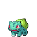

[Frames elegidos](../pokemon/bulbasaur/anim_front_selected.png) · [Todas las poses](../pokemon/bulbasaur/anim_front_source.png)

default.back · 64×64 · APNG [0, 5, 2] · timing: source_idle_cycle

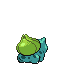

[Frames elegidos](../pokemon/bulbasaur/back_selected.png) · [Todas las poses](../pokemon/bulbasaur/back_source.png)

## IVYSAUR

default.front · 64×64 · APNG [9, 6, 3, 50, 53] · timing: source_timeline

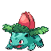

[Frames elegidos](../pokemon/ivysaur/anim_front_selected.png) · [Todas las poses](../pokemon/ivysaur/anim_front_source.png)

default.back · 64×64 · APNG [2, 7, 3] · timing: source_idle_cycle

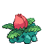

[Frames elegidos](../pokemon/ivysaur/back_selected.png) · [Todas las poses](../pokemon/ivysaur/back_source.png)

## VENUSAUR

default.front · 96×96 · APNG [2, 0, 25, 59, 66] · timing: source_timeline

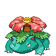

[Frames elegidos](../pokemon/venusaur/anim_front_selected.png) · [Todas las poses](../pokemon/venusaur/anim_front_source.png)

default.back · 96×96 · APNG [26, 21, 25] · timing: source_idle_cycle

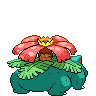

[Frames elegidos](../pokemon/venusaur/back_selected.png) · [Todas las poses](../pokemon/venusaur/back_source.png)

female.front · 96×96 · tira original [0, 1, 0, 2, 3] · timing: shared_species_timing

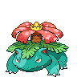

[Frames elegidos](../pokemon/venusaur/anim_frontf_selected.png) · [Todas las poses](../pokemon/venusaur/anim_frontf_source.png)

female.back · 64×64 · tira original [0, 0, 0] · timing: shared_species_timing

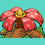

[Frames elegidos](../pokemon/venusaur/backf_selected.png) · [Todas las poses](../pokemon/venusaur/backf_source.png)

## CHARMANDER

default.front · 64×64 · APNG [1, 4, 2, 37, 46] · timing: source_timeline

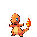

[Frames elegidos](../pokemon/charmander/anim_front_selected.png) · [Todas las poses](../pokemon/charmander/anim_front_source.png)

default.back · 64×64 · APNG [0, 4, 2] · timing: source_idle_cycle

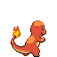

[Frames elegidos](../pokemon/charmander/back_selected.png) · [Todas las poses](../pokemon/charmander/back_source.png)

## CHARMELEON

default.front · 80×80 · APNG [15, 0, 13, 37, 76] · timing: synthetic_special_cadence

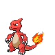

[Frames elegidos](../pokemon/charmeleon/anim_front_selected.png) · [Todas las poses](../pokemon/charmeleon/anim_front_source.png)

default.back · 64×64 · APNG [6, 0, 4] · timing: source_idle_cycle

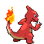

[Frames elegidos](../pokemon/charmeleon/back_selected.png) · [Todas las poses](../pokemon/charmeleon/back_source.png)

## CHARIZARD

default.front · 96×96 · APNG [0, 9, 4, 42, 54] · timing: source_timeline

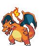

[Frames elegidos](../pokemon/charizard/anim_front_selected.png) · [Todas las poses](../pokemon/charizard/anim_front_source.png)

default.back · 96×96 · APNG [15, 0, 13] · timing: source_idle_cycle

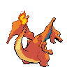

[Frames elegidos](../pokemon/charizard/back_selected.png) · [Todas las poses](../pokemon/charizard/back_source.png)

## SQUIRTLE

default.front · 64×64 · APNG [1, 2, 0, 21, 24] · timing: source_timeline

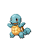

[Frames elegidos](../pokemon/squirtle/anim_front_selected.png) · [Todas las poses](../pokemon/squirtle/anim_front_source.png)

default.back · 64×64 · APNG [1, 2, 0] · timing: source_idle_cycle

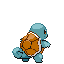

[Frames elegidos](../pokemon/squirtle/back_selected.png) · [Todas las poses](../pokemon/squirtle/back_source.png)

## WARTORTLE

default.front · 64×64 · APNG [3, 8, 4, 28, 31] · timing: source_timeline

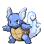

[Frames elegidos](../pokemon/wartortle/anim_front_selected.png) · [Todas las poses](../pokemon/wartortle/anim_front_source.png)

default.back · 64×64 · APNG [3, 8, 4] · timing: source_idle_cycle

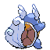

[Frames elegidos](../pokemon/wartortle/back_selected.png) · [Todas las poses](../pokemon/wartortle/back_source.png)

## BLASTOISE

default.front · 80×80 · APNG [4, 0, 7, 42, 50] · timing: source_timeline

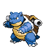

[Frames elegidos](../pokemon/blastoise/anim_front_selected.png) · [Todas las poses](../pokemon/blastoise/anim_front_source.png)

default.back · 80×80 · APNG [9, 0, 7] · timing: source_idle_cycle

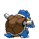

[Frames elegidos](../pokemon/blastoise/back_selected.png) · [Todas las poses](../pokemon/blastoise/back_source.png)

## CATERPIE

default.front · 64×64 · APNG [2, 0, 4, 1, 3] · timing: synthetic_special_cadence

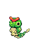

[Frames elegidos](../pokemon/caterpie/anim_front_selected.png) · [Todas las poses](../pokemon/caterpie/anim_front_source.png)

default.back · 64×64 · APNG [0, 7, 4] · timing: source_idle_cycle

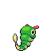

[Frames elegidos](../pokemon/caterpie/back_selected.png) · [Todas las poses](../pokemon/caterpie/back_source.png)

## METAPOD

default.front · 64×64 · APNG [17, 20, 1, 6, 8] · timing: synthetic_special_cadence

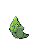

[Frames elegidos](../pokemon/metapod/anim_front_selected.png) · [Todas las poses](../pokemon/metapod/anim_front_source.png)

default.back · 64×64 · APNG [22, 13, 6] · timing: source_idle_cycle

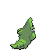

[Frames elegidos](../pokemon/metapod/back_selected.png) · [Todas las poses](../pokemon/metapod/back_source.png)

## BUTTERFREE

default.front · 64×64 · APNG [0, 16, 7, 3, 10] · timing: synthetic_special_cadence

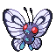

[Frames elegidos](../pokemon/butterfree/anim_front_selected.png) · [Todas las poses](../pokemon/butterfree/anim_front_source.png)

default.back · 64×64 · APNG [2, 0, 5] · timing: source_idle_cycle

[Frames elegidos](../pokemon/butterfree/back_selected.png) · [Todas las poses](../pokemon/butterfree/back_source.png)

female.front · 64×64 · tira original [0, 1, 0, 1, 1] · timing: shared_species_timing

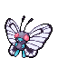

[Frames elegidos](../pokemon/butterfree/anim_frontf_selected.png) · [Todas las poses](../pokemon/butterfree/anim_frontf_source.png)

female.back · 64×64 · tira original [0, 0, 0] · timing: shared_species_timing

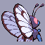

[Frames elegidos](../pokemon/butterfree/backf_selected.png) · [Todas las poses](../pokemon/butterfree/backf_source.png)

## WEEDLE

default.front · 64×64 · APNG [0, 8, 3, 52, 55] · timing: source_timeline

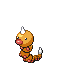

[Frames elegidos](../pokemon/weedle/anim_front_selected.png) · [Todas las poses](../pokemon/weedle/anim_front_source.png)

default.back · 64×64 · APNG [8, 5, 0] · timing: source_idle_cycle

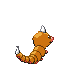

[Frames elegidos](../pokemon/weedle/back_selected.png) · [Todas las poses](../pokemon/weedle/back_source.png)

## KAKUNA

default.front · 64×64 · APNG [0, 68, 9, 82, 257] · timing: synthetic_special_cadence

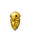

[Frames elegidos](../pokemon/kakuna/anim_front_selected.png) · [Todas las poses](../pokemon/kakuna/anim_front_source.png)

default.back · 64×64 · APNG [6, 0, 10] · timing: source_idle_cycle

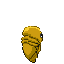

[Frames elegidos](../pokemon/kakuna/back_selected.png) · [Todas las poses](../pokemon/kakuna/back_source.png)

## BEEDRILL

default.front · 80×80 · APNG [0, 32, 10, 356, 455] · timing: source_timeline

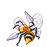

[Frames elegidos](../pokemon/beedrill/anim_front_selected.png) · [Todas las poses](../pokemon/beedrill/anim_front_source.png)

default.back · 80×80 · APNG [0, 32, 10] · timing: source_idle_cycle

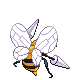

[Frames elegidos](../pokemon/beedrill/back_selected.png) · [Todas las poses](../pokemon/beedrill/back_source.png)

## PIDGEY

default.front · 64×64 · APNG [0, 2, 4, 7, 14] · timing: source_timeline

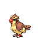

[Frames elegidos](../pokemon/pidgey/anim_front_selected.png) · [Todas las poses](../pokemon/pidgey/anim_front_source.png)

default.back · 64×64 · APNG [0, 2, 4] · timing: source_idle_cycle

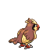

[Frames elegidos](../pokemon/pidgey/back_selected.png) · [Todas las poses](../pokemon/pidgey/back_source.png)

## PIDGEOTTO

default.front · 116×116 · APNG [0, 5, 2, 10, 12] · timing: source_timeline

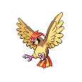

[Frames elegidos](../pokemon/pidgeotto/anim_front_selected.png) · [Todas las poses](../pokemon/pidgeotto/anim_front_source.png)

default.back · 96×96 · APNG [0, 5, 2] · timing: source_idle_cycle

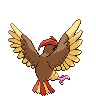

[Frames elegidos](../pokemon/pidgeotto/back_selected.png) · [Todas las poses](../pokemon/pidgeotto/back_source.png)

## PIDGEOT

default.front · 80×80 · APNG [2, 7, 5, 4, 6] · timing: synthetic_special_cadence

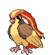

[Frames elegidos](../pokemon/pidgeot/anim_front_selected.png) · [Todas las poses](../pokemon/pidgeot/anim_front_source.png)

default.back · 80×80 · APNG [7, 4, 0] · timing: source_idle_cycle

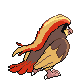

[Frames elegidos](../pokemon/pidgeot/back_selected.png) · [Todas las poses](../pokemon/pidgeot/back_source.png)

## RATTATA

default.front · 64×64 · APNG [1, 5, 2, 37, 39] · timing: source_timeline

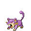

[Frames elegidos](../pokemon/rattata/anim_front_selected.png) · [Todas las poses](../pokemon/rattata/anim_front_source.png)

default.back · 64×64 · APNG [3, 0, 2] · timing: source_idle_cycle

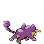

[Frames elegidos](../pokemon/rattata/back_selected.png) · [Todas las poses](../pokemon/rattata/back_source.png)

female.front · 64×64 · tira original [0, 1, 0, 2, 3] · timing: shared_species_timing

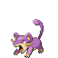

[Frames elegidos](../pokemon/rattata/anim_frontf_selected.png) · [Todas las poses](../pokemon/rattata/anim_frontf_source.png)

female.back · 64×64 · tira original [0, 0, 0] · timing: shared_species_timing

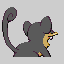

[Frames elegidos](../pokemon/rattata/backf_selected.png) · [Todas las poses](../pokemon/rattata/backf_source.png)

## RATICATE

default.front · 64×64 · APNG [4, 0, 9, 7, 10] · timing: synthetic_special_cadence

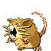

[Frames elegidos](../pokemon/raticate/anim_front_selected.png) · [Todas las poses](../pokemon/raticate/anim_front_source.png)

default.back · 80×80 · APNG [2, 6, 9] · timing: source_idle_cycle

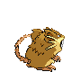

[Frames elegidos](../pokemon/raticate/back_selected.png) · [Todas las poses](../pokemon/raticate/back_source.png)

female.front · 64×64 · tira original [0, 1, 0, 2, 3] · timing: shared_species_timing

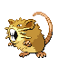

[Frames elegidos](../pokemon/raticate/anim_frontf_selected.png) · [Todas las poses](../pokemon/raticate/anim_frontf_source.png)

female.back · 64×64 · tira original [0, 0, 0] · timing: shared_species_timing

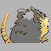

[Frames elegidos](../pokemon/raticate/backf_selected.png) · [Todas las poses](../pokemon/raticate/backf_source.png)

## SPEAROW

default.front · 64×64 · APNG [1, 0, 2, 17, 23] · timing: source_timeline

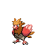

[Frames elegidos](../pokemon/spearow/anim_front_selected.png) · [Todas las poses](../pokemon/spearow/anim_front_source.png)

default.back · 64×64 · APNG [1, 0, 2] · timing: source_idle_cycle

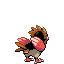

[Frames elegidos](../pokemon/spearow/back_selected.png) · [Todas las poses](../pokemon/spearow/back_source.png)

## FEAROW

default.front · 112×112 · APNG [1, 0, 3, 4, 7] · timing: source_timeline

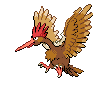

[Frames elegidos](../pokemon/fearow/anim_front_selected.png) · [Todas las poses](../pokemon/fearow/anim_front_source.png)

default.back · 96×96 · APNG [1, 0, 3] · timing: source_idle_cycle

[Frames elegidos](../pokemon/fearow/back_selected.png) · [Todas las poses](../pokemon/fearow/back_source.png)

## EKANS

default.front · 64×64 · APNG [0, 15, 10, 6, 13] · timing: synthetic_special_cadence

[Frames elegidos](../pokemon/ekans/anim_front_selected.png) · [Todas las poses](../pokemon/ekans/anim_front_source.png)

default.back · 64×64 · APNG [6, 5, 0] · timing: source_idle_cycle

[Frames elegidos](../pokemon/ekans/back_selected.png) · [Todas las poses](../pokemon/ekans/back_source.png)

## ARBOK

default.front · 96×96 · APNG [16, 9, 17, 4, 12] · timing: synthetic_special_cadence

[Frames elegidos](../pokemon/arbok/anim_front_selected.png) · [Todas las poses](../pokemon/arbok/anim_front_source.png)

default.back · 96×96 · APNG [13, 9, 0] · timing: source_idle_cycle

[Frames elegidos](../pokemon/arbok/back_selected.png) · [Todas las poses](../pokemon/arbok/back_source.png)

## PICHU

default.front · 64×64 · APNG [9, 17, 12, 41, 50] · timing: source_timeline

[Frames elegidos](../pokemon/pichu/anim_front_selected.png) · [Todas las poses](../pokemon/pichu/anim_front_source.png)

default.back · 64×64 · APNG [9, 17, 2] · timing: source_idle_cycle

[Frames elegidos](../pokemon/pichu/back_selected.png) · [Todas las poses](../pokemon/pichu/back_source.png)

[Índice](../GALLERY.md) · [Siguiente](page_02.md)
