# Galería / página 2

[Índice](../GALLERY.md) · [Anterior](page_01.md) · [Siguiente](page_03.md)

## PIKACHU

default.front · 64×64 · APNG [3, 0, 4, 48, 53]

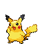

[Frames elegidos](../pokemon/pikachu/anim_front_selected.png) · [Todas las poses](../pokemon/pikachu/anim_front_source.png)

default.back · 64×64 · APNG [3, 0, 4]

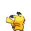

[Frames elegidos](../pokemon/pikachu/back_selected.png) · [Todas las poses](../pokemon/pikachu/back_source.png)

## RAICHU

default.front · 80×80 · APNG [11, 2, 7, 48, 51]

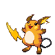

[Frames elegidos](../pokemon/raichu/anim_front_selected.png) · [Todas las poses](../pokemon/raichu/anim_front_source.png)

default.back · 80×80 · APNG [0, 2, 7]

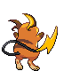

[Frames elegidos](../pokemon/raichu/back_selected.png) · [Todas las poses](../pokemon/raichu/back_source.png)

## SANDSHREW

default.front · 64×64 · APNG [2, 0, 4, 25, 31]

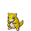

[Frames elegidos](../pokemon/sandshrew/anim_front_selected.png) · [Todas las poses](../pokemon/sandshrew/anim_front_source.png)

default.back · 64×64 · APNG [2, 1, 4]

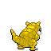

[Frames elegidos](../pokemon/sandshrew/back_selected.png) · [Todas las poses](../pokemon/sandshrew/back_source.png)

## SANDSLASH

default.front · 64×64 · APNG [0, 2, 5, 46, 50]

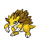

[Frames elegidos](../pokemon/sandslash/anim_front_selected.png) · [Todas las poses](../pokemon/sandslash/anim_front_source.png)

default.back · 64×64 · APNG [3, 8, 5]

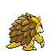

[Frames elegidos](../pokemon/sandslash/back_selected.png) · [Todas las poses](../pokemon/sandslash/back_source.png)

## NIDORAN_F

default.front · 64×64 · APNG [1, 0, 2, 42, 45]

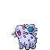

[Frames elegidos](../pokemon/nidoran_f/anim_front_selected.png) · [Todas las poses](../pokemon/nidoran_f/anim_front_source.png)

default.back · 64×64 · APNG [1, 0, 2]

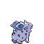

[Frames elegidos](../pokemon/nidoran_f/back_selected.png) · [Todas las poses](../pokemon/nidoran_f/back_source.png)

## NIDORINA

default.front · 64×64 · APNG [15, 0, 8, 17, 21]

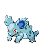

[Frames elegidos](../pokemon/nidorina/anim_front_selected.png) · [Todas las poses](../pokemon/nidorina/anim_front_source.png)

default.back · 64×64 · APNG [3, 0, 6]

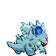

[Frames elegidos](../pokemon/nidorina/back_selected.png) · [Todas las poses](../pokemon/nidorina/back_source.png)

## NIDOQUEEN

default.front · 80×80 · APNG [10, 1, 7, 46, 51]

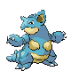

[Frames elegidos](../pokemon/nidoqueen/anim_front_selected.png) · [Todas las poses](../pokemon/nidoqueen/anim_front_source.png)

default.back · 96×96 · APNG [5, 0, 7]

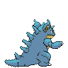

[Frames elegidos](../pokemon/nidoqueen/back_selected.png) · [Todas las poses](../pokemon/nidoqueen/back_source.png)

## NIDORAN_M

default.front · 64×64 · APNG [4, 14, 8, 3, 12]

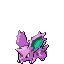

[Frames elegidos](../pokemon/nidoran_m/anim_front_selected.png) · [Todas las poses](../pokemon/nidoran_m/anim_front_source.png)

default.back · 64×64 · APNG [0, 7, 3]

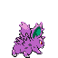

[Frames elegidos](../pokemon/nidoran_m/back_selected.png) · [Todas las poses](../pokemon/nidoran_m/back_source.png)

## NIDORINO

default.front · 64×64 · APNG [3, 0, 4, 34, 36]

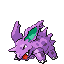

[Frames elegidos](../pokemon/nidorino/anim_front_selected.png) · [Todas las poses](../pokemon/nidorino/anim_front_source.png)

default.back · 64×64 · APNG [3, 1, 4]

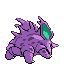

[Frames elegidos](../pokemon/nidorino/back_selected.png) · [Todas las poses](../pokemon/nidorino/back_source.png)

## NIDOKING

default.front · 96×96 · APNG [2, 0, 4, 36, 41]

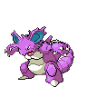

[Frames elegidos](../pokemon/nidoking/anim_front_selected.png) · [Todas las poses](../pokemon/nidoking/anim_front_source.png)

default.back · 96×96 · APNG [2, 8, 4]

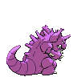

[Frames elegidos](../pokemon/nidoking/back_selected.png) · [Todas las poses](../pokemon/nidoking/back_source.png)

## CLEFFA

default.front · 64×64 · APNG [0, 12, 4, 43, 49]

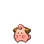

[Frames elegidos](../pokemon/cleffa/anim_front_selected.png) · [Todas las poses](../pokemon/cleffa/anim_front_source.png)

default.back · 64×64 · APNG [0, 4, 12]

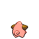

[Frames elegidos](../pokemon/cleffa/back_selected.png) · [Todas las poses](../pokemon/cleffa/back_source.png)

## CLEFAIRY

default.front · 64×64 · APNG [0, 10, 4, 100, 110]

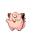

[Frames elegidos](../pokemon/clefairy/anim_front_selected.png) · [Todas las poses](../pokemon/clefairy/anim_front_source.png)

default.back · 64×64 · APNG [0, 11, 4]

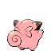

[Frames elegidos](../pokemon/clefairy/back_selected.png) · [Todas las poses](../pokemon/clefairy/back_source.png)

## CLEFABLE

default.front · 64×64 · APNG [2, 0, 4, 38, 46]

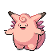

[Frames elegidos](../pokemon/clefable/anim_front_selected.png) · [Todas las poses](../pokemon/clefable/anim_front_source.png)

default.back · 64×64 · APNG [2, 8, 4]

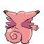

[Frames elegidos](../pokemon/clefable/back_selected.png) · [Todas las poses](../pokemon/clefable/back_source.png)

## VULPIX

default.front · 64×64 · APNG [6, 0, 4, 29, 31]

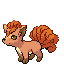

[Frames elegidos](../pokemon/vulpix/anim_front_selected.png) · [Todas las poses](../pokemon/vulpix/anim_front_source.png)

default.back · 64×64 · APNG [5, 0, 4]

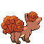

[Frames elegidos](../pokemon/vulpix/back_selected.png) · [Todas las poses](../pokemon/vulpix/back_source.png)

## NINETALES

default.front · 80×80 · APNG [6, 0, 4, 2, 5]

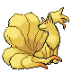

[Frames elegidos](../pokemon/ninetales/anim_front_selected.png) · [Todas las poses](../pokemon/ninetales/anim_front_source.png)

default.back · 80×80 · APNG [3, 6, 0]

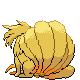

[Frames elegidos](../pokemon/ninetales/back_selected.png) · [Todas las poses](../pokemon/ninetales/back_source.png)

## IGGLYBUFF

default.front · 64×64 · APNG [12, 4, 1, 51, 66]

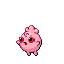

[Frames elegidos](../pokemon/igglybuff/anim_front_selected.png) · [Todas las poses](../pokemon/igglybuff/anim_front_source.png)

default.back · 64×64 · APNG [0, 18, 9]

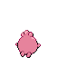

[Frames elegidos](../pokemon/igglybuff/back_selected.png) · [Todas las poses](../pokemon/igglybuff/back_source.png)

## JIGGLYPUFF

default.front · 64×64 · APNG [7, 5, 0, 23, 32]

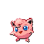

[Frames elegidos](../pokemon/jigglypuff/anim_front_selected.png) · [Todas las poses](../pokemon/jigglypuff/anim_front_source.png)

default.back · 64×64 · APNG [7, 5, 0]

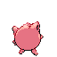

[Frames elegidos](../pokemon/jigglypuff/back_selected.png) · [Todas las poses](../pokemon/jigglypuff/back_source.png)

## WIGGLYTUFF

default.front · 96×96 · APNG [0, 5, 8, 46, 50]

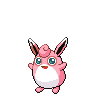

[Frames elegidos](../pokemon/wigglytuff/anim_front_selected.png) · [Todas las poses](../pokemon/wigglytuff/anim_front_source.png)

default.back · 64×64 · APNG [0, 5, 2]

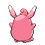

[Frames elegidos](../pokemon/wigglytuff/back_selected.png) · [Todas las poses](../pokemon/wigglytuff/back_source.png)

## ZUBAT

default.front · 64×64 · APNG [0, 7, 59, 21, 35]

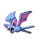

[Frames elegidos](../pokemon/zubat/anim_front_selected.png) · [Todas las poses](../pokemon/zubat/anim_front_source.png)

default.back · 64×64 · APNG [3, 8, 5]

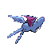

[Frames elegidos](../pokemon/zubat/back_selected.png) · [Todas las poses](../pokemon/zubat/back_source.png)

## GOLBAT

default.front · 111×111 · APNG [0, 1, 4, 6, 7]

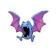

[Frames elegidos](../pokemon/golbat/anim_front_selected.png) · [Todas las poses](../pokemon/golbat/anim_front_source.png)

default.back · 80×80 · APNG [0, 1, 4]

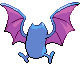

[Frames elegidos](../pokemon/golbat/back_selected.png) · [Todas las poses](../pokemon/golbat/back_source.png)

## CROBAT

default.front · 96×96 · APNG [0, 2, 5, 14, 17]

[Frames elegidos](../pokemon/crobat/anim_front_selected.png) · [Todas las poses](../pokemon/crobat/anim_front_source.png)

default.back · 96×96 · APNG [0, 9, 6]

[Frames elegidos](../pokemon/crobat/back_selected.png) · [Todas las poses](../pokemon/crobat/back_source.png)

## ODDISH

default.front · 64×64 · APNG [2, 1, 3, 46, 48]

[Frames elegidos](../pokemon/oddish/anim_front_selected.png) · [Todas las poses](../pokemon/oddish/anim_front_source.png)

default.back · 64×64 · APNG [2, 0, 4]

[Frames elegidos](../pokemon/oddish/back_selected.png) · [Todas las poses](../pokemon/oddish/back_source.png)

## GLOOM

default.front · 64×64 · APNG [14, 8, 12, 4, 37]

[Frames elegidos](../pokemon/gloom/anim_front_selected.png) · [Todas las poses](../pokemon/gloom/anim_front_source.png)

default.back · 64×64 · APNG [1, 0, 4]

[Frames elegidos](../pokemon/gloom/back_selected.png) · [Todas las poses](../pokemon/gloom/back_source.png)

## VILEPLUME

default.front · 64×64 · APNG [0, 8, 4, 2, 6]

[Frames elegidos](../pokemon/vileplume/anim_front_selected.png) · [Todas las poses](../pokemon/vileplume/anim_front_source.png)

default.back · 64×64 · APNG [2, 0, 5]

[Frames elegidos](../pokemon/vileplume/back_selected.png) · [Todas las poses](../pokemon/vileplume/back_source.png)

## BELLOSSOM

default.front · 64×64 · APNG [0, 9, 3, 42, 45]

[Frames elegidos](../pokemon/bellossom/anim_front_selected.png) · [Todas las poses](../pokemon/bellossom/anim_front_source.png)

default.back · 64×64 · APNG [0, 3, 9]

[Frames elegidos](../pokemon/bellossom/back_selected.png) · [Todas las poses](../pokemon/bellossom/back_source.png)

[Índice](../GALLERY.md) · [Anterior](page_01.md) · [Siguiente](page_03.md)
