# Galería / página 3

[Índice](../GALLERY.md) · [Anterior](page_02.md) · [Siguiente](page_04.md)

## CROBAT

default.front · 96×96 · APNG [0, 2, 5, 14, 17] · timing: source_timeline

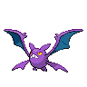

[Frames elegidos](../pokemon/crobat/anim_front_selected.png) · [Todas las poses](../pokemon/crobat/anim_front_source.png)

default.back · 96×96 · APNG [0, 9, 6] · timing: source_idle_cycle

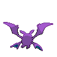

[Frames elegidos](../pokemon/crobat/back_selected.png) · [Todas las poses](../pokemon/crobat/back_source.png)

## ODDISH

default.front · 64×64 · APNG [2, 1, 3, 46, 48] · timing: source_timeline

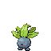

[Frames elegidos](../pokemon/oddish/anim_front_selected.png) · [Todas las poses](../pokemon/oddish/anim_front_source.png)

default.back · 64×64 · APNG [2, 0, 4] · timing: source_idle_cycle

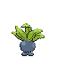

[Frames elegidos](../pokemon/oddish/back_selected.png) · [Todas las poses](../pokemon/oddish/back_source.png)

## GLOOM

default.front · 64×64 · APNG [14, 8, 12, 4, 37] · timing: synthetic_special_cadence

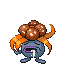

[Frames elegidos](../pokemon/gloom/anim_front_selected.png) · [Todas las poses](../pokemon/gloom/anim_front_source.png)

default.back · 64×64 · APNG [1, 0, 4] · timing: source_idle_cycle

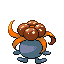

[Frames elegidos](../pokemon/gloom/back_selected.png) · [Todas las poses](../pokemon/gloom/back_source.png)

female.front · 64×64 · tira original [0, 1, 0, 2, 3] · timing: shared_species_timing

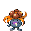

[Frames elegidos](../pokemon/gloom/anim_frontf_selected.png) · [Todas las poses](../pokemon/gloom/anim_frontf_source.png)

female.back · 64×64 · APNG [1, 0, 4] · timing: shared_species_timing

[Frames elegidos](../pokemon/gloom/backf_selected.png) · [Todas las poses](../pokemon/gloom/backf_source.png)

## VILEPLUME

default.front · 64×64 · APNG [0, 8, 4, 2, 6] · timing: synthetic_special_cadence

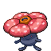

[Frames elegidos](../pokemon/vileplume/anim_front_selected.png) · [Todas las poses](../pokemon/vileplume/anim_front_source.png)

default.back · 64×64 · APNG [2, 0, 5] · timing: source_idle_cycle

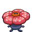

[Frames elegidos](../pokemon/vileplume/back_selected.png) · [Todas las poses](../pokemon/vileplume/back_source.png)

female.front · 64×64 · tira original [0, 1, 0, 2, 3] · timing: shared_species_timing

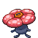

[Frames elegidos](../pokemon/vileplume/anim_frontf_selected.png) · [Todas las poses](../pokemon/vileplume/anim_frontf_source.png)

female.back · 64×64 · APNG [2, 0, 5] · timing: shared_species_timing

[Frames elegidos](../pokemon/vileplume/backf_selected.png) · [Todas las poses](../pokemon/vileplume/backf_source.png)

## BELLOSSOM

default.front · 64×64 · APNG [0, 9, 3, 42, 45] · timing: source_timeline

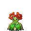

[Frames elegidos](../pokemon/bellossom/anim_front_selected.png) · [Todas las poses](../pokemon/bellossom/anim_front_source.png)

default.back · 64×64 · APNG [0, 3, 9] · timing: source_idle_cycle

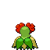

[Frames elegidos](../pokemon/bellossom/back_selected.png) · [Todas las poses](../pokemon/bellossom/back_source.png)

## PARAS

default.front · 64×64 · APNG [1, 0, 3, 27, 30] · timing: source_timeline

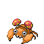

[Frames elegidos](../pokemon/paras/anim_front_selected.png) · [Todas las poses](../pokemon/paras/anim_front_source.png)

default.back · 64×64 · APNG [2, 3, 0] · timing: source_idle_cycle

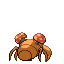

[Frames elegidos](../pokemon/paras/back_selected.png) · [Todas las poses](../pokemon/paras/back_source.png)

## PARASECT

default.front · 64×64 · APNG [0, 8, 4, 2, 14] · timing: synthetic_special_cadence

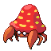

[Frames elegidos](../pokemon/parasect/anim_front_selected.png) · [Todas las poses](../pokemon/parasect/anim_front_source.png)

default.back · 64×64 · APNG [10, 0, 12] · timing: source_idle_cycle

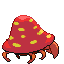

[Frames elegidos](../pokemon/parasect/back_selected.png) · [Todas las poses](../pokemon/parasect/back_source.png)

## MEOWTH

default.front · 80×80 · APNG [6, 0, 4, 58, 61] · timing: source_timeline

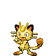

[Frames elegidos](../pokemon/meowth/anim_front_selected.png) · [Todas las poses](../pokemon/meowth/anim_front_source.png)

default.back · 64×64 · APNG [6, 0, 4] · timing: source_idle_cycle

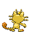

[Frames elegidos](../pokemon/meowth/back_selected.png) · [Todas las poses](../pokemon/meowth/back_source.png)

## PERSIAN

default.front · 80×80 · APNG [11, 0, 13, 4, 16] · timing: synthetic_special_cadence

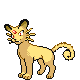

[Frames elegidos](../pokemon/persian/anim_front_selected.png) · [Todas las poses](../pokemon/persian/anim_front_source.png)

default.back · 80×80 · APNG [11, 0, 13] · timing: source_idle_cycle

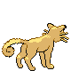

[Frames elegidos](../pokemon/persian/back_selected.png) · [Todas las poses](../pokemon/persian/back_source.png)

## PSYDUCK

default.front · 64×64 · APNG [3, 8, 0, 12, 14] · timing: source_timeline

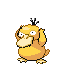

[Frames elegidos](../pokemon/psyduck/anim_front_selected.png) · [Todas las poses](../pokemon/psyduck/anim_front_source.png)

default.back · 64×64 · APNG [18, 0, 6] · timing: source_idle_cycle

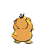

[Frames elegidos](../pokemon/psyduck/back_selected.png) · [Todas las poses](../pokemon/psyduck/back_source.png)

## GOLDUCK

default.front · 64×64 · APNG [2, 0, 4, 28, 32] · timing: source_timeline

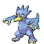

[Frames elegidos](../pokemon/golduck/anim_front_selected.png) · [Todas las poses](../pokemon/golduck/anim_front_source.png)

default.back · 64×64 · APNG [3, 0, 4] · timing: source_idle_cycle

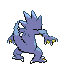

[Frames elegidos](../pokemon/golduck/back_selected.png) · [Todas las poses](../pokemon/golduck/back_source.png)

## MANKEY

default.front · 80×80 · APNG [5, 0, 4, 26, 28] · timing: source_timeline

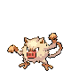

[Frames elegidos](../pokemon/mankey/anim_front_selected.png) · [Todas las poses](../pokemon/mankey/anim_front_source.png)

default.back · 64×64 · APNG [2, 0, 4] · timing: source_idle_cycle

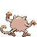

[Frames elegidos](../pokemon/mankey/back_selected.png) · [Todas las poses](../pokemon/mankey/back_source.png)

## PRIMEAPE

default.front · 80×80 · APNG [16, 9, 13, 1, 11] · timing: synthetic_special_cadence

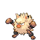

[Frames elegidos](../pokemon/primeape/anim_front_selected.png) · [Todas las poses](../pokemon/primeape/anim_front_source.png)

default.back · 80×80 · APNG [7, 9, 13] · timing: source_idle_cycle

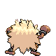

[Frames elegidos](../pokemon/primeape/back_selected.png) · [Todas las poses](../pokemon/primeape/back_source.png)

## ANNIHILAPE

default.front · 64×64 · tira original [0, 1, 0, 1, 1] · timing: legacy_estimated

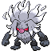

[Frames elegidos](../pokemon/annihilape/anim_front_selected.png) · [Todas las poses](../pokemon/annihilape/anim_front_source.png)

default.back · 64×64 · tira original [0, 0, 0] · timing: legacy_estimated

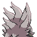

[Frames elegidos](../pokemon/annihilape/back_selected.png) · [Todas las poses](../pokemon/annihilape/back_source.png)

## GROWLITHE

default.front · 64×64 · APNG [0, 1, 4, 55, 57] · timing: source_timeline

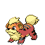

[Frames elegidos](../pokemon/growlithe/anim_front_selected.png) · [Todas las poses](../pokemon/growlithe/anim_front_source.png)

default.back · 64×64 · APNG [0, 2, 5] · timing: source_idle_cycle

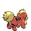

[Frames elegidos](../pokemon/growlithe/back_selected.png) · [Todas las poses](../pokemon/growlithe/back_source.png)

## ARCANINE

default.front · 80×80 · APNG [6, 0, 4, 1, 3] · timing: synthetic_special_cadence

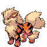

[Frames elegidos](../pokemon/arcanine/anim_front_selected.png) · [Todas las poses](../pokemon/arcanine/anim_front_source.png)

default.back · 96×96 · APNG [2, 0, 4] · timing: source_idle_cycle

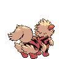

[Frames elegidos](../pokemon/arcanine/back_selected.png) · [Todas las poses](../pokemon/arcanine/back_source.png)

## POLIWAG

default.front · 64×64 · APNG [2, 1, 4, 27, 33] · timing: source_timeline

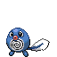

[Frames elegidos](../pokemon/poliwag/anim_front_selected.png) · [Todas las poses](../pokemon/poliwag/anim_front_source.png)

default.back · 64×64 · APNG [2, 1, 4] · timing: source_idle_cycle

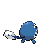

[Frames elegidos](../pokemon/poliwag/back_selected.png) · [Todas las poses](../pokemon/poliwag/back_source.png)

## POLIWHIRL

default.front · 80×80 · APNG [1, 0, 3, 40, 43] · timing: source_timeline

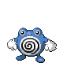

[Frames elegidos](../pokemon/poliwhirl/anim_front_selected.png) · [Todas las poses](../pokemon/poliwhirl/anim_front_source.png)

default.back · 80×80 · APNG [4, 3, 0] · timing: source_idle_cycle

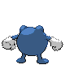

[Frames elegidos](../pokemon/poliwhirl/back_selected.png) · [Todas las poses](../pokemon/poliwhirl/back_source.png)

## POLIWRATH

default.front · 96×96 · APNG [2, 0, 4, 1, 5] · timing: synthetic_special_cadence

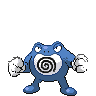

[Frames elegidos](../pokemon/poliwrath/anim_front_selected.png) · [Todas las poses](../pokemon/poliwrath/anim_front_source.png)

default.back · 80×80 · APNG [2, 0, 4] · timing: source_idle_cycle

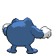

[Frames elegidos](../pokemon/poliwrath/back_selected.png) · [Todas las poses](../pokemon/poliwrath/back_source.png)

## POLITOED

default.front · 80×80 · APNG [0, 8, 3, 38, 42] · timing: source_timeline

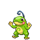

[Frames elegidos](../pokemon/politoed/anim_front_selected.png) · [Todas las poses](../pokemon/politoed/anim_front_source.png)

default.back · 96×96 · APNG [0, 8, 3] · timing: source_idle_cycle

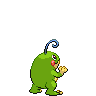

[Frames elegidos](../pokemon/politoed/back_selected.png) · [Todas las poses](../pokemon/politoed/back_source.png)

female.front · 80×80 · tira original [0, 1, 0, 2, 3] · timing: shared_species_timing

[Frames elegidos](../pokemon/politoed/anim_frontf_selected.png) · [Todas las poses](../pokemon/politoed/anim_frontf_source.png)

female.back · 64×64 · tira original [0, 0, 0] · timing: shared_species_timing

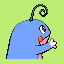

[Frames elegidos](../pokemon/politoed/backf_selected.png) · [Todas las poses](../pokemon/politoed/backf_source.png)

## ABRA

default.front · 64×64 · APNG [71, 85, 76, 63, 209] · timing: synthetic_special_cadence

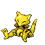

[Frames elegidos](../pokemon/abra/anim_front_selected.png) · [Todas las poses](../pokemon/abra/anim_front_source.png)

default.back · 80×80 · APNG [4, 9, 18] · timing: source_idle_cycle

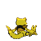

[Frames elegidos](../pokemon/abra/back_selected.png) · [Todas las poses](../pokemon/abra/back_source.png)

## KADABRA

default.front · 80×80 · APNG [0, 1, 5, 44, 46] · timing: source_timeline

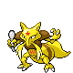

[Frames elegidos](../pokemon/kadabra/anim_front_selected.png) · [Todas las poses](../pokemon/kadabra/anim_front_source.png)

default.back · 80×80 · APNG [7, 1, 5] · timing: source_idle_cycle

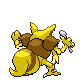

[Frames elegidos](../pokemon/kadabra/back_selected.png) · [Todas las poses](../pokemon/kadabra/back_source.png)

female.front · 80×80 · tira original [0, 1, 0, 2, 3] · timing: shared_species_timing

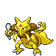

[Frames elegidos](../pokemon/kadabra/anim_frontf_selected.png) · [Todas las poses](../pokemon/kadabra/anim_frontf_source.png)

female.back · 64×64 · tira original [0, 0, 0] · timing: shared_species_timing

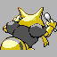

[Frames elegidos](../pokemon/kadabra/backf_selected.png) · [Todas las poses](../pokemon/kadabra/backf_source.png)

## ALAKAZAM

default.front · 96×96 · APNG [2, 12, 5, 55, 64] · timing: source_timeline

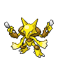

[Frames elegidos](../pokemon/alakazam/anim_front_selected.png) · [Todas las poses](../pokemon/alakazam/anim_front_source.png)

default.back · 96×96 · APNG [3, 0, 6] · timing: source_idle_cycle

[Frames elegidos](../pokemon/alakazam/back_selected.png) · [Todas las poses](../pokemon/alakazam/back_source.png)

female.front · 96×96 · tira original [0, 1, 0, 2, 3] · timing: shared_species_timing

[Frames elegidos](../pokemon/alakazam/anim_frontf_selected.png) · [Todas las poses](../pokemon/alakazam/anim_frontf_source.png)

female.back · 64×64 · tira original [0, 0, 0] · timing: shared_species_timing

[Frames elegidos](../pokemon/alakazam/backf_selected.png) · [Todas las poses](../pokemon/alakazam/backf_source.png)

## MACHOP

default.front · 64×64 · APNG [2, 0, 4, 83, 94] · timing: source_timeline

[Frames elegidos](../pokemon/machop/anim_front_selected.png) · [Todas las poses](../pokemon/machop/anim_front_source.png)

default.back · 64×64 · APNG [2, 0, 4] · timing: source_idle_cycle

[Frames elegidos](../pokemon/machop/back_selected.png) · [Todas las poses](../pokemon/machop/back_source.png)

## MACHOKE

default.front · 80×80 · APNG [0, 10, 12, 4, 15] · timing: synthetic_special_cadence

[Frames elegidos](../pokemon/machoke/anim_front_selected.png) · [Todas las poses](../pokemon/machoke/anim_front_source.png)

default.back · 80×80 · APNG [0, 4, 12] · timing: source_idle_cycle

[Frames elegidos](../pokemon/machoke/back_selected.png) · [Todas las poses](../pokemon/machoke/back_source.png)

[Índice](../GALLERY.md) · [Anterior](page_02.md) · [Siguiente](page_04.md)
