# Galería / página 4

[Índice](../GALLERY.md) · [Anterior](page_03.md) · [Siguiente](page_05.md)

## MACHAMP

default.front · 80×80 · APNG [0, 9, 4, 11, 13] · timing: source_timeline

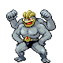

[Frames elegidos](../pokemon/machamp/anim_front_selected.png) · [Todas las poses](../pokemon/machamp/anim_front_source.png)

default.back · 80×80 · APNG [0, 10, 4] · timing: source_idle_cycle

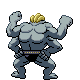

[Frames elegidos](../pokemon/machamp/back_selected.png) · [Todas las poses](../pokemon/machamp/back_source.png)

## BELLSPROUT

default.front · 64×64 · APNG [1, 3, 5, 31, 32] · timing: source_timeline

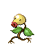

[Frames elegidos](../pokemon/bellsprout/anim_front_selected.png) · [Todas las poses](../pokemon/bellsprout/anim_front_source.png)

default.back · 64×64 · APNG [2, 5, 0] · timing: source_idle_cycle

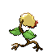

[Frames elegidos](../pokemon/bellsprout/back_selected.png) · [Todas las poses](../pokemon/bellsprout/back_source.png)

## WEEPINBELL

default.front · 80×80 · APNG [2, 0, 4, 36, 44] · timing: source_timeline

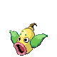

[Frames elegidos](../pokemon/weepinbell/anim_front_selected.png) · [Todas las poses](../pokemon/weepinbell/anim_front_source.png)

default.back · 64×64 · APNG [2, 0, 4] · timing: source_idle_cycle

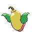

[Frames elegidos](../pokemon/weepinbell/back_selected.png) · [Todas las poses](../pokemon/weepinbell/back_source.png)

## VICTREEBEL

default.front · 80×80 · APNG [11, 0, 8, 3, 14] · timing: synthetic_special_cadence

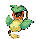

[Frames elegidos](../pokemon/victreebel/anim_front_selected.png) · [Todas las poses](../pokemon/victreebel/anim_front_source.png)

default.back · 80×80 · APNG [11, 0, 7] · timing: source_idle_cycle

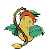

[Frames elegidos](../pokemon/victreebel/back_selected.png) · [Todas las poses](../pokemon/victreebel/back_source.png)

## TENTACOOL

default.front · 80×80 · APNG [5, 8, 0, 19, 21] · timing: source_timeline

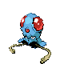

[Frames elegidos](../pokemon/tentacool/anim_front_selected.png) · [Todas las poses](../pokemon/tentacool/anim_front_source.png)

default.back · 80×80 · APNG [11, 8, 0] · timing: source_idle_cycle

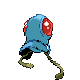

[Frames elegidos](../pokemon/tentacool/back_selected.png) · [Todas las poses](../pokemon/tentacool/back_source.png)

## TENTACRUEL

default.front · 96×96 · APNG [30, 17, 1, 42, 53] · timing: source_timeline

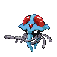

[Frames elegidos](../pokemon/tentacruel/anim_front_selected.png) · [Todas las poses](../pokemon/tentacruel/anim_front_source.png)

default.back · 96×96 · APNG [28, 17, 0] · timing: source_idle_cycle

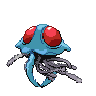

[Frames elegidos](../pokemon/tentacruel/back_selected.png) · [Todas las poses](../pokemon/tentacruel/back_source.png)

## GEODUDE

default.front · 64×64 · APNG [38, 35, 28, 14, 36] · timing: synthetic_special_cadence

[Frames elegidos](../pokemon/geodude/anim_front_selected.png) · [Todas las poses](../pokemon/geodude/anim_front_source.png)

default.back · 64×64 · APNG [24, 27, 23] · timing: source_idle_cycle

[Frames elegidos](../pokemon/geodude/back_selected.png) · [Todas las poses](../pokemon/geodude/back_source.png)

## GRAVELER

default.front · 80×80 · APNG [2, 0, 4, 5, 7] · timing: synthetic_special_cadence

[Frames elegidos](../pokemon/graveler/anim_front_selected.png) · [Todas las poses](../pokemon/graveler/anim_front_source.png)

default.back · 80×80 · APNG [1, 0, 4] · timing: source_idle_cycle

[Frames elegidos](../pokemon/graveler/back_selected.png) · [Todas las poses](../pokemon/graveler/back_source.png)

## GOLEM

default.front · 80×80 · APNG [7, 0, 5, 34, 42] · timing: source_timeline

[Frames elegidos](../pokemon/golem/anim_front_selected.png) · [Todas las poses](../pokemon/golem/anim_front_source.png)

default.back · 80×80 · APNG [3, 0, 5] · timing: source_idle_cycle

[Frames elegidos](../pokemon/golem/back_selected.png) · [Todas las poses](../pokemon/golem/back_source.png)

## PONYTA

default.front · 64×64 · APNG [12, 0, 7, 9, 16] · timing: synthetic_special_cadence

[Frames elegidos](../pokemon/ponyta/anim_front_selected.png) · [Todas las poses](../pokemon/ponyta/anim_front_source.png)

default.back · 64×64 · APNG [12, 0, 8] · timing: source_idle_cycle

[Frames elegidos](../pokemon/ponyta/back_selected.png) · [Todas las poses](../pokemon/ponyta/back_source.png)

## RAPIDASH

default.front · 80×80 · APNG [0, 55, 213, 571, 639] · timing: synthetic_special_cadence

[Frames elegidos](../pokemon/rapidash/anim_front_selected.png) · [Todas las poses](../pokemon/rapidash/anim_front_source.png)

default.back · 80×80 · APNG [0, 4, 11] · timing: source_idle_cycle

[Frames elegidos](../pokemon/rapidash/back_selected.png) · [Todas las poses](../pokemon/rapidash/back_source.png)

## SLOWPOKE

default.front · 64×64 · APNG [11, 0, 7, 5, 12] · timing: synthetic_special_cadence

[Frames elegidos](../pokemon/slowpoke/anim_front_selected.png) · [Todas las poses](../pokemon/slowpoke/anim_front_source.png)

default.back · 80×80 · APNG [3, 7, 0] · timing: source_idle_cycle

[Frames elegidos](../pokemon/slowpoke/back_selected.png) · [Todas las poses](../pokemon/slowpoke/back_source.png)

## SLOWBRO

default.front · 64×64 · APNG [14, 0, 9, 43, 51] · timing: source_timeline

[Frames elegidos](../pokemon/slowbro/anim_front_selected.png) · [Todas las poses](../pokemon/slowbro/anim_front_source.png)

default.back · 80×80 · APNG [5, 8, 17] · timing: source_idle_cycle

[Frames elegidos](../pokemon/slowbro/back_selected.png) · [Todas las poses](../pokemon/slowbro/back_source.png)

## SLOWKING

default.front · 80×80 · APNG [0, 11, 4, 2, 8] · timing: synthetic_special_cadence

[Frames elegidos](../pokemon/slowking/anim_front_selected.png) · [Todas las poses](../pokemon/slowking/anim_front_source.png)

default.back · 80×80 · APNG [0, 2, 9] · timing: source_idle_cycle

[Frames elegidos](../pokemon/slowking/back_selected.png) · [Todas las poses](../pokemon/slowking/back_source.png)

## MAGNEMITE

default.front · 64×64 · APNG [15, 6, 0, 11, 42] · timing: synthetic_special_cadence

[Frames elegidos](../pokemon/magnemite/anim_front_selected.png) · [Todas las poses](../pokemon/magnemite/anim_front_source.png)

default.back · 64×64 · APNG [15, 18, 12] · timing: source_idle_cycle

[Frames elegidos](../pokemon/magnemite/back_selected.png) · [Todas las poses](../pokemon/magnemite/back_source.png)

## MAGNETON

default.front · 80×80 · APNG [0, 20, 7, 210, 223] · timing: source_timeline

[Frames elegidos](../pokemon/magneton/anim_front_selected.png) · [Todas las poses](../pokemon/magneton/anim_front_source.png)

default.back · 80×80 · APNG [0, 6, 18] · timing: source_idle_cycle

[Frames elegidos](../pokemon/magneton/back_selected.png) · [Todas las poses](../pokemon/magneton/back_source.png)

## MAGNEZONE

default.front · 96×96 · APNG [0, 21, 8, 55, 60] · timing: source_timeline

[Frames elegidos](../pokemon/magnezone/anim_front_selected.png) · [Todas las poses](../pokemon/magnezone/anim_front_source.png)

default.back · 96×96 · APNG [0, 19, 8] · timing: source_idle_cycle

[Frames elegidos](../pokemon/magnezone/back_selected.png) · [Todas las poses](../pokemon/magnezone/back_source.png)

## DODUO

default.front · 64×64 · APNG [9, 1, 7, 46, 52] · timing: source_timeline

[Frames elegidos](../pokemon/doduo/anim_front_selected.png) · [Todas las poses](../pokemon/doduo/anim_front_source.png)

default.back · 64×64 · APNG [11, 7, 0] · timing: source_idle_cycle

[Frames elegidos](../pokemon/doduo/back_selected.png) · [Todas las poses](../pokemon/doduo/back_source.png)

female.front · 64×64 · tira original [0, 1, 0, 2, 3] · timing: shared_species_timing

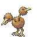

[Frames elegidos](../pokemon/doduo/anim_frontf_selected.png) · [Todas las poses](../pokemon/doduo/anim_frontf_source.png)

female.back · 64×64 · APNG [11, 7, 0] · timing: shared_species_timing

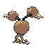

[Frames elegidos](../pokemon/doduo/backf_selected.png) · [Todas las poses](../pokemon/doduo/backf_source.png)

## DODRIO

default.front · 80×80 · APNG [42, 0, 6, 3, 76] · timing: synthetic_special_cadence

[Frames elegidos](../pokemon/dodrio/anim_front_selected.png) · [Todas las poses](../pokemon/dodrio/anim_front_source.png)

default.back · 80×80 · APNG [36, 51, 6] · timing: source_idle_cycle

[Frames elegidos](../pokemon/dodrio/back_selected.png) · [Todas las poses](../pokemon/dodrio/back_source.png)

female.front · 80×80 · tira original [0, 1, 0, 2, 3] · timing: shared_species_timing

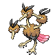

[Frames elegidos](../pokemon/dodrio/anim_frontf_selected.png) · [Todas las poses](../pokemon/dodrio/anim_frontf_source.png)

female.back · 80×80 · APNG [36, 51, 6] · timing: shared_species_timing

[Frames elegidos](../pokemon/dodrio/backf_selected.png) · [Todas las poses](../pokemon/dodrio/backf_source.png)

## GRIMER

default.front · 80×80 · APNG [5, 14, 7, 48, 52] · timing: source_timeline

[Frames elegidos](../pokemon/grimer/anim_front_selected.png) · [Todas las poses](../pokemon/grimer/anim_front_source.png)

default.back · 80×80 · APNG [3, 7, 0] · timing: source_idle_cycle

[Frames elegidos](../pokemon/grimer/back_selected.png) · [Todas las poses](../pokemon/grimer/back_source.png)

## MUK

default.front · 96×96 · APNG [0, 13, 4, 37, 43] · timing: source_timeline

[Frames elegidos](../pokemon/muk/anim_front_selected.png) · [Todas las poses](../pokemon/muk/anim_front_source.png)

default.back · 96×96 · APNG [0, 10, 4] · timing: source_idle_cycle

[Frames elegidos](../pokemon/muk/back_selected.png) · [Todas las poses](../pokemon/muk/back_source.png)

## SHELLDER

default.front · 64×64 · APNG [7, 11, 0, 27, 33] · timing: source_timeline

[Frames elegidos](../pokemon/shellder/anim_front_selected.png) · [Todas las poses](../pokemon/shellder/anim_front_source.png)

default.back · 64×64 · APNG [7, 11, 0] · timing: source_idle_cycle

[Frames elegidos](../pokemon/shellder/back_selected.png) · [Todas las poses](../pokemon/shellder/back_source.png)

## CLOYSTER

default.front · 80×80 · APNG [5, 0, 9, 13, 15] · timing: synthetic_special_cadence

[Frames elegidos](../pokemon/cloyster/anim_front_selected.png) · [Todas las poses](../pokemon/cloyster/anim_front_source.png)

default.back · 80×80 · APNG [13, 9, 0] · timing: source_idle_cycle

[Frames elegidos](../pokemon/cloyster/back_selected.png) · [Todas las poses](../pokemon/cloyster/back_source.png)

## GASTLY

default.front · 80×80 · APNG [22, 0, 13, 59, 72] · timing: source_timeline

[Frames elegidos](../pokemon/gastly/anim_front_selected.png) · [Todas las poses](../pokemon/gastly/anim_front_source.png)

default.back · 80×80 · APNG [35, 0, 14] · timing: source_idle_cycle

[Frames elegidos](../pokemon/gastly/back_selected.png) · [Todas las poses](../pokemon/gastly/back_source.png)

## HAUNTER

default.front · 80×80 · APNG [3, 0, 8, 11, 14] · timing: source_timeline

[Frames elegidos](../pokemon/haunter/anim_front_selected.png) · [Todas las poses](../pokemon/haunter/anim_front_source.png)

default.back · 80×80 · APNG [3, 0, 8] · timing: source_idle_cycle

[Frames elegidos](../pokemon/haunter/back_selected.png) · [Todas las poses](../pokemon/haunter/back_source.png)

[Índice](../GALLERY.md) · [Anterior](page_03.md) · [Siguiente](page_05.md)
