# Galería / página 4

[Índice](../GALLERY.md) · [Anterior](page_03.md) · [Siguiente](page_05.md)

## GEODUDE

default.front · 64×64 · APNG [38, 35, 28, 14, 36]

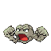

[Frames elegidos](../pokemon/geodude/anim_front_selected.png) · [Todas las poses](../pokemon/geodude/anim_front_source.png)

default.back · 64×64 · APNG [24, 27, 23]

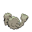

[Frames elegidos](../pokemon/geodude/back_selected.png) · [Todas las poses](../pokemon/geodude/back_source.png)

## GRAVELER

default.front · 80×80 · APNG [2, 0, 4, 5, 7]

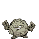

[Frames elegidos](../pokemon/graveler/anim_front_selected.png) · [Todas las poses](../pokemon/graveler/anim_front_source.png)

default.back · 80×80 · APNG [1, 0, 4]

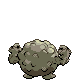

[Frames elegidos](../pokemon/graveler/back_selected.png) · [Todas las poses](../pokemon/graveler/back_source.png)

## GOLEM

default.front · 80×80 · APNG [7, 0, 5, 34, 42]

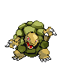

[Frames elegidos](../pokemon/golem/anim_front_selected.png) · [Todas las poses](../pokemon/golem/anim_front_source.png)

default.back · 80×80 · APNG [3, 0, 5]

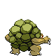

[Frames elegidos](../pokemon/golem/back_selected.png) · [Todas las poses](../pokemon/golem/back_source.png)

## PONYTA

default.front · 64×64 · APNG [12, 0, 7, 9, 16]

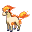

[Frames elegidos](../pokemon/ponyta/anim_front_selected.png) · [Todas las poses](../pokemon/ponyta/anim_front_source.png)

default.back · 64×64 · APNG [12, 0, 8]

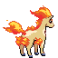

[Frames elegidos](../pokemon/ponyta/back_selected.png) · [Todas las poses](../pokemon/ponyta/back_source.png)

## RAPIDASH

default.front · 80×80 · APNG [0, 55, 213, 571, 639]

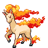

[Frames elegidos](../pokemon/rapidash/anim_front_selected.png) · [Todas las poses](../pokemon/rapidash/anim_front_source.png)

default.back · 80×80 · APNG [0, 4, 11]

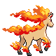

[Frames elegidos](../pokemon/rapidash/back_selected.png) · [Todas las poses](../pokemon/rapidash/back_source.png)

## SLOWPOKE

default.front · 64×64 · APNG [11, 0, 7, 5, 12]

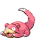

[Frames elegidos](../pokemon/slowpoke/anim_front_selected.png) · [Todas las poses](../pokemon/slowpoke/anim_front_source.png)

default.back · 80×80 · APNG [3, 7, 0]

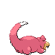

[Frames elegidos](../pokemon/slowpoke/back_selected.png) · [Todas las poses](../pokemon/slowpoke/back_source.png)

## SLOWBRO

default.front · 64×64 · APNG [14, 0, 9, 43, 51]

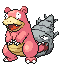

[Frames elegidos](../pokemon/slowbro/anim_front_selected.png) · [Todas las poses](../pokemon/slowbro/anim_front_source.png)

default.back · 80×80 · APNG [5, 8, 17]

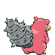

[Frames elegidos](../pokemon/slowbro/back_selected.png) · [Todas las poses](../pokemon/slowbro/back_source.png)

## SLOWKING

default.front · 80×80 · APNG [0, 11, 4, 2, 8]

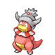

[Frames elegidos](../pokemon/slowking/anim_front_selected.png) · [Todas las poses](../pokemon/slowking/anim_front_source.png)

default.back · 80×80 · APNG [0, 2, 9]

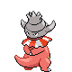

[Frames elegidos](../pokemon/slowking/back_selected.png) · [Todas las poses](../pokemon/slowking/back_source.png)

## MAGNEMITE

default.front · 64×64 · APNG [15, 6, 0, 11, 42]

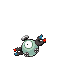

[Frames elegidos](../pokemon/magnemite/anim_front_selected.png) · [Todas las poses](../pokemon/magnemite/anim_front_source.png)

default.back · 64×64 · APNG [15, 18, 12]

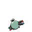

[Frames elegidos](../pokemon/magnemite/back_selected.png) · [Todas las poses](../pokemon/magnemite/back_source.png)

## MAGNETON

default.front · 80×80 · APNG [0, 20, 7, 210, 223]

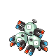

[Frames elegidos](../pokemon/magneton/anim_front_selected.png) · [Todas las poses](../pokemon/magneton/anim_front_source.png)

default.back · 80×80 · APNG [0, 6, 18]

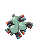

[Frames elegidos](../pokemon/magneton/back_selected.png) · [Todas las poses](../pokemon/magneton/back_source.png)

## MAGNEZONE

default.front · 96×96 · APNG [0, 21, 8, 55, 60]

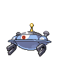

[Frames elegidos](../pokemon/magnezone/anim_front_selected.png) · [Todas las poses](../pokemon/magnezone/anim_front_source.png)

default.back · 96×96 · APNG [0, 19, 8]

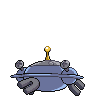

[Frames elegidos](../pokemon/magnezone/back_selected.png) · [Todas las poses](../pokemon/magnezone/back_source.png)

## DODUO

default.front · 64×64 · APNG [9, 1, 7, 46, 52]

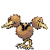

[Frames elegidos](../pokemon/doduo/anim_front_selected.png) · [Todas las poses](../pokemon/doduo/anim_front_source.png)

default.back · 64×64 · APNG [11, 7, 0]

[Frames elegidos](../pokemon/doduo/back_selected.png) · [Todas las poses](../pokemon/doduo/back_source.png)

## DODRIO

default.front · 80×80 · APNG [42, 0, 6, 3, 76]

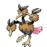

[Frames elegidos](../pokemon/dodrio/anim_front_selected.png) · [Todas las poses](../pokemon/dodrio/anim_front_source.png)

default.back · 80×80 · APNG [36, 51, 6]

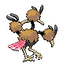

[Frames elegidos](../pokemon/dodrio/back_selected.png) · [Todas las poses](../pokemon/dodrio/back_source.png)

## GRIMER

default.front · 80×80 · APNG [5, 14, 7, 48, 52]

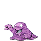

[Frames elegidos](../pokemon/grimer/anim_front_selected.png) · [Todas las poses](../pokemon/grimer/anim_front_source.png)

default.back · 80×80 · APNG [3, 7, 0]

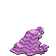

[Frames elegidos](../pokemon/grimer/back_selected.png) · [Todas las poses](../pokemon/grimer/back_source.png)

## MUK

default.front · 96×96 · APNG [0, 13, 4, 37, 43]

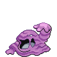

[Frames elegidos](../pokemon/muk/anim_front_selected.png) · [Todas las poses](../pokemon/muk/anim_front_source.png)

default.back · 96×96 · APNG [0, 10, 4]

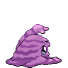

[Frames elegidos](../pokemon/muk/back_selected.png) · [Todas las poses](../pokemon/muk/back_source.png)

## SHELLDER

default.front · 64×64 · APNG [7, 11, 0, 27, 33]

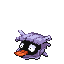

[Frames elegidos](../pokemon/shellder/anim_front_selected.png) · [Todas las poses](../pokemon/shellder/anim_front_source.png)

default.back · 64×64 · APNG [7, 11, 0]

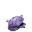

[Frames elegidos](../pokemon/shellder/back_selected.png) · [Todas las poses](../pokemon/shellder/back_source.png)

## CLOYSTER

default.front · 80×80 · APNG [5, 0, 9, 13, 15]

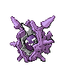

[Frames elegidos](../pokemon/cloyster/anim_front_selected.png) · [Todas las poses](../pokemon/cloyster/anim_front_source.png)

default.back · 80×80 · APNG [13, 9, 0]

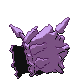

[Frames elegidos](../pokemon/cloyster/back_selected.png) · [Todas las poses](../pokemon/cloyster/back_source.png)

## GASTLY

default.front · 80×80 · APNG [22, 0, 13, 59, 72]

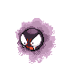

[Frames elegidos](../pokemon/gastly/anim_front_selected.png) · [Todas las poses](../pokemon/gastly/anim_front_source.png)

default.back · 80×80 · APNG [35, 0, 14]

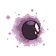

[Frames elegidos](../pokemon/gastly/back_selected.png) · [Todas las poses](../pokemon/gastly/back_source.png)

## HAUNTER

default.front · 80×80 · APNG [3, 0, 8, 11, 14]

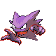

[Frames elegidos](../pokemon/haunter/anim_front_selected.png) · [Todas las poses](../pokemon/haunter/anim_front_source.png)

default.back · 80×80 · APNG [3, 0, 8]

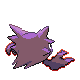

[Frames elegidos](../pokemon/haunter/back_selected.png) · [Todas las poses](../pokemon/haunter/back_source.png)

## GENGAR

default.front · 80×80 · APNG [2, 0, 3, 33, 39]

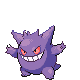

[Frames elegidos](../pokemon/gengar/anim_front_selected.png) · [Todas las poses](../pokemon/gengar/anim_front_source.png)

default.back · 64×64 · APNG [1, 0, 3]

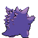

[Frames elegidos](../pokemon/gengar/back_selected.png) · [Todas las poses](../pokemon/gengar/back_source.png)

## ONIX

default.front · 80×80 · APNG [11, 1, 8, 47, 49]

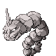

[Frames elegidos](../pokemon/onix/anim_front_selected.png) · [Todas las poses](../pokemon/onix/anim_front_source.png)

default.back · 98×98 · APNG [5, 1, 9]

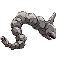

[Frames elegidos](../pokemon/onix/back_selected.png) · [Todas las poses](../pokemon/onix/back_source.png)

## STEELIX

default.front · 96×96 · APNG [0, 4, 12, 2, 8]

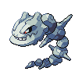

[Frames elegidos](../pokemon/steelix/anim_front_selected.png) · [Todas las poses](../pokemon/steelix/anim_front_source.png)

default.back · 96×96 · APNG [0, 12, 4]

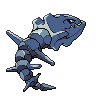

[Frames elegidos](../pokemon/steelix/back_selected.png) · [Todas las poses](../pokemon/steelix/back_source.png)

## DROWZEE

default.front · 64×64 · APNG [4, 1, 6, 43, 45]

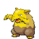

[Frames elegidos](../pokemon/drowzee/anim_front_selected.png) · [Todas las poses](../pokemon/drowzee/anim_front_source.png)

default.back · 64×64 · APNG [0, 3, 8]

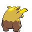

[Frames elegidos](../pokemon/drowzee/back_selected.png) · [Todas las poses](../pokemon/drowzee/back_source.png)

## HYPNO

default.front · 64×64 · APNG [6, 8, 4, 42, 44]

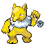

[Frames elegidos](../pokemon/hypno/anim_front_selected.png) · [Todas las poses](../pokemon/hypno/anim_front_source.png)

default.back · 64×64 · APNG [2, 8, 4]

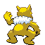

[Frames elegidos](../pokemon/hypno/back_selected.png) · [Todas las poses](../pokemon/hypno/back_source.png)

## KRABBY

default.front · 64×64 · APNG [2, 0, 3, 13, 15]

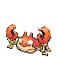

[Frames elegidos](../pokemon/krabby/anim_front_selected.png) · [Todas las poses](../pokemon/krabby/anim_front_source.png)

default.back · 64×64 · APNG [2, 0, 3]

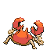

[Frames elegidos](../pokemon/krabby/back_selected.png) · [Todas las poses](../pokemon/krabby/back_source.png)

[Índice](../GALLERY.md) · [Anterior](page_03.md) · [Siguiente](page_05.md)
