# Galería / página 5

[Índice](../GALLERY.md) · [Anterior](page_04.md) · [Siguiente](page_06.md)

## GENGAR

default.front · 80×80 · APNG [2, 0, 3, 33, 39] · timing: source_timeline

[Frames elegidos](../pokemon/gengar/anim_front_selected.png) · [Todas las poses](../pokemon/gengar/anim_front_source.png)

default.back · 64×64 · APNG [1, 0, 3] · timing: source_idle_cycle

[Frames elegidos](../pokemon/gengar/back_selected.png) · [Todas las poses](../pokemon/gengar/back_source.png)

## ONIX

default.front · 80×80 · APNG [11, 1, 8, 47, 49] · timing: source_timeline

[Frames elegidos](../pokemon/onix/anim_front_selected.png) · [Todas las poses](../pokemon/onix/anim_front_source.png)

default.back · 98×98 · APNG [5, 1, 9] · timing: source_idle_cycle

[Frames elegidos](../pokemon/onix/back_selected.png) · [Todas las poses](../pokemon/onix/back_source.png)

## STEELIX

default.front · 96×96 · APNG [0, 4, 12, 2, 8] · timing: synthetic_special_cadence

[Frames elegidos](../pokemon/steelix/anim_front_selected.png) · [Todas las poses](../pokemon/steelix/anim_front_source.png)

default.back · 96×96 · APNG [0, 12, 4] · timing: source_idle_cycle

[Frames elegidos](../pokemon/steelix/back_selected.png) · [Todas las poses](../pokemon/steelix/back_source.png)

female.front · 96×96 · tira original [0, 1, 0, 2, 3] · timing: shared_species_timing

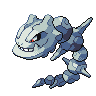

[Frames elegidos](../pokemon/steelix/anim_frontf_selected.png) · [Todas las poses](../pokemon/steelix/anim_frontf_source.png)

female.back · 64×64 · tira original [0, 0, 0] · timing: shared_species_timing

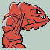

[Frames elegidos](../pokemon/steelix/backf_selected.png) · [Todas las poses](../pokemon/steelix/backf_source.png)

## DROWZEE

default.front · 64×64 · APNG [4, 1, 6, 43, 45] · timing: source_timeline

[Frames elegidos](../pokemon/drowzee/anim_front_selected.png) · [Todas las poses](../pokemon/drowzee/anim_front_source.png)

default.back · 64×64 · APNG [0, 3, 8] · timing: source_idle_cycle

[Frames elegidos](../pokemon/drowzee/back_selected.png) · [Todas las poses](../pokemon/drowzee/back_source.png)

## HYPNO

default.front · 64×64 · APNG [6, 8, 4, 42, 44] · timing: source_timeline

[Frames elegidos](../pokemon/hypno/anim_front_selected.png) · [Todas las poses](../pokemon/hypno/anim_front_source.png)

default.back · 64×64 · APNG [2, 8, 4] · timing: source_idle_cycle

[Frames elegidos](../pokemon/hypno/back_selected.png) · [Todas las poses](../pokemon/hypno/back_source.png)

female.front · 64×64 · tira original [0, 1, 0, 2, 3] · timing: shared_species_timing

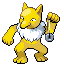

[Frames elegidos](../pokemon/hypno/anim_frontf_selected.png) · [Todas las poses](../pokemon/hypno/anim_frontf_source.png)

female.back · 64×64 · tira original [0, 0, 0] · timing: shared_species_timing

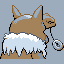

[Frames elegidos](../pokemon/hypno/backf_selected.png) · [Todas las poses](../pokemon/hypno/backf_source.png)

## KRABBY

default.front · 64×64 · APNG [2, 0, 3, 13, 15] · timing: source_timeline

[Frames elegidos](../pokemon/krabby/anim_front_selected.png) · [Todas las poses](../pokemon/krabby/anim_front_source.png)

default.back · 64×64 · APNG [2, 0, 3] · timing: source_idle_cycle

[Frames elegidos](../pokemon/krabby/back_selected.png) · [Todas las poses](../pokemon/krabby/back_source.png)

## KINGLER

default.front · 96×96 · APNG [8, 0, 9, 3, 7] · timing: synthetic_special_cadence

[Frames elegidos](../pokemon/kingler/anim_front_selected.png) · [Todas las poses](../pokemon/kingler/anim_front_source.png)

default.back · 96×96 · APNG [2, 0, 9] · timing: source_idle_cycle

[Frames elegidos](../pokemon/kingler/back_selected.png) · [Todas las poses](../pokemon/kingler/back_source.png)

## EXEGGCUTE

default.front · 64×64 · APNG [0, 4, 2, 3, 5] · timing: synthetic_special_cadence

[Frames elegidos](../pokemon/exeggcute/anim_front_selected.png) · [Todas las poses](../pokemon/exeggcute/anim_front_source.png)

default.back · 64×64 · APNG [0, 4, 2] · timing: source_idle_cycle

[Frames elegidos](../pokemon/exeggcute/back_selected.png) · [Todas las poses](../pokemon/exeggcute/back_source.png)

## EXEGGUTOR

default.front · 80×80 · APNG [0, 2, 4, 6, 7] · timing: synthetic_special_cadence

[Frames elegidos](../pokemon/exeggutor/anim_front_selected.png) · [Todas las poses](../pokemon/exeggutor/anim_front_source.png)

default.back · 80×80 · APNG [0, 2, 4] · timing: source_idle_cycle

[Frames elegidos](../pokemon/exeggutor/back_selected.png) · [Todas las poses](../pokemon/exeggutor/back_source.png)

## CUBONE

default.front · 64×64 · APNG [14, 9, 3, 57, 73] · timing: source_timeline

[Frames elegidos](../pokemon/cubone/anim_front_selected.png) · [Todas las poses](../pokemon/cubone/anim_front_source.png)

default.back · 64×64 · APNG [10, 0, 2] · timing: source_idle_cycle

[Frames elegidos](../pokemon/cubone/back_selected.png) · [Todas las poses](../pokemon/cubone/back_source.png)

## MAROWAK

default.front · 80×80 · APNG [6, 1, 4, 24, 27] · timing: source_timeline

[Frames elegidos](../pokemon/marowak/anim_front_selected.png) · [Todas las poses](../pokemon/marowak/anim_front_source.png)

default.back · 64×64 · APNG [2, 1, 4] · timing: source_idle_cycle

[Frames elegidos](../pokemon/marowak/back_selected.png) · [Todas las poses](../pokemon/marowak/back_source.png)

## MAROWAK_ALOLA

default.front · 64×64 · tira original [0, 1, 0, 1, 1] · timing: legacy_estimated

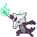

[Frames elegidos](../pokemon/marowak/alola/anim_front_selected.png) · [Todas las poses](../pokemon/marowak/alola/anim_front_source.png)

default.back · 64×64 · tira original [0, 0, 0] · timing: legacy_estimated

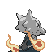

[Frames elegidos](../pokemon/marowak/alola/back_selected.png) · [Todas las poses](../pokemon/marowak/alola/back_source.png)

## TYROGUE

default.front · 64×64 · APNG [1, 5, 3, 34, 36] · timing: source_timeline

[Frames elegidos](../pokemon/tyrogue/anim_front_selected.png) · [Todas las poses](../pokemon/tyrogue/anim_front_source.png)

default.back · 64×64 · APNG [1, 0, 3] · timing: source_idle_cycle

[Frames elegidos](../pokemon/tyrogue/back_selected.png) · [Todas las poses](../pokemon/tyrogue/back_source.png)

## HITMONLEE

default.front · 80×80 · APNG [2, 21, 11, 0, 14] · timing: synthetic_special_cadence

[Frames elegidos](../pokemon/hitmonlee/anim_front_selected.png) · [Todas las poses](../pokemon/hitmonlee/anim_front_source.png)

default.back · 80×80 · APNG [3, 16, 10] · timing: source_idle_cycle

[Frames elegidos](../pokemon/hitmonlee/back_selected.png) · [Todas las poses](../pokemon/hitmonlee/back_source.png)

## HITMONCHAN

default.front · 64×64 · APNG [1, 0, 2, 22, 23] · timing: source_timeline

[Frames elegidos](../pokemon/hitmonchan/anim_front_selected.png) · [Todas las poses](../pokemon/hitmonchan/anim_front_source.png)

default.back · 64×64 · APNG [3, 0, 6] · timing: source_idle_cycle

[Frames elegidos](../pokemon/hitmonchan/back_selected.png) · [Todas las poses](../pokemon/hitmonchan/back_source.png)

## HITMONTOP

default.front · 96×96 · APNG [0, 12, 4, 33, 36] · timing: source_timeline

[Frames elegidos](../pokemon/hitmontop/anim_front_selected.png) · [Todas las poses](../pokemon/hitmontop/anim_front_source.png)

default.back · 80×80 · APNG [0, 4, 12] · timing: source_idle_cycle

[Frames elegidos](../pokemon/hitmontop/back_selected.png) · [Todas las poses](../pokemon/hitmontop/back_source.png)

## LICKITUNG

default.front · 80×80 · APNG [5, 1, 8, 3, 13] · timing: synthetic_special_cadence

[Frames elegidos](../pokemon/lickitung/anim_front_selected.png) · [Todas las poses](../pokemon/lickitung/anim_front_source.png)

default.back · 80×80 · APNG [5, 1, 8] · timing: source_idle_cycle

[Frames elegidos](../pokemon/lickitung/back_selected.png) · [Todas las poses](../pokemon/lickitung/back_source.png)

## LICKILICKY

default.front · 80×80 · APNG [2, 9, 14, 49, 51] · timing: source_timeline

[Frames elegidos](../pokemon/lickilicky/anim_front_selected.png) · [Todas las poses](../pokemon/lickilicky/anim_front_source.png)

default.back · 80×80 · APNG [12, 9, 14] · timing: source_idle_cycle

[Frames elegidos](../pokemon/lickilicky/back_selected.png) · [Todas las poses](../pokemon/lickilicky/back_source.png)

## KOFFING

default.front · 96×96 · APNG [7, 10, 4, 5, 6] · timing: synthetic_special_cadence

[Frames elegidos](../pokemon/koffing/anim_front_selected.png) · [Todas las poses](../pokemon/koffing/anim_front_source.png)

default.back · 64×64 · APNG [0, 10, 7] · timing: source_idle_cycle

[Frames elegidos](../pokemon/koffing/back_selected.png) · [Todas las poses](../pokemon/koffing/back_source.png)

## WEEZING

default.front · 96×96 · APNG [5, 1, 3, 0, 9] · timing: synthetic_special_cadence

[Frames elegidos](../pokemon/weezing/anim_front_selected.png) · [Todas las poses](../pokemon/weezing/anim_front_source.png)

default.back · 96×96 · APNG [2, 1, 7] · timing: source_idle_cycle

[Frames elegidos](../pokemon/weezing/back_selected.png) · [Todas las poses](../pokemon/weezing/back_source.png)

## WEEZING_GALAR

default.front · 64×64 · tira original [0, 0, 0, 0, 0] · timing: legacy_estimated

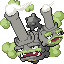

[Frames elegidos](../pokemon/weezing/galar/anim_front_selected.png) · [Todas las poses](../pokemon/weezing/galar/anim_front_source.png)

default.back · 64×64 · tira original [0, 0, 0] · timing: legacy_estimated

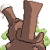

[Frames elegidos](../pokemon/weezing/galar/back_selected.png) · [Todas las poses](../pokemon/weezing/galar/back_source.png)

## RHYHORN

default.front · 80×80 · APNG [3, 0, 5, 33, 37] · timing: source_timeline

[Frames elegidos](../pokemon/rhyhorn/anim_front_selected.png) · [Todas las poses](../pokemon/rhyhorn/anim_front_source.png)

default.back · 80×80 · APNG [4, 0, 5] · timing: source_idle_cycle

[Frames elegidos](../pokemon/rhyhorn/back_selected.png) · [Todas las poses](../pokemon/rhyhorn/back_source.png)

female.front · 80×80 · tira original [0, 1, 0, 2, 3] · timing: shared_species_timing

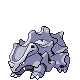

[Frames elegidos](../pokemon/rhyhorn/anim_frontf_selected.png) · [Todas las poses](../pokemon/rhyhorn/anim_frontf_source.png)

female.back · 64×64 · tira original [0, 0, 0] · timing: shared_species_timing

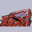

[Frames elegidos](../pokemon/rhyhorn/backf_selected.png) · [Todas las poses](../pokemon/rhyhorn/backf_source.png)

## RHYDON

default.front · 80×80 · APNG [17, 13, 6, 75, 80] · timing: source_timeline

[Frames elegidos](../pokemon/rhydon/anim_front_selected.png) · [Todas las poses](../pokemon/rhydon/anim_front_source.png)

default.back · 96×96 · APNG [0, 2, 18] · timing: source_idle_cycle

[Frames elegidos](../pokemon/rhydon/back_selected.png) · [Todas las poses](../pokemon/rhydon/back_source.png)

female.front · 80×80 · tira original [0, 1, 0, 2, 3] · timing: shared_species_timing

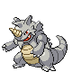

[Frames elegidos](../pokemon/rhydon/anim_frontf_selected.png) · [Todas las poses](../pokemon/rhydon/anim_frontf_source.png)

female.back · 64×64 · tira original [0, 0, 0] · timing: shared_species_timing

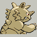

[Frames elegidos](../pokemon/rhydon/backf_selected.png) · [Todas las poses](../pokemon/rhydon/backf_source.png)

## RHYPERIOR

default.front · 96×96 · APNG [2, 0, 5, 65, 81] · timing: source_timeline

[Frames elegidos](../pokemon/rhyperior/anim_front_selected.png) · [Todas las poses](../pokemon/rhyperior/anim_front_source.png)

default.back · 96×96 · APNG [3, 0, 5] · timing: source_idle_cycle

[Frames elegidos](../pokemon/rhyperior/back_selected.png) · [Todas las poses](../pokemon/rhyperior/back_source.png)

female.front · 96×96 · tira original [0, 1, 0, 2, 3] · timing: shared_species_timing

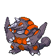

[Frames elegidos](../pokemon/rhyperior/anim_frontf_selected.png) · [Todas las poses](../pokemon/rhyperior/anim_frontf_source.png)

female.back · 64×64 · tira original [0, 0, 0] · timing: shared_species_timing

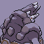

[Frames elegidos](../pokemon/rhyperior/backf_selected.png) · [Todas las poses](../pokemon/rhyperior/backf_source.png)

## TANGELA

default.front · 64×64 · APNG [12, 1, 4, 2, 10] · timing: synthetic_special_cadence

[Frames elegidos](../pokemon/tangela/anim_front_selected.png) · [Todas las poses](../pokemon/tangela/anim_front_source.png)

default.back · 64×64 · APNG [0, 1, 12] · timing: source_idle_cycle

[Frames elegidos](../pokemon/tangela/back_selected.png) · [Todas las poses](../pokemon/tangela/back_source.png)

[Índice](../GALLERY.md) · [Anterior](page_04.md) · [Siguiente](page_06.md)
