# Galería / página 5

[Índice](../GALLERY.md) · [Anterior](page_04.md) · [Siguiente](page_06.md)

## KINGLER

default.front · 96×96 · APNG [8, 0, 9, 3, 7]

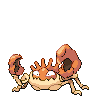

[Frames elegidos](../pokemon/kingler/anim_front_selected.png) · [Todas las poses](../pokemon/kingler/anim_front_source.png)

default.back · 96×96 · APNG [2, 0, 9]

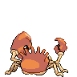

[Frames elegidos](../pokemon/kingler/back_selected.png) · [Todas las poses](../pokemon/kingler/back_source.png)

## EXEGGCUTE

default.front · 64×64 · APNG [0, 4, 2, 3, 5]

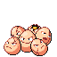

[Frames elegidos](../pokemon/exeggcute/anim_front_selected.png) · [Todas las poses](../pokemon/exeggcute/anim_front_source.png)

default.back · 64×64 · APNG [0, 4, 2]

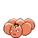

[Frames elegidos](../pokemon/exeggcute/back_selected.png) · [Todas las poses](../pokemon/exeggcute/back_source.png)

## EXEGGUTOR

default.front · 80×80 · APNG [0, 2, 4, 6, 7]

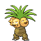

[Frames elegidos](../pokemon/exeggutor/anim_front_selected.png) · [Todas las poses](../pokemon/exeggutor/anim_front_source.png)

default.back · 80×80 · APNG [0, 2, 4]

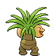

[Frames elegidos](../pokemon/exeggutor/back_selected.png) · [Todas las poses](../pokemon/exeggutor/back_source.png)

## CUBONE

default.front · 64×64 · APNG [14, 9, 3, 57, 73]

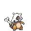

[Frames elegidos](../pokemon/cubone/anim_front_selected.png) · [Todas las poses](../pokemon/cubone/anim_front_source.png)

default.back · 64×64 · APNG [10, 0, 2]

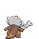

[Frames elegidos](../pokemon/cubone/back_selected.png) · [Todas las poses](../pokemon/cubone/back_source.png)

## MAROWAK

default.front · 80×80 · APNG [6, 1, 4, 24, 27]

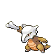

[Frames elegidos](../pokemon/marowak/anim_front_selected.png) · [Todas las poses](../pokemon/marowak/anim_front_source.png)

default.back · 64×64 · APNG [2, 1, 4]

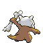

[Frames elegidos](../pokemon/marowak/back_selected.png) · [Todas las poses](../pokemon/marowak/back_source.png)

## TYROGUE

default.front · 64×64 · APNG [1, 5, 3, 34, 36]

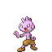

[Frames elegidos](../pokemon/tyrogue/anim_front_selected.png) · [Todas las poses](../pokemon/tyrogue/anim_front_source.png)

default.back · 64×64 · APNG [1, 0, 3]

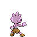

[Frames elegidos](../pokemon/tyrogue/back_selected.png) · [Todas las poses](../pokemon/tyrogue/back_source.png)

## HITMONLEE

default.front · 80×80 · APNG [2, 21, 11, 0, 14]

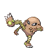

[Frames elegidos](../pokemon/hitmonlee/anim_front_selected.png) · [Todas las poses](../pokemon/hitmonlee/anim_front_source.png)

default.back · 80×80 · APNG [3, 16, 10]

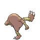

[Frames elegidos](../pokemon/hitmonlee/back_selected.png) · [Todas las poses](../pokemon/hitmonlee/back_source.png)

## HITMONCHAN

default.front · 64×64 · APNG [1, 0, 2, 22, 23]

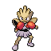

[Frames elegidos](../pokemon/hitmonchan/anim_front_selected.png) · [Todas las poses](../pokemon/hitmonchan/anim_front_source.png)

default.back · 64×64 · APNG [3, 0, 6]

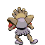

[Frames elegidos](../pokemon/hitmonchan/back_selected.png) · [Todas las poses](../pokemon/hitmonchan/back_source.png)

## HITMONTOP

default.front · 96×96 · APNG [0, 12, 4, 33, 36]

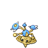

[Frames elegidos](../pokemon/hitmontop/anim_front_selected.png) · [Todas las poses](../pokemon/hitmontop/anim_front_source.png)

default.back · 80×80 · APNG [0, 4, 12]

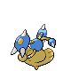

[Frames elegidos](../pokemon/hitmontop/back_selected.png) · [Todas las poses](../pokemon/hitmontop/back_source.png)

## LICKITUNG

default.front · 80×80 · APNG [5, 1, 8, 3, 13]

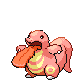

[Frames elegidos](../pokemon/lickitung/anim_front_selected.png) · [Todas las poses](../pokemon/lickitung/anim_front_source.png)

default.back · 80×80 · APNG [5, 1, 8]

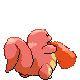

[Frames elegidos](../pokemon/lickitung/back_selected.png) · [Todas las poses](../pokemon/lickitung/back_source.png)

## LICKILICKY

default.front · 80×80 · APNG [2, 9, 14, 49, 51]

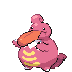

[Frames elegidos](../pokemon/lickilicky/anim_front_selected.png) · [Todas las poses](../pokemon/lickilicky/anim_front_source.png)

default.back · 80×80 · APNG [12, 9, 14]

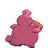

[Frames elegidos](../pokemon/lickilicky/back_selected.png) · [Todas las poses](../pokemon/lickilicky/back_source.png)

## KOFFING

default.front · 96×96 · APNG [7, 10, 4, 5, 6]

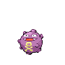

[Frames elegidos](../pokemon/koffing/anim_front_selected.png) · [Todas las poses](../pokemon/koffing/anim_front_source.png)

default.back · 64×64 · APNG [0, 10, 7]

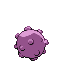

[Frames elegidos](../pokemon/koffing/back_selected.png) · [Todas las poses](../pokemon/koffing/back_source.png)

## WEEZING

default.front · 96×96 · APNG [5, 1, 3, 0, 9]

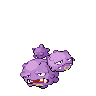

[Frames elegidos](../pokemon/weezing/anim_front_selected.png) · [Todas las poses](../pokemon/weezing/anim_front_source.png)

default.back · 96×96 · APNG [2, 1, 7]

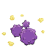

[Frames elegidos](../pokemon/weezing/back_selected.png) · [Todas las poses](../pokemon/weezing/back_source.png)

## RHYHORN

default.front · 80×80 · APNG [3, 0, 5, 33, 37]

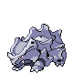

[Frames elegidos](../pokemon/rhyhorn/anim_front_selected.png) · [Todas las poses](../pokemon/rhyhorn/anim_front_source.png)

default.back · 80×80 · APNG [4, 0, 5]

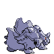

[Frames elegidos](../pokemon/rhyhorn/back_selected.png) · [Todas las poses](../pokemon/rhyhorn/back_source.png)

## RHYDON

default.front · 80×80 · APNG [17, 13, 6, 75, 80]

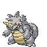

[Frames elegidos](../pokemon/rhydon/anim_front_selected.png) · [Todas las poses](../pokemon/rhydon/anim_front_source.png)

default.back · 96×96 · APNG [0, 2, 18]

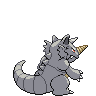

[Frames elegidos](../pokemon/rhydon/back_selected.png) · [Todas las poses](../pokemon/rhydon/back_source.png)

## RHYPERIOR

default.front · 96×96 · APNG [2, 0, 5, 65, 81]

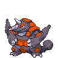

[Frames elegidos](../pokemon/rhyperior/anim_front_selected.png) · [Todas las poses](../pokemon/rhyperior/anim_front_source.png)

default.back · 96×96 · APNG [3, 0, 5]

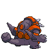

[Frames elegidos](../pokemon/rhyperior/back_selected.png) · [Todas las poses](../pokemon/rhyperior/back_source.png)

## TANGELA

default.front · 64×64 · APNG [12, 1, 4, 2, 10]

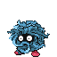

[Frames elegidos](../pokemon/tangela/anim_front_selected.png) · [Todas las poses](../pokemon/tangela/anim_front_source.png)

default.back · 64×64 · APNG [0, 1, 12]

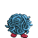

[Frames elegidos](../pokemon/tangela/back_selected.png) · [Todas las poses](../pokemon/tangela/back_source.png)

## TANGROWTH

default.front · 96×96 · APNG [0, 7, 12, 49, 55]

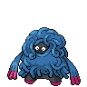

[Frames elegidos](../pokemon/tangrowth/anim_front_selected.png) · [Todas las poses](../pokemon/tangrowth/anim_front_source.png)

default.back · 96×96 · APNG [13, 9, 12]

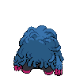

[Frames elegidos](../pokemon/tangrowth/back_selected.png) · [Todas las poses](../pokemon/tangrowth/back_source.png)

## KANGASKHAN

default.front · 80×80 · APNG [18, 35, 0, 5, 7]

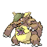

[Frames elegidos](../pokemon/kangaskhan/anim_front_selected.png) · [Todas las poses](../pokemon/kangaskhan/anim_front_source.png)

default.back · 80×80 · APNG [3, 0, 6]

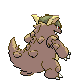

[Frames elegidos](../pokemon/kangaskhan/back_selected.png) · [Todas las poses](../pokemon/kangaskhan/back_source.png)

## HORSEA

default.front · 64×64 · APNG [40, 53, 29, 34, 48]

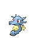

[Frames elegidos](../pokemon/horsea/anim_front_selected.png) · [Todas las poses](../pokemon/horsea/anim_front_source.png)

default.back · 64×64 · APNG [11, 53, 29]

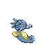

[Frames elegidos](../pokemon/horsea/back_selected.png) · [Todas las poses](../pokemon/horsea/back_source.png)

## SEADRA

default.front · 64×64 · APNG [6, 18, 33, 0, 13]

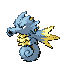

[Frames elegidos](../pokemon/seadra/anim_front_selected.png) · [Todas las poses](../pokemon/seadra/anim_front_source.png)

default.back · 80×80 · APNG [29, 18, 37]

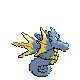

[Frames elegidos](../pokemon/seadra/back_selected.png) · [Todas las poses](../pokemon/seadra/back_source.png)

## KINGDRA

default.front · 96×96 · APNG [7, 0, 11, 27, 48]

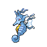

[Frames elegidos](../pokemon/kingdra/anim_front_selected.png) · [Todas las poses](../pokemon/kingdra/anim_front_source.png)

default.back · 80×80 · APNG [18, 1, 10]

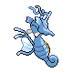

[Frames elegidos](../pokemon/kingdra/back_selected.png) · [Todas las poses](../pokemon/kingdra/back_source.png)

## GOLDEEN

default.front · 80×80 · APNG [17, 1, 39, 55, 69]

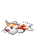

[Frames elegidos](../pokemon/goldeen/anim_front_selected.png) · [Todas las poses](../pokemon/goldeen/anim_front_source.png)

default.back · 80×80 · APNG [53, 74, 37]

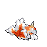

[Frames elegidos](../pokemon/goldeen/back_selected.png) · [Todas las poses](../pokemon/goldeen/back_source.png)

## SEAKING

default.front · 80×80 · APNG [17, 71, 35, 40, 53]

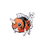

[Frames elegidos](../pokemon/seaking/anim_front_selected.png) · [Todas las poses](../pokemon/seaking/anim_front_source.png)

default.back · 96×96 · APNG [0, 16, 56]

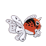

[Frames elegidos](../pokemon/seaking/back_selected.png) · [Todas las poses](../pokemon/seaking/back_source.png)

## STARYU

default.front · 64×64 · APNG [0, 15, 5, 2, 13]

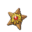

[Frames elegidos](../pokemon/staryu/anim_front_selected.png) · [Todas las poses](../pokemon/staryu/anim_front_source.png)

default.back · 64×64 · APNG [0, 5, 15]

[Frames elegidos](../pokemon/staryu/back_selected.png) · [Todas las poses](../pokemon/staryu/back_source.png)

[Índice](../GALLERY.md) · [Anterior](page_04.md) · [Siguiente](page_06.md)
