# Galería / página 6

[Índice](../GALLERY.md) · [Anterior](page_05.md) · [Siguiente](page_07.md)

## TANGROWTH

default.front · 96×96 · APNG [0, 7, 12, 49, 55] · timing: source_timeline

[Frames elegidos](../pokemon/tangrowth/anim_front_selected.png) · [Todas las poses](../pokemon/tangrowth/anim_front_source.png)

default.back · 96×96 · APNG [13, 9, 12] · timing: source_idle_cycle

[Frames elegidos](../pokemon/tangrowth/back_selected.png) · [Todas las poses](../pokemon/tangrowth/back_source.png)

female.front · 96×96 · tira original [0, 1, 0, 2, 3] · timing: shared_species_timing

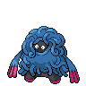

[Frames elegidos](../pokemon/tangrowth/anim_frontf_selected.png) · [Todas las poses](../pokemon/tangrowth/anim_frontf_source.png)

female.back · 96×96 · APNG [13, 9, 12] · timing: shared_species_timing

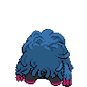

[Frames elegidos](../pokemon/tangrowth/backf_selected.png) · [Todas las poses](../pokemon/tangrowth/backf_source.png)

## KANGASKHAN

default.front · 80×80 · APNG [18, 35, 0, 5, 7] · timing: synthetic_special_cadence

[Frames elegidos](../pokemon/kangaskhan/anim_front_selected.png) · [Todas las poses](../pokemon/kangaskhan/anim_front_source.png)

default.back · 80×80 · APNG [3, 0, 6] · timing: source_idle_cycle

[Frames elegidos](../pokemon/kangaskhan/back_selected.png) · [Todas las poses](../pokemon/kangaskhan/back_source.png)

## HORSEA

default.front · 64×64 · APNG [40, 53, 29, 34, 48] · timing: synthetic_special_cadence

[Frames elegidos](../pokemon/horsea/anim_front_selected.png) · [Todas las poses](../pokemon/horsea/anim_front_source.png)

default.back · 64×64 · APNG [11, 53, 29] · timing: source_idle_cycle

[Frames elegidos](../pokemon/horsea/back_selected.png) · [Todas las poses](../pokemon/horsea/back_source.png)

## SEADRA

default.front · 64×64 · APNG [6, 18, 33, 0, 13] · timing: synthetic_special_cadence

[Frames elegidos](../pokemon/seadra/anim_front_selected.png) · [Todas las poses](../pokemon/seadra/anim_front_source.png)

default.back · 80×80 · APNG [29, 18, 37] · timing: source_idle_cycle

[Frames elegidos](../pokemon/seadra/back_selected.png) · [Todas las poses](../pokemon/seadra/back_source.png)

## KINGDRA

default.front · 96×96 · APNG [7, 0, 11, 27, 48] · timing: source_timeline

[Frames elegidos](../pokemon/kingdra/anim_front_selected.png) · [Todas las poses](../pokemon/kingdra/anim_front_source.png)

default.back · 80×80 · APNG [18, 1, 10] · timing: source_idle_cycle

[Frames elegidos](../pokemon/kingdra/back_selected.png) · [Todas las poses](../pokemon/kingdra/back_source.png)

## GOLDEEN

default.front · 80×80 · APNG [17, 1, 39, 55, 69] · timing: synthetic_special_cadence

[Frames elegidos](../pokemon/goldeen/anim_front_selected.png) · [Todas las poses](../pokemon/goldeen/anim_front_source.png)

default.back · 80×80 · APNG [53, 74, 37] · timing: source_idle_cycle

[Frames elegidos](../pokemon/goldeen/back_selected.png) · [Todas las poses](../pokemon/goldeen/back_source.png)

female.front · 80×80 · tira original [0, 1, 0, 2, 3] · timing: shared_species_timing

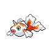

[Frames elegidos](../pokemon/goldeen/anim_frontf_selected.png) · [Todas las poses](../pokemon/goldeen/anim_frontf_source.png)

female.back · 64×64 · tira original [0, 0, 0] · timing: shared_species_timing

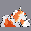

[Frames elegidos](../pokemon/goldeen/backf_selected.png) · [Todas las poses](../pokemon/goldeen/backf_source.png)

## SEAKING

default.front · 80×80 · APNG [17, 71, 35, 40, 53] · timing: synthetic_special_cadence

[Frames elegidos](../pokemon/seaking/anim_front_selected.png) · [Todas las poses](../pokemon/seaking/anim_front_source.png)

default.back · 96×96 · APNG [0, 16, 56] · timing: source_idle_cycle

[Frames elegidos](../pokemon/seaking/back_selected.png) · [Todas las poses](../pokemon/seaking/back_source.png)

female.front · 80×80 · tira original [0, 1, 0, 2, 3] · timing: shared_species_timing

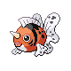

[Frames elegidos](../pokemon/seaking/anim_frontf_selected.png) · [Todas las poses](../pokemon/seaking/anim_frontf_source.png)

female.back · 64×64 · tira original [0, 0, 0] · timing: shared_species_timing

[Frames elegidos](../pokemon/seaking/backf_selected.png) · [Todas las poses](../pokemon/seaking/backf_source.png)

## STARYU

default.front · 64×64 · APNG [0, 15, 5, 2, 13] · timing: synthetic_special_cadence

[Frames elegidos](../pokemon/staryu/anim_front_selected.png) · [Todas las poses](../pokemon/staryu/anim_front_source.png)

default.back · 64×64 · APNG [0, 5, 15] · timing: source_idle_cycle

[Frames elegidos](../pokemon/staryu/back_selected.png) · [Todas las poses](../pokemon/staryu/back_source.png)

## STARMIE

default.front · 80×80 · APNG [13, 0, 5, 1, 4] · timing: synthetic_special_cadence

[Frames elegidos](../pokemon/starmie/anim_front_selected.png) · [Todas las poses](../pokemon/starmie/anim_front_source.png)

default.back · 64×64 · APNG [16, 1, 11] · timing: source_idle_cycle

[Frames elegidos](../pokemon/starmie/back_selected.png) · [Todas las poses](../pokemon/starmie/back_source.png)

## MIME_JR

default.front · 64×64 · APNG [0, 4, 12, 49, 51] · timing: source_timeline

[Frames elegidos](../pokemon/mime_jr/anim_front_selected.png) · [Todas las poses](../pokemon/mime_jr/anim_front_source.png)

default.back · 64×64 · APNG [0, 11, 4] · timing: source_idle_cycle

[Frames elegidos](../pokemon/mime_jr/back_selected.png) · [Todas las poses](../pokemon/mime_jr/back_source.png)

## MR_MIME

default.front · 64×64 · APNG [0, 11, 3, 6, 14] · timing: synthetic_special_cadence

[Frames elegidos](../pokemon/mr_mime/anim_front_selected.png) · [Todas las poses](../pokemon/mr_mime/anim_front_source.png)

default.back · 64×64 · APNG [0, 1, 12] · timing: source_idle_cycle

[Frames elegidos](../pokemon/mr_mime/back_selected.png) · [Todas las poses](../pokemon/mr_mime/back_source.png)

## SCYTHER

default.front · 64×64 · APNG [6, 0, 4, 27, 31] · timing: source_timeline

[Frames elegidos](../pokemon/scyther/anim_front_selected.png) · [Todas las poses](../pokemon/scyther/anim_front_source.png)

default.back · 80×80 · APNG [6, 0, 4] · timing: source_idle_cycle

[Frames elegidos](../pokemon/scyther/back_selected.png) · [Todas las poses](../pokemon/scyther/back_source.png)

female.front · 64×64 · tira original [0, 1, 0, 2, 3] · timing: shared_species_timing

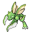

[Frames elegidos](../pokemon/scyther/anim_frontf_selected.png) · [Todas las poses](../pokemon/scyther/anim_frontf_source.png)

female.back · 80×80 · APNG [6, 0, 4] · timing: shared_species_timing

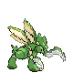

[Frames elegidos](../pokemon/scyther/backf_selected.png) · [Todas las poses](../pokemon/scyther/backf_source.png)

## SCIZOR

default.front · 80×80 · APNG [51, 79, 91, 173, 220] · timing: synthetic_special_cadence

[Frames elegidos](../pokemon/scizor/anim_front_selected.png) · [Todas las poses](../pokemon/scizor/anim_front_source.png)

default.back · 80×80 · APNG [31, 0, 91] · timing: source_idle_cycle

[Frames elegidos](../pokemon/scizor/back_selected.png) · [Todas las poses](../pokemon/scizor/back_source.png)

female.front · 80×80 · tira original [0, 1, 0, 2, 3] · timing: shared_species_timing

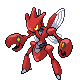

[Frames elegidos](../pokemon/scizor/anim_frontf_selected.png) · [Todas las poses](../pokemon/scizor/anim_frontf_source.png)

female.back · 80×80 · APNG [31, 0, 91] · timing: shared_species_timing

[Frames elegidos](../pokemon/scizor/backf_selected.png) · [Todas las poses](../pokemon/scizor/backf_source.png)

## KLEAVOR

default.front · 64×64 · tira original [0, 0, 0, 0, 0] · timing: legacy_estimated

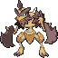

[Frames elegidos](../pokemon/kleavor/anim_front_selected.png) · [Todas las poses](../pokemon/kleavor/anim_front_source.png)

default.back · 64×64 · tira original [0, 0, 0] · timing: legacy_estimated

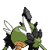

[Frames elegidos](../pokemon/kleavor/back_selected.png) · [Todas las poses](../pokemon/kleavor/back_source.png)

## SMOOCHUM

default.front · 64×64 · APNG [0, 2, 8, 40, 43] · timing: source_timeline

[Frames elegidos](../pokemon/smoochum/anim_front_selected.png) · [Todas las poses](../pokemon/smoochum/anim_front_source.png)

default.back · 64×64 · APNG [0, 8, 3] · timing: source_idle_cycle

[Frames elegidos](../pokemon/smoochum/back_selected.png) · [Todas las poses](../pokemon/smoochum/back_source.png)

## JYNX

default.front · 64×64 · APNG [2, 0, 4, 39, 43] · timing: source_timeline

[Frames elegidos](../pokemon/jynx/anim_front_selected.png) · [Todas las poses](../pokemon/jynx/anim_front_source.png)

default.back · 64×64 · APNG [2, 0, 4] · timing: source_idle_cycle

[Frames elegidos](../pokemon/jynx/back_selected.png) · [Todas las poses](../pokemon/jynx/back_source.png)

## ELEKID

default.front · 64×64 · APNG [0, 14, 4, 35, 37] · timing: source_timeline

[Frames elegidos](../pokemon/elekid/anim_front_selected.png) · [Todas las poses](../pokemon/elekid/anim_front_source.png)

default.back · 64×64 · APNG [0, 14, 4] · timing: source_idle_cycle

[Frames elegidos](../pokemon/elekid/back_selected.png) · [Todas las poses](../pokemon/elekid/back_source.png)

## ELECTABUZZ

default.front · 80×80 · APNG [2, 0, 8, 37, 40] · timing: source_timeline

[Frames elegidos](../pokemon/electabuzz/anim_front_selected.png) · [Todas las poses](../pokemon/electabuzz/anim_front_source.png)

default.back · 80×80 · APNG [2, 0, 7] · timing: source_idle_cycle

[Frames elegidos](../pokemon/electabuzz/back_selected.png) · [Todas las poses](../pokemon/electabuzz/back_source.png)

## ELECTIVIRE

default.front · 102×102 · APNG [0, 1, 4, 33, 34] · timing: source_timeline

[Frames elegidos](../pokemon/electivire/anim_front_selected.png) · [Todas las poses](../pokemon/electivire/anim_front_source.png)

default.back · 96×96 · APNG [3, 1, 4] · timing: source_idle_cycle

[Frames elegidos](../pokemon/electivire/back_selected.png) · [Todas las poses](../pokemon/electivire/back_source.png)

## MAGBY

default.front · 64×64 · APNG [0, 6, 3, 26, 29] · timing: source_timeline

[Frames elegidos](../pokemon/magby/anim_front_selected.png) · [Todas las poses](../pokemon/magby/anim_front_source.png)

default.back · 64×64 · APNG [1, 10, 3] · timing: source_idle_cycle

[Frames elegidos](../pokemon/magby/back_selected.png) · [Todas las poses](../pokemon/magby/back_source.png)

## MAGMAR

default.front · 80×80 · APNG [6, 0, 4, 25, 29] · timing: source_timeline

[Frames elegidos](../pokemon/magmar/anim_front_selected.png) · [Todas las poses](../pokemon/magmar/anim_front_source.png)

default.back · 64×64 · APNG [2, 0, 4] · timing: source_idle_cycle

[Frames elegidos](../pokemon/magmar/back_selected.png) · [Todas las poses](../pokemon/magmar/back_source.png)

## MAGMORTAR

default.front · 96×96 · APNG [0, 30, 17, 147, 157] · timing: source_timeline

[Frames elegidos](../pokemon/magmortar/anim_front_selected.png) · [Todas las poses](../pokemon/magmortar/anim_front_source.png)

default.back · 80×80 · APNG [7, 30, 17] · timing: source_idle_cycle

[Frames elegidos](../pokemon/magmortar/back_selected.png) · [Todas las poses](../pokemon/magmortar/back_source.png)

## PINSIR

default.front · 80×80 · APNG [0, 16, 12, 2, 4] · timing: synthetic_special_cadence

[Frames elegidos](../pokemon/pinsir/anim_front_selected.png) · [Todas las poses](../pokemon/pinsir/anim_front_source.png)

default.back · 80×80 · APNG [11, 0, 4] · timing: source_idle_cycle

[Frames elegidos](../pokemon/pinsir/back_selected.png) · [Todas las poses](../pokemon/pinsir/back_source.png)

## TAUROS

default.front · 80×80 · APNG [14, 0, 5, 1, 22] · timing: synthetic_special_cadence

[Frames elegidos](../pokemon/tauros/anim_front_selected.png) · [Todas las poses](../pokemon/tauros/anim_front_source.png)

default.back · 80×80 · APNG [13, 19, 5] · timing: source_idle_cycle

[Frames elegidos](../pokemon/tauros/back_selected.png) · [Todas las poses](../pokemon/tauros/back_source.png)

## MAGIKARP

default.front · 64×64 · APNG [7, 9, 1, 38, 41] · timing: source_timeline

[Frames elegidos](../pokemon/magikarp/anim_front_selected.png) · [Todas las poses](../pokemon/magikarp/anim_front_source.png)

default.back · 64×64 · APNG [6, 9, 0] · timing: source_idle_cycle

[Frames elegidos](../pokemon/magikarp/back_selected.png) · [Todas las poses](../pokemon/magikarp/back_source.png)

female.front · 64×64 · tira original [0, 1, 0, 2, 3] · timing: shared_species_timing

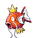

[Frames elegidos](../pokemon/magikarp/anim_frontf_selected.png) · [Todas las poses](../pokemon/magikarp/anim_frontf_source.png)

female.back · 64×64 · tira original [0, 0, 0] · timing: shared_species_timing

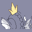

[Frames elegidos](../pokemon/magikarp/backf_selected.png) · [Todas las poses](../pokemon/magikarp/backf_source.png)

[Índice](../GALLERY.md) · [Anterior](page_05.md) · [Siguiente](page_07.md)
