# Galería / página 6

[Índice](../GALLERY.md) · [Anterior](page_05.md) · [Siguiente](page_07.md)

## STARMIE

default.front · 80×80 · APNG [13, 0, 5, 1, 4]

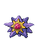

[Frames elegidos](../pokemon/starmie/anim_front_selected.png) · [Todas las poses](../pokemon/starmie/anim_front_source.png)

default.back · 64×64 · APNG [16, 1, 11]

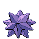

[Frames elegidos](../pokemon/starmie/back_selected.png) · [Todas las poses](../pokemon/starmie/back_source.png)

## MIME_JR

default.front · 64×64 · APNG [0, 4, 12, 49, 51]

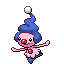

[Frames elegidos](../pokemon/mime_jr/anim_front_selected.png) · [Todas las poses](../pokemon/mime_jr/anim_front_source.png)

default.back · 64×64 · APNG [0, 11, 4]

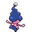

[Frames elegidos](../pokemon/mime_jr/back_selected.png) · [Todas las poses](../pokemon/mime_jr/back_source.png)

## MR_MIME

default.front · 64×64 · APNG [0, 11, 3, 6, 14]

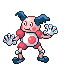

[Frames elegidos](../pokemon/mr_mime/anim_front_selected.png) · [Todas las poses](../pokemon/mr_mime/anim_front_source.png)

default.back · 64×64 · APNG [0, 1, 12]

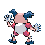

[Frames elegidos](../pokemon/mr_mime/back_selected.png) · [Todas las poses](../pokemon/mr_mime/back_source.png)

## SCYTHER

default.front · 64×64 · APNG [6, 0, 4, 27, 31]

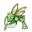

[Frames elegidos](../pokemon/scyther/anim_front_selected.png) · [Todas las poses](../pokemon/scyther/anim_front_source.png)

default.back · 80×80 · APNG [6, 0, 4]

[Frames elegidos](../pokemon/scyther/back_selected.png) · [Todas las poses](../pokemon/scyther/back_source.png)

## SCIZOR

default.front · 80×80 · APNG [51, 79, 91, 173, 220]

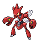

[Frames elegidos](../pokemon/scizor/anim_front_selected.png) · [Todas las poses](../pokemon/scizor/anim_front_source.png)

default.back · 80×80 · APNG [31, 0, 91]

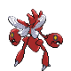

[Frames elegidos](../pokemon/scizor/back_selected.png) · [Todas las poses](../pokemon/scizor/back_source.png)

## SMOOCHUM

default.front · 64×64 · APNG [0, 2, 8, 40, 43]

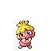

[Frames elegidos](../pokemon/smoochum/anim_front_selected.png) · [Todas las poses](../pokemon/smoochum/anim_front_source.png)

default.back · 64×64 · APNG [0, 8, 3]

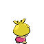

[Frames elegidos](../pokemon/smoochum/back_selected.png) · [Todas las poses](../pokemon/smoochum/back_source.png)

## JYNX

default.front · 64×64 · APNG [2, 0, 4, 39, 43]

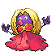

[Frames elegidos](../pokemon/jynx/anim_front_selected.png) · [Todas las poses](../pokemon/jynx/anim_front_source.png)

default.back · 64×64 · APNG [2, 0, 4]

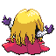

[Frames elegidos](../pokemon/jynx/back_selected.png) · [Todas las poses](../pokemon/jynx/back_source.png)

## ELEKID

default.front · 64×64 · APNG [0, 14, 4, 35, 37]

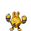

[Frames elegidos](../pokemon/elekid/anim_front_selected.png) · [Todas las poses](../pokemon/elekid/anim_front_source.png)

default.back · 64×64 · APNG [0, 14, 4]

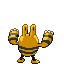

[Frames elegidos](../pokemon/elekid/back_selected.png) · [Todas las poses](../pokemon/elekid/back_source.png)

## ELECTABUZZ

default.front · 80×80 · APNG [2, 0, 8, 37, 40]

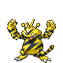

[Frames elegidos](../pokemon/electabuzz/anim_front_selected.png) · [Todas las poses](../pokemon/electabuzz/anim_front_source.png)

default.back · 80×80 · APNG [2, 0, 7]

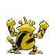

[Frames elegidos](../pokemon/electabuzz/back_selected.png) · [Todas las poses](../pokemon/electabuzz/back_source.png)

## ELECTIVIRE

default.front · 102×102 · APNG [0, 1, 4, 33, 34]

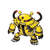

[Frames elegidos](../pokemon/electivire/anim_front_selected.png) · [Todas las poses](../pokemon/electivire/anim_front_source.png)

default.back · 96×96 · APNG [3, 1, 4]

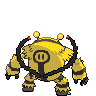

[Frames elegidos](../pokemon/electivire/back_selected.png) · [Todas las poses](../pokemon/electivire/back_source.png)

## MAGBY

default.front · 64×64 · APNG [0, 6, 3, 26, 29]

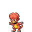

[Frames elegidos](../pokemon/magby/anim_front_selected.png) · [Todas las poses](../pokemon/magby/anim_front_source.png)

default.back · 64×64 · APNG [1, 10, 3]

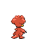

[Frames elegidos](../pokemon/magby/back_selected.png) · [Todas las poses](../pokemon/magby/back_source.png)

## MAGMAR

default.front · 80×80 · APNG [6, 0, 4, 25, 29]

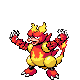

[Frames elegidos](../pokemon/magmar/anim_front_selected.png) · [Todas las poses](../pokemon/magmar/anim_front_source.png)

default.back · 64×64 · APNG [2, 0, 4]

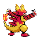

[Frames elegidos](../pokemon/magmar/back_selected.png) · [Todas las poses](../pokemon/magmar/back_source.png)

## MAGMORTAR

default.front · 96×96 · APNG [0, 30, 17, 147, 157]

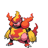

[Frames elegidos](../pokemon/magmortar/anim_front_selected.png) · [Todas las poses](../pokemon/magmortar/anim_front_source.png)

default.back · 80×80 · APNG [7, 30, 17]

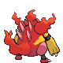

[Frames elegidos](../pokemon/magmortar/back_selected.png) · [Todas las poses](../pokemon/magmortar/back_source.png)

## PINSIR

default.front · 80×80 · APNG [0, 16, 12, 2, 4]

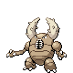

[Frames elegidos](../pokemon/pinsir/anim_front_selected.png) · [Todas las poses](../pokemon/pinsir/anim_front_source.png)

default.back · 80×80 · APNG [11, 0, 4]

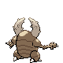

[Frames elegidos](../pokemon/pinsir/back_selected.png) · [Todas las poses](../pokemon/pinsir/back_source.png)

## TAUROS

default.front · 80×80 · APNG [14, 0, 5, 1, 22]

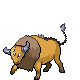

[Frames elegidos](../pokemon/tauros/anim_front_selected.png) · [Todas las poses](../pokemon/tauros/anim_front_source.png)

default.back · 80×80 · APNG [13, 19, 5]

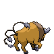

[Frames elegidos](../pokemon/tauros/back_selected.png) · [Todas las poses](../pokemon/tauros/back_source.png)

## MAGIKARP

default.front · 64×64 · APNG [7, 9, 1, 38, 41]

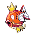

[Frames elegidos](../pokemon/magikarp/anim_front_selected.png) · [Todas las poses](../pokemon/magikarp/anim_front_source.png)

default.back · 64×64 · APNG [6, 9, 0]

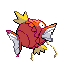

[Frames elegidos](../pokemon/magikarp/back_selected.png) · [Todas las poses](../pokemon/magikarp/back_source.png)

## GYARADOS

default.front · 109×109 · APNG [3, 1, 5, 2, 4]

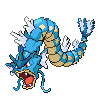

[Frames elegidos](../pokemon/gyarados/anim_front_selected.png) · [Todas las poses](../pokemon/gyarados/anim_front_source.png)

default.back · 109×109 · APNG [9, 5, 0]

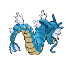

[Frames elegidos](../pokemon/gyarados/back_selected.png) · [Todas las poses](../pokemon/gyarados/back_source.png)

## LAPRAS

default.front · 80×80 · APNG [6, 4, 0, 25, 28]

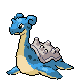

[Frames elegidos](../pokemon/lapras/anim_front_selected.png) · [Todas las poses](../pokemon/lapras/anim_front_source.png)

default.back · 80×80 · APNG [5, 0, 4]

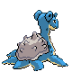

[Frames elegidos](../pokemon/lapras/back_selected.png) · [Todas las poses](../pokemon/lapras/back_source.png)

## EEVEE

default.front · 64×64 · APNG [3, 0, 5, 56, 59]

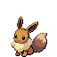

[Frames elegidos](../pokemon/eevee/anim_front_selected.png) · [Todas las poses](../pokemon/eevee/anim_front_source.png)

default.back · 64×64 · APNG [3, 0, 5]

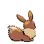

[Frames elegidos](../pokemon/eevee/back_selected.png) · [Todas las poses](../pokemon/eevee/back_source.png)

## VAPOREON

default.front · 64×64 · APNG [0, 12, 16, 10, 36]

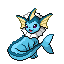

[Frames elegidos](../pokemon/vaporeon/anim_front_selected.png) · [Todas las poses](../pokemon/vaporeon/anim_front_source.png)

default.back · 64×64 · APNG [0, 3, 7]

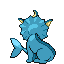

[Frames elegidos](../pokemon/vaporeon/back_selected.png) · [Todas las poses](../pokemon/vaporeon/back_source.png)

## JOLTEON

default.front · 64×64 · APNG [6, 0, 4, 34, 37]

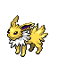

[Frames elegidos](../pokemon/jolteon/anim_front_selected.png) · [Todas las poses](../pokemon/jolteon/anim_front_source.png)

default.back · 64×64 · APNG [7, 0, 4]

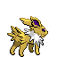

[Frames elegidos](../pokemon/jolteon/back_selected.png) · [Todas las poses](../pokemon/jolteon/back_source.png)

## FLAREON

default.front · 80×80 · APNG [4, 0, 9, 99, 101]

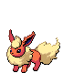

[Frames elegidos](../pokemon/flareon/anim_front_selected.png) · [Todas las poses](../pokemon/flareon/anim_front_source.png)

default.back · 80×80 · APNG [4, 0, 9]

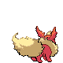

[Frames elegidos](../pokemon/flareon/back_selected.png) · [Todas las poses](../pokemon/flareon/back_source.png)

## ESPEON

default.front · 64×64 · APNG [3, 1, 9, 48, 56]

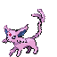

[Frames elegidos](../pokemon/espeon/anim_front_selected.png) · [Todas las poses](../pokemon/espeon/anim_front_source.png)

default.back · 64×64 · APNG [7, 10, 4]

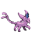

[Frames elegidos](../pokemon/espeon/back_selected.png) · [Todas las poses](../pokemon/espeon/back_source.png)

## UMBREON

default.front · 64×64 · APNG [2, 0, 4, 26, 28]

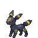

[Frames elegidos](../pokemon/umbreon/anim_front_selected.png) · [Todas las poses](../pokemon/umbreon/anim_front_source.png)

default.back · 64×64 · APNG [2, 0, 4]

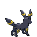

[Frames elegidos](../pokemon/umbreon/back_selected.png) · [Todas las poses](../pokemon/umbreon/back_source.png)

## LEAFEON

default.front · 64×64 · APNG [0, 7, 3, 49, 59]

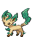

[Frames elegidos](../pokemon/leafeon/anim_front_selected.png) · [Todas las poses](../pokemon/leafeon/anim_front_source.png)

default.back · 64×64 · APNG [0, 7, 3]

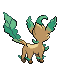

[Frames elegidos](../pokemon/leafeon/back_selected.png) · [Todas las poses](../pokemon/leafeon/back_source.png)

[Índice](../GALLERY.md) · [Anterior](page_05.md) · [Siguiente](page_07.md)
