# Galería / página 7

[Índice](../GALLERY.md) · [Anterior](page_06.md) · [Siguiente](page_08.md)

## GYARADOS

default.front · 109×109 · APNG [3, 1, 5, 2, 4] · timing: synthetic_special_cadence

[Frames elegidos](../pokemon/gyarados/anim_front_selected.png) · [Todas las poses](../pokemon/gyarados/anim_front_source.png)

default.back · 109×109 · APNG [9, 5, 0] · timing: source_idle_cycle

[Frames elegidos](../pokemon/gyarados/back_selected.png) · [Todas las poses](../pokemon/gyarados/back_source.png)

female.front · 64×64 · tira original [0, 1, 0, 1, 1] · timing: shared_species_timing

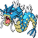

[Frames elegidos](../pokemon/gyarados/anim_frontf_selected.png) · [Todas las poses](../pokemon/gyarados/anim_frontf_source.png)

female.back · 64×64 · tira original [0, 0, 0] · timing: shared_species_timing

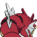

[Frames elegidos](../pokemon/gyarados/backf_selected.png) · [Todas las poses](../pokemon/gyarados/backf_source.png)

## LAPRAS

default.front · 80×80 · APNG [6, 4, 0, 25, 28] · timing: source_timeline

[Frames elegidos](../pokemon/lapras/anim_front_selected.png) · [Todas las poses](../pokemon/lapras/anim_front_source.png)

default.back · 80×80 · APNG [5, 0, 4] · timing: source_idle_cycle

[Frames elegidos](../pokemon/lapras/back_selected.png) · [Todas las poses](../pokemon/lapras/back_source.png)

## EEVEE

default.front · 64×64 · APNG [3, 0, 5, 56, 59] · timing: source_timeline

[Frames elegidos](../pokemon/eevee/anim_front_selected.png) · [Todas las poses](../pokemon/eevee/anim_front_source.png)

default.back · 64×64 · APNG [3, 0, 5] · timing: source_idle_cycle

[Frames elegidos](../pokemon/eevee/back_selected.png) · [Todas las poses](../pokemon/eevee/back_source.png)

female.front · 64×64 · tira original [0, 1, 0, 1, 1] · timing: shared_species_timing

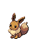

[Frames elegidos](../pokemon/eevee/anim_frontf_selected.png) · [Todas las poses](../pokemon/eevee/anim_frontf_source.png)

female.back · 64×64 · tira original [0, 0, 0] · timing: shared_species_timing

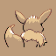

[Frames elegidos](../pokemon/eevee/backf_selected.png) · [Todas las poses](../pokemon/eevee/backf_source.png)

## VAPOREON

default.front · 64×64 · APNG [0, 12, 16, 10, 36] · timing: synthetic_special_cadence

[Frames elegidos](../pokemon/vaporeon/anim_front_selected.png) · [Todas las poses](../pokemon/vaporeon/anim_front_source.png)

default.back · 64×64 · APNG [0, 3, 7] · timing: source_idle_cycle

[Frames elegidos](../pokemon/vaporeon/back_selected.png) · [Todas las poses](../pokemon/vaporeon/back_source.png)

## JOLTEON

default.front · 64×64 · APNG [6, 0, 4, 34, 37] · timing: source_timeline

[Frames elegidos](../pokemon/jolteon/anim_front_selected.png) · [Todas las poses](../pokemon/jolteon/anim_front_source.png)

default.back · 64×64 · APNG [7, 0, 4] · timing: source_idle_cycle

[Frames elegidos](../pokemon/jolteon/back_selected.png) · [Todas las poses](../pokemon/jolteon/back_source.png)

## FLAREON

default.front · 80×80 · APNG [4, 0, 9, 99, 101] · timing: source_timeline

[Frames elegidos](../pokemon/flareon/anim_front_selected.png) · [Todas las poses](../pokemon/flareon/anim_front_source.png)

default.back · 80×80 · APNG [4, 0, 9] · timing: source_idle_cycle

[Frames elegidos](../pokemon/flareon/back_selected.png) · [Todas las poses](../pokemon/flareon/back_source.png)

## ESPEON

default.front · 64×64 · APNG [3, 1, 9, 48, 56] · timing: source_timeline

[Frames elegidos](../pokemon/espeon/anim_front_selected.png) · [Todas las poses](../pokemon/espeon/anim_front_source.png)

default.back · 64×64 · APNG [7, 10, 4] · timing: source_idle_cycle

[Frames elegidos](../pokemon/espeon/back_selected.png) · [Todas las poses](../pokemon/espeon/back_source.png)

## UMBREON

default.front · 64×64 · APNG [2, 0, 4, 26, 28] · timing: source_timeline

[Frames elegidos](../pokemon/umbreon/anim_front_selected.png) · [Todas las poses](../pokemon/umbreon/anim_front_source.png)

default.back · 64×64 · APNG [2, 0, 4] · timing: source_idle_cycle

[Frames elegidos](../pokemon/umbreon/back_selected.png) · [Todas las poses](../pokemon/umbreon/back_source.png)

## LEAFEON

default.front · 64×64 · APNG [0, 7, 3, 49, 59] · timing: source_timeline

[Frames elegidos](../pokemon/leafeon/anim_front_selected.png) · [Todas las poses](../pokemon/leafeon/anim_front_source.png)

default.back · 64×64 · APNG [0, 7, 3] · timing: source_idle_cycle

[Frames elegidos](../pokemon/leafeon/back_selected.png) · [Todas las poses](../pokemon/leafeon/back_source.png)

## GLACEON

default.front · 80×80 · APNG [0, 2, 5, 42, 46] · timing: source_timeline

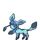

[Frames elegidos](../pokemon/glaceon/anim_front_selected.png) · [Todas las poses](../pokemon/glaceon/anim_front_source.png)

default.back · 80×80 · APNG [0, 2, 7] · timing: source_idle_cycle

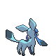

[Frames elegidos](../pokemon/glaceon/back_selected.png) · [Todas las poses](../pokemon/glaceon/back_source.png)

## SYLVEON

default.front · 64×64 · tira original [0, 1, 0, 1, 1] · timing: legacy_estimated

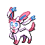

[Frames elegidos](../pokemon/sylveon/anim_front_selected.png) · [Todas las poses](../pokemon/sylveon/anim_front_source.png)

default.back · 64×64 · tira original [0, 0, 0] · timing: legacy_estimated

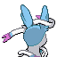

[Frames elegidos](../pokemon/sylveon/back_selected.png) · [Todas las poses](../pokemon/sylveon/back_source.png)

## PORYGON

default.front · 64×64 · APNG [7, 1, 20, 35, 61] · timing: source_timeline

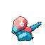

[Frames elegidos](../pokemon/porygon/anim_front_selected.png) · [Todas las poses](../pokemon/porygon/anim_front_source.png)

default.back · 64×64 · APNG [0, 17, 5] · timing: source_idle_cycle

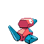

[Frames elegidos](../pokemon/porygon/back_selected.png) · [Todas las poses](../pokemon/porygon/back_source.png)

## PORYGON2

default.front · 64×64 · APNG [0, 3, 9, 39, 47] · timing: source_timeline

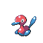

[Frames elegidos](../pokemon/porygon2/anim_front_selected.png) · [Todas las poses](../pokemon/porygon2/anim_front_source.png)

default.back · 64×64 · APNG [0, 9, 3] · timing: source_idle_cycle

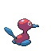

[Frames elegidos](../pokemon/porygon2/back_selected.png) · [Todas las poses](../pokemon/porygon2/back_source.png)

## PORYGON_Z

default.front · 64×64 · APNG [2, 4, 0, 10, 12] · timing: synthetic_special_cadence

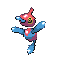

[Frames elegidos](../pokemon/porygon_z/anim_front_selected.png) · [Todas las poses](../pokemon/porygon_z/anim_front_source.png)

default.back · 64×64 · APNG [2, 4, 0] · timing: source_idle_cycle

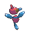

[Frames elegidos](../pokemon/porygon_z/back_selected.png) · [Todas las poses](../pokemon/porygon_z/back_source.png)

## OMANYTE

default.front · 64×64 · APNG [4, 8, 23, 13, 17] · timing: synthetic_special_cadence

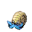

[Frames elegidos](../pokemon/omanyte/anim_front_selected.png) · [Todas las poses](../pokemon/omanyte/anim_front_source.png)

default.back · 64×64 · APNG [13, 8, 23] · timing: source_idle_cycle

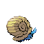

[Frames elegidos](../pokemon/omanyte/back_selected.png) · [Todas las poses](../pokemon/omanyte/back_source.png)

## OMASTAR

default.front · 64×64 · APNG [7, 12, 1, 18, 22] · timing: synthetic_special_cadence

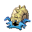

[Frames elegidos](../pokemon/omastar/anim_front_selected.png) · [Todas las poses](../pokemon/omastar/anim_front_source.png)

default.back · 64×64 · APNG [20, 12, 0] · timing: source_idle_cycle

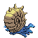

[Frames elegidos](../pokemon/omastar/back_selected.png) · [Todas las poses](../pokemon/omastar/back_source.png)

## KABUTO

default.front · 64×64 · APNG [10, 16, 1, 50, 61] · timing: source_timeline

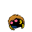

[Frames elegidos](../pokemon/kabuto/anim_front_selected.png) · [Todas las poses](../pokemon/kabuto/anim_front_source.png)

default.back · 64×64 · APNG [10, 16, 0] · timing: source_idle_cycle

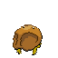

[Frames elegidos](../pokemon/kabuto/back_selected.png) · [Todas las poses](../pokemon/kabuto/back_source.png)

## KABUTOPS

default.front · 80×80 · APNG [6, 0, 13, 10, 15] · timing: synthetic_special_cadence

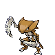

[Frames elegidos](../pokemon/kabutops/anim_front_selected.png) · [Todas las poses](../pokemon/kabutops/anim_front_source.png)

default.back · 80×80 · APNG [6, 0, 13] · timing: source_idle_cycle

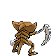

[Frames elegidos](../pokemon/kabutops/back_selected.png) · [Todas las poses](../pokemon/kabutops/back_source.png)

## AERODACTYL

default.front · 96×96 · APNG [12, 1, 28, 162, 168] · timing: source_timeline

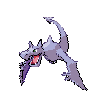

[Frames elegidos](../pokemon/aerodactyl/anim_front_selected.png) · [Todas las poses](../pokemon/aerodactyl/anim_front_source.png)

default.back · 99×99 · APNG [0, 35, 28] · timing: source_idle_cycle

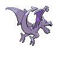

[Frames elegidos](../pokemon/aerodactyl/back_selected.png) · [Todas las poses](../pokemon/aerodactyl/back_source.png)

## MUNCHLAX

default.front · 64×64 · APNG [2, 0, 3, 50, 57] · timing: source_timeline

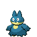

[Frames elegidos](../pokemon/munchlax/anim_front_selected.png) · [Todas las poses](../pokemon/munchlax/anim_front_source.png)

default.back · 64×64 · APNG [2, 0, 3] · timing: source_idle_cycle

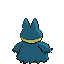

[Frames elegidos](../pokemon/munchlax/back_selected.png) · [Todas las poses](../pokemon/munchlax/back_source.png)

## SNORLAX

default.front · 80×80 · APNG [0, 13, 8, 60, 71] · timing: source_timeline

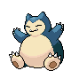

[Frames elegidos](../pokemon/snorlax/anim_front_selected.png) · [Todas las poses](../pokemon/snorlax/anim_front_source.png)

default.back · 80×80 · APNG [0, 13, 9] · timing: source_idle_cycle

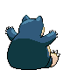

[Frames elegidos](../pokemon/snorlax/back_selected.png) · [Todas las poses](../pokemon/snorlax/back_source.png)

## ARTICUNO

default.front · 96×96 · APNG [2, 11, 4, 8, 27] · timing: synthetic_special_cadence

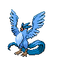

[Frames elegidos](../pokemon/articuno/anim_front_selected.png) · [Todas las poses](../pokemon/articuno/anim_front_source.png)

default.back · 96×96 · APNG [17, 11, 4] · timing: source_idle_cycle

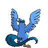

[Frames elegidos](../pokemon/articuno/back_selected.png) · [Todas las poses](../pokemon/articuno/back_source.png)

## ZAPDOS

default.front · 97×97 · APNG [1, 0, 3, 4, 8] · timing: source_timeline

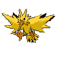

[Frames elegidos](../pokemon/zapdos/anim_front_selected.png) · [Todas las poses](../pokemon/zapdos/anim_front_source.png)

default.back · 96×96 · APNG [2, 0, 3] · timing: source_idle_cycle

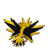

[Frames elegidos](../pokemon/zapdos/back_selected.png) · [Todas las poses](../pokemon/zapdos/back_source.png)

## MOLTRES

default.front · 129×129 · APNG [4, 0, 9, 15, 20] · timing: source_timeline

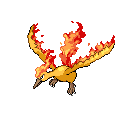

[Frames elegidos](../pokemon/moltres/anim_front_selected.png) · [Todas las poses](../pokemon/moltres/anim_front_source.png)

default.back · 129×129 · APNG [5, 0, 9] · timing: source_idle_cycle

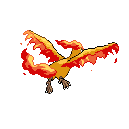

[Frames elegidos](../pokemon/moltres/back_selected.png) · [Todas las poses](../pokemon/moltres/back_source.png)

## DRATINI

default.front · 64×64 · APNG [6, 0, 3, 9, 14] · timing: source_timeline

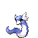

[Frames elegidos](../pokemon/dratini/anim_front_selected.png) · [Todas las poses](../pokemon/dratini/anim_front_source.png)

default.back · 64×64 · APNG [7, 3, 0] · timing: source_idle_cycle

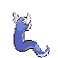

[Frames elegidos](../pokemon/dratini/back_selected.png) · [Todas las poses](../pokemon/dratini/back_source.png)

[Índice](../GALLERY.md) · [Anterior](page_06.md) · [Siguiente](page_08.md)
