# Galería / página 8

[Índice](../GALLERY.md) · [Anterior](page_07.md) · [Siguiente](page_09.md)

## DRAGONAIR

default.front · 80×80 · APNG [0, 4, 11, 51, 56] · timing: source_timeline

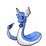

[Frames elegidos](../pokemon/dragonair/anim_front_selected.png) · [Todas las poses](../pokemon/dragonair/anim_front_source.png)

default.back · 80×80 · APNG [0, 3, 12] · timing: source_idle_cycle

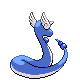

[Frames elegidos](../pokemon/dragonair/back_selected.png) · [Todas las poses](../pokemon/dragonair/back_source.png)

## DRAGONITE

default.front · 96×96 · APNG [5, 0, 4, 35, 50] · timing: source_timeline

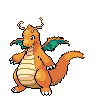

[Frames elegidos](../pokemon/dragonite/anim_front_selected.png) · [Todas las poses](../pokemon/dragonite/anim_front_source.png)

default.back · 96×96 · APNG [6, 0, 4] · timing: source_idle_cycle

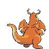

[Frames elegidos](../pokemon/dragonite/back_selected.png) · [Todas las poses](../pokemon/dragonite/back_source.png)

## MEW

default.front · 80×80 · APNG [0, 5, 15, 2, 18] · timing: synthetic_special_cadence

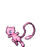

[Frames elegidos](../pokemon/mew/anim_front_selected.png) · [Todas las poses](../pokemon/mew/anim_front_source.png)

default.back · 64×64 · APNG [0, 5, 11] · timing: source_idle_cycle

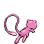

[Frames elegidos](../pokemon/mew/back_selected.png) · [Todas las poses](../pokemon/mew/back_source.png)

## MEWTWO

default.front · 96×96 · APNG [7, 1, 15, 47, 53] · timing: source_timeline

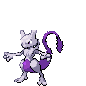

[Frames elegidos](../pokemon/mewtwo/anim_front_selected.png) · [Todas las poses](../pokemon/mewtwo/anim_front_source.png)

default.back · 80×80 · APNG [12, 1, 15] · timing: source_idle_cycle

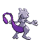

[Frames elegidos](../pokemon/mewtwo/back_selected.png) · [Todas las poses](../pokemon/mewtwo/back_source.png)

## CHIKORITA

default.front · 64×64 · APNG [0, 6, 4, 20, 22] · timing: source_timeline

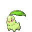

[Frames elegidos](../pokemon/chikorita/anim_front_selected.png) · [Todas las poses](../pokemon/chikorita/anim_front_source.png)

default.back · 64×64 · APNG [0, 3, 1] · timing: source_idle_cycle

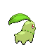

[Frames elegidos](../pokemon/chikorita/back_selected.png) · [Todas las poses](../pokemon/chikorita/back_source.png)

## BAYLEEF

default.front · 80×80 · APNG [7, 5, 0, 25, 64] · timing: source_timeline

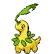

[Frames elegidos](../pokemon/bayleef/anim_front_selected.png) · [Todas las poses](../pokemon/bayleef/anim_front_source.png)

default.back · 80×80 · APNG [6, 0, 5] · timing: source_idle_cycle

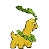

[Frames elegidos](../pokemon/bayleef/back_selected.png) · [Todas las poses](../pokemon/bayleef/back_source.png)

## MEGANIUM

default.front · 96×96 · APNG [2, 5, 0, 34, 36] · timing: source_timeline

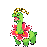

[Frames elegidos](../pokemon/meganium/anim_front_selected.png) · [Todas las poses](../pokemon/meganium/anim_front_source.png)

default.back · 80×80 · APNG [3, 0, 5] · timing: source_idle_cycle

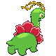

[Frames elegidos](../pokemon/meganium/back_selected.png) · [Todas las poses](../pokemon/meganium/back_source.png)

female.front · 96×96 · tira original [0, 1, 0, 2, 3] · timing: shared_species_timing

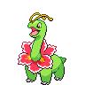

[Frames elegidos](../pokemon/meganium/anim_frontf_selected.png) · [Todas las poses](../pokemon/meganium/anim_frontf_source.png)

female.back · 64×64 · tira original [0, 0, 0] · timing: shared_species_timing

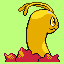

[Frames elegidos](../pokemon/meganium/backf_selected.png) · [Todas las poses](../pokemon/meganium/backf_source.png)

## CYNDAQUIL

default.front · 64×64 · APNG [26, 23, 6, 72, 81] · timing: source_timeline

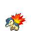

[Frames elegidos](../pokemon/cyndaquil/anim_front_selected.png) · [Todas las poses](../pokemon/cyndaquil/anim_front_source.png)

default.back · 64×64 · APNG [0, 8, 25] · timing: source_idle_cycle

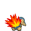

[Frames elegidos](../pokemon/cyndaquil/back_selected.png) · [Todas las poses](../pokemon/cyndaquil/back_source.png)

## QUILAVA

default.front · 64×64 · APNG [0, 1, 8, 47, 50] · timing: source_timeline

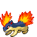

[Frames elegidos](../pokemon/quilava/anim_front_selected.png) · [Todas las poses](../pokemon/quilava/anim_front_source.png)

default.back · 64×64 · APNG [4, 8, 1] · timing: source_idle_cycle

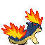

[Frames elegidos](../pokemon/quilava/back_selected.png) · [Todas las poses](../pokemon/quilava/back_source.png)

## TYPHLOSION

default.front · 80×80 · APNG [1, 0, 9, 67, 80] · timing: source_timeline

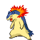

[Frames elegidos](../pokemon/typhlosion/anim_front_selected.png) · [Todas las poses](../pokemon/typhlosion/anim_front_source.png)

default.back · 80×80 · APNG [4, 1, 8] · timing: source_idle_cycle

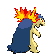

[Frames elegidos](../pokemon/typhlosion/back_selected.png) · [Todas las poses](../pokemon/typhlosion/back_source.png)

## TOTODILE

default.front · 64×64 · APNG [0, 7, 9, 35, 36] · timing: source_timeline

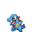

[Frames elegidos](../pokemon/totodile/anim_front_selected.png) · [Todas las poses](../pokemon/totodile/anim_front_source.png)

default.back · 64×64 · APNG [0, 2, 7] · timing: source_idle_cycle

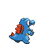

[Frames elegidos](../pokemon/totodile/back_selected.png) · [Todas las poses](../pokemon/totodile/back_source.png)

## CROCONAW

default.front · 64×64 · APNG [14, 4, 0, 41, 47] · timing: source_timeline

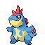

[Frames elegidos](../pokemon/croconaw/anim_front_selected.png) · [Todas las poses](../pokemon/croconaw/anim_front_source.png)

default.back · 64×64 · APNG [6, 0, 12] · timing: source_idle_cycle

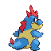

[Frames elegidos](../pokemon/croconaw/back_selected.png) · [Todas las poses](../pokemon/croconaw/back_source.png)

## FERALIGATR

default.front · 96×96 · APNG [0, 3, 8, 33, 36] · timing: source_timeline

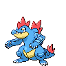

[Frames elegidos](../pokemon/feraligatr/anim_front_selected.png) · [Todas las poses](../pokemon/feraligatr/anim_front_source.png)

default.back · 96×96 · APNG [0, 8, 3] · timing: source_idle_cycle

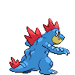

[Frames elegidos](../pokemon/feraligatr/back_selected.png) · [Todas las poses](../pokemon/feraligatr/back_source.png)

## SENTRET

default.front · 80×80 · APNG [0, 12, 4, 21, 23] · timing: source_timeline

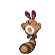

[Frames elegidos](../pokemon/sentret/anim_front_selected.png) · [Todas las poses](../pokemon/sentret/anim_front_source.png)

default.back · 64×64 · APNG [0, 4, 12] · timing: source_idle_cycle

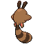

[Frames elegidos](../pokemon/sentret/back_selected.png) · [Todas las poses](../pokemon/sentret/back_source.png)

## FURRET

default.front · 64×64 · APNG [12, 7, 10, 45, 49] · timing: source_timeline

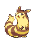

[Frames elegidos](../pokemon/furret/anim_front_selected.png) · [Todas las poses](../pokemon/furret/anim_front_source.png)

default.back · 64×64 · APNG [0, 8, 3] · timing: source_idle_cycle

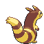

[Frames elegidos](../pokemon/furret/back_selected.png) · [Todas las poses](../pokemon/furret/back_source.png)

## HOOTHOOT

default.front · 64×64 · APNG [0, 1, 4, 44, 49] · timing: source_timeline

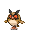

[Frames elegidos](../pokemon/hoothoot/anim_front_selected.png) · [Todas las poses](../pokemon/hoothoot/anim_front_source.png)

default.back · 64×64 · APNG [3, 1, 4] · timing: source_idle_cycle

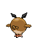

[Frames elegidos](../pokemon/hoothoot/back_selected.png) · [Todas las poses](../pokemon/hoothoot/back_source.png)

## NOCTOWL

default.front · 80×80 · APNG [8, 13, 4, 32, 33] · timing: source_timeline

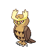

[Frames elegidos](../pokemon/noctowl/anim_front_selected.png) · [Todas las poses](../pokemon/noctowl/anim_front_source.png)

default.back · 80×80 · APNG [9, 0, 11] · timing: source_idle_cycle

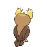

[Frames elegidos](../pokemon/noctowl/back_selected.png) · [Todas las poses](../pokemon/noctowl/back_source.png)

## LEDYBA

default.front · 64×64 · APNG [13, 0, 4, 34, 38] · timing: source_timeline

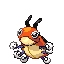

[Frames elegidos](../pokemon/ledyba/anim_front_selected.png) · [Todas las poses](../pokemon/ledyba/anim_front_source.png)

default.back · 64×64 · APNG [3, 15, 12] · timing: source_idle_cycle

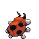

[Frames elegidos](../pokemon/ledyba/back_selected.png) · [Todas las poses](../pokemon/ledyba/back_source.png)

female.front · 64×64 · tira original [0, 1, 0, 2, 3] · timing: shared_species_timing

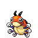

[Frames elegidos](../pokemon/ledyba/anim_frontf_selected.png) · [Todas las poses](../pokemon/ledyba/anim_frontf_source.png)

female.back · 64×64 · tira original [0, 0, 0] · timing: shared_species_timing

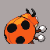

[Frames elegidos](../pokemon/ledyba/backf_selected.png) · [Todas las poses](../pokemon/ledyba/backf_source.png)

## LEDIAN

default.front · 80×80 · APNG [23, 33, 0, 45, 48] · timing: synthetic_special_cadence

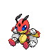

[Frames elegidos](../pokemon/ledian/anim_front_selected.png) · [Todas las poses](../pokemon/ledian/anim_front_source.png)

default.back · 64×64 · APNG [49, 30, 3] · timing: source_idle_cycle

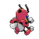

[Frames elegidos](../pokemon/ledian/back_selected.png) · [Todas las poses](../pokemon/ledian/back_source.png)

female.front · 64×64 · tira original [0, 1, 0, 2, 3] · timing: shared_species_timing

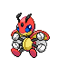

[Frames elegidos](../pokemon/ledian/anim_frontf_selected.png) · [Todas las poses](../pokemon/ledian/anim_frontf_source.png)

female.back · 64×64 · tira original [0, 0, 0] · timing: shared_species_timing

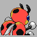

[Frames elegidos](../pokemon/ledian/backf_selected.png) · [Todas las poses](../pokemon/ledian/backf_source.png)

## SPINARAK

default.front · 64×64 · APNG [5, 0, 4, 18, 20] · timing: source_timeline

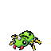

[Frames elegidos](../pokemon/spinarak/anim_front_selected.png) · [Todas las poses](../pokemon/spinarak/anim_front_source.png)

default.back · 64×64 · APNG [3, 6, 4] · timing: source_idle_cycle

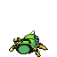

[Frames elegidos](../pokemon/spinarak/back_selected.png) · [Todas las poses](../pokemon/spinarak/back_source.png)

## ARIADOS

default.front · 64×64 · APNG [2, 0, 5, 13, 14] · timing: source_timeline

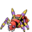

[Frames elegidos](../pokemon/ariados/anim_front_selected.png) · [Todas las poses](../pokemon/ariados/anim_front_source.png)

default.back · 64×64 · APNG [2, 0, 4] · timing: source_idle_cycle

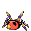

[Frames elegidos](../pokemon/ariados/back_selected.png) · [Todas las poses](../pokemon/ariados/back_source.png)

## CHINCHOU

default.front · 64×64 · APNG [0, 11, 4, 20, 24] · timing: source_timeline

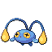

[Frames elegidos](../pokemon/chinchou/anim_front_selected.png) · [Todas las poses](../pokemon/chinchou/anim_front_source.png)

default.back · 64×64 · APNG [0, 4, 11] · timing: source_idle_cycle

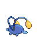

[Frames elegidos](../pokemon/chinchou/back_selected.png) · [Todas las poses](../pokemon/chinchou/back_source.png)

## LANTURN

default.front · 80×80 · APNG [0, 21, 28, 103, 108] · timing: source_timeline

[Frames elegidos](../pokemon/lanturn/anim_front_selected.png) · [Todas las poses](../pokemon/lanturn/anim_front_source.png)

default.back · 80×80 · APNG [0, 29, 4] · timing: source_idle_cycle

[Frames elegidos](../pokemon/lanturn/back_selected.png) · [Todas las poses](../pokemon/lanturn/back_source.png)

## TOGEPI

default.front · 64×64 · APNG [12, 24, 0, 33, 37] · timing: source_timeline

[Frames elegidos](../pokemon/togepi/anim_front_selected.png) · [Todas las poses](../pokemon/togepi/anim_front_source.png)

default.back · 64×64 · APNG [4, 24, 0] · timing: source_idle_cycle

[Frames elegidos](../pokemon/togepi/back_selected.png) · [Todas las poses](../pokemon/togepi/back_source.png)

## TOGETIC

default.front · 80×80 · APNG [7, 0, 8, 39, 41] · timing: source_timeline

[Frames elegidos](../pokemon/togetic/anim_front_selected.png) · [Todas las poses](../pokemon/togetic/anim_front_source.png)

default.back · 64×64 · APNG [10, 0, 8] · timing: source_idle_cycle

[Frames elegidos](../pokemon/togetic/back_selected.png) · [Todas las poses](../pokemon/togetic/back_source.png)

[Índice](../GALLERY.md) · [Anterior](page_07.md) · [Siguiente](page_09.md)
