# Galería / página 8

[Índice](../GALLERY.md) · [Anterior](page_07.md) · [Siguiente](page_09.md)

## TOTODILE

default.front · 64×64 · APNG [0, 7, 9, 35, 36]

[Frames elegidos](../pokemon/totodile/anim_front_selected.png) · [Todas las poses](../pokemon/totodile/anim_front_source.png)

default.back · 64×64 · APNG [0, 2, 7]

[Frames elegidos](../pokemon/totodile/back_selected.png) · [Todas las poses](../pokemon/totodile/back_source.png)

## CROCONAW

default.front · 64×64 · APNG [14, 4, 0, 41, 47]

[Frames elegidos](../pokemon/croconaw/anim_front_selected.png) · [Todas las poses](../pokemon/croconaw/anim_front_source.png)

default.back · 64×64 · APNG [6, 0, 12]

[Frames elegidos](../pokemon/croconaw/back_selected.png) · [Todas las poses](../pokemon/croconaw/back_source.png)

## FERALIGATR

default.front · 96×96 · APNG [0, 3, 8, 33, 36]

[Frames elegidos](../pokemon/feraligatr/anim_front_selected.png) · [Todas las poses](../pokemon/feraligatr/anim_front_source.png)

default.back · 96×96 · APNG [0, 8, 3]

[Frames elegidos](../pokemon/feraligatr/back_selected.png) · [Todas las poses](../pokemon/feraligatr/back_source.png)

## SENTRET

default.front · 80×80 · APNG [0, 12, 4, 21, 23]

[Frames elegidos](../pokemon/sentret/anim_front_selected.png) · [Todas las poses](../pokemon/sentret/anim_front_source.png)

default.back · 64×64 · APNG [0, 4, 12]

[Frames elegidos](../pokemon/sentret/back_selected.png) · [Todas las poses](../pokemon/sentret/back_source.png)

## FURRET

default.front · 64×64 · APNG [12, 7, 10, 45, 49]

[Frames elegidos](../pokemon/furret/anim_front_selected.png) · [Todas las poses](../pokemon/furret/anim_front_source.png)

default.back · 64×64 · APNG [0, 8, 3]

[Frames elegidos](../pokemon/furret/back_selected.png) · [Todas las poses](../pokemon/furret/back_source.png)

## HOOTHOOT

default.front · 64×64 · APNG [0, 1, 4, 44, 49]

[Frames elegidos](../pokemon/hoothoot/anim_front_selected.png) · [Todas las poses](../pokemon/hoothoot/anim_front_source.png)

default.back · 64×64 · APNG [3, 1, 4]

[Frames elegidos](../pokemon/hoothoot/back_selected.png) · [Todas las poses](../pokemon/hoothoot/back_source.png)

## NOCTOWL

default.front · 80×80 · APNG [8, 13, 4, 32, 33]

[Frames elegidos](../pokemon/noctowl/anim_front_selected.png) · [Todas las poses](../pokemon/noctowl/anim_front_source.png)

default.back · 80×80 · APNG [9, 0, 11]

[Frames elegidos](../pokemon/noctowl/back_selected.png) · [Todas las poses](../pokemon/noctowl/back_source.png)

## LEDYBA

default.front · 64×64 · APNG [13, 0, 4, 34, 38]

[Frames elegidos](../pokemon/ledyba/anim_front_selected.png) · [Todas las poses](../pokemon/ledyba/anim_front_source.png)

default.back · 64×64 · APNG [3, 15, 12]

[Frames elegidos](../pokemon/ledyba/back_selected.png) · [Todas las poses](../pokemon/ledyba/back_source.png)

## LEDIAN

default.front · 80×80 · APNG [23, 33, 0, 45, 48]

[Frames elegidos](../pokemon/ledian/anim_front_selected.png) · [Todas las poses](../pokemon/ledian/anim_front_source.png)

default.back · 64×64 · APNG [49, 30, 3]

[Frames elegidos](../pokemon/ledian/back_selected.png) · [Todas las poses](../pokemon/ledian/back_source.png)

## SPINARAK

default.front · 64×64 · APNG [5, 0, 4, 18, 20]

[Frames elegidos](../pokemon/spinarak/anim_front_selected.png) · [Todas las poses](../pokemon/spinarak/anim_front_source.png)

default.back · 64×64 · APNG [3, 6, 4]

[Frames elegidos](../pokemon/spinarak/back_selected.png) · [Todas las poses](../pokemon/spinarak/back_source.png)

## ARIADOS

default.front · 64×64 · APNG [2, 0, 5, 13, 14]

[Frames elegidos](../pokemon/ariados/anim_front_selected.png) · [Todas las poses](../pokemon/ariados/anim_front_source.png)

default.back · 64×64 · APNG [2, 0, 4]

[Frames elegidos](../pokemon/ariados/back_selected.png) · [Todas las poses](../pokemon/ariados/back_source.png)

## CHINCHOU

default.front · 64×64 · APNG [0, 11, 4, 20, 24]

[Frames elegidos](../pokemon/chinchou/anim_front_selected.png) · [Todas las poses](../pokemon/chinchou/anim_front_source.png)

default.back · 64×64 · APNG [0, 4, 11]

[Frames elegidos](../pokemon/chinchou/back_selected.png) · [Todas las poses](../pokemon/chinchou/back_source.png)

## LANTURN

default.front · 80×80 · APNG [0, 21, 28, 103, 108]

[Frames elegidos](../pokemon/lanturn/anim_front_selected.png) · [Todas las poses](../pokemon/lanturn/anim_front_source.png)

default.back · 80×80 · APNG [0, 29, 4]

[Frames elegidos](../pokemon/lanturn/back_selected.png) · [Todas las poses](../pokemon/lanturn/back_source.png)

## TOGEPI

default.front · 64×64 · APNG [12, 24, 0, 33, 37]

[Frames elegidos](../pokemon/togepi/anim_front_selected.png) · [Todas las poses](../pokemon/togepi/anim_front_source.png)

default.back · 64×64 · APNG [4, 24, 0]

[Frames elegidos](../pokemon/togepi/back_selected.png) · [Todas las poses](../pokemon/togepi/back_source.png)

## TOGETIC

default.front · 80×80 · APNG [7, 0, 8, 39, 41]

[Frames elegidos](../pokemon/togetic/anim_front_selected.png) · [Todas las poses](../pokemon/togetic/anim_front_source.png)

default.back · 64×64 · APNG [10, 0, 8]

[Frames elegidos](../pokemon/togetic/back_selected.png) · [Todas las poses](../pokemon/togetic/back_source.png)

## TOGEKISS

default.front · 96×96 · APNG [11, 8, 0, 33, 36]

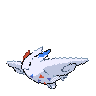

[Frames elegidos](../pokemon/togekiss/anim_front_selected.png) · [Todas las poses](../pokemon/togekiss/anim_front_source.png)

default.back · 96×96 · APNG [5, 8, 0]

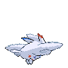

[Frames elegidos](../pokemon/togekiss/back_selected.png) · [Todas las poses](../pokemon/togekiss/back_source.png)

## NATU

default.front · 64×64 · APNG [0, 15, 4, 46, 58]

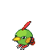

[Frames elegidos](../pokemon/natu/anim_front_selected.png) · [Todas las poses](../pokemon/natu/anim_front_source.png)

default.back · 64×64 · APNG [0, 4, 15]

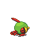

[Frames elegidos](../pokemon/natu/back_selected.png) · [Todas las poses](../pokemon/natu/back_source.png)

## XATU

default.front · 64×64 · APNG [0, 9, 2, 41, 44]

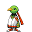

[Frames elegidos](../pokemon/xatu/anim_front_selected.png) · [Todas las poses](../pokemon/xatu/anim_front_source.png)

default.back · 64×64 · APNG [0, 3, 9]

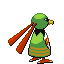

[Frames elegidos](../pokemon/xatu/back_selected.png) · [Todas las poses](../pokemon/xatu/back_source.png)

## MAREEP

default.front · 64×64 · APNG [16, 17, 11, 18, 28]

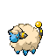

[Frames elegidos](../pokemon/mareep/anim_front_selected.png) · [Todas las poses](../pokemon/mareep/anim_front_source.png)

default.back · 64×64 · APNG [17, 7, 12]

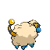

[Frames elegidos](../pokemon/mareep/back_selected.png) · [Todas las poses](../pokemon/mareep/back_source.png)

## FLAAFFY

default.front · 64×64 · APNG [0, 6, 2, 47, 50]

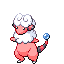

[Frames elegidos](../pokemon/flaaffy/anim_front_selected.png) · [Todas las poses](../pokemon/flaaffy/anim_front_source.png)

default.back · 64×64 · APNG [1, 5, 3]

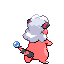

[Frames elegidos](../pokemon/flaaffy/back_selected.png) · [Todas las poses](../pokemon/flaaffy/back_source.png)

## AMPHAROS

default.front · 80×80 · APNG [0, 3, 8, 22, 25]

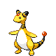

[Frames elegidos](../pokemon/ampharos/anim_front_selected.png) · [Todas las poses](../pokemon/ampharos/anim_front_source.png)

default.back · 64×64 · APNG [0, 8, 3]

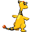

[Frames elegidos](../pokemon/ampharos/back_selected.png) · [Todas las poses](../pokemon/ampharos/back_source.png)

## AZURILL

default.front · 64×64 · APNG [0, 3, 8, 26, 31]

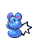

[Frames elegidos](../pokemon/azurill/anim_front_selected.png) · [Todas las poses](../pokemon/azurill/anim_front_source.png)

default.back · 64×64 · APNG [0, 3, 8]

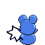

[Frames elegidos](../pokemon/azurill/back_selected.png) · [Todas las poses](../pokemon/azurill/back_source.png)

## MARILL

default.front · 64×64 · APNG [1, 0, 2, 36, 53]

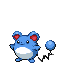

[Frames elegidos](../pokemon/marill/anim_front_selected.png) · [Todas las poses](../pokemon/marill/anim_front_source.png)

default.back · 64×64 · APNG [1, 0, 2]

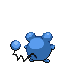

[Frames elegidos](../pokemon/marill/back_selected.png) · [Todas las poses](../pokemon/marill/back_source.png)

## AZUMARILL

default.front · 80×80 · APNG [0, 12, 4, 59, 67]

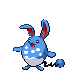

[Frames elegidos](../pokemon/azumarill/anim_front_selected.png) · [Todas las poses](../pokemon/azumarill/anim_front_source.png)

default.back · 80×80 · APNG [0, 4, 12]

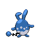

[Frames elegidos](../pokemon/azumarill/back_selected.png) · [Todas las poses](../pokemon/azumarill/back_source.png)

## BONSLY

default.front · 64×64 · APNG [0, 8, 3, 75, 83]

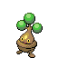

[Frames elegidos](../pokemon/bonsly/anim_front_selected.png) · [Todas las poses](../pokemon/bonsly/anim_front_source.png)

default.back · 64×64 · APNG [0, 3, 8]

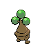

[Frames elegidos](../pokemon/bonsly/back_selected.png) · [Todas las poses](../pokemon/bonsly/back_source.png)

[Índice](../GALLERY.md) · [Anterior](page_07.md) · [Siguiente](page_09.md)
