# Galería / página 9

[Índice](../GALLERY.md) · [Anterior](page_08.md) · [Siguiente](page_10.md)

## SUDOWOODO

default.front · 80×80 · APNG [2, 5, 0, 13, 16]

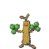

[Frames elegidos](../pokemon/sudowoodo/anim_front_selected.png) · [Todas las poses](../pokemon/sudowoodo/anim_front_source.png)

default.back · 80×80 · APNG [2, 0, 5]

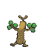

[Frames elegidos](../pokemon/sudowoodo/back_selected.png) · [Todas las poses](../pokemon/sudowoodo/back_source.png)

## HOPPIP

default.front · 80×80 · APNG [0, 27, 5, 50, 59]

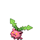

[Frames elegidos](../pokemon/hoppip/anim_front_selected.png) · [Todas las poses](../pokemon/hoppip/anim_front_source.png)

default.back · 80×80 · APNG [0, 27, 5]

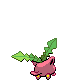

[Frames elegidos](../pokemon/hoppip/back_selected.png) · [Todas las poses](../pokemon/hoppip/back_source.png)

## SKIPLOOM

default.front · 64×64 · APNG [2, 11, 6, 38, 43]

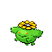

[Frames elegidos](../pokemon/skiploom/anim_front_selected.png) · [Todas las poses](../pokemon/skiploom/anim_front_source.png)

default.back · 64×64 · APNG [2, 11, 4]

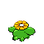

[Frames elegidos](../pokemon/skiploom/back_selected.png) · [Todas las poses](../pokemon/skiploom/back_source.png)

## JUMPLUFF

default.front · 80×80 · APNG [13, 9, 0, 20, 28]

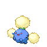

[Frames elegidos](../pokemon/jumpluff/anim_front_selected.png) · [Todas las poses](../pokemon/jumpluff/anim_front_source.png)

default.back · 64×64 · APNG [3, 6, 0]

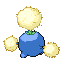

[Frames elegidos](../pokemon/jumpluff/back_selected.png) · [Todas las poses](../pokemon/jumpluff/back_source.png)

## AIPOM

default.front · 64×64 · APNG [4, 0, 18, 19, 21]

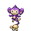

[Frames elegidos](../pokemon/aipom/anim_front_selected.png) · [Todas las poses](../pokemon/aipom/anim_front_source.png)

default.back · 64×64 · APNG [8, 0, 18]

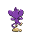

[Frames elegidos](../pokemon/aipom/back_selected.png) · [Todas las poses](../pokemon/aipom/back_source.png)

## AMBIPOM

default.front · 80×80 · APNG [5, 0, 12, 34, 36]

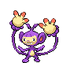

[Frames elegidos](../pokemon/ambipom/anim_front_selected.png) · [Todas las poses](../pokemon/ambipom/anim_front_source.png)

default.back · 80×80 · APNG [1, 0, 11]

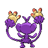

[Frames elegidos](../pokemon/ambipom/back_selected.png) · [Todas las poses](../pokemon/ambipom/back_source.png)

## SUNKERN

default.front · 64×64 · APNG [5, 6, 0, 25, 30]

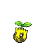

[Frames elegidos](../pokemon/sunkern/anim_front_selected.png) · [Todas las poses](../pokemon/sunkern/anim_front_source.png)

default.back · 64×64 · APNG [5, 6, 0]

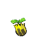

[Frames elegidos](../pokemon/sunkern/back_selected.png) · [Todas las poses](../pokemon/sunkern/back_source.png)

## SUNFLORA

default.front · 64×64 · APNG [0, 2, 14, 6, 11]

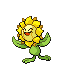

[Frames elegidos](../pokemon/sunflora/anim_front_selected.png) · [Todas las poses](../pokemon/sunflora/anim_front_source.png)

default.back · 64×64 · APNG [0, 2, 12]

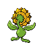

[Frames elegidos](../pokemon/sunflora/back_selected.png) · [Todas las poses](../pokemon/sunflora/back_source.png)

## YANMA

default.front · 96×96 · APNG [108, 24, 68, 457, 496]

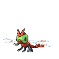

[Frames elegidos](../pokemon/yanma/anim_front_selected.png) · [Todas las poses](../pokemon/yanma/anim_front_source.png)

default.back · 96×96 · APNG [916, 280, 444]

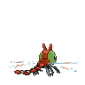

[Frames elegidos](../pokemon/yanma/back_selected.png) · [Todas las poses](../pokemon/yanma/back_source.png)

## YANMEGA

default.front · 96×96 · APNG [0, 42, 73, 125, 209]

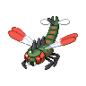

[Frames elegidos](../pokemon/yanmega/anim_front_selected.png) · [Todas las poses](../pokemon/yanmega/anim_front_source.png)

default.back · 96×96 · APNG [0, 42, 74]

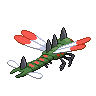

[Frames elegidos](../pokemon/yanmega/back_selected.png) · [Todas las poses](../pokemon/yanmega/back_source.png)

## MURKROW

default.front · 64×64 · APNG [0, 8, 3, 4, 9]

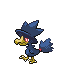

[Frames elegidos](../pokemon/murkrow/anim_front_selected.png) · [Todas las poses](../pokemon/murkrow/anim_front_source.png)

default.back · 64×64 · APNG [0, 3, 8]

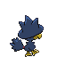

[Frames elegidos](../pokemon/murkrow/back_selected.png) · [Todas las poses](../pokemon/murkrow/back_source.png)

## HONCHKROW

default.front · 80×80 · APNG [0, 14, 3, 34, 37]

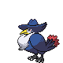

[Frames elegidos](../pokemon/honchkrow/anim_front_selected.png) · [Todas las poses](../pokemon/honchkrow/anim_front_source.png)

default.back · 80×80 · APNG [0, 6, 3]

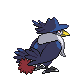

[Frames elegidos](../pokemon/honchkrow/back_selected.png) · [Todas las poses](../pokemon/honchkrow/back_source.png)

## MISDREAVUS

default.front · 64×64 · APNG [17, 0, 9, 1, 13]

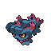

[Frames elegidos](../pokemon/misdreavus/anim_front_selected.png) · [Todas las poses](../pokemon/misdreavus/anim_front_source.png)

default.back · 64×64 · APNG [0, 20, 5]

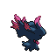

[Frames elegidos](../pokemon/misdreavus/back_selected.png) · [Todas las poses](../pokemon/misdreavus/back_source.png)

## MISMAGIUS

default.front · 96×96 · APNG [3, 0, 5, 6, 10]

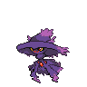

[Frames elegidos](../pokemon/mismagius/anim_front_selected.png) · [Todas las poses](../pokemon/mismagius/anim_front_source.png)

default.back · 80×80 · APNG [3, 0, 5]

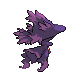

[Frames elegidos](../pokemon/mismagius/back_selected.png) · [Todas las poses](../pokemon/mismagius/back_source.png)

## GIRAFARIG

default.front · 80×80 · APNG [6, 0, 5, 44, 47]

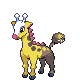

[Frames elegidos](../pokemon/girafarig/anim_front_selected.png) · [Todas las poses](../pokemon/girafarig/anim_front_source.png)

default.back · 80×80 · APNG [3, 0, 5]

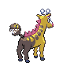

[Frames elegidos](../pokemon/girafarig/back_selected.png) · [Todas las poses](../pokemon/girafarig/back_source.png)

## GLIGAR

default.front · 96×96 · APNG [7, 0, 4, 21, 32]

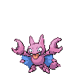

[Frames elegidos](../pokemon/gligar/anim_front_selected.png) · [Todas las poses](../pokemon/gligar/anim_front_source.png)

default.back · 80×80 · APNG [1, 0, 2]

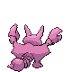

[Frames elegidos](../pokemon/gligar/back_selected.png) · [Todas las poses](../pokemon/gligar/back_source.png)

## GLISCOR

default.front · 96×96 · APNG [0, 6, 17, 3, 19]

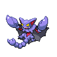

[Frames elegidos](../pokemon/gliscor/anim_front_selected.png) · [Todas las poses](../pokemon/gliscor/anim_front_source.png)

default.back · 96×96 · APNG [0, 6, 17]

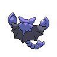

[Frames elegidos](../pokemon/gliscor/back_selected.png) · [Todas las poses](../pokemon/gliscor/back_source.png)

## SNUBBULL

default.front · 64×64 · APNG [0, 10, 7, 51, 56]

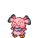

[Frames elegidos](../pokemon/snubbull/anim_front_selected.png) · [Todas las poses](../pokemon/snubbull/anim_front_source.png)

default.back · 64×64 · APNG [0, 9, 4]

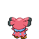

[Frames elegidos](../pokemon/snubbull/back_selected.png) · [Todas las poses](../pokemon/snubbull/back_source.png)

## GRANBULL

default.front · 64×64 · APNG [0, 21, 11, 18, 25]

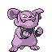

[Frames elegidos](../pokemon/granbull/anim_front_selected.png) · [Todas las poses](../pokemon/granbull/anim_front_source.png)

default.back · 64×64 · APNG [0, 22, 12]

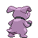

[Frames elegidos](../pokemon/granbull/back_selected.png) · [Todas las poses](../pokemon/granbull/back_source.png)

## HERACROSS

default.front · 80×80 · APNG [14, 11, 1, 56, 59]

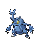

[Frames elegidos](../pokemon/heracross/anim_front_selected.png) · [Todas las poses](../pokemon/heracross/anim_front_source.png)

default.back · 80×80 · APNG [14, 9, 1]

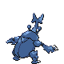

[Frames elegidos](../pokemon/heracross/back_selected.png) · [Todas las poses](../pokemon/heracross/back_source.png)

## SNEASEL

default.front · 64×64 · APNG [0, 6, 12, 53, 57]

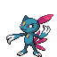

[Frames elegidos](../pokemon/sneasel/anim_front_selected.png) · [Todas las poses](../pokemon/sneasel/anim_front_source.png)

default.back · 64×64 · APNG [0, 5, 11]

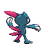

[Frames elegidos](../pokemon/sneasel/back_selected.png) · [Todas las poses](../pokemon/sneasel/back_source.png)

## WEAVILE

default.front · 96×96 · APNG [7, 0, 5, 40, 43]

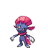

[Frames elegidos](../pokemon/weavile/anim_front_selected.png) · [Todas las poses](../pokemon/weavile/anim_front_source.png)

default.back · 64×64 · APNG [2, 0, 5]

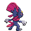

[Frames elegidos](../pokemon/weavile/back_selected.png) · [Todas las poses](../pokemon/weavile/back_source.png)

## TEDDIURSA

default.front · 64×64 · APNG [2, 0, 4, 40, 42]

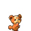

[Frames elegidos](../pokemon/teddiursa/anim_front_selected.png) · [Todas las poses](../pokemon/teddiursa/anim_front_source.png)

default.back · 64×64 · APNG [3, 0, 5]

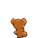

[Frames elegidos](../pokemon/teddiursa/back_selected.png) · [Todas las poses](../pokemon/teddiursa/back_source.png)

## URSARING

default.front · 96×96 · APNG [0, 18, 6, 97, 107]

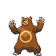

[Frames elegidos](../pokemon/ursaring/anim_front_selected.png) · [Todas las poses](../pokemon/ursaring/anim_front_source.png)

default.back · 80×80 · APNG [0, 18, 6]

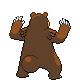

[Frames elegidos](../pokemon/ursaring/back_selected.png) · [Todas las poses](../pokemon/ursaring/back_source.png)

## SLUGMA

default.front · 64×64 · APNG [8, 6, 0, 15, 17]

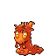

[Frames elegidos](../pokemon/slugma/anim_front_selected.png) · [Todas las poses](../pokemon/slugma/anim_front_source.png)

default.back · 64×64 · APNG [13, 0, 6]

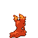

[Frames elegidos](../pokemon/slugma/back_selected.png) · [Todas las poses](../pokemon/slugma/back_source.png)

[Índice](../GALLERY.md) · [Anterior](page_08.md) · [Siguiente](page_10.md)
