# Galería / página 9

[Índice](../GALLERY.md) · [Anterior](page_08.md) · [Siguiente](page_10.md)

## TOGEKISS

default.front · 96×96 · APNG [11, 8, 0, 33, 36] · timing: source_timeline

[Frames elegidos](../pokemon/togekiss/anim_front_selected.png) · [Todas las poses](../pokemon/togekiss/anim_front_source.png)

default.back · 96×96 · APNG [5, 8, 0] · timing: source_idle_cycle

[Frames elegidos](../pokemon/togekiss/back_selected.png) · [Todas las poses](../pokemon/togekiss/back_source.png)

## NATU

default.front · 64×64 · APNG [0, 15, 4, 46, 58] · timing: source_timeline

[Frames elegidos](../pokemon/natu/anim_front_selected.png) · [Todas las poses](../pokemon/natu/anim_front_source.png)

default.back · 64×64 · APNG [0, 4, 15] · timing: source_idle_cycle

[Frames elegidos](../pokemon/natu/back_selected.png) · [Todas las poses](../pokemon/natu/back_source.png)

## XATU

default.front · 64×64 · APNG [0, 9, 2, 41, 44] · timing: source_timeline

[Frames elegidos](../pokemon/xatu/anim_front_selected.png) · [Todas las poses](../pokemon/xatu/anim_front_source.png)

default.back · 64×64 · APNG [0, 3, 9] · timing: source_idle_cycle

[Frames elegidos](../pokemon/xatu/back_selected.png) · [Todas las poses](../pokemon/xatu/back_source.png)

female.front · 64×64 · tira original [0, 1, 0, 1, 1] · timing: shared_species_timing

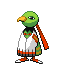

[Frames elegidos](../pokemon/xatu/anim_frontf_selected.png) · [Todas las poses](../pokemon/xatu/anim_frontf_source.png)

female.back · 64×64 · APNG [0, 3, 9] · timing: shared_species_timing

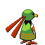

[Frames elegidos](../pokemon/xatu/backf_selected.png) · [Todas las poses](../pokemon/xatu/backf_source.png)

## MAREEP

default.front · 64×64 · APNG [16, 17, 11, 18, 28] · timing: source_timeline

[Frames elegidos](../pokemon/mareep/anim_front_selected.png) · [Todas las poses](../pokemon/mareep/anim_front_source.png)

default.back · 64×64 · APNG [17, 7, 12] · timing: source_idle_cycle

[Frames elegidos](../pokemon/mareep/back_selected.png) · [Todas las poses](../pokemon/mareep/back_source.png)

## FLAAFFY

default.front · 64×64 · APNG [0, 6, 2, 47, 50] · timing: source_timeline

[Frames elegidos](../pokemon/flaaffy/anim_front_selected.png) · [Todas las poses](../pokemon/flaaffy/anim_front_source.png)

default.back · 64×64 · APNG [1, 5, 3] · timing: source_idle_cycle

[Frames elegidos](../pokemon/flaaffy/back_selected.png) · [Todas las poses](../pokemon/flaaffy/back_source.png)

## AMPHAROS

default.front · 80×80 · APNG [0, 3, 8, 22, 25] · timing: source_timeline

[Frames elegidos](../pokemon/ampharos/anim_front_selected.png) · [Todas las poses](../pokemon/ampharos/anim_front_source.png)

default.back · 64×64 · APNG [0, 8, 3] · timing: source_idle_cycle

[Frames elegidos](../pokemon/ampharos/back_selected.png) · [Todas las poses](../pokemon/ampharos/back_source.png)

## AZURILL

default.front · 64×64 · APNG [0, 3, 8, 26, 31] · timing: source_timeline

[Frames elegidos](../pokemon/azurill/anim_front_selected.png) · [Todas las poses](../pokemon/azurill/anim_front_source.png)

default.back · 64×64 · APNG [0, 3, 8] · timing: source_idle_cycle

[Frames elegidos](../pokemon/azurill/back_selected.png) · [Todas las poses](../pokemon/azurill/back_source.png)

## MARILL

default.front · 64×64 · APNG [1, 0, 2, 36, 53] · timing: source_timeline

[Frames elegidos](../pokemon/marill/anim_front_selected.png) · [Todas las poses](../pokemon/marill/anim_front_source.png)

default.back · 64×64 · APNG [1, 0, 2] · timing: source_idle_cycle

[Frames elegidos](../pokemon/marill/back_selected.png) · [Todas las poses](../pokemon/marill/back_source.png)

## AZUMARILL

default.front · 80×80 · APNG [0, 12, 4, 59, 67] · timing: source_timeline

[Frames elegidos](../pokemon/azumarill/anim_front_selected.png) · [Todas las poses](../pokemon/azumarill/anim_front_source.png)

default.back · 80×80 · APNG [0, 4, 12] · timing: source_idle_cycle

[Frames elegidos](../pokemon/azumarill/back_selected.png) · [Todas las poses](../pokemon/azumarill/back_source.png)

## BONSLY

default.front · 64×64 · APNG [0, 8, 3, 75, 83] · timing: source_timeline

[Frames elegidos](../pokemon/bonsly/anim_front_selected.png) · [Todas las poses](../pokemon/bonsly/anim_front_source.png)

default.back · 64×64 · APNG [0, 3, 8] · timing: source_idle_cycle

[Frames elegidos](../pokemon/bonsly/back_selected.png) · [Todas las poses](../pokemon/bonsly/back_source.png)

## SUDOWOODO

default.front · 80×80 · APNG [2, 5, 0, 13, 16] · timing: source_timeline

[Frames elegidos](../pokemon/sudowoodo/anim_front_selected.png) · [Todas las poses](../pokemon/sudowoodo/anim_front_source.png)

default.back · 80×80 · APNG [2, 0, 5] · timing: source_idle_cycle

[Frames elegidos](../pokemon/sudowoodo/back_selected.png) · [Todas las poses](../pokemon/sudowoodo/back_source.png)

female.front · 80×80 · tira original [0, 1, 0, 2, 3] · timing: shared_species_timing

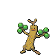

[Frames elegidos](../pokemon/sudowoodo/anim_frontf_selected.png) · [Todas las poses](../pokemon/sudowoodo/anim_frontf_source.png)

female.back · 64×64 · tira original [0, 0, 0] · timing: shared_species_timing

[Frames elegidos](../pokemon/sudowoodo/backf_selected.png) · [Todas las poses](../pokemon/sudowoodo/backf_source.png)

## HOPPIP

default.front · 80×80 · APNG [0, 27, 5, 50, 59] · timing: source_timeline

[Frames elegidos](../pokemon/hoppip/anim_front_selected.png) · [Todas las poses](../pokemon/hoppip/anim_front_source.png)

default.back · 80×80 · APNG [0, 27, 5] · timing: source_idle_cycle

[Frames elegidos](../pokemon/hoppip/back_selected.png) · [Todas las poses](../pokemon/hoppip/back_source.png)

## SKIPLOOM

default.front · 64×64 · APNG [2, 11, 6, 38, 43] · timing: source_timeline

[Frames elegidos](../pokemon/skiploom/anim_front_selected.png) · [Todas las poses](../pokemon/skiploom/anim_front_source.png)

default.back · 64×64 · APNG [2, 11, 4] · timing: source_idle_cycle

[Frames elegidos](../pokemon/skiploom/back_selected.png) · [Todas las poses](../pokemon/skiploom/back_source.png)

## JUMPLUFF

default.front · 80×80 · APNG [13, 9, 0, 20, 28] · timing: source_timeline

[Frames elegidos](../pokemon/jumpluff/anim_front_selected.png) · [Todas las poses](../pokemon/jumpluff/anim_front_source.png)

default.back · 64×64 · APNG [3, 6, 0] · timing: source_idle_cycle

[Frames elegidos](../pokemon/jumpluff/back_selected.png) · [Todas las poses](../pokemon/jumpluff/back_source.png)

## AIPOM

default.front · 64×64 · APNG [4, 0, 18, 19, 21] · timing: synthetic_special_cadence

[Frames elegidos](../pokemon/aipom/anim_front_selected.png) · [Todas las poses](../pokemon/aipom/anim_front_source.png)

default.back · 64×64 · APNG [8, 0, 18] · timing: source_idle_cycle

[Frames elegidos](../pokemon/aipom/back_selected.png) · [Todas las poses](../pokemon/aipom/back_source.png)

female.front · 64×64 · tira original [0, 1, 0, 2, 3] · timing: shared_species_timing

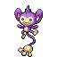

[Frames elegidos](../pokemon/aipom/anim_frontf_selected.png) · [Todas las poses](../pokemon/aipom/anim_frontf_source.png)

female.back · 64×64 · tira original [0, 0, 0] · timing: shared_species_timing

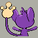

[Frames elegidos](../pokemon/aipom/backf_selected.png) · [Todas las poses](../pokemon/aipom/backf_source.png)

## AMBIPOM

default.front · 80×80 · APNG [5, 0, 12, 34, 36] · timing: source_timeline

[Frames elegidos](../pokemon/ambipom/anim_front_selected.png) · [Todas las poses](../pokemon/ambipom/anim_front_source.png)

default.back · 80×80 · APNG [1, 0, 11] · timing: source_idle_cycle

[Frames elegidos](../pokemon/ambipom/back_selected.png) · [Todas las poses](../pokemon/ambipom/back_source.png)

female.front · 80×80 · tira original [0, 1, 0, 2, 3] · timing: shared_species_timing

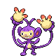

[Frames elegidos](../pokemon/ambipom/anim_frontf_selected.png) · [Todas las poses](../pokemon/ambipom/anim_frontf_source.png)

female.back · 64×64 · tira original [0, 0, 0] · timing: shared_species_timing

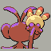

[Frames elegidos](../pokemon/ambipom/backf_selected.png) · [Todas las poses](../pokemon/ambipom/backf_source.png)

## SUNKERN

default.front · 64×64 · APNG [5, 6, 0, 25, 30] · timing: source_timeline

[Frames elegidos](../pokemon/sunkern/anim_front_selected.png) · [Todas las poses](../pokemon/sunkern/anim_front_source.png)

default.back · 64×64 · APNG [5, 6, 0] · timing: source_idle_cycle

[Frames elegidos](../pokemon/sunkern/back_selected.png) · [Todas las poses](../pokemon/sunkern/back_source.png)

## SUNFLORA

default.front · 64×64 · APNG [0, 2, 14, 6, 11] · timing: synthetic_special_cadence

[Frames elegidos](../pokemon/sunflora/anim_front_selected.png) · [Todas las poses](../pokemon/sunflora/anim_front_source.png)

default.back · 64×64 · APNG [0, 2, 12] · timing: source_idle_cycle

[Frames elegidos](../pokemon/sunflora/back_selected.png) · [Todas las poses](../pokemon/sunflora/back_source.png)

## YANMA

default.front · 96×96 · APNG [108, 24, 68, 457, 496] · timing: source_timeline

[Frames elegidos](../pokemon/yanma/anim_front_selected.png) · [Todas las poses](../pokemon/yanma/anim_front_source.png)

default.back · 96×96 · APNG [916, 280, 444] · timing: source_idle_cycle

[Frames elegidos](../pokemon/yanma/back_selected.png) · [Todas las poses](../pokemon/yanma/back_source.png)

## YANMEGA

default.front · 96×96 · APNG [0, 42, 73, 125, 209] · timing: source_timeline

[Frames elegidos](../pokemon/yanmega/anim_front_selected.png) · [Todas las poses](../pokemon/yanmega/anim_front_source.png)

default.back · 96×96 · APNG [0, 42, 74] · timing: source_idle_cycle

[Frames elegidos](../pokemon/yanmega/back_selected.png) · [Todas las poses](../pokemon/yanmega/back_source.png)

## MURKROW

default.front · 64×64 · APNG [0, 8, 3, 4, 9] · timing: synthetic_special_cadence

[Frames elegidos](../pokemon/murkrow/anim_front_selected.png) · [Todas las poses](../pokemon/murkrow/anim_front_source.png)

default.back · 64×64 · APNG [0, 3, 8] · timing: source_idle_cycle

[Frames elegidos](../pokemon/murkrow/back_selected.png) · [Todas las poses](../pokemon/murkrow/back_source.png)

female.front · 64×64 · tira original [0, 1, 0, 2, 3] · timing: shared_species_timing

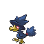

[Frames elegidos](../pokemon/murkrow/anim_frontf_selected.png) · [Todas las poses](../pokemon/murkrow/anim_frontf_source.png)

female.back · 64×64 · tira original [0, 0, 0] · timing: shared_species_timing

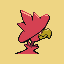

[Frames elegidos](../pokemon/murkrow/backf_selected.png) · [Todas las poses](../pokemon/murkrow/backf_source.png)

## HONCHKROW

default.front · 80×80 · APNG [0, 14, 3, 34, 37] · timing: source_timeline

[Frames elegidos](../pokemon/honchkrow/anim_front_selected.png) · [Todas las poses](../pokemon/honchkrow/anim_front_source.png)

default.back · 80×80 · APNG [0, 6, 3] · timing: source_idle_cycle

[Frames elegidos](../pokemon/honchkrow/back_selected.png) · [Todas las poses](../pokemon/honchkrow/back_source.png)

## MISDREAVUS

default.front · 64×64 · APNG [17, 0, 9, 1, 13] · timing: synthetic_special_cadence

[Frames elegidos](../pokemon/misdreavus/anim_front_selected.png) · [Todas las poses](../pokemon/misdreavus/anim_front_source.png)

default.back · 64×64 · APNG [0, 20, 5] · timing: source_idle_cycle

[Frames elegidos](../pokemon/misdreavus/back_selected.png) · [Todas las poses](../pokemon/misdreavus/back_source.png)

## MISMAGIUS

default.front · 96×96 · APNG [3, 0, 5, 6, 10] · timing: source_timeline

[Frames elegidos](../pokemon/mismagius/anim_front_selected.png) · [Todas las poses](../pokemon/mismagius/anim_front_source.png)

default.back · 80×80 · APNG [3, 0, 5] · timing: source_idle_cycle

[Frames elegidos](../pokemon/mismagius/back_selected.png) · [Todas las poses](../pokemon/mismagius/back_source.png)

## GIRAFARIG

default.front · 80×80 · APNG [6, 0, 5, 44, 47] · timing: source_timeline

[Frames elegidos](../pokemon/girafarig/anim_front_selected.png) · [Todas las poses](../pokemon/girafarig/anim_front_source.png)

default.back · 80×80 · APNG [3, 0, 5] · timing: source_idle_cycle

[Frames elegidos](../pokemon/girafarig/back_selected.png) · [Todas las poses](../pokemon/girafarig/back_source.png)

female.front · 80×80 · tira original [0, 1, 0, 2, 3] · timing: shared_species_timing

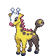

[Frames elegidos](../pokemon/girafarig/anim_frontf_selected.png) · [Todas las poses](../pokemon/girafarig/anim_frontf_source.png)

female.back · 64×64 · tira original [0, 0, 0] · timing: shared_species_timing

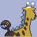

[Frames elegidos](../pokemon/girafarig/backf_selected.png) · [Todas las poses](../pokemon/girafarig/backf_source.png)

[Índice](../GALLERY.md) · [Anterior](page_08.md) · [Siguiente](page_10.md)
