# Galería / página 10

[Índice](../GALLERY.md) · [Anterior](page_09.md) · [Siguiente](page_11.md)

## GLIGAR

default.front · 96×96 · APNG [7, 0, 4, 21, 32] · timing: source_timeline

[Frames elegidos](../pokemon/gligar/anim_front_selected.png) · [Todas las poses](../pokemon/gligar/anim_front_source.png)

default.back · 80×80 · APNG [1, 0, 2] · timing: source_idle_cycle

[Frames elegidos](../pokemon/gligar/back_selected.png) · [Todas las poses](../pokemon/gligar/back_source.png)

female.front · 80×80 · tira original [0, 1, 0, 2, 3] · timing: shared_species_timing

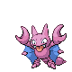

[Frames elegidos](../pokemon/gligar/anim_frontf_selected.png) · [Todas las poses](../pokemon/gligar/anim_frontf_source.png)

female.back · 64×64 · tira original [0, 0, 0] · timing: shared_species_timing

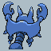

[Frames elegidos](../pokemon/gligar/backf_selected.png) · [Todas las poses](../pokemon/gligar/backf_source.png)

## GLISCOR

default.front · 96×96 · APNG [0, 6, 17, 3, 19] · timing: synthetic_special_cadence

[Frames elegidos](../pokemon/gliscor/anim_front_selected.png) · [Todas las poses](../pokemon/gliscor/anim_front_source.png)

default.back · 96×96 · APNG [0, 6, 17] · timing: source_idle_cycle

[Frames elegidos](../pokemon/gliscor/back_selected.png) · [Todas las poses](../pokemon/gliscor/back_source.png)

## SNUBBULL

default.front · 64×64 · APNG [0, 10, 7, 51, 56] · timing: source_timeline

[Frames elegidos](../pokemon/snubbull/anim_front_selected.png) · [Todas las poses](../pokemon/snubbull/anim_front_source.png)

default.back · 64×64 · APNG [0, 9, 4] · timing: source_idle_cycle

[Frames elegidos](../pokemon/snubbull/back_selected.png) · [Todas las poses](../pokemon/snubbull/back_source.png)

## GRANBULL

default.front · 64×64 · APNG [0, 21, 11, 18, 25] · timing: synthetic_special_cadence

[Frames elegidos](../pokemon/granbull/anim_front_selected.png) · [Todas las poses](../pokemon/granbull/anim_front_source.png)

default.back · 64×64 · APNG [0, 22, 12] · timing: source_idle_cycle

[Frames elegidos](../pokemon/granbull/back_selected.png) · [Todas las poses](../pokemon/granbull/back_source.png)

## HERACROSS

default.front · 80×80 · APNG [14, 11, 1, 56, 59] · timing: source_timeline

[Frames elegidos](../pokemon/heracross/anim_front_selected.png) · [Todas las poses](../pokemon/heracross/anim_front_source.png)

default.back · 80×80 · APNG [14, 9, 1] · timing: source_idle_cycle

[Frames elegidos](../pokemon/heracross/back_selected.png) · [Todas las poses](../pokemon/heracross/back_source.png)

female.front · 80×80 · tira original [0, 1, 0, 2, 3] · timing: shared_species_timing

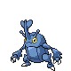

[Frames elegidos](../pokemon/heracross/anim_frontf_selected.png) · [Todas las poses](../pokemon/heracross/anim_frontf_source.png)

female.back · 64×64 · tira original [0, 0, 0] · timing: shared_species_timing

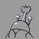

[Frames elegidos](../pokemon/heracross/backf_selected.png) · [Todas las poses](../pokemon/heracross/backf_source.png)

## SNEASEL

default.front · 64×64 · APNG [0, 6, 12, 53, 57] · timing: source_timeline

[Frames elegidos](../pokemon/sneasel/anim_front_selected.png) · [Todas las poses](../pokemon/sneasel/anim_front_source.png)

default.back · 64×64 · APNG [0, 5, 11] · timing: source_idle_cycle

[Frames elegidos](../pokemon/sneasel/back_selected.png) · [Todas las poses](../pokemon/sneasel/back_source.png)

female.front · 64×64 · tira original [0, 1, 0, 2, 3] · timing: shared_species_timing

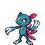

[Frames elegidos](../pokemon/sneasel/anim_frontf_selected.png) · [Todas las poses](../pokemon/sneasel/anim_frontf_source.png)

female.back · 64×64 · tira original [0, 0, 0] · timing: shared_species_timing

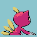

[Frames elegidos](../pokemon/sneasel/backf_selected.png) · [Todas las poses](../pokemon/sneasel/backf_source.png)

## WEAVILE

default.front · 96×96 · APNG [7, 0, 5, 40, 43] · timing: source_timeline

[Frames elegidos](../pokemon/weavile/anim_front_selected.png) · [Todas las poses](../pokemon/weavile/anim_front_source.png)

default.back · 64×64 · APNG [2, 0, 5] · timing: source_idle_cycle

[Frames elegidos](../pokemon/weavile/back_selected.png) · [Todas las poses](../pokemon/weavile/back_source.png)

female.front · 96×96 · tira original [0, 1, 0, 2, 3] · timing: shared_species_timing

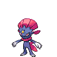

[Frames elegidos](../pokemon/weavile/anim_frontf_selected.png) · [Todas las poses](../pokemon/weavile/anim_frontf_source.png)

female.back · 64×64 · tira original [0, 0, 0] · timing: shared_species_timing

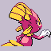

[Frames elegidos](../pokemon/weavile/backf_selected.png) · [Todas las poses](../pokemon/weavile/backf_source.png)

## SNEASLER

default.front · 64×64 · tira original [0, 0, 0, 0, 0] · timing: legacy_estimated

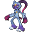

[Frames elegidos](../pokemon/sneasler/anim_front_selected.png) · [Todas las poses](../pokemon/sneasler/anim_front_source.png)

default.back · 64×64 · tira original [0, 0, 0] · timing: legacy_estimated

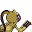

[Frames elegidos](../pokemon/sneasler/back_selected.png) · [Todas las poses](../pokemon/sneasler/back_source.png)

## TEDDIURSA

default.front · 64×64 · APNG [2, 0, 4, 40, 42] · timing: source_timeline

[Frames elegidos](../pokemon/teddiursa/anim_front_selected.png) · [Todas las poses](../pokemon/teddiursa/anim_front_source.png)

default.back · 64×64 · APNG [3, 0, 5] · timing: source_idle_cycle

[Frames elegidos](../pokemon/teddiursa/back_selected.png) · [Todas las poses](../pokemon/teddiursa/back_source.png)

## URSARING

default.front · 96×96 · APNG [0, 18, 6, 97, 107] · timing: source_timeline

[Frames elegidos](../pokemon/ursaring/anim_front_selected.png) · [Todas las poses](../pokemon/ursaring/anim_front_source.png)

default.back · 80×80 · APNG [0, 18, 6] · timing: source_idle_cycle

[Frames elegidos](../pokemon/ursaring/back_selected.png) · [Todas las poses](../pokemon/ursaring/back_source.png)

female.front · 80×80 · tira original [0, 1, 0, 2, 3] · timing: shared_species_timing

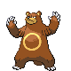

[Frames elegidos](../pokemon/ursaring/anim_frontf_selected.png) · [Todas las poses](../pokemon/ursaring/anim_frontf_source.png)

female.back · 64×64 · tira original [0, 0, 0] · timing: shared_species_timing

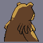

[Frames elegidos](../pokemon/ursaring/backf_selected.png) · [Todas las poses](../pokemon/ursaring/backf_source.png)

## SLUGMA

default.front · 64×64 · APNG [8, 6, 0, 15, 17] · timing: synthetic_special_cadence

[Frames elegidos](../pokemon/slugma/anim_front_selected.png) · [Todas las poses](../pokemon/slugma/anim_front_source.png)

default.back · 64×64 · APNG [13, 0, 6] · timing: source_idle_cycle

[Frames elegidos](../pokemon/slugma/back_selected.png) · [Todas las poses](../pokemon/slugma/back_source.png)

## MAGCARGO

default.front · 64×64 · APNG [12, 0, 6, 3, 9] · timing: synthetic_special_cadence

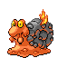

[Frames elegidos](../pokemon/magcargo/anim_front_selected.png) · [Todas las poses](../pokemon/magcargo/anim_front_source.png)

default.back · 64×64 · APNG [3, 0, 8] · timing: source_idle_cycle

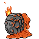

[Frames elegidos](../pokemon/magcargo/back_selected.png) · [Todas las poses](../pokemon/magcargo/back_source.png)

## SWINUB

default.front · 64×64 · APNG [6, 5, 1, 2, 3] · timing: synthetic_special_cadence

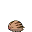

[Frames elegidos](../pokemon/swinub/anim_front_selected.png) · [Todas las poses](../pokemon/swinub/anim_front_source.png)

default.back · 64×64 · APNG [5, 4, 6] · timing: source_idle_cycle

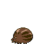

[Frames elegidos](../pokemon/swinub/back_selected.png) · [Todas las poses](../pokemon/swinub/back_source.png)

## PILOSWINE

default.front · 64×64 · APNG [0, 10, 4, 320, 322] · timing: source_timeline

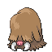

[Frames elegidos](../pokemon/piloswine/anim_front_selected.png) · [Todas las poses](../pokemon/piloswine/anim_front_source.png)

default.back · 64×64 · APNG [0, 8, 6] · timing: source_idle_cycle

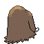

[Frames elegidos](../pokemon/piloswine/back_selected.png) · [Todas las poses](../pokemon/piloswine/back_source.png)

female.front · 64×64 · tira original [0, 1, 0, 2, 3] · timing: shared_species_timing

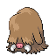

[Frames elegidos](../pokemon/piloswine/anim_frontf_selected.png) · [Todas las poses](../pokemon/piloswine/anim_frontf_source.png)

female.back · 64×64 · tira original [0, 0, 0] · timing: shared_species_timing

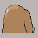

[Frames elegidos](../pokemon/piloswine/backf_selected.png) · [Todas las poses](../pokemon/piloswine/backf_source.png)

## MAMOSWINE

default.front · 96×96 · APNG [0, 7, 3, 49, 64] · timing: source_timeline

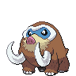

[Frames elegidos](../pokemon/mamoswine/anim_front_selected.png) · [Todas las poses](../pokemon/mamoswine/anim_front_source.png)

default.back · 80×80 · APNG [0, 7, 3] · timing: source_idle_cycle

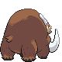

[Frames elegidos](../pokemon/mamoswine/back_selected.png) · [Todas las poses](../pokemon/mamoswine/back_source.png)

female.front · 96×96 · tira original [0, 1, 0, 2, 3] · timing: shared_species_timing

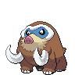

[Frames elegidos](../pokemon/mamoswine/anim_frontf_selected.png) · [Todas las poses](../pokemon/mamoswine/anim_frontf_source.png)

female.back · 80×80 · APNG [0, 7, 3] · timing: shared_species_timing

[Frames elegidos](../pokemon/mamoswine/backf_selected.png) · [Todas las poses](../pokemon/mamoswine/backf_source.png)

## OCTILLERY

default.front · 80×80 · APNG [0, 5, 3, 7, 11] · timing: source_timeline

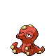

[Frames elegidos](../pokemon/octillery/anim_front_selected.png) · [Todas las poses](../pokemon/octillery/anim_front_source.png)

default.back · 80×80 · APNG [4, 0, 5] · timing: source_idle_cycle

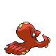

[Frames elegidos](../pokemon/octillery/back_selected.png) · [Todas las poses](../pokemon/octillery/back_source.png)

female.front · 64×64 · tira original [0, 1, 0, 2, 3] · timing: shared_species_timing

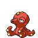

[Frames elegidos](../pokemon/octillery/anim_frontf_selected.png) · [Todas las poses](../pokemon/octillery/anim_frontf_source.png)

female.back · 80×80 · APNG [4, 0, 5] · timing: shared_species_timing

[Frames elegidos](../pokemon/octillery/backf_selected.png) · [Todas las poses](../pokemon/octillery/backf_source.png)

## DELIBIRD

default.front · 64×64 · APNG [5, 1, 8, 51, 52] · timing: source_timeline

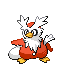

[Frames elegidos](../pokemon/delibird/anim_front_selected.png) · [Todas las poses](../pokemon/delibird/anim_front_source.png)

default.back · 64×64 · APNG [5, 2, 7] · timing: source_idle_cycle

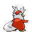

[Frames elegidos](../pokemon/delibird/back_selected.png) · [Todas las poses](../pokemon/delibird/back_source.png)

## HOUNDOUR

default.front · 64×64 · APNG [9, 0, 7, 71, 74] · timing: source_timeline

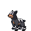

[Frames elegidos](../pokemon/houndour/anim_front_selected.png) · [Todas las poses](../pokemon/houndour/anim_front_source.png)

default.back · 64×64 · APNG [5, 0, 4] · timing: source_idle_cycle

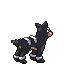

[Frames elegidos](../pokemon/houndour/back_selected.png) · [Todas las poses](../pokemon/houndour/back_source.png)

## HOUNDOOM

default.front · 80×80 · APNG [6, 0, 4, 51, 56] · timing: source_timeline

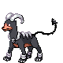

[Frames elegidos](../pokemon/houndoom/anim_front_selected.png) · [Todas las poses](../pokemon/houndoom/anim_front_source.png)

default.back · 80×80 · APNG [6, 0, 4] · timing: source_idle_cycle

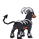

[Frames elegidos](../pokemon/houndoom/back_selected.png) · [Todas las poses](../pokemon/houndoom/back_source.png)

female.front · 80×80 · tira original [0, 1, 0, 2, 3] · timing: shared_species_timing

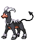

[Frames elegidos](../pokemon/houndoom/anim_frontf_selected.png) · [Todas las poses](../pokemon/houndoom/anim_frontf_source.png)

female.back · 64×64 · tira original [0, 0, 0] · timing: shared_species_timing

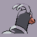

[Frames elegidos](../pokemon/houndoom/backf_selected.png) · [Todas las poses](../pokemon/houndoom/backf_source.png)

## PHANPY

default.front · 64×64 · APNG [0, 9, 3, 48, 52] · timing: source_timeline

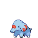

[Frames elegidos](../pokemon/phanpy/anim_front_selected.png) · [Todas las poses](../pokemon/phanpy/anim_front_source.png)

default.back · 64×64 · APNG [0, 3, 10] · timing: source_idle_cycle

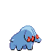

[Frames elegidos](../pokemon/phanpy/back_selected.png) · [Todas las poses](../pokemon/phanpy/back_source.png)

## DONPHAN

default.front · 96×96 · APNG [0, 12, 2, 50, 52] · timing: source_timeline

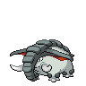

[Frames elegidos](../pokemon/donphan/anim_front_selected.png) · [Todas las poses](../pokemon/donphan/anim_front_source.png)

default.back · 96×96 · APNG [10, 12, 0] · timing: source_idle_cycle

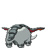

[Frames elegidos](../pokemon/donphan/back_selected.png) · [Todas las poses](../pokemon/donphan/back_source.png)

female.front · 80×80 · tira original [0, 1, 0, 2, 3] · timing: shared_species_timing

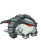

[Frames elegidos](../pokemon/donphan/anim_frontf_selected.png) · [Todas las poses](../pokemon/donphan/anim_frontf_source.png)

female.back · 64×64 · tira original [0, 0, 0] · timing: shared_species_timing

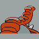

[Frames elegidos](../pokemon/donphan/backf_selected.png) · [Todas las poses](../pokemon/donphan/backf_source.png)

## STANTLER

default.front · 80×80 · APNG [2, 0, 5, 36, 38] · timing: source_timeline

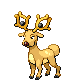

[Frames elegidos](../pokemon/stantler/anim_front_selected.png) · [Todas las poses](../pokemon/stantler/anim_front_source.png)

default.back · 80×80 · APNG [2, 0, 5] · timing: source_idle_cycle

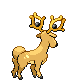

[Frames elegidos](../pokemon/stantler/back_selected.png) · [Todas las poses](../pokemon/stantler/back_source.png)

## WYRDEER

default.front · 64×64 · tira original [0, 0, 0, 0, 0] · timing: legacy_estimated

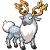

[Frames elegidos](../pokemon/wyrdeer/anim_front_selected.png) · [Todas las poses](../pokemon/wyrdeer/anim_front_source.png)

default.back · 64×64 · tira original [0, 0, 0] · timing: legacy_estimated

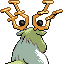

[Frames elegidos](../pokemon/wyrdeer/back_selected.png) · [Todas las poses](../pokemon/wyrdeer/back_source.png)

## RAIKOU

default.front · 96×96 · APNG [6, 4, 8, 38, 46] · timing: source_timeline

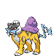

[Frames elegidos](../pokemon/raikou/anim_front_selected.png) · [Todas las poses](../pokemon/raikou/anim_front_source.png)

default.back · 96×96 · APNG [2, 0, 4] · timing: source_idle_cycle

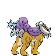

[Frames elegidos](../pokemon/raikou/back_selected.png) · [Todas las poses](../pokemon/raikou/back_source.png)

## ENTEI

default.front · 80×80 · APNG [6, 0, 4, 47, 50] · timing: source_timeline

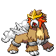

[Frames elegidos](../pokemon/entei/anim_front_selected.png) · [Todas las poses](../pokemon/entei/anim_front_source.png)

default.back · 96×96 · APNG [5, 3, 0] · timing: source_idle_cycle

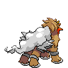

[Frames elegidos](../pokemon/entei/back_selected.png) · [Todas las poses](../pokemon/entei/back_source.png)

[Índice](../GALLERY.md) · [Anterior](page_09.md) · [Siguiente](page_11.md)
