# Galería / página 11

[Índice](../GALLERY.md) · [Anterior](page_10.md) · [Siguiente](page_12.md)

## SUICUNE

default.front · 80×80 · APNG [8, 1, 10, 22, 27] · timing: source_timeline

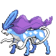

[Frames elegidos](../pokemon/suicune/anim_front_selected.png) · [Todas las poses](../pokemon/suicune/anim_front_source.png)

default.back · 96×96 · APNG [8, 1, 10] · timing: source_idle_cycle

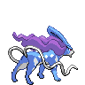

[Frames elegidos](../pokemon/suicune/back_selected.png) · [Todas las poses](../pokemon/suicune/back_source.png)

## LARVITAR

default.front · 64×64 · APNG [1, 0, 2, 28, 32] · timing: source_timeline

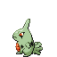

[Frames elegidos](../pokemon/larvitar/anim_front_selected.png) · [Todas las poses](../pokemon/larvitar/anim_front_source.png)

default.back · 64×64 · APNG [5, 0, 6] · timing: source_idle_cycle

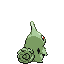

[Frames elegidos](../pokemon/larvitar/back_selected.png) · [Todas las poses](../pokemon/larvitar/back_source.png)

## PUPITAR

default.front · 64×64 · APNG [0, 4, 12, 17, 18] · timing: source_timeline

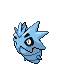

[Frames elegidos](../pokemon/pupitar/anim_front_selected.png) · [Todas las poses](../pokemon/pupitar/anim_front_source.png)

default.back · 64×64 · APNG [0, 12, 4] · timing: source_idle_cycle

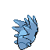

[Frames elegidos](../pokemon/pupitar/back_selected.png) · [Todas las poses](../pokemon/pupitar/back_source.png)

## TYRANITAR

default.front · 96×96 · APNG [13, 9, 15, 5, 27] · timing: synthetic_special_cadence

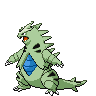

[Frames elegidos](../pokemon/tyranitar/anim_front_selected.png) · [Todas las poses](../pokemon/tyranitar/anim_front_source.png)

default.back · 80×80 · APNG [18, 0, 15] · timing: source_idle_cycle

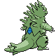

[Frames elegidos](../pokemon/tyranitar/back_selected.png) · [Todas las poses](../pokemon/tyranitar/back_source.png)

## LUGIA

default.front · 153×153 · APNG [0, 12, 6, 54, 58] · timing: source_timeline

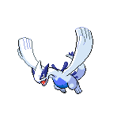

[Frames elegidos](../pokemon/lugia/anim_front_selected.png) · [Todas las poses](../pokemon/lugia/anim_front_source.png)

default.back · 153×153 · APNG [0, 12, 5] · timing: source_idle_cycle

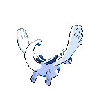

[Frames elegidos](../pokemon/lugia/back_selected.png) · [Todas las poses](../pokemon/lugia/back_source.png)

## HO_OH

default.front · 108×108 · APNG [2, 13, 4, 33, 34] · timing: source_timeline

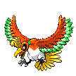

[Frames elegidos](../pokemon/ho_oh/anim_front_selected.png) · [Todas las poses](../pokemon/ho_oh/anim_front_source.png)

default.back · 96×96 · APNG [0, 6, 4] · timing: source_idle_cycle

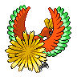

[Frames elegidos](../pokemon/ho_oh/back_selected.png) · [Todas las poses](../pokemon/ho_oh/back_source.png)

## CELEBI

default.front · 64×64 · APNG [36, 21, 0, 118, 150] · timing: source_timeline

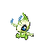

[Frames elegidos](../pokemon/celebi/anim_front_selected.png) · [Todas las poses](../pokemon/celebi/anim_front_source.png)

default.back · 64×64 · APNG [36, 21, 0] · timing: source_idle_cycle

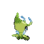

[Frames elegidos](../pokemon/celebi/back_selected.png) · [Todas las poses](../pokemon/celebi/back_source.png)

## TREECKO

default.front · 64×64 · APNG [2, 0, 3, 67, 70] · timing: source_timeline

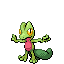

[Frames elegidos](../pokemon/treecko/anim_front_selected.png) · [Todas las poses](../pokemon/treecko/anim_front_source.png)

default.back · 64×64 · APNG [5, 0, 4] · timing: source_idle_cycle

[Frames elegidos](../pokemon/treecko/back_selected.png) · [Todas las poses](../pokemon/treecko/back_source.png)

## GROVYLE

default.front · 80×80 · APNG [0, 9, 4, 39, 48] · timing: source_timeline

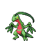

[Frames elegidos](../pokemon/grovyle/anim_front_selected.png) · [Todas las poses](../pokemon/grovyle/anim_front_source.png)

default.back · 80×80 · APNG [14, 10, 8] · timing: source_idle_cycle

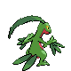

[Frames elegidos](../pokemon/grovyle/back_selected.png) · [Todas las poses](../pokemon/grovyle/back_source.png)

## SCEPTILE

default.front · 80×80 · APNG [0, 5, 2, 35, 38] · timing: source_timeline

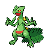

[Frames elegidos](../pokemon/sceptile/anim_front_selected.png) · [Todas las poses](../pokemon/sceptile/anim_front_source.png)

default.back · 80×80 · APNG [0, 5, 2] · timing: source_idle_cycle

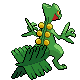

[Frames elegidos](../pokemon/sceptile/back_selected.png) · [Todas las poses](../pokemon/sceptile/back_source.png)

## TORCHIC

default.front · 64×64 · APNG [0, 5, 15, 42, 47] · timing: source_timeline

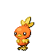

[Frames elegidos](../pokemon/torchic/anim_front_selected.png) · [Todas las poses](../pokemon/torchic/anim_front_source.png)

default.back · 64×64 · APNG [0, 15, 5] · timing: source_idle_cycle

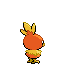

[Frames elegidos](../pokemon/torchic/back_selected.png) · [Todas las poses](../pokemon/torchic/back_source.png)

female.front · 64×64 · tira original [0, 1, 0, 2, 3] · timing: shared_species_timing

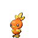

[Frames elegidos](../pokemon/torchic/anim_frontf_selected.png) · [Todas las poses](../pokemon/torchic/anim_frontf_source.png)

female.back · 64×64 · tira original [0, 0, 0] · timing: shared_species_timing

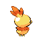

[Frames elegidos](../pokemon/torchic/backf_selected.png) · [Todas las poses](../pokemon/torchic/backf_source.png)

## COMBUSKEN

default.front · 80×80 · APNG [2, 0, 4, 17, 20] · timing: source_timeline

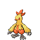

[Frames elegidos](../pokemon/combusken/anim_front_selected.png) · [Todas las poses](../pokemon/combusken/anim_front_source.png)

default.back · 80×80 · APNG [2, 0, 4] · timing: source_idle_cycle

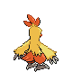

[Frames elegidos](../pokemon/combusken/back_selected.png) · [Todas las poses](../pokemon/combusken/back_source.png)

female.front · 80×80 · tira original [0, 1, 0, 2, 3] · timing: shared_species_timing

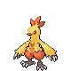

[Frames elegidos](../pokemon/combusken/anim_frontf_selected.png) · [Todas las poses](../pokemon/combusken/anim_frontf_source.png)

female.back · 64×64 · tira original [0, 0, 0] · timing: shared_species_timing

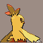

[Frames elegidos](../pokemon/combusken/backf_selected.png) · [Todas las poses](../pokemon/combusken/backf_source.png)

## BLAZIKEN

default.front · 80×80 · APNG [0, 3, 8, 36, 40] · timing: source_timeline

[Frames elegidos](../pokemon/blaziken/anim_front_selected.png) · [Todas las poses](../pokemon/blaziken/anim_front_source.png)

default.back · 80×80 · APNG [0, 4, 8] · timing: source_idle_cycle

[Frames elegidos](../pokemon/blaziken/back_selected.png) · [Todas las poses](../pokemon/blaziken/back_source.png)

female.front · 64×64 · tira original [0, 1, 0, 1, 1] · timing: shared_species_timing

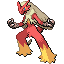

[Frames elegidos](../pokemon/blaziken/anim_frontf_selected.png) · [Todas las poses](../pokemon/blaziken/anim_frontf_source.png)

female.back · 64×64 · tira original [0, 0, 0] · timing: shared_species_timing

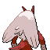

[Frames elegidos](../pokemon/blaziken/backf_selected.png) · [Todas las poses](../pokemon/blaziken/backf_source.png)

## MUDKIP

default.front · 64×64 · APNG [0, 5, 15, 40, 41] · timing: source_timeline

[Frames elegidos](../pokemon/mudkip/anim_front_selected.png) · [Todas las poses](../pokemon/mudkip/anim_front_source.png)

default.back · 64×64 · APNG [6, 5, 15] · timing: source_idle_cycle

[Frames elegidos](../pokemon/mudkip/back_selected.png) · [Todas las poses](../pokemon/mudkip/back_source.png)

## MARSHTOMP

default.front · 64×64 · APNG [0, 9, 5, 26, 50] · timing: source_timeline

[Frames elegidos](../pokemon/marshtomp/anim_front_selected.png) · [Todas las poses](../pokemon/marshtomp/anim_front_source.png)

default.back · 64×64 · APNG [0, 8, 4] · timing: source_idle_cycle

[Frames elegidos](../pokemon/marshtomp/back_selected.png) · [Todas las poses](../pokemon/marshtomp/back_source.png)

## SWAMPERT

default.front · 80×80 · APNG [10, 6, 12, 28, 32] · timing: source_timeline

[Frames elegidos](../pokemon/swampert/anim_front_selected.png) · [Todas las poses](../pokemon/swampert/anim_front_source.png)

default.back · 80×80 · APNG [8, 12, 2] · timing: source_idle_cycle

[Frames elegidos](../pokemon/swampert/back_selected.png) · [Todas las poses](../pokemon/swampert/back_source.png)

## POOCHYENA

default.front · 64×64 · APNG [15, 1, 8, 49, 52] · timing: source_timeline

[Frames elegidos](../pokemon/poochyena/anim_front_selected.png) · [Todas las poses](../pokemon/poochyena/anim_front_source.png)

default.back · 64×64 · APNG [12, 0, 8] · timing: source_idle_cycle

[Frames elegidos](../pokemon/poochyena/back_selected.png) · [Todas las poses](../pokemon/poochyena/back_source.png)

## MIGHTYENA

default.front · 80×80 · APNG [4, 0, 8, 51, 56] · timing: source_timeline

[Frames elegidos](../pokemon/mightyena/anim_front_selected.png) · [Todas las poses](../pokemon/mightyena/anim_front_source.png)

default.back · 80×80 · APNG [4, 0, 8] · timing: source_idle_cycle

[Frames elegidos](../pokemon/mightyena/back_selected.png) · [Todas las poses](../pokemon/mightyena/back_source.png)

## WURMPLE

default.front · 64×64 · APNG [3, 2, 6, 27, 32] · timing: source_timeline

[Frames elegidos](../pokemon/wurmple/anim_front_selected.png) · [Todas las poses](../pokemon/wurmple/anim_front_source.png)

default.back · 64×64 · APNG [1, 4, 0] · timing: source_idle_cycle

[Frames elegidos](../pokemon/wurmple/back_selected.png) · [Todas las poses](../pokemon/wurmple/back_source.png)

## SILCOON

default.front · 64×64 · APNG [1, 0, 2, 37, 39] · timing: source_timeline

[Frames elegidos](../pokemon/silcoon/anim_front_selected.png) · [Todas las poses](../pokemon/silcoon/anim_front_source.png)

default.back · 64×64 · APNG [1, 0, 2] · timing: source_idle_cycle

[Frames elegidos](../pokemon/silcoon/back_selected.png) · [Todas las poses](../pokemon/silcoon/back_source.png)

## BEAUTIFLY

default.front · 80×80 · APNG [19, 16, 0, 78, 90] · timing: source_timeline

[Frames elegidos](../pokemon/beautifly/anim_front_selected.png) · [Todas las poses](../pokemon/beautifly/anim_front_source.png)

default.back · 64×64 · APNG [13, 16, 0] · timing: source_idle_cycle

[Frames elegidos](../pokemon/beautifly/back_selected.png) · [Todas las poses](../pokemon/beautifly/back_source.png)

female.front · 80×80 · tira original [0, 1, 0, 2, 3] · timing: shared_species_timing

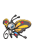

[Frames elegidos](../pokemon/beautifly/anim_frontf_selected.png) · [Todas las poses](../pokemon/beautifly/anim_frontf_source.png)

female.back · 64×64 · tira original [0, 0, 0] · timing: shared_species_timing

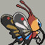

[Frames elegidos](../pokemon/beautifly/backf_selected.png) · [Todas las poses](../pokemon/beautifly/backf_source.png)

## CASCOON

default.front · 64×64 · APNG [2, 0, 4, 25, 26] · timing: source_timeline

[Frames elegidos](../pokemon/cascoon/anim_front_selected.png) · [Todas las poses](../pokemon/cascoon/anim_front_source.png)

default.back · 64×64 · APNG [2, 0, 6] · timing: source_idle_cycle

[Frames elegidos](../pokemon/cascoon/back_selected.png) · [Todas las poses](../pokemon/cascoon/back_source.png)

## DUSTOX

default.front · 80×80 · APNG [23, 19, 0, 81, 93] · timing: source_timeline

[Frames elegidos](../pokemon/dustox/anim_front_selected.png) · [Todas las poses](../pokemon/dustox/anim_front_source.png)

default.back · 64×64 · APNG [4, 5, 0] · timing: source_idle_cycle

[Frames elegidos](../pokemon/dustox/back_selected.png) · [Todas las poses](../pokemon/dustox/back_source.png)

female.front · 80×80 · tira original [0, 1, 0, 2, 3] · timing: shared_species_timing

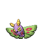

[Frames elegidos](../pokemon/dustox/anim_frontf_selected.png) · [Todas las poses](../pokemon/dustox/anim_frontf_source.png)

female.back · 64×64 · tira original [0, 0, 0] · timing: shared_species_timing

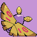

[Frames elegidos](../pokemon/dustox/backf_selected.png) · [Todas las poses](../pokemon/dustox/backf_source.png)

## LOTAD

default.front · 64×64 · APNG [2, 7, 16, 35, 50] · timing: source_timeline

[Frames elegidos](../pokemon/lotad/anim_front_selected.png) · [Todas las poses](../pokemon/lotad/anim_front_source.png)

default.back · 64×64 · APNG [0, 7, 14] · timing: source_idle_cycle

[Frames elegidos](../pokemon/lotad/back_selected.png) · [Todas las poses](../pokemon/lotad/back_source.png)

## LOMBRE

default.front · 64×64 · APNG [0, 2, 5, 34, 38] · timing: source_timeline

[Frames elegidos](../pokemon/lombre/anim_front_selected.png) · [Todas las poses](../pokemon/lombre/anim_front_source.png)

default.back · 64×64 · APNG [0, 2, 5] · timing: source_idle_cycle

[Frames elegidos](../pokemon/lombre/back_selected.png) · [Todas las poses](../pokemon/lombre/back_source.png)

[Índice](../GALLERY.md) · [Anterior](page_10.md) · [Siguiente](page_12.md)
