# Galería / página 11

[Índice](../GALLERY.md) · [Anterior](page_10.md) · [Siguiente](page_12.md)

## BLAZIKEN

default.front · 80×80 · APNG [0, 3, 8, 36, 40]

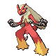

[Frames elegidos](../pokemon/blaziken/anim_front_selected.png) · [Todas las poses](../pokemon/blaziken/anim_front_source.png)

default.back · 80×80 · APNG [0, 4, 8]

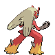

[Frames elegidos](../pokemon/blaziken/back_selected.png) · [Todas las poses](../pokemon/blaziken/back_source.png)

## MUDKIP

default.front · 64×64 · APNG [0, 5, 15, 40, 41]

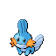

[Frames elegidos](../pokemon/mudkip/anim_front_selected.png) · [Todas las poses](../pokemon/mudkip/anim_front_source.png)

default.back · 64×64 · APNG [6, 5, 15]

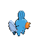

[Frames elegidos](../pokemon/mudkip/back_selected.png) · [Todas las poses](../pokemon/mudkip/back_source.png)

## MARSHTOMP

default.front · 64×64 · APNG [0, 9, 5, 26, 50]

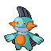

[Frames elegidos](../pokemon/marshtomp/anim_front_selected.png) · [Todas las poses](../pokemon/marshtomp/anim_front_source.png)

default.back · 64×64 · APNG [0, 8, 4]

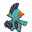

[Frames elegidos](../pokemon/marshtomp/back_selected.png) · [Todas las poses](../pokemon/marshtomp/back_source.png)

## SWAMPERT

default.front · 80×80 · APNG [10, 6, 12, 28, 32]

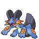

[Frames elegidos](../pokemon/swampert/anim_front_selected.png) · [Todas las poses](../pokemon/swampert/anim_front_source.png)

default.back · 80×80 · APNG [8, 12, 2]

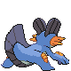

[Frames elegidos](../pokemon/swampert/back_selected.png) · [Todas las poses](../pokemon/swampert/back_source.png)

## POOCHYENA

default.front · 64×64 · APNG [15, 1, 8, 49, 52]

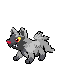

[Frames elegidos](../pokemon/poochyena/anim_front_selected.png) · [Todas las poses](../pokemon/poochyena/anim_front_source.png)

default.back · 64×64 · APNG [12, 0, 8]

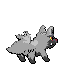

[Frames elegidos](../pokemon/poochyena/back_selected.png) · [Todas las poses](../pokemon/poochyena/back_source.png)

## MIGHTYENA

default.front · 80×80 · APNG [4, 0, 8, 51, 56]

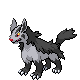

[Frames elegidos](../pokemon/mightyena/anim_front_selected.png) · [Todas las poses](../pokemon/mightyena/anim_front_source.png)

default.back · 80×80 · APNG [4, 0, 8]

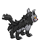

[Frames elegidos](../pokemon/mightyena/back_selected.png) · [Todas las poses](../pokemon/mightyena/back_source.png)

## WURMPLE

default.front · 64×64 · APNG [3, 2, 6, 27, 32]

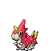

[Frames elegidos](../pokemon/wurmple/anim_front_selected.png) · [Todas las poses](../pokemon/wurmple/anim_front_source.png)

default.back · 64×64 · APNG [1, 4, 0]

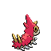

[Frames elegidos](../pokemon/wurmple/back_selected.png) · [Todas las poses](../pokemon/wurmple/back_source.png)

## SILCOON

default.front · 64×64 · APNG [1, 0, 2, 37, 39]

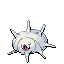

[Frames elegidos](../pokemon/silcoon/anim_front_selected.png) · [Todas las poses](../pokemon/silcoon/anim_front_source.png)

default.back · 64×64 · APNG [1, 0, 2]

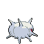

[Frames elegidos](../pokemon/silcoon/back_selected.png) · [Todas las poses](../pokemon/silcoon/back_source.png)

## BEAUTIFLY

default.front · 80×80 · APNG [19, 16, 0, 78, 90]

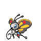

[Frames elegidos](../pokemon/beautifly/anim_front_selected.png) · [Todas las poses](../pokemon/beautifly/anim_front_source.png)

default.back · 64×64 · APNG [13, 16, 0]

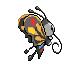

[Frames elegidos](../pokemon/beautifly/back_selected.png) · [Todas las poses](../pokemon/beautifly/back_source.png)

## CASCOON

default.front · 64×64 · APNG [2, 0, 4, 25, 26]

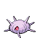

[Frames elegidos](../pokemon/cascoon/anim_front_selected.png) · [Todas las poses](../pokemon/cascoon/anim_front_source.png)

default.back · 64×64 · APNG [2, 0, 6]

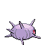

[Frames elegidos](../pokemon/cascoon/back_selected.png) · [Todas las poses](../pokemon/cascoon/back_source.png)

## DUSTOX

default.front · 80×80 · APNG [23, 19, 0, 81, 93]

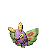

[Frames elegidos](../pokemon/dustox/anim_front_selected.png) · [Todas las poses](../pokemon/dustox/anim_front_source.png)

default.back · 64×64 · APNG [4, 5, 0]

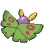

[Frames elegidos](../pokemon/dustox/back_selected.png) · [Todas las poses](../pokemon/dustox/back_source.png)

## LOTAD

default.front · 64×64 · APNG [2, 7, 16, 35, 50]

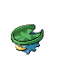

[Frames elegidos](../pokemon/lotad/anim_front_selected.png) · [Todas las poses](../pokemon/lotad/anim_front_source.png)

default.back · 64×64 · APNG [0, 7, 14]

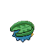

[Frames elegidos](../pokemon/lotad/back_selected.png) · [Todas las poses](../pokemon/lotad/back_source.png)

## LOMBRE

default.front · 64×64 · APNG [0, 2, 5, 34, 38]

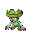

[Frames elegidos](../pokemon/lombre/anim_front_selected.png) · [Todas las poses](../pokemon/lombre/anim_front_source.png)

default.back · 64×64 · APNG [0, 2, 5]

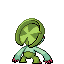

[Frames elegidos](../pokemon/lombre/back_selected.png) · [Todas las poses](../pokemon/lombre/back_source.png)

## LUDICOLO

default.front · 96×96 · APNG [0, 13, 5, 16, 17]

[Frames elegidos](../pokemon/ludicolo/anim_front_selected.png) · [Todas las poses](../pokemon/ludicolo/anim_front_source.png)

default.back · 80×80 · APNG [0, 14, 4]

[Frames elegidos](../pokemon/ludicolo/back_selected.png) · [Todas las poses](../pokemon/ludicolo/back_source.png)

## SEEDOT

default.front · 64×64 · APNG [0, 18, 7, 50, 63]

[Frames elegidos](../pokemon/seedot/anim_front_selected.png) · [Todas las poses](../pokemon/seedot/anim_front_source.png)

default.back · 64×64 · APNG [0, 17, 6]

[Frames elegidos](../pokemon/seedot/back_selected.png) · [Todas las poses](../pokemon/seedot/back_source.png)

## NUZLEAF

default.front · 64×64 · APNG [3, 7, 0, 9, 11]

[Frames elegidos](../pokemon/nuzleaf/anim_front_selected.png) · [Todas las poses](../pokemon/nuzleaf/anim_front_source.png)

default.back · 64×64 · APNG [3, 0, 7]

[Frames elegidos](../pokemon/nuzleaf/back_selected.png) · [Todas las poses](../pokemon/nuzleaf/back_source.png)

## SHIFTRY

default.front · 103×103 · APNG [0, 2, 5, 26, 29]

[Frames elegidos](../pokemon/shiftry/anim_front_selected.png) · [Todas las poses](../pokemon/shiftry/anim_front_source.png)

default.back · 96×96 · APNG [4, 5, 0]

[Frames elegidos](../pokemon/shiftry/back_selected.png) · [Todas las poses](../pokemon/shiftry/back_source.png)

## TAILLOW

default.front · 64×64 · APNG [0, 7, 5, 41, 44]

[Frames elegidos](../pokemon/taillow/anim_front_selected.png) · [Todas las poses](../pokemon/taillow/anim_front_source.png)

default.back · 64×64 · APNG [0, 5, 2]

[Frames elegidos](../pokemon/taillow/back_selected.png) · [Todas las poses](../pokemon/taillow/back_source.png)

## SWELLOW

default.front · 80×80 · APNG [0, 13, 9, 54, 57]

[Frames elegidos](../pokemon/swellow/anim_front_selected.png) · [Todas las poses](../pokemon/swellow/anim_front_source.png)

default.back · 80×80 · APNG [0, 9, 13]

[Frames elegidos](../pokemon/swellow/back_selected.png) · [Todas las poses](../pokemon/swellow/back_source.png)

## WINGULL

default.front · 64×64 · APNG [0, 15, 5, 42, 48]

[Frames elegidos](../pokemon/wingull/anim_front_selected.png) · [Todas las poses](../pokemon/wingull/anim_front_source.png)

default.back · 64×64 · APNG [0, 15, 5]

[Frames elegidos](../pokemon/wingull/back_selected.png) · [Todas las poses](../pokemon/wingull/back_source.png)

## PELIPPER

default.front · 96×96 · APNG [0, 4, 20, 11, 28]

[Frames elegidos](../pokemon/pelipper/anim_front_selected.png) · [Todas las poses](../pokemon/pelipper/anim_front_source.png)

default.back · 96×96 · APNG [0, 4, 19]

[Frames elegidos](../pokemon/pelipper/back_selected.png) · [Todas las poses](../pokemon/pelipper/back_source.png)

## RALTS

default.front · 64×64 · APNG [11, 12, 4, 7, 9]

[Frames elegidos](../pokemon/ralts/anim_front_selected.png) · [Todas las poses](../pokemon/ralts/anim_front_source.png)

default.back · 64×64 · APNG [11, 12, 7]

[Frames elegidos](../pokemon/ralts/back_selected.png) · [Todas las poses](../pokemon/ralts/back_source.png)

## KIRLIA

default.front · 64×64 · APNG [0, 6, 2, 29, 32]

[Frames elegidos](../pokemon/kirlia/anim_front_selected.png) · [Todas las poses](../pokemon/kirlia/anim_front_source.png)

default.back · 64×64 · APNG [0, 6, 2]

[Frames elegidos](../pokemon/kirlia/back_selected.png) · [Todas las poses](../pokemon/kirlia/back_source.png)

## GARDEVOIR

default.front · 80×80 · APNG [0, 21, 15, 136, 142]

[Frames elegidos](../pokemon/gardevoir/anim_front_selected.png) · [Todas las poses](../pokemon/gardevoir/anim_front_source.png)

default.back · 80×80 · APNG [0, 22, 16]

[Frames elegidos](../pokemon/gardevoir/back_selected.png) · [Todas las poses](../pokemon/gardevoir/back_source.png)

## GALLADE

default.front · 80×80 · APNG [3, 1, 5, 64, 67]

[Frames elegidos](../pokemon/gallade/anim_front_selected.png) · [Todas las poses](../pokemon/gallade/anim_front_source.png)

default.back · 80×80 · APNG [3, 1, 5]

[Frames elegidos](../pokemon/gallade/back_selected.png) · [Todas las poses](../pokemon/gallade/back_source.png)

[Índice](../GALLERY.md) · [Anterior](page_10.md) · [Siguiente](page_12.md)
