# Galería / página 12

[Índice](../GALLERY.md) · [Anterior](page_11.md) · [Siguiente](page_13.md)

## LUDICOLO

default.front · 96×96 · APNG [0, 13, 5, 16, 17] · timing: source_timeline

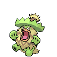

[Frames elegidos](../pokemon/ludicolo/anim_front_selected.png) · [Todas las poses](../pokemon/ludicolo/anim_front_source.png)

default.back · 80×80 · APNG [0, 14, 4] · timing: source_idle_cycle

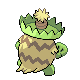

[Frames elegidos](../pokemon/ludicolo/back_selected.png) · [Todas las poses](../pokemon/ludicolo/back_source.png)

female.front · 80×80 · tira original [0, 1, 0, 2, 3] · timing: shared_species_timing

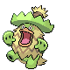

[Frames elegidos](../pokemon/ludicolo/anim_frontf_selected.png) · [Todas las poses](../pokemon/ludicolo/anim_frontf_source.png)

female.back · 64×64 · tira original [0, 0, 0] · timing: shared_species_timing

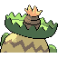

[Frames elegidos](../pokemon/ludicolo/backf_selected.png) · [Todas las poses](../pokemon/ludicolo/backf_source.png)

## SEEDOT

default.front · 64×64 · APNG [0, 18, 7, 50, 63] · timing: source_timeline

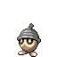

[Frames elegidos](../pokemon/seedot/anim_front_selected.png) · [Todas las poses](../pokemon/seedot/anim_front_source.png)

default.back · 64×64 · APNG [0, 17, 6] · timing: source_idle_cycle

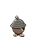

[Frames elegidos](../pokemon/seedot/back_selected.png) · [Todas las poses](../pokemon/seedot/back_source.png)

## NUZLEAF

default.front · 64×64 · APNG [3, 7, 0, 9, 11] · timing: synthetic_special_cadence

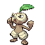

[Frames elegidos](../pokemon/nuzleaf/anim_front_selected.png) · [Todas las poses](../pokemon/nuzleaf/anim_front_source.png)

default.back · 64×64 · APNG [3, 0, 7] · timing: source_idle_cycle

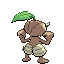

[Frames elegidos](../pokemon/nuzleaf/back_selected.png) · [Todas las poses](../pokemon/nuzleaf/back_source.png)

female.front · 64×64 · tira original [0, 1, 0, 2, 3] · timing: shared_species_timing

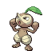

[Frames elegidos](../pokemon/nuzleaf/anim_frontf_selected.png) · [Todas las poses](../pokemon/nuzleaf/anim_frontf_source.png)

female.back · 64×64 · tira original [0, 0, 0] · timing: shared_species_timing

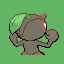

[Frames elegidos](../pokemon/nuzleaf/backf_selected.png) · [Todas las poses](../pokemon/nuzleaf/backf_source.png)

## SHIFTRY

default.front · 103×103 · APNG [0, 2, 5, 26, 29] · timing: source_timeline

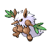

[Frames elegidos](../pokemon/shiftry/anim_front_selected.png) · [Todas las poses](../pokemon/shiftry/anim_front_source.png)

default.back · 96×96 · APNG [4, 5, 0] · timing: source_idle_cycle

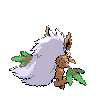

[Frames elegidos](../pokemon/shiftry/back_selected.png) · [Todas las poses](../pokemon/shiftry/back_source.png)

female.front · 64×64 · tira original [0, 1, 0, 1, 1] · timing: shared_species_timing

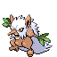

[Frames elegidos](../pokemon/shiftry/anim_frontf_selected.png) · [Todas las poses](../pokemon/shiftry/anim_frontf_source.png)

female.back · 64×64 · tira original [0, 0, 0] · timing: shared_species_timing

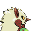

[Frames elegidos](../pokemon/shiftry/backf_selected.png) · [Todas las poses](../pokemon/shiftry/backf_source.png)

## TAILLOW

default.front · 64×64 · APNG [0, 7, 5, 41, 44] · timing: source_timeline

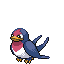

[Frames elegidos](../pokemon/taillow/anim_front_selected.png) · [Todas las poses](../pokemon/taillow/anim_front_source.png)

default.back · 64×64 · APNG [0, 5, 2] · timing: source_idle_cycle

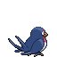

[Frames elegidos](../pokemon/taillow/back_selected.png) · [Todas las poses](../pokemon/taillow/back_source.png)

## SWELLOW

default.front · 80×80 · APNG [0, 13, 9, 54, 57] · timing: source_timeline

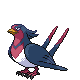

[Frames elegidos](../pokemon/swellow/anim_front_selected.png) · [Todas las poses](../pokemon/swellow/anim_front_source.png)

default.back · 80×80 · APNG [0, 9, 13] · timing: source_idle_cycle

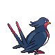

[Frames elegidos](../pokemon/swellow/back_selected.png) · [Todas las poses](../pokemon/swellow/back_source.png)

## WINGULL

default.front · 64×64 · APNG [0, 15, 5, 42, 48] · timing: source_timeline

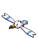

[Frames elegidos](../pokemon/wingull/anim_front_selected.png) · [Todas las poses](../pokemon/wingull/anim_front_source.png)

default.back · 64×64 · APNG [0, 15, 5] · timing: source_idle_cycle

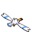

[Frames elegidos](../pokemon/wingull/back_selected.png) · [Todas las poses](../pokemon/wingull/back_source.png)

## PELIPPER

default.front · 96×96 · APNG [0, 4, 20, 11, 28] · timing: synthetic_special_cadence

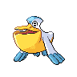

[Frames elegidos](../pokemon/pelipper/anim_front_selected.png) · [Todas las poses](../pokemon/pelipper/anim_front_source.png)

default.back · 96×96 · APNG [0, 4, 19] · timing: source_idle_cycle

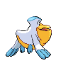

[Frames elegidos](../pokemon/pelipper/back_selected.png) · [Todas las poses](../pokemon/pelipper/back_source.png)

## RALTS

default.front · 64×64 · APNG [11, 12, 4, 7, 9] · timing: synthetic_special_cadence

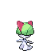

[Frames elegidos](../pokemon/ralts/anim_front_selected.png) · [Todas las poses](../pokemon/ralts/anim_front_source.png)

default.back · 64×64 · APNG [11, 12, 7] · timing: source_idle_cycle

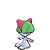

[Frames elegidos](../pokemon/ralts/back_selected.png) · [Todas las poses](../pokemon/ralts/back_source.png)

## KIRLIA

default.front · 64×64 · APNG [0, 6, 2, 29, 32] · timing: source_timeline

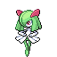

[Frames elegidos](../pokemon/kirlia/anim_front_selected.png) · [Todas las poses](../pokemon/kirlia/anim_front_source.png)

default.back · 64×64 · APNG [0, 6, 2] · timing: source_idle_cycle

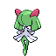

[Frames elegidos](../pokemon/kirlia/back_selected.png) · [Todas las poses](../pokemon/kirlia/back_source.png)

## GARDEVOIR

default.front · 80×80 · APNG [0, 21, 15, 136, 142] · timing: source_timeline

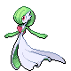

[Frames elegidos](../pokemon/gardevoir/anim_front_selected.png) · [Todas las poses](../pokemon/gardevoir/anim_front_source.png)

default.back · 80×80 · APNG [0, 22, 16] · timing: source_idle_cycle

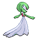

[Frames elegidos](../pokemon/gardevoir/back_selected.png) · [Todas las poses](../pokemon/gardevoir/back_source.png)

## GALLADE

default.front · 80×80 · APNG [3, 1, 5, 64, 67] · timing: source_timeline

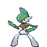

[Frames elegidos](../pokemon/gallade/anim_front_selected.png) · [Todas las poses](../pokemon/gallade/anim_front_source.png)

default.back · 80×80 · APNG [3, 1, 5] · timing: source_idle_cycle

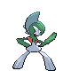

[Frames elegidos](../pokemon/gallade/back_selected.png) · [Todas las poses](../pokemon/gallade/back_source.png)

## SURSKIT

default.front · 80×80 · APNG [0, 22, 7, 54, 57] · timing: source_timeline

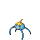

[Frames elegidos](../pokemon/surskit/anim_front_selected.png) · [Todas las poses](../pokemon/surskit/anim_front_source.png)

default.back · 80×80 · APNG [0, 20, 7] · timing: source_idle_cycle

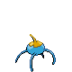

[Frames elegidos](../pokemon/surskit/back_selected.png) · [Todas las poses](../pokemon/surskit/back_source.png)

## MASQUERAIN

default.front · 80×80 · APNG [11, 63, 84, 132, 150] · timing: source_timeline

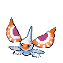

[Frames elegidos](../pokemon/masquerain/anim_front_selected.png) · [Todas las poses](../pokemon/masquerain/anim_front_source.png)

default.back · 64×64 · APNG [11, 63, 40] · timing: source_idle_cycle

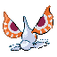

[Frames elegidos](../pokemon/masquerain/back_selected.png) · [Todas las poses](../pokemon/masquerain/back_source.png)

## SLAKOTH

default.front · 64×64 · APNG [4, 10, 0, 1, 3] · timing: synthetic_special_cadence

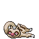

[Frames elegidos](../pokemon/slakoth/anim_front_selected.png) · [Todas las poses](../pokemon/slakoth/anim_front_source.png)

default.back · 64×64 · APNG [8, 7, 0] · timing: source_idle_cycle

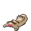

[Frames elegidos](../pokemon/slakoth/back_selected.png) · [Todas las poses](../pokemon/slakoth/back_source.png)

## VIGOROTH

default.front · 80×80 · APNG [3, 2, 0, 14, 22] · timing: source_timeline

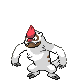

[Frames elegidos](../pokemon/vigoroth/anim_front_selected.png) · [Todas las poses](../pokemon/vigoroth/anim_front_source.png)

default.back · 80×80 · APNG [0, 23, 20] · timing: source_idle_cycle

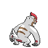

[Frames elegidos](../pokemon/vigoroth/back_selected.png) · [Todas las poses](../pokemon/vigoroth/back_source.png)

## SLAKING

default.front · 80×80 · APNG [14, 10, 3, 56, 57] · timing: source_timeline

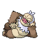

[Frames elegidos](../pokemon/slaking/anim_front_selected.png) · [Todas las poses](../pokemon/slaking/anim_front_source.png)

default.back · 80×80 · APNG [1, 4, 0] · timing: source_idle_cycle

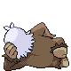

[Frames elegidos](../pokemon/slaking/back_selected.png) · [Todas las poses](../pokemon/slaking/back_source.png)

## NINCADA

default.front · 64×64 · APNG [5, 1, 4, 39, 42] · timing: source_timeline

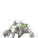

[Frames elegidos](../pokemon/nincada/anim_front_selected.png) · [Todas las poses](../pokemon/nincada/anim_front_source.png)

default.back · 64×64 · APNG [2, 0, 3] · timing: source_idle_cycle

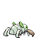

[Frames elegidos](../pokemon/nincada/back_selected.png) · [Todas las poses](../pokemon/nincada/back_source.png)

## NINJASK

default.front · 64×64 · APNG [12, 1, 24, 84, 86] · timing: source_timeline

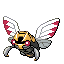

[Frames elegidos](../pokemon/ninjask/anim_front_selected.png) · [Todas las poses](../pokemon/ninjask/anim_front_source.png)

default.back · 64×64 · APNG [12, 1, 24] · timing: source_idle_cycle

[Frames elegidos](../pokemon/ninjask/back_selected.png) · [Todas las poses](../pokemon/ninjask/back_source.png)

## SHEDINJA

default.front · 64×64 · APNG [1, 0, 2, 3, 4] · timing: source_timeline

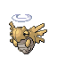

[Frames elegidos](../pokemon/shedinja/anim_front_selected.png) · [Todas las poses](../pokemon/shedinja/anim_front_source.png)

default.back · 64×64 · APNG [1, 0, 2] · timing: source_idle_cycle

[Frames elegidos](../pokemon/shedinja/back_selected.png) · [Todas las poses](../pokemon/shedinja/back_source.png)

## WHISMUR

default.front · 64×64 · APNG [1, 0, 2, 11, 12] · timing: source_timeline

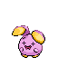

[Frames elegidos](../pokemon/whismur/anim_front_selected.png) · [Todas las poses](../pokemon/whismur/anim_front_source.png)

default.back · 64×64 · APNG [1, 0, 2] · timing: source_idle_cycle

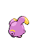

[Frames elegidos](../pokemon/whismur/back_selected.png) · [Todas las poses](../pokemon/whismur/back_source.png)

## LOUDRED

default.front · 64×64 · APNG [0, 7, 1, 31, 33] · timing: source_timeline

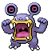

[Frames elegidos](../pokemon/loudred/anim_front_selected.png) · [Todas las poses](../pokemon/loudred/anim_front_source.png)

default.back · 64×64 · APNG [0, 7, 4] · timing: source_idle_cycle

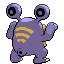

[Frames elegidos](../pokemon/loudred/back_selected.png) · [Todas las poses](../pokemon/loudred/back_source.png)

## EXPLOUD

default.front · 80×80 · APNG [6, 0, 3, 44, 53] · timing: source_timeline

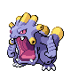

[Frames elegidos](../pokemon/exploud/anim_front_selected.png) · [Todas las poses](../pokemon/exploud/anim_front_source.png)

default.back · 80×80 · APNG [6, 0, 4] · timing: source_idle_cycle

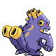

[Frames elegidos](../pokemon/exploud/back_selected.png) · [Todas las poses](../pokemon/exploud/back_source.png)

## MAKUHITA

default.front · 64×64 · APNG [0, 5, 15, 53, 56] · timing: source_timeline

[Frames elegidos](../pokemon/makuhita/anim_front_selected.png) · [Todas las poses](../pokemon/makuhita/anim_front_source.png)

default.back · 64×64 · APNG [0, 15, 5] · timing: source_idle_cycle

[Frames elegidos](../pokemon/makuhita/back_selected.png) · [Todas las poses](../pokemon/makuhita/back_source.png)

## HARIYAMA

default.front · 96×96 · APNG [3, 5, 0, 45, 60] · timing: source_timeline

[Frames elegidos](../pokemon/hariyama/anim_front_selected.png) · [Todas las poses](../pokemon/hariyama/anim_front_source.png)

default.back · 80×80 · APNG [0, 15, 5] · timing: source_idle_cycle

[Frames elegidos](../pokemon/hariyama/back_selected.png) · [Todas las poses](../pokemon/hariyama/back_source.png)

[Índice](../GALLERY.md) · [Anterior](page_11.md) · [Siguiente](page_13.md)
