# Galería / página 12

[Índice](../GALLERY.md) · [Anterior](page_11.md) · [Siguiente](page_13.md)

## SURSKIT

default.front · 80×80 · APNG [0, 22, 7, 54, 57]

[Frames elegidos](../pokemon/surskit/anim_front_selected.png) · [Todas las poses](../pokemon/surskit/anim_front_source.png)

default.back · 80×80 · APNG [0, 20, 7]

[Frames elegidos](../pokemon/surskit/back_selected.png) · [Todas las poses](../pokemon/surskit/back_source.png)

## MASQUERAIN

default.front · 80×80 · APNG [11, 63, 84, 132, 150]

[Frames elegidos](../pokemon/masquerain/anim_front_selected.png) · [Todas las poses](../pokemon/masquerain/anim_front_source.png)

default.back · 64×64 · APNG [11, 63, 40]

[Frames elegidos](../pokemon/masquerain/back_selected.png) · [Todas las poses](../pokemon/masquerain/back_source.png)

## SLAKOTH

default.front · 64×64 · APNG [4, 10, 0, 1, 3]

[Frames elegidos](../pokemon/slakoth/anim_front_selected.png) · [Todas las poses](../pokemon/slakoth/anim_front_source.png)

default.back · 64×64 · APNG [8, 7, 0]

[Frames elegidos](../pokemon/slakoth/back_selected.png) · [Todas las poses](../pokemon/slakoth/back_source.png)

## VIGOROTH

default.front · 80×80 · APNG [3, 2, 0, 14, 22]

[Frames elegidos](../pokemon/vigoroth/anim_front_selected.png) · [Todas las poses](../pokemon/vigoroth/anim_front_source.png)

default.back · 80×80 · APNG [0, 23, 20]

[Frames elegidos](../pokemon/vigoroth/back_selected.png) · [Todas las poses](../pokemon/vigoroth/back_source.png)

## SLAKING

default.front · 80×80 · APNG [14, 10, 3, 56, 57]

[Frames elegidos](../pokemon/slaking/anim_front_selected.png) · [Todas las poses](../pokemon/slaking/anim_front_source.png)

default.back · 80×80 · APNG [1, 4, 0]

[Frames elegidos](../pokemon/slaking/back_selected.png) · [Todas las poses](../pokemon/slaking/back_source.png)

## NINCADA

default.front · 64×64 · APNG [5, 1, 4, 39, 42]

[Frames elegidos](../pokemon/nincada/anim_front_selected.png) · [Todas las poses](../pokemon/nincada/anim_front_source.png)

default.back · 64×64 · APNG [2, 0, 3]

[Frames elegidos](../pokemon/nincada/back_selected.png) · [Todas las poses](../pokemon/nincada/back_source.png)

## NINJASK

default.front · 64×64 · APNG [12, 1, 24, 84, 86]

[Frames elegidos](../pokemon/ninjask/anim_front_selected.png) · [Todas las poses](../pokemon/ninjask/anim_front_source.png)

default.back · 64×64 · APNG [12, 1, 24]

[Frames elegidos](../pokemon/ninjask/back_selected.png) · [Todas las poses](../pokemon/ninjask/back_source.png)

## SHEDINJA

default.front · 64×64 · APNG [1, 0, 2, 3, 4]

[Frames elegidos](../pokemon/shedinja/anim_front_selected.png) · [Todas las poses](../pokemon/shedinja/anim_front_source.png)

default.back · 64×64 · APNG [1, 0, 2]

[Frames elegidos](../pokemon/shedinja/back_selected.png) · [Todas las poses](../pokemon/shedinja/back_source.png)

## WHISMUR

default.front · 64×64 · APNG [1, 0, 2, 11, 12]

[Frames elegidos](../pokemon/whismur/anim_front_selected.png) · [Todas las poses](../pokemon/whismur/anim_front_source.png)

default.back · 64×64 · APNG [1, 0, 2]

[Frames elegidos](../pokemon/whismur/back_selected.png) · [Todas las poses](../pokemon/whismur/back_source.png)

## LOUDRED

default.front · 64×64 · APNG [0, 7, 1, 31, 33]

[Frames elegidos](../pokemon/loudred/anim_front_selected.png) · [Todas las poses](../pokemon/loudred/anim_front_source.png)

default.back · 64×64 · APNG [0, 7, 4]

[Frames elegidos](../pokemon/loudred/back_selected.png) · [Todas las poses](../pokemon/loudred/back_source.png)

## EXPLOUD

default.front · 80×80 · APNG [6, 0, 3, 44, 53]

[Frames elegidos](../pokemon/exploud/anim_front_selected.png) · [Todas las poses](../pokemon/exploud/anim_front_source.png)

default.back · 80×80 · APNG [6, 0, 4]

[Frames elegidos](../pokemon/exploud/back_selected.png) · [Todas las poses](../pokemon/exploud/back_source.png)

## MAKUHITA

default.front · 64×64 · APNG [0, 5, 15, 53, 56]

[Frames elegidos](../pokemon/makuhita/anim_front_selected.png) · [Todas las poses](../pokemon/makuhita/anim_front_source.png)

default.back · 64×64 · APNG [0, 15, 5]

[Frames elegidos](../pokemon/makuhita/back_selected.png) · [Todas las poses](../pokemon/makuhita/back_source.png)

## HARIYAMA

default.front · 96×96 · APNG [3, 5, 0, 45, 60]

[Frames elegidos](../pokemon/hariyama/anim_front_selected.png) · [Todas las poses](../pokemon/hariyama/anim_front_source.png)

default.back · 80×80 · APNG [0, 15, 5]

[Frames elegidos](../pokemon/hariyama/back_selected.png) · [Todas las poses](../pokemon/hariyama/back_source.png)

## NOSEPASS

default.front · 64×64 · APNG [0, 1, 3, 5, 6]

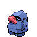

[Frames elegidos](../pokemon/nosepass/anim_front_selected.png) · [Todas las poses](../pokemon/nosepass/anim_front_source.png)

default.back · 64×64 · APNG [0, 3, 1]

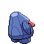

[Frames elegidos](../pokemon/nosepass/back_selected.png) · [Todas las poses](../pokemon/nosepass/back_source.png)

## PROBOPASS

default.front · 96×96 · APNG [5, 10, 0, 107, 111]

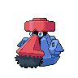

[Frames elegidos](../pokemon/probopass/anim_front_selected.png) · [Todas las poses](../pokemon/probopass/anim_front_source.png)

default.back · 96×96 · APNG [5, 10, 0]

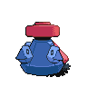

[Frames elegidos](../pokemon/probopass/back_selected.png) · [Todas las poses](../pokemon/probopass/back_source.png)

## SABLEYE

default.front · 64×64 · APNG [0, 8, 5, 38, 44]

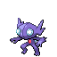

[Frames elegidos](../pokemon/sableye/anim_front_selected.png) · [Todas las poses](../pokemon/sableye/anim_front_source.png)

default.back · 64×64 · APNG [0, 8, 5]

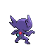

[Frames elegidos](../pokemon/sableye/back_selected.png) · [Todas las poses](../pokemon/sableye/back_source.png)

## MAWILE

default.front · 80×80 · APNG [4, 8, 0, 38, 40]

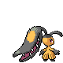

[Frames elegidos](../pokemon/mawile/anim_front_selected.png) · [Todas las poses](../pokemon/mawile/anim_front_source.png)

default.back · 80×80 · APNG [4, 0, 8]

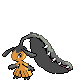

[Frames elegidos](../pokemon/mawile/back_selected.png) · [Todas las poses](../pokemon/mawile/back_source.png)

## ARON

default.front · 64×64 · APNG [1, 0, 2, 13, 15]

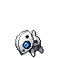

[Frames elegidos](../pokemon/aron/anim_front_selected.png) · [Todas las poses](../pokemon/aron/anim_front_source.png)

default.back · 64×64 · APNG [1, 0, 2]

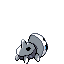

[Frames elegidos](../pokemon/aron/back_selected.png) · [Todas las poses](../pokemon/aron/back_source.png)

## LAIRON

default.front · 64×64 · APNG [4, 9, 1, 35, 36]

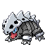

[Frames elegidos](../pokemon/lairon/anim_front_selected.png) · [Todas las poses](../pokemon/lairon/anim_front_source.png)

default.back · 64×64 · APNG [4, 1, 7]

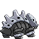

[Frames elegidos](../pokemon/lairon/back_selected.png) · [Todas las poses](../pokemon/lairon/back_source.png)

## AGGRON

default.front · 80×80 · APNG [11, 14, 8, 37, 41]

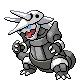

[Frames elegidos](../pokemon/aggron/anim_front_selected.png) · [Todas las poses](../pokemon/aggron/anim_front_source.png)

default.back · 80×80 · APNG [3, 15, 7]

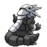

[Frames elegidos](../pokemon/aggron/back_selected.png) · [Todas las poses](../pokemon/aggron/back_source.png)

## MEDITITE

default.front · 64×64 · APNG [0, 19, 31, 26, 39]

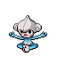

[Frames elegidos](../pokemon/meditite/anim_front_selected.png) · [Todas las poses](../pokemon/meditite/anim_front_source.png)

default.back · 64×64 · APNG [0, 43, 31]

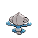

[Frames elegidos](../pokemon/meditite/back_selected.png) · [Todas las poses](../pokemon/meditite/back_source.png)

## MEDICHAM

default.front · 80×80 · APNG [0, 5, 13, 39, 44]

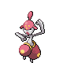

[Frames elegidos](../pokemon/medicham/anim_front_selected.png) · [Todas las poses](../pokemon/medicham/anim_front_source.png)

default.back · 80×80 · APNG [0, 13, 4]

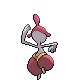

[Frames elegidos](../pokemon/medicham/back_selected.png) · [Todas las poses](../pokemon/medicham/back_source.png)

## ELECTRIKE

default.front · 64×64 · APNG [0, 5, 2, 1, 6]

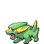

[Frames elegidos](../pokemon/electrike/anim_front_selected.png) · [Todas las poses](../pokemon/electrike/anim_front_source.png)

default.back · 64×64 · APNG [0, 5, 2]

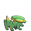

[Frames elegidos](../pokemon/electrike/back_selected.png) · [Todas las poses](../pokemon/electrike/back_source.png)

## MANECTRIC

default.front · 80×80 · APNG [2, 5, 11, 1, 8]

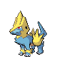

[Frames elegidos](../pokemon/manectric/anim_front_selected.png) · [Todas las poses](../pokemon/manectric/anim_front_source.png)

default.back · 80×80 · APNG [0, 8, 4]

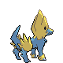

[Frames elegidos](../pokemon/manectric/back_selected.png) · [Todas las poses](../pokemon/manectric/back_source.png)

## BUDEW

default.front · 64×64 · APNG [0, 3, 9, 56, 72]

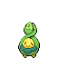

[Frames elegidos](../pokemon/budew/anim_front_selected.png) · [Todas las poses](../pokemon/budew/anim_front_source.png)

default.back · 64×64 · APNG [0, 9, 3]

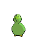

[Frames elegidos](../pokemon/budew/back_selected.png) · [Todas las poses](../pokemon/budew/back_source.png)

[Índice](../GALLERY.md) · [Anterior](page_11.md) · [Siguiente](page_13.md)
