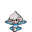
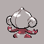
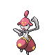
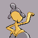
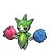
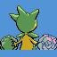
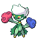
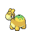
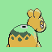
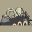

# Galería / página 13

[Índice](../GALLERY.md) · [Anterior](page_12.md) · [Siguiente](page_14.md)

## NOSEPASS

default.front · 64×64 · APNG [0, 1, 3, 5, 6] · timing: source_timeline

[Frames elegidos](../pokemon/nosepass/anim_front_selected.png) · [Todas las poses](../pokemon/nosepass/anim_front_source.png)

default.back · 64×64 · APNG [0, 3, 1] · timing: source_idle_cycle

[Frames elegidos](../pokemon/nosepass/back_selected.png) · [Todas las poses](../pokemon/nosepass/back_source.png)

## PROBOPASS

default.front · 96×96 · APNG [5, 10, 0, 107, 111] · timing: source_timeline

[Frames elegidos](../pokemon/probopass/anim_front_selected.png) · [Todas las poses](../pokemon/probopass/anim_front_source.png)

default.back · 96×96 · APNG [5, 10, 0] · timing: source_idle_cycle

[Frames elegidos](../pokemon/probopass/back_selected.png) · [Todas las poses](../pokemon/probopass/back_source.png)

## SABLEYE

default.front · 64×64 · APNG [0, 8, 5, 38, 44] · timing: source_timeline

[Frames elegidos](../pokemon/sableye/anim_front_selected.png) · [Todas las poses](../pokemon/sableye/anim_front_source.png)

default.back · 64×64 · APNG [0, 8, 5] · timing: source_idle_cycle

[Frames elegidos](../pokemon/sableye/back_selected.png) · [Todas las poses](../pokemon/sableye/back_source.png)

## MAWILE

default.front · 80×80 · APNG [4, 8, 0, 38, 40] · timing: source_timeline

[Frames elegidos](../pokemon/mawile/anim_front_selected.png) · [Todas las poses](../pokemon/mawile/anim_front_source.png)

default.back · 80×80 · APNG [4, 0, 8] · timing: source_idle_cycle

[Frames elegidos](../pokemon/mawile/back_selected.png) · [Todas las poses](../pokemon/mawile/back_source.png)

## ARON

default.front · 64×64 · APNG [1, 0, 2, 13, 15] · timing: source_timeline

[Frames elegidos](../pokemon/aron/anim_front_selected.png) · [Todas las poses](../pokemon/aron/anim_front_source.png)

default.back · 64×64 · APNG [1, 0, 2] · timing: source_idle_cycle

[Frames elegidos](../pokemon/aron/back_selected.png) · [Todas las poses](../pokemon/aron/back_source.png)

## LAIRON

default.front · 64×64 · APNG [4, 9, 1, 35, 36] · timing: source_timeline

[Frames elegidos](../pokemon/lairon/anim_front_selected.png) · [Todas las poses](../pokemon/lairon/anim_front_source.png)

default.back · 64×64 · APNG [4, 1, 7] · timing: source_idle_cycle

[Frames elegidos](../pokemon/lairon/back_selected.png) · [Todas las poses](../pokemon/lairon/back_source.png)

## AGGRON

default.front · 80×80 · APNG [11, 14, 8, 37, 41] · timing: source_timeline

[Frames elegidos](../pokemon/aggron/anim_front_selected.png) · [Todas las poses](../pokemon/aggron/anim_front_source.png)

default.back · 80×80 · APNG [3, 15, 7] · timing: source_idle_cycle

[Frames elegidos](../pokemon/aggron/back_selected.png) · [Todas las poses](../pokemon/aggron/back_source.png)

## MEDITITE

default.front · 64×64 · APNG [0, 19, 31, 26, 39] · timing: synthetic_special_cadence

[Frames elegidos](../pokemon/meditite/anim_front_selected.png) · [Todas las poses](../pokemon/meditite/anim_front_source.png)

default.back · 64×64 · APNG [0, 43, 31] · timing: source_idle_cycle

[Frames elegidos](../pokemon/meditite/back_selected.png) · [Todas las poses](../pokemon/meditite/back_source.png)

female.front · 64×64 · tira original [0, 1, 0, 2, 3] · timing: shared_species_timing

[Frames elegidos](../pokemon/meditite/anim_frontf_selected.png) · [Todas las poses](../pokemon/meditite/anim_frontf_source.png)

female.back · 64×64 · tira original [0, 0, 0] · timing: shared_species_timing

[Frames elegidos](../pokemon/meditite/backf_selected.png) · [Todas las poses](../pokemon/meditite/backf_source.png)

## MEDICHAM

default.front · 80×80 · APNG [0, 5, 13, 39, 44] · timing: source_timeline

[Frames elegidos](../pokemon/medicham/anim_front_selected.png) · [Todas las poses](../pokemon/medicham/anim_front_source.png)

default.back · 80×80 · APNG [0, 13, 4] · timing: source_idle_cycle

[Frames elegidos](../pokemon/medicham/back_selected.png) · [Todas las poses](../pokemon/medicham/back_source.png)

female.front · 80×80 · tira original [0, 1, 0, 2, 3] · timing: shared_species_timing

[Frames elegidos](../pokemon/medicham/anim_frontf_selected.png) · [Todas las poses](../pokemon/medicham/anim_frontf_source.png)

female.back · 64×64 · tira original [0, 0, 0] · timing: shared_species_timing

[Frames elegidos](../pokemon/medicham/backf_selected.png) · [Todas las poses](../pokemon/medicham/backf_source.png)

## ELECTRIKE

default.front · 64×64 · APNG [0, 5, 2, 1, 6] · timing: synthetic_special_cadence

[Frames elegidos](../pokemon/electrike/anim_front_selected.png) · [Todas las poses](../pokemon/electrike/anim_front_source.png)

default.back · 64×64 · APNG [0, 5, 2] · timing: source_idle_cycle

[Frames elegidos](../pokemon/electrike/back_selected.png) · [Todas las poses](../pokemon/electrike/back_source.png)

## MANECTRIC

default.front · 80×80 · APNG [2, 5, 11, 1, 8] · timing: synthetic_special_cadence

[Frames elegidos](../pokemon/manectric/anim_front_selected.png) · [Todas las poses](../pokemon/manectric/anim_front_source.png)

default.back · 80×80 · APNG [0, 8, 4] · timing: source_idle_cycle

[Frames elegidos](../pokemon/manectric/back_selected.png) · [Todas las poses](../pokemon/manectric/back_source.png)

## BUDEW

default.front · 64×64 · APNG [0, 3, 9, 56, 72] · timing: source_timeline

[Frames elegidos](../pokemon/budew/anim_front_selected.png) · [Todas las poses](../pokemon/budew/anim_front_source.png)

default.back · 64×64 · APNG [0, 9, 3] · timing: source_idle_cycle

[Frames elegidos](../pokemon/budew/back_selected.png) · [Todas las poses](../pokemon/budew/back_source.png)

## ROSELIA

default.front · 64×64 · APNG [2, 4, 0, 40, 45] · timing: source_timeline

[Frames elegidos](../pokemon/roselia/anim_front_selected.png) · [Todas las poses](../pokemon/roselia/anim_front_source.png)

default.back · 64×64 · APNG [2, 3, 0] · timing: source_idle_cycle

[Frames elegidos](../pokemon/roselia/back_selected.png) · [Todas las poses](../pokemon/roselia/back_source.png)

female.front · 64×64 · tira original [0, 1, 0, 2, 3] · timing: shared_species_timing

[Frames elegidos](../pokemon/roselia/anim_frontf_selected.png) · [Todas las poses](../pokemon/roselia/anim_frontf_source.png)

female.back · 64×64 · tira original [0, 0, 0] · timing: shared_species_timing

[Frames elegidos](../pokemon/roselia/backf_selected.png) · [Todas las poses](../pokemon/roselia/backf_source.png)

## ROSERADE

default.front · 80×80 · APNG [2, 8, 4, 59, 66] · timing: source_timeline

[Frames elegidos](../pokemon/roserade/anim_front_selected.png) · [Todas las poses](../pokemon/roserade/anim_front_source.png)

default.back · 64×64 · APNG [2, 8, 4] · timing: source_idle_cycle

[Frames elegidos](../pokemon/roserade/back_selected.png) · [Todas las poses](../pokemon/roserade/back_source.png)

female.front · 64×64 · tira original [0, 1, 0, 2, 3] · timing: shared_species_timing

[Frames elegidos](../pokemon/roserade/anim_frontf_selected.png) · [Todas las poses](../pokemon/roserade/anim_frontf_source.png)

female.back · 64×64 · tira original [0, 0, 0] · timing: shared_species_timing

[Frames elegidos](../pokemon/roserade/backf_selected.png) · [Todas las poses](../pokemon/roserade/backf_source.png)

## CARVANHA

default.front · 64×64 · APNG [0, 9, 3, 29, 37] · timing: synthetic_special_cadence

[Frames elegidos](../pokemon/carvanha/anim_front_selected.png) · [Todas las poses](../pokemon/carvanha/anim_front_source.png)

default.back · 64×64 · APNG [0, 9, 3] · timing: source_idle_cycle

[Frames elegidos](../pokemon/carvanha/back_selected.png) · [Todas las poses](../pokemon/carvanha/back_source.png)

## SHARPEDO

default.front · 80×80 · APNG [0, 9, 3, 30, 36] · timing: source_timeline

[Frames elegidos](../pokemon/sharpedo/anim_front_selected.png) · [Todas las poses](../pokemon/sharpedo/anim_front_source.png)

default.back · 80×80 · APNG [0, 3, 9] · timing: source_idle_cycle

[Frames elegidos](../pokemon/sharpedo/back_selected.png) · [Todas las poses](../pokemon/sharpedo/back_source.png)

## WAILMER

default.front · 96×96 · APNG [0, 14, 18, 31, 43] · timing: source_timeline

[Frames elegidos](../pokemon/wailmer/anim_front_selected.png) · [Todas las poses](../pokemon/wailmer/anim_front_source.png)

default.back · 80×80 · APNG [0, 10, 4] · timing: source_idle_cycle

[Frames elegidos](../pokemon/wailmer/back_selected.png) · [Todas las poses](../pokemon/wailmer/back_source.png)

## WAILORD

default.front · 111×111 · APNG [0, 18, 6, 10, 22] · timing: synthetic_special_cadence

[Frames elegidos](../pokemon/wailord/anim_front_selected.png) · [Todas las poses](../pokemon/wailord/anim_front_source.png)

default.back · 111×111 · APNG [0, 6, 18] · timing: source_idle_cycle

[Frames elegidos](../pokemon/wailord/back_selected.png) · [Todas las poses](../pokemon/wailord/back_source.png)

## NUMEL

default.front · 64×64 · APNG [0, 7, 3, 18, 20] · timing: source_timeline

[Frames elegidos](../pokemon/numel/anim_front_selected.png) · [Todas las poses](../pokemon/numel/anim_front_source.png)

default.back · 64×64 · APNG [0, 7, 3] · timing: source_idle_cycle

[Frames elegidos](../pokemon/numel/back_selected.png) · [Todas las poses](../pokemon/numel/back_source.png)

female.front · 64×64 · tira original [0, 1, 0, 2, 3] · timing: shared_species_timing

[Frames elegidos](../pokemon/numel/anim_frontf_selected.png) · [Todas las poses](../pokemon/numel/anim_frontf_source.png)

female.back · 64×64 · tira original [0, 0, 0] · timing: shared_species_timing

[Frames elegidos](../pokemon/numel/backf_selected.png) · [Todas las poses](../pokemon/numel/backf_source.png)

## CAMERUPT

default.front · 80×80 · APNG [0, 7, 4, 36, 41] · timing: source_timeline

[Frames elegidos](../pokemon/camerupt/anim_front_selected.png) · [Todas las poses](../pokemon/camerupt/anim_front_source.png)

default.back · 80×80 · APNG [0, 7, 4] · timing: source_idle_cycle

[Frames elegidos](../pokemon/camerupt/back_selected.png) · [Todas las poses](../pokemon/camerupt/back_source.png)

female.front · 80×80 · tira original [0, 1, 0, 2, 3] · timing: shared_species_timing

[Frames elegidos](../pokemon/camerupt/anim_frontf_selected.png) · [Todas las poses](../pokemon/camerupt/anim_frontf_source.png)

female.back · 64×64 · tira original [0, 0, 0] · timing: shared_species_timing

[Frames elegidos](../pokemon/camerupt/backf_selected.png) · [Todas las poses](../pokemon/camerupt/backf_source.png)

## TORKOAL

default.front · 64×64 · APNG [1, 0, 6, 39, 40] · timing: source_timeline

[Frames elegidos](../pokemon/torkoal/anim_front_selected.png) · [Todas las poses](../pokemon/torkoal/anim_front_source.png)

default.back · 80×80 · APNG [1, 0, 2] · timing: source_idle_cycle

[Frames elegidos](../pokemon/torkoal/back_selected.png) · [Todas las poses](../pokemon/torkoal/back_source.png)

## SPOINK

default.front · 80×80 · APNG [0, 23, 2, 53, 58] · timing: source_timeline

[Frames elegidos](../pokemon/spoink/anim_front_selected.png) · [Todas las poses](../pokemon/spoink/anim_front_source.png)

default.back · 64×64 · APNG [0, 23, 13] · timing: source_idle_cycle

[Frames elegidos](../pokemon/spoink/back_selected.png) · [Todas las poses](../pokemon/spoink/back_source.png)

## GRUMPIG

default.front · 80×80 · APNG [2, 0, 5, 7, 11] · timing: source_timeline

[Frames elegidos](../pokemon/grumpig/anim_front_selected.png) · [Todas las poses](../pokemon/grumpig/anim_front_source.png)

default.back · 64×64 · APNG [2, 0, 4] · timing: source_idle_cycle

[Frames elegidos](../pokemon/grumpig/back_selected.png) · [Todas las poses](../pokemon/grumpig/back_source.png)

## TRAPINCH

default.front · 64×64 · APNG [1, 0, 2, 2, 6] · timing: synthetic_special_cadence

[Frames elegidos](../pokemon/trapinch/anim_front_selected.png) · [Todas las poses](../pokemon/trapinch/anim_front_source.png)

default.back · 64×64 · APNG [1, 0, 7] · timing: source_idle_cycle

[Frames elegidos](../pokemon/trapinch/back_selected.png) · [Todas las poses](../pokemon/trapinch/back_source.png)

## VIBRAVA

default.front · 64×64 · APNG [8, 0, 3, 32, 38] · timing: source_timeline

[Frames elegidos](../pokemon/vibrava/anim_front_selected.png) · [Todas las poses](../pokemon/vibrava/anim_front_source.png)

default.back · 64×64 · APNG [1, 0, 3] · timing: source_idle_cycle

[Frames elegidos](../pokemon/vibrava/back_selected.png) · [Todas las poses](../pokemon/vibrava/back_source.png)

[Índice](../GALLERY.md) · [Anterior](page_12.md) · [Siguiente](page_14.md)
