# Galería / página 13

[Índice](../GALLERY.md) · [Anterior](page_12.md) · [Siguiente](page_14.md)

## ROSELIA

default.front · 64×64 · APNG [2, 4, 0, 40, 45]

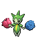

[Frames elegidos](../pokemon/roselia/anim_front_selected.png) · [Todas las poses](../pokemon/roselia/anim_front_source.png)

default.back · 64×64 · APNG [2, 3, 0]

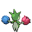

[Frames elegidos](../pokemon/roselia/back_selected.png) · [Todas las poses](../pokemon/roselia/back_source.png)

## ROSERADE

default.front · 80×80 · APNG [2, 8, 4, 59, 66]

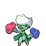

[Frames elegidos](../pokemon/roserade/anim_front_selected.png) · [Todas las poses](../pokemon/roserade/anim_front_source.png)

default.back · 64×64 · APNG [2, 8, 4]

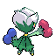

[Frames elegidos](../pokemon/roserade/back_selected.png) · [Todas las poses](../pokemon/roserade/back_source.png)

## CARVANHA

default.front · 64×64 · APNG [0, 9, 3, 29, 37]

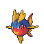

[Frames elegidos](../pokemon/carvanha/anim_front_selected.png) · [Todas las poses](../pokemon/carvanha/anim_front_source.png)

default.back · 64×64 · APNG [0, 9, 3]

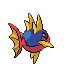

[Frames elegidos](../pokemon/carvanha/back_selected.png) · [Todas las poses](../pokemon/carvanha/back_source.png)

## SHARPEDO

default.front · 80×80 · APNG [0, 9, 3, 30, 36]

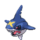

[Frames elegidos](../pokemon/sharpedo/anim_front_selected.png) · [Todas las poses](../pokemon/sharpedo/anim_front_source.png)

default.back · 80×80 · APNG [0, 3, 9]

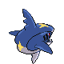

[Frames elegidos](../pokemon/sharpedo/back_selected.png) · [Todas las poses](../pokemon/sharpedo/back_source.png)

## WAILMER

default.front · 96×96 · APNG [0, 14, 18, 31, 43]

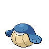

[Frames elegidos](../pokemon/wailmer/anim_front_selected.png) · [Todas las poses](../pokemon/wailmer/anim_front_source.png)

default.back · 80×80 · APNG [0, 10, 4]

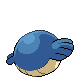

[Frames elegidos](../pokemon/wailmer/back_selected.png) · [Todas las poses](../pokemon/wailmer/back_source.png)

## WAILORD

default.front · 111×111 · APNG [0, 18, 6, 10, 22]

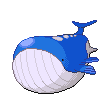

[Frames elegidos](../pokemon/wailord/anim_front_selected.png) · [Todas las poses](../pokemon/wailord/anim_front_source.png)

default.back · 111×111 · APNG [0, 6, 18]

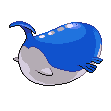

[Frames elegidos](../pokemon/wailord/back_selected.png) · [Todas las poses](../pokemon/wailord/back_source.png)

## NUMEL

default.front · 64×64 · APNG [0, 7, 3, 18, 20]

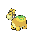

[Frames elegidos](../pokemon/numel/anim_front_selected.png) · [Todas las poses](../pokemon/numel/anim_front_source.png)

default.back · 64×64 · APNG [0, 7, 3]

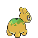

[Frames elegidos](../pokemon/numel/back_selected.png) · [Todas las poses](../pokemon/numel/back_source.png)

## CAMERUPT

default.front · 80×80 · APNG [0, 7, 4, 36, 41]

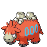

[Frames elegidos](../pokemon/camerupt/anim_front_selected.png) · [Todas las poses](../pokemon/camerupt/anim_front_source.png)

default.back · 80×80 · APNG [0, 7, 4]

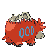

[Frames elegidos](../pokemon/camerupt/back_selected.png) · [Todas las poses](../pokemon/camerupt/back_source.png)

## TORKOAL

default.front · 64×64 · APNG [1, 0, 6, 39, 40]

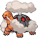

[Frames elegidos](../pokemon/torkoal/anim_front_selected.png) · [Todas las poses](../pokemon/torkoal/anim_front_source.png)

default.back · 80×80 · APNG [1, 0, 2]

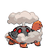

[Frames elegidos](../pokemon/torkoal/back_selected.png) · [Todas las poses](../pokemon/torkoal/back_source.png)

## SPOINK

default.front · 80×80 · APNG [0, 23, 2, 53, 58]

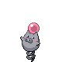

[Frames elegidos](../pokemon/spoink/anim_front_selected.png) · [Todas las poses](../pokemon/spoink/anim_front_source.png)

default.back · 64×64 · APNG [0, 23, 13]

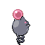

[Frames elegidos](../pokemon/spoink/back_selected.png) · [Todas las poses](../pokemon/spoink/back_source.png)

## GRUMPIG

default.front · 80×80 · APNG [2, 0, 5, 7, 11]

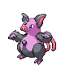

[Frames elegidos](../pokemon/grumpig/anim_front_selected.png) · [Todas las poses](../pokemon/grumpig/anim_front_source.png)

default.back · 64×64 · APNG [2, 0, 4]

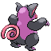

[Frames elegidos](../pokemon/grumpig/back_selected.png) · [Todas las poses](../pokemon/grumpig/back_source.png)

## TRAPINCH

default.front · 64×64 · APNG [1, 0, 2, 2, 6]

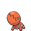

[Frames elegidos](../pokemon/trapinch/anim_front_selected.png) · [Todas las poses](../pokemon/trapinch/anim_front_source.png)

default.back · 64×64 · APNG [1, 0, 7]

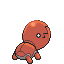

[Frames elegidos](../pokemon/trapinch/back_selected.png) · [Todas las poses](../pokemon/trapinch/back_source.png)

## VIBRAVA

default.front · 64×64 · APNG [8, 0, 3, 32, 38]

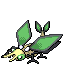

[Frames elegidos](../pokemon/vibrava/anim_front_selected.png) · [Todas las poses](../pokemon/vibrava/anim_front_source.png)

default.back · 64×64 · APNG [1, 0, 3]

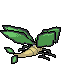

[Frames elegidos](../pokemon/vibrava/back_selected.png) · [Todas las poses](../pokemon/vibrava/back_source.png)

## FLYGON

default.front · 80×80 · APNG [4, 8, 0, 52, 56]

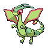

[Frames elegidos](../pokemon/flygon/anim_front_selected.png) · [Todas las poses](../pokemon/flygon/anim_front_source.png)

default.back · 80×80 · APNG [4, 8, 0]

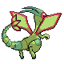

[Frames elegidos](../pokemon/flygon/back_selected.png) · [Todas las poses](../pokemon/flygon/back_source.png)

## CACNEA

default.front · 64×64 · APNG [5, 4, 0, 17, 18]

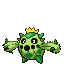

[Frames elegidos](../pokemon/cacnea/anim_front_selected.png) · [Todas las poses](../pokemon/cacnea/anim_front_source.png)

default.back · 64×64 · APNG [3, 5, 0]

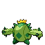

[Frames elegidos](../pokemon/cacnea/back_selected.png) · [Todas las poses](../pokemon/cacnea/back_source.png)

## CACTURNE

default.front · 80×80 · APNG [0, 18, 6, 50, 51]

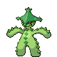

[Frames elegidos](../pokemon/cacturne/anim_front_selected.png) · [Todas las poses](../pokemon/cacturne/anim_front_source.png)

default.back · 80×80 · APNG [0, 18, 6]

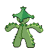

[Frames elegidos](../pokemon/cacturne/back_selected.png) · [Todas las poses](../pokemon/cacturne/back_source.png)

## SWABLU

default.front · 80×80 · APNG [3, 1, 4, 5, 8]

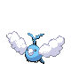

[Frames elegidos](../pokemon/swablu/anim_front_selected.png) · [Todas las poses](../pokemon/swablu/anim_front_source.png)

default.back · 80×80 · APNG [3, 1, 4]

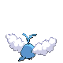

[Frames elegidos](../pokemon/swablu/back_selected.png) · [Todas las poses](../pokemon/swablu/back_source.png)

## ALTARIA

default.front · 64×64 · APNG [2, 0, 6, 46, 51]

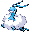

[Frames elegidos](../pokemon/altaria/anim_front_selected.png) · [Todas las poses](../pokemon/altaria/anim_front_source.png)

default.back · 80×80 · APNG [0, 12, 6]

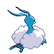

[Frames elegidos](../pokemon/altaria/back_selected.png) · [Todas las poses](../pokemon/altaria/back_source.png)

## LUNATONE

default.front · 64×64 · APNG [0, 25, 18, 4, 46]

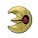

[Frames elegidos](../pokemon/lunatone/anim_front_selected.png) · [Todas las poses](../pokemon/lunatone/anim_front_source.png)

default.back · 64×64 · APNG [0, 25, 18]

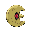

[Frames elegidos](../pokemon/lunatone/back_selected.png) · [Todas las poses](../pokemon/lunatone/back_source.png)

## SOLROCK

default.front · 96×96 · APNG [0, 28, 36, 44, 52]

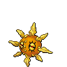

[Frames elegidos](../pokemon/solrock/anim_front_selected.png) · [Todas las poses](../pokemon/solrock/anim_front_source.png)

default.back · 80×80 · APNG [0, 28, 36]

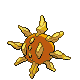

[Frames elegidos](../pokemon/solrock/back_selected.png) · [Todas las poses](../pokemon/solrock/back_source.png)

## BALTOY

default.front · 64×64 · APNG [0, 15, 5, 2, 12]

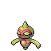

[Frames elegidos](../pokemon/baltoy/anim_front_selected.png) · [Todas las poses](../pokemon/baltoy/anim_front_source.png)

default.back · 64×64 · APNG [0, 15, 5]

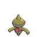

[Frames elegidos](../pokemon/baltoy/back_selected.png) · [Todas las poses](../pokemon/baltoy/back_source.png)

## CLAYDOL

default.front · 80×80 · APNG [0, 14, 8, 40, 41]

[Frames elegidos](../pokemon/claydol/anim_front_selected.png) · [Todas las poses](../pokemon/claydol/anim_front_source.png)

default.back · 80×80 · APNG [0, 14, 8]

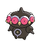

[Frames elegidos](../pokemon/claydol/back_selected.png) · [Todas las poses](../pokemon/claydol/back_source.png)

## LILEEP

default.front · 64×64 · APNG [0, 20, 30, 9, 18]

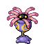

[Frames elegidos](../pokemon/lileep/anim_front_selected.png) · [Todas las poses](../pokemon/lileep/anim_front_source.png)

default.back · 64×64 · APNG [0, 5, 15]

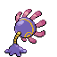

[Frames elegidos](../pokemon/lileep/back_selected.png) · [Todas las poses](../pokemon/lileep/back_source.png)

## CRADILY

default.front · 80×80 · APNG [0, 11, 19, 4, 21]

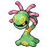

[Frames elegidos](../pokemon/cradily/anim_front_selected.png) · [Todas las poses](../pokemon/cradily/anim_front_source.png)

default.back · 80×80 · APNG [0, 11, 19]

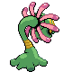

[Frames elegidos](../pokemon/cradily/back_selected.png) · [Todas las poses](../pokemon/cradily/back_source.png)

## ANORITH

default.front · 64×64 · APNG [0, 15, 5, 37, 41]

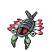

[Frames elegidos](../pokemon/anorith/anim_front_selected.png) · [Todas las poses](../pokemon/anorith/anim_front_source.png)

default.back · 64×64 · APNG [0, 16, 9]

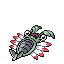

[Frames elegidos](../pokemon/anorith/back_selected.png) · [Todas las poses](../pokemon/anorith/back_source.png)

[Índice](../GALLERY.md) · [Anterior](page_12.md) · [Siguiente](page_14.md)
