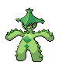
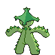
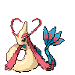
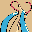
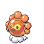
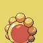
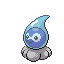
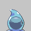
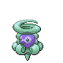
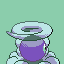

# Galería / página 14

[Índice](../GALLERY.md) · [Anterior](page_13.md) · [Siguiente](page_15.md)

## FLYGON

default.front · 80×80 · APNG [4, 8, 0, 52, 56] · timing: source_timeline

[Frames elegidos](../pokemon/flygon/anim_front_selected.png) · [Todas las poses](../pokemon/flygon/anim_front_source.png)

default.back · 80×80 · APNG [4, 8, 0] · timing: source_idle_cycle

[Frames elegidos](../pokemon/flygon/back_selected.png) · [Todas las poses](../pokemon/flygon/back_source.png)

## CACNEA

default.front · 64×64 · APNG [5, 4, 0, 17, 18] · timing: source_timeline

[Frames elegidos](../pokemon/cacnea/anim_front_selected.png) · [Todas las poses](../pokemon/cacnea/anim_front_source.png)

default.back · 64×64 · APNG [3, 5, 0] · timing: source_idle_cycle

[Frames elegidos](../pokemon/cacnea/back_selected.png) · [Todas las poses](../pokemon/cacnea/back_source.png)

## CACTURNE

default.front · 80×80 · APNG [0, 18, 6, 50, 51] · timing: source_timeline

[Frames elegidos](../pokemon/cacturne/anim_front_selected.png) · [Todas las poses](../pokemon/cacturne/anim_front_source.png)

default.back · 80×80 · APNG [0, 18, 6] · timing: source_idle_cycle

[Frames elegidos](../pokemon/cacturne/back_selected.png) · [Todas las poses](../pokemon/cacturne/back_source.png)

female.front · 80×80 · tira original [0, 1, 0, 2, 3] · timing: shared_species_timing

[Frames elegidos](../pokemon/cacturne/anim_frontf_selected.png) · [Todas las poses](../pokemon/cacturne/anim_frontf_source.png)

female.back · 80×80 · APNG [0, 18, 6] · timing: shared_species_timing

[Frames elegidos](../pokemon/cacturne/backf_selected.png) · [Todas las poses](../pokemon/cacturne/backf_source.png)

## SWABLU

default.front · 80×80 · APNG [3, 1, 4, 5, 8] · timing: source_timeline

[Frames elegidos](../pokemon/swablu/anim_front_selected.png) · [Todas las poses](../pokemon/swablu/anim_front_source.png)

default.back · 80×80 · APNG [3, 1, 4] · timing: source_idle_cycle

[Frames elegidos](../pokemon/swablu/back_selected.png) · [Todas las poses](../pokemon/swablu/back_source.png)

## ALTARIA

default.front · 64×64 · APNG [2, 0, 6, 46, 51] · timing: source_timeline

[Frames elegidos](../pokemon/altaria/anim_front_selected.png) · [Todas las poses](../pokemon/altaria/anim_front_source.png)

default.back · 80×80 · APNG [0, 12, 6] · timing: source_idle_cycle

[Frames elegidos](../pokemon/altaria/back_selected.png) · [Todas las poses](../pokemon/altaria/back_source.png)

## LUNATONE

default.front · 64×64 · APNG [0, 25, 18, 4, 46] · timing: synthetic_special_cadence

[Frames elegidos](../pokemon/lunatone/anim_front_selected.png) · [Todas las poses](../pokemon/lunatone/anim_front_source.png)

default.back · 64×64 · APNG [0, 25, 18] · timing: source_idle_cycle

[Frames elegidos](../pokemon/lunatone/back_selected.png) · [Todas las poses](../pokemon/lunatone/back_source.png)

## SOLROCK

default.front · 96×96 · APNG [0, 28, 36, 44, 52] · timing: source_timeline

[Frames elegidos](../pokemon/solrock/anim_front_selected.png) · [Todas las poses](../pokemon/solrock/anim_front_source.png)

default.back · 80×80 · APNG [0, 28, 36] · timing: source_idle_cycle

[Frames elegidos](../pokemon/solrock/back_selected.png) · [Todas las poses](../pokemon/solrock/back_source.png)

## BALTOY

default.front · 64×64 · APNG [0, 15, 5, 2, 12] · timing: synthetic_special_cadence

[Frames elegidos](../pokemon/baltoy/anim_front_selected.png) · [Todas las poses](../pokemon/baltoy/anim_front_source.png)

default.back · 64×64 · APNG [0, 15, 5] · timing: source_idle_cycle

[Frames elegidos](../pokemon/baltoy/back_selected.png) · [Todas las poses](../pokemon/baltoy/back_source.png)

## CLAYDOL

default.front · 80×80 · APNG [0, 14, 8, 40, 41] · timing: source_timeline

[Frames elegidos](../pokemon/claydol/anim_front_selected.png) · [Todas las poses](../pokemon/claydol/anim_front_source.png)

default.back · 80×80 · APNG [0, 14, 8] · timing: source_idle_cycle

[Frames elegidos](../pokemon/claydol/back_selected.png) · [Todas las poses](../pokemon/claydol/back_source.png)

## LILEEP

default.front · 64×64 · APNG [0, 20, 30, 9, 18] · timing: synthetic_special_cadence

[Frames elegidos](../pokemon/lileep/anim_front_selected.png) · [Todas las poses](../pokemon/lileep/anim_front_source.png)

default.back · 64×64 · APNG [0, 5, 15] · timing: source_idle_cycle

[Frames elegidos](../pokemon/lileep/back_selected.png) · [Todas las poses](../pokemon/lileep/back_source.png)

## CRADILY

default.front · 80×80 · APNG [0, 11, 19, 4, 21] · timing: synthetic_special_cadence

[Frames elegidos](../pokemon/cradily/anim_front_selected.png) · [Todas las poses](../pokemon/cradily/anim_front_source.png)

default.back · 80×80 · APNG [0, 11, 19] · timing: source_idle_cycle

[Frames elegidos](../pokemon/cradily/back_selected.png) · [Todas las poses](../pokemon/cradily/back_source.png)

## ANORITH

default.front · 64×64 · APNG [0, 15, 5, 37, 41] · timing: source_timeline

[Frames elegidos](../pokemon/anorith/anim_front_selected.png) · [Todas las poses](../pokemon/anorith/anim_front_source.png)

default.back · 64×64 · APNG [0, 16, 9] · timing: source_idle_cycle

[Frames elegidos](../pokemon/anorith/back_selected.png) · [Todas las poses](../pokemon/anorith/back_source.png)

## ARMALDO

default.front · 96×96 · APNG [0, 18, 3, 45, 48] · timing: source_timeline

[Frames elegidos](../pokemon/armaldo/anim_front_selected.png) · [Todas las poses](../pokemon/armaldo/anim_front_source.png)

default.back · 80×80 · APNG [0, 18, 14] · timing: source_idle_cycle

[Frames elegidos](../pokemon/armaldo/back_selected.png) · [Todas las poses](../pokemon/armaldo/back_source.png)

## FEEBAS

default.front · 64×64 · APNG [0, 9, 16, 14, 17] · timing: synthetic_special_cadence

[Frames elegidos](../pokemon/feebas/anim_front_selected.png) · [Todas las poses](../pokemon/feebas/anim_front_source.png)

default.back · 64×64 · APNG [7, 21, 16] · timing: source_idle_cycle

[Frames elegidos](../pokemon/feebas/back_selected.png) · [Todas las poses](../pokemon/feebas/back_source.png)

## MILOTIC

default.front · 96×96 · APNG [3, 12, 21, 55, 61] · timing: source_timeline

[Frames elegidos](../pokemon/milotic/anim_front_selected.png) · [Todas las poses](../pokemon/milotic/anim_front_source.png)

default.back · 96×96 · APNG [0, 9, 13] · timing: source_idle_cycle

[Frames elegidos](../pokemon/milotic/back_selected.png) · [Todas las poses](../pokemon/milotic/back_source.png)

female.front · 96×96 · tira original [0, 1, 0, 2, 3] · timing: shared_species_timing

[Frames elegidos](../pokemon/milotic/anim_frontf_selected.png) · [Todas las poses](../pokemon/milotic/anim_frontf_source.png)

female.back · 64×64 · tira original [0, 0, 0] · timing: shared_species_timing

[Frames elegidos](../pokemon/milotic/backf_selected.png) · [Todas las poses](../pokemon/milotic/backf_source.png)

## CASTFORM

default.front · 64×64 · APNG [9, 17, 0, 20, 28] · timing: source_timeline

[Frames elegidos](../pokemon/castform/anim_front_selected.png) · [Todas las poses](../pokemon/castform/anim_front_source.png)

default.back · 64×64 · APNG [9, 17, 0] · timing: source_idle_cycle

[Frames elegidos](../pokemon/castform/back_selected.png) · [Todas las poses](../pokemon/castform/back_source.png)

## CASTFORM_SUNNY

default.front · 64×64 · tira original [0, 1, 0, 2, 3] · timing: legacy_estimated

[Frames elegidos](../pokemon/castform/sunny/anim_front_selected.png) · [Todas las poses](../pokemon/castform/sunny/anim_front_source.png)

default.back · 64×64 · tira original [0, 0, 0] · timing: legacy_estimated

[Frames elegidos](../pokemon/castform/sunny/back_selected.png) · [Todas las poses](../pokemon/castform/sunny/back_source.png)

## CASTFORM_RAINY

default.front · 64×64 · tira original [0, 1, 0, 2, 3] · timing: legacy_estimated

[Frames elegidos](../pokemon/castform/rainy/anim_front_selected.png) · [Todas las poses](../pokemon/castform/rainy/anim_front_source.png)

default.back · 64×64 · tira original [0, 0, 0] · timing: legacy_estimated

[Frames elegidos](../pokemon/castform/rainy/back_selected.png) · [Todas las poses](../pokemon/castform/rainy/back_source.png)

## CASTFORM_SNOWY

default.front · 80×80 · tira original [0, 1, 0, 2, 3] · timing: legacy_estimated

[Frames elegidos](../pokemon/castform/snowy/anim_front_selected.png) · [Todas las poses](../pokemon/castform/snowy/anim_front_source.png)

default.back · 64×64 · tira original [0, 0, 0] · timing: legacy_estimated

[Frames elegidos](../pokemon/castform/snowy/back_selected.png) · [Todas las poses](../pokemon/castform/snowy/back_source.png)

## KECLEON

default.front · 64×64 · APNG [5, 0, 8, 36, 41] · timing: source_timeline

[Frames elegidos](../pokemon/kecleon/anim_front_selected.png) · [Todas las poses](../pokemon/kecleon/anim_front_source.png)

default.back · 64×64 · APNG [5, 0, 8] · timing: source_idle_cycle

[Frames elegidos](../pokemon/kecleon/back_selected.png) · [Todas las poses](../pokemon/kecleon/back_source.png)

## SHUPPET

default.front · 64×64 · APNG [3, 5, 16, 37, 42] · timing: source_timeline

[Frames elegidos](../pokemon/shuppet/anim_front_selected.png) · [Todas las poses](../pokemon/shuppet/anim_front_source.png)

default.back · 64×64 · APNG [0, 5, 14] · timing: source_idle_cycle

[Frames elegidos](../pokemon/shuppet/back_selected.png) · [Todas las poses](../pokemon/shuppet/back_source.png)

## BANETTE

default.front · 64×64 · APNG [0, 8, 14, 37, 43] · timing: source_timeline

[Frames elegidos](../pokemon/banette/anim_front_selected.png) · [Todas las poses](../pokemon/banette/anim_front_source.png)

default.back · 64×64 · APNG [0, 27, 13] · timing: source_idle_cycle

[Frames elegidos](../pokemon/banette/back_selected.png) · [Todas las poses](../pokemon/banette/back_source.png)

## DUSKULL

default.front · 64×64 · APNG [4, 8, 0, 38, 42] · timing: source_timeline

[Frames elegidos](../pokemon/duskull/anim_front_selected.png) · [Todas las poses](../pokemon/duskull/anim_front_source.png)

default.back · 64×64 · APNG [12, 9, 1] · timing: source_idle_cycle

[Frames elegidos](../pokemon/duskull/back_selected.png) · [Todas las poses](../pokemon/duskull/back_source.png)

## DUSCLOPS

default.front · 96×96 · APNG [13, 7, 0, 54, 63] · timing: source_timeline

[Frames elegidos](../pokemon/dusclops/anim_front_selected.png) · [Todas las poses](../pokemon/dusclops/anim_front_source.png)

default.back · 80×80 · APNG [11, 7, 0] · timing: source_idle_cycle

[Frames elegidos](../pokemon/dusclops/back_selected.png) · [Todas las poses](../pokemon/dusclops/back_source.png)

## DUSKNOIR

default.front · 80×80 · APNG [4, 8, 0, 36, 44] · timing: source_timeline

[Frames elegidos](../pokemon/dusknoir/anim_front_selected.png) · [Todas las poses](../pokemon/dusknoir/anim_front_source.png)

default.back · 80×80 · APNG [4, 8, 0] · timing: source_idle_cycle

[Frames elegidos](../pokemon/dusknoir/back_selected.png) · [Todas las poses](../pokemon/dusknoir/back_source.png)

[Índice](../GALLERY.md) · [Anterior](page_13.md) · [Siguiente](page_15.md)
