# Galería / página 14

[Índice](../GALLERY.md) · [Anterior](page_13.md) · [Siguiente](page_15.md)

## ARMALDO

default.front · 96×96 · APNG [0, 18, 3, 45, 48]

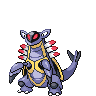

[Frames elegidos](../pokemon/armaldo/anim_front_selected.png) · [Todas las poses](../pokemon/armaldo/anim_front_source.png)

default.back · 80×80 · APNG [0, 18, 14]

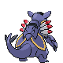

[Frames elegidos](../pokemon/armaldo/back_selected.png) · [Todas las poses](../pokemon/armaldo/back_source.png)

## FEEBAS

default.front · 64×64 · APNG [0, 9, 16, 14, 17]

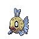

[Frames elegidos](../pokemon/feebas/anim_front_selected.png) · [Todas las poses](../pokemon/feebas/anim_front_source.png)

default.back · 64×64 · APNG [7, 21, 16]

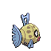

[Frames elegidos](../pokemon/feebas/back_selected.png) · [Todas las poses](../pokemon/feebas/back_source.png)

## MILOTIC

default.front · 96×96 · APNG [3, 12, 21, 55, 61]

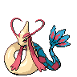

[Frames elegidos](../pokemon/milotic/anim_front_selected.png) · [Todas las poses](../pokemon/milotic/anim_front_source.png)

default.back · 96×96 · APNG [0, 9, 13]

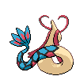

[Frames elegidos](../pokemon/milotic/back_selected.png) · [Todas las poses](../pokemon/milotic/back_source.png)

## CASTFORM

default.front · 64×64 · APNG [9, 17, 0, 20, 28]

[Frames elegidos](../pokemon/castform/anim_front_selected.png) · [Todas las poses](../pokemon/castform/anim_front_source.png)

default.back · 64×64 · APNG [9, 17, 0]

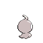

[Frames elegidos](../pokemon/castform/back_selected.png) · [Todas las poses](../pokemon/castform/back_source.png)

## KECLEON

default.front · 64×64 · APNG [5, 0, 8, 36, 41]

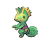

[Frames elegidos](../pokemon/kecleon/anim_front_selected.png) · [Todas las poses](../pokemon/kecleon/anim_front_source.png)

default.back · 64×64 · APNG [5, 0, 8]

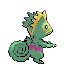

[Frames elegidos](../pokemon/kecleon/back_selected.png) · [Todas las poses](../pokemon/kecleon/back_source.png)

## SHUPPET

default.front · 64×64 · APNG [3, 5, 16, 37, 42]

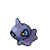

[Frames elegidos](../pokemon/shuppet/anim_front_selected.png) · [Todas las poses](../pokemon/shuppet/anim_front_source.png)

default.back · 64×64 · APNG [0, 5, 14]

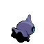

[Frames elegidos](../pokemon/shuppet/back_selected.png) · [Todas las poses](../pokemon/shuppet/back_source.png)

## BANETTE

default.front · 64×64 · APNG [0, 8, 14, 37, 43]

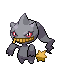

[Frames elegidos](../pokemon/banette/anim_front_selected.png) · [Todas las poses](../pokemon/banette/anim_front_source.png)

default.back · 64×64 · APNG [0, 27, 13]

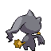

[Frames elegidos](../pokemon/banette/back_selected.png) · [Todas las poses](../pokemon/banette/back_source.png)

## DUSKULL

default.front · 64×64 · APNG [4, 8, 0, 38, 42]

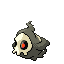

[Frames elegidos](../pokemon/duskull/anim_front_selected.png) · [Todas las poses](../pokemon/duskull/anim_front_source.png)

default.back · 64×64 · APNG [12, 9, 1]

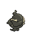

[Frames elegidos](../pokemon/duskull/back_selected.png) · [Todas las poses](../pokemon/duskull/back_source.png)

## DUSCLOPS

default.front · 96×96 · APNG [13, 7, 0, 54, 63]

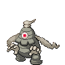

[Frames elegidos](../pokemon/dusclops/anim_front_selected.png) · [Todas las poses](../pokemon/dusclops/anim_front_source.png)

default.back · 80×80 · APNG [11, 7, 0]

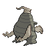

[Frames elegidos](../pokemon/dusclops/back_selected.png) · [Todas las poses](../pokemon/dusclops/back_source.png)

## DUSKNOIR

default.front · 80×80 · APNG [4, 8, 0, 36, 44]

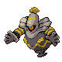

[Frames elegidos](../pokemon/dusknoir/anim_front_selected.png) · [Todas las poses](../pokemon/dusknoir/anim_front_source.png)

default.back · 80×80 · APNG [4, 8, 0]

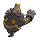

[Frames elegidos](../pokemon/dusknoir/back_selected.png) · [Todas las poses](../pokemon/dusknoir/back_source.png)

## TROPIUS

default.front · 96×96 · APNG [4, 0, 8, 38, 43]

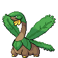

[Frames elegidos](../pokemon/tropius/anim_front_selected.png) · [Todas las poses](../pokemon/tropius/anim_front_source.png)

default.back · 96×96 · APNG [4, 0, 8]

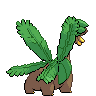

[Frames elegidos](../pokemon/tropius/back_selected.png) · [Todas las poses](../pokemon/tropius/back_source.png)

## CHINGLING

default.front · 64×64 · APNG [4, 15, 2, 69, 71]

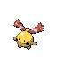

[Frames elegidos](../pokemon/chingling/anim_front_selected.png) · [Todas las poses](../pokemon/chingling/anim_front_source.png)

default.back · 64×64 · APNG [4, 15, 2]

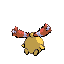

[Frames elegidos](../pokemon/chingling/back_selected.png) · [Todas las poses](../pokemon/chingling/back_source.png)

## CHIMECHO

default.front · 80×80 · APNG [12, 8, 0, 40, 52]

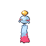

[Frames elegidos](../pokemon/chimecho/anim_front_selected.png) · [Todas las poses](../pokemon/chimecho/anim_front_source.png)

default.back · 80×80 · APNG [12, 9, 0]

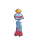

[Frames elegidos](../pokemon/chimecho/back_selected.png) · [Todas las poses](../pokemon/chimecho/back_source.png)

## ABSOL

default.front · 80×80 · APNG [4, 0, 8, 41, 58]

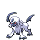

[Frames elegidos](../pokemon/absol/anim_front_selected.png) · [Todas las poses](../pokemon/absol/anim_front_source.png)

default.back · 80×80 · APNG [3, 1, 8]

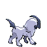

[Frames elegidos](../pokemon/absol/back_selected.png) · [Todas las poses](../pokemon/absol/back_source.png)

## SNORUNT

default.front · 64×64 · APNG [0, 3, 1, 19, 22]

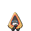

[Frames elegidos](../pokemon/snorunt/anim_front_selected.png) · [Todas las poses](../pokemon/snorunt/anim_front_source.png)

default.back · 64×64 · APNG [0, 1, 4]

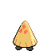

[Frames elegidos](../pokemon/snorunt/back_selected.png) · [Todas las poses](../pokemon/snorunt/back_source.png)

## GLALIE

default.front · 64×64 · APNG [2, 0, 4, 32, 33]

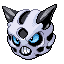

[Frames elegidos](../pokemon/glalie/anim_front_selected.png) · [Todas las poses](../pokemon/glalie/anim_front_source.png)

default.back · 64×64 · APNG [2, 0, 4]

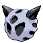

[Frames elegidos](../pokemon/glalie/back_selected.png) · [Todas las poses](../pokemon/glalie/back_source.png)

## FROSLASS

default.front · 80×80 · APNG [0, 11, 17, 33, 39]

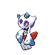

[Frames elegidos](../pokemon/froslass/anim_front_selected.png) · [Todas las poses](../pokemon/froslass/anim_front_source.png)

default.back · 64×64 · APNG [0, 11, 17]

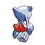

[Frames elegidos](../pokemon/froslass/back_selected.png) · [Todas las poses](../pokemon/froslass/back_source.png)

## SPHEAL

default.front · 64×64 · APNG [0, 1, 4, 33, 36]

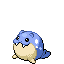

[Frames elegidos](../pokemon/spheal/anim_front_selected.png) · [Todas las poses](../pokemon/spheal/anim_front_source.png)

default.back · 64×64 · APNG [2, 4, 0]

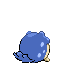

[Frames elegidos](../pokemon/spheal/back_selected.png) · [Todas las poses](../pokemon/spheal/back_source.png)

## SEALEO

default.front · 80×80 · APNG [5, 0, 9, 35, 41]

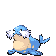

[Frames elegidos](../pokemon/sealeo/anim_front_selected.png) · [Todas las poses](../pokemon/sealeo/anim_front_source.png)

default.back · 64×64 · APNG [0, 1, 9]

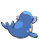

[Frames elegidos](../pokemon/sealeo/back_selected.png) · [Todas las poses](../pokemon/sealeo/back_source.png)

## WALREIN

default.front · 80×80 · APNG [4, 1, 8, 51, 55]

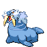

[Frames elegidos](../pokemon/walrein/anim_front_selected.png) · [Todas las poses](../pokemon/walrein/anim_front_source.png)

default.back · 80×80 · APNG [3, 0, 5]

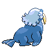

[Frames elegidos](../pokemon/walrein/back_selected.png) · [Todas las poses](../pokemon/walrein/back_source.png)

## BAGON

default.front · 64×64 · APNG [0, 6, 3, 22, 24]

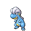

[Frames elegidos](../pokemon/bagon/anim_front_selected.png) · [Todas las poses](../pokemon/bagon/anim_front_source.png)

default.back · 64×64 · APNG [0, 6, 3]

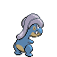

[Frames elegidos](../pokemon/bagon/back_selected.png) · [Todas las poses](../pokemon/bagon/back_source.png)

## SHELGON

default.front · 64×64 · APNG [0, 7, 2, 45, 47]

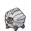

[Frames elegidos](../pokemon/shelgon/anim_front_selected.png) · [Todas las poses](../pokemon/shelgon/anim_front_source.png)

default.back · 64×64 · APNG [0, 4, 2]

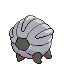

[Frames elegidos](../pokemon/shelgon/back_selected.png) · [Todas las poses](../pokemon/shelgon/back_source.png)

## SALAMENCE

default.front · 96×96 · APNG [0, 10, 5, 30, 42]

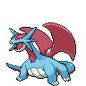

[Frames elegidos](../pokemon/salamence/anim_front_selected.png) · [Todas las poses](../pokemon/salamence/anim_front_source.png)

default.back · 96×96 · APNG [0, 10, 5]

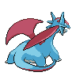

[Frames elegidos](../pokemon/salamence/back_selected.png) · [Todas las poses](../pokemon/salamence/back_source.png)

## BELDUM

default.front · 64×64 · APNG [0, 4, 8, 91, 96]

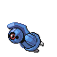

[Frames elegidos](../pokemon/beldum/anim_front_selected.png) · [Todas las poses](../pokemon/beldum/anim_front_source.png)

default.back · 64×64 · APNG [0, 4, 8]

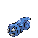

[Frames elegidos](../pokemon/beldum/back_selected.png) · [Todas las poses](../pokemon/beldum/back_source.png)

## METANG

default.front · 80×80 · APNG [0, 11, 5, 47, 52]

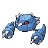

[Frames elegidos](../pokemon/metang/anim_front_selected.png) · [Todas las poses](../pokemon/metang/anim_front_source.png)

default.back · 80×80 · APNG [0, 11, 16]

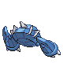

[Frames elegidos](../pokemon/metang/back_selected.png) · [Todas las poses](../pokemon/metang/back_source.png)

[Índice](../GALLERY.md) · [Anterior](page_13.md) · [Siguiente](page_15.md)
