# Galería / página 15

[Índice](../GALLERY.md) · [Anterior](page_14.md) · [Siguiente](page_16.md)

## METAGROSS

default.front · 96×96 · APNG [0, 8, 3, 23, 37]

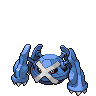

[Frames elegidos](../pokemon/metagross/anim_front_selected.png) · [Todas las poses](../pokemon/metagross/anim_front_source.png)

default.back · 80×80 · APNG [0, 8, 4]

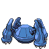

[Frames elegidos](../pokemon/metagross/back_selected.png) · [Todas las poses](../pokemon/metagross/back_source.png)

## LATIAS

default.front · 96×96 · APNG [0, 4, 9, 37, 41]

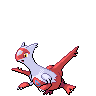

[Frames elegidos](../pokemon/latias/anim_front_selected.png) · [Todas las poses](../pokemon/latias/anim_front_source.png)

default.back · 80×80 · APNG [11, 4, 9]

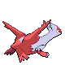

[Frames elegidos](../pokemon/latias/back_selected.png) · [Todas las poses](../pokemon/latias/back_source.png)

## LATIOS

default.front · 96×96 · APNG [2, 4, 0, 20, 22]

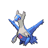

[Frames elegidos](../pokemon/latios/anim_front_selected.png) · [Todas las poses](../pokemon/latios/anim_front_source.png)

default.back · 80×80 · APNG [2, 4, 0]

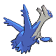

[Frames elegidos](../pokemon/latios/back_selected.png) · [Todas las poses](../pokemon/latios/back_source.png)

## KYOGRE

default.front · 109×109 · APNG [0, 18, 6, 83, 93]

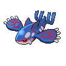

[Frames elegidos](../pokemon/kyogre/anim_front_selected.png) · [Todas las poses](../pokemon/kyogre/anim_front_source.png)

default.back · 109×109 · APNG [0, 18, 6]

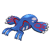

[Frames elegidos](../pokemon/kyogre/back_selected.png) · [Todas las poses](../pokemon/kyogre/back_source.png)

## GROUDON

default.front · 96×96 · APNG [0, 17, 4, 21, 27]

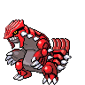

[Frames elegidos](../pokemon/groudon/anim_front_selected.png) · [Todas las poses](../pokemon/groudon/anim_front_source.png)

default.back · 96×96 · APNG [0, 8, 15]

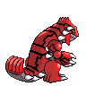

[Frames elegidos](../pokemon/groudon/back_selected.png) · [Todas las poses](../pokemon/groudon/back_source.png)

## RAYQUAZA

default.front · 110×110 · APNG [2, 5, 0, 33, 42]

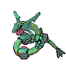

[Frames elegidos](../pokemon/rayquaza/anim_front_selected.png) · [Todas las poses](../pokemon/rayquaza/anim_front_source.png)

default.back · 110×110 · APNG [2, 0, 5]

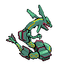

[Frames elegidos](../pokemon/rayquaza/back_selected.png) · [Todas las poses](../pokemon/rayquaza/back_source.png)

## DEOXYS_NORMAL

default.front · 80×80 · APNG [3, 0, 6, 27, 30]

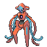

[Frames elegidos](../pokemon/deoxys/anim_front_selected.png) · [Todas las poses](../pokemon/deoxys/anim_front_source.png)

default.back · 80×80 · APNG [9, 0, 6]

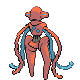

[Frames elegidos](../pokemon/deoxys/back_selected.png) · [Todas las poses](../pokemon/deoxys/back_source.png)

## TURTWIG

default.front · 64×64 · APNG [0, 7, 5, 33, 37]

[Frames elegidos](../pokemon/turtwig/anim_front_selected.png) · [Todas las poses](../pokemon/turtwig/anim_front_source.png)

default.back · 64×64 · APNG [0, 7, 4]

[Frames elegidos](../pokemon/turtwig/back_selected.png) · [Todas las poses](../pokemon/turtwig/back_source.png)

## GROTLE

default.front · 64×64 · APNG [0, 6, 18, 74, 76]

[Frames elegidos](../pokemon/grotle/anim_front_selected.png) · [Todas las poses](../pokemon/grotle/anim_front_source.png)

default.back · 64×64 · APNG [0, 18, 6]

[Frames elegidos](../pokemon/grotle/back_selected.png) · [Todas las poses](../pokemon/grotle/back_source.png)

## TORTERRA

default.front · 80×80 · APNG [8, 0, 6, 34, 39]

[Frames elegidos](../pokemon/torterra/anim_front_selected.png) · [Todas las poses](../pokemon/torterra/anim_front_source.png)

default.back · 96×96 · APNG [8, 0, 6]

[Frames elegidos](../pokemon/torterra/back_selected.png) · [Todas las poses](../pokemon/torterra/back_source.png)

## CHIMCHAR

default.front · 64×64 · APNG [13, 17, 9, 79, 82]

[Frames elegidos](../pokemon/chimchar/anim_front_selected.png) · [Todas las poses](../pokemon/chimchar/anim_front_source.png)

default.back · 64×64 · APNG [0, 16, 8]

[Frames elegidos](../pokemon/chimchar/back_selected.png) · [Todas las poses](../pokemon/chimchar/back_source.png)

## MONFERNO

default.front · 80×80 · APNG [12, 9, 17, 74, 77]

[Frames elegidos](../pokemon/monferno/anim_front_selected.png) · [Todas las poses](../pokemon/monferno/anim_front_source.png)

default.back · 64×64 · APNG [14, 1, 8]

[Frames elegidos](../pokemon/monferno/back_selected.png) · [Todas las poses](../pokemon/monferno/back_source.png)

## INFERNAPE

default.front · 80×80 · APNG [5, 0, 10, 87, 90]

[Frames elegidos](../pokemon/infernape/anim_front_selected.png) · [Todas las poses](../pokemon/infernape/anim_front_source.png)

default.back · 80×80 · APNG [0, 5, 12]

[Frames elegidos](../pokemon/infernape/back_selected.png) · [Todas las poses](../pokemon/infernape/back_source.png)

## PIPLUP

default.front · 64×64 · APNG [0, 2, 6, 61, 63]

[Frames elegidos](../pokemon/piplup/anim_front_selected.png) · [Todas las poses](../pokemon/piplup/anim_front_source.png)

default.back · 64×64 · APNG [3, 4, 6]

[Frames elegidos](../pokemon/piplup/back_selected.png) · [Todas las poses](../pokemon/piplup/back_source.png)

## PRINPLUP

default.front · 64×64 · APNG [0, 6, 4, 19, 23]

[Frames elegidos](../pokemon/prinplup/anim_front_selected.png) · [Todas las poses](../pokemon/prinplup/anim_front_source.png)

default.back · 64×64 · APNG [0, 6, 4]

[Frames elegidos](../pokemon/prinplup/back_selected.png) · [Todas las poses](../pokemon/prinplup/back_source.png)

## EMPOLEON

default.front · 96×96 · APNG [2, 6, 0, 53, 56]

[Frames elegidos](../pokemon/empoleon/anim_front_selected.png) · [Todas las poses](../pokemon/empoleon/anim_front_source.png)

default.back · 80×80 · APNG [0, 2, 5]

[Frames elegidos](../pokemon/empoleon/back_selected.png) · [Todas las poses](../pokemon/empoleon/back_source.png)

## STARLY

default.front · 64×64 · APNG [0, 5, 3, 46, 48]

[Frames elegidos](../pokemon/starly/anim_front_selected.png) · [Todas las poses](../pokemon/starly/anim_front_source.png)

default.back · 64×64 · APNG [0, 5, 3]

[Frames elegidos](../pokemon/starly/back_selected.png) · [Todas las poses](../pokemon/starly/back_source.png)

## STARAVIA

default.front · 64×64 · APNG [0, 6, 4, 25, 27]

[Frames elegidos](../pokemon/staravia/anim_front_selected.png) · [Todas las poses](../pokemon/staravia/anim_front_source.png)

default.back · 64×64 · APNG [0, 5, 4]

[Frames elegidos](../pokemon/staravia/back_selected.png) · [Todas las poses](../pokemon/staravia/back_source.png)

## STARAPTOR

default.front · 80×80 · APNG [6, 0, 3, 29, 34]

[Frames elegidos](../pokemon/staraptor/anim_front_selected.png) · [Todas las poses](../pokemon/staraptor/anim_front_source.png)

default.back · 64×64 · APNG [7, 9, 3]

[Frames elegidos](../pokemon/staraptor/back_selected.png) · [Todas las poses](../pokemon/staraptor/back_source.png)

## BIDOOF

default.front · 64×64 · APNG [0, 3, 6, 36, 38]

[Frames elegidos](../pokemon/bidoof/anim_front_selected.png) · [Todas las poses](../pokemon/bidoof/anim_front_source.png)

default.back · 64×64 · APNG [0, 4, 6]

[Frames elegidos](../pokemon/bidoof/back_selected.png) · [Todas las poses](../pokemon/bidoof/back_source.png)

## BIBAREL

default.front · 80×80 · APNG [13, 0, 15, 62, 65]

[Frames elegidos](../pokemon/bibarel/anim_front_selected.png) · [Todas las poses](../pokemon/bibarel/anim_front_source.png)

default.back · 64×64 · APNG [3, 0, 15]

[Frames elegidos](../pokemon/bibarel/back_selected.png) · [Todas las poses](../pokemon/bibarel/back_source.png)

## KRICKETOT

default.front · 64×64 · APNG [0, 14, 3, 53, 61]

[Frames elegidos](../pokemon/kricketot/anim_front_selected.png) · [Todas las poses](../pokemon/kricketot/anim_front_source.png)

default.back · 64×64 · APNG [0, 6, 2]

[Frames elegidos](../pokemon/kricketot/back_selected.png) · [Todas las poses](../pokemon/kricketot/back_source.png)

## KRICKETUNE

default.front · 80×80 · APNG [0, 5, 7, 46, 57]

[Frames elegidos](../pokemon/kricketune/anim_front_selected.png) · [Todas las poses](../pokemon/kricketune/anim_front_source.png)

default.back · 80×80 · APNG [0, 5, 7]

[Frames elegidos](../pokemon/kricketune/back_selected.png) · [Todas las poses](../pokemon/kricketune/back_source.png)

## SHINX

default.front · 64×64 · APNG [6, 1, 4, 37, 42]

[Frames elegidos](../pokemon/shinx/anim_front_selected.png) · [Todas las poses](../pokemon/shinx/anim_front_source.png)

default.back · 64×64 · APNG [0, 7, 4]

[Frames elegidos](../pokemon/shinx/back_selected.png) · [Todas las poses](../pokemon/shinx/back_source.png)

## LUXIO

default.front · 80×80 · APNG [0, 24, 9, 100, 111]

[Frames elegidos](../pokemon/luxio/anim_front_selected.png) · [Todas las poses](../pokemon/luxio/anim_front_source.png)

default.back · 64×64 · APNG [0, 12, 22]

[Frames elegidos](../pokemon/luxio/back_selected.png) · [Todas las poses](../pokemon/luxio/back_source.png)

[Índice](../GALLERY.md) · [Anterior](page_14.md) · [Siguiente](page_16.md)
