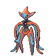
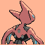
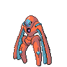
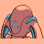
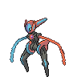
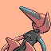

# Galería / página 15

[Índice](../GALLERY.md) · [Anterior](page_14.md) · [Siguiente](page_16.md)

## TROPIUS

default.front · 96×96 · APNG [4, 0, 8, 38, 43] · timing: source_timeline

[Frames elegidos](../pokemon/tropius/anim_front_selected.png) · [Todas las poses](../pokemon/tropius/anim_front_source.png)

default.back · 96×96 · APNG [4, 0, 8] · timing: source_idle_cycle

[Frames elegidos](../pokemon/tropius/back_selected.png) · [Todas las poses](../pokemon/tropius/back_source.png)

## CHINGLING

default.front · 64×64 · APNG [4, 15, 2, 69, 71] · timing: source_timeline

[Frames elegidos](../pokemon/chingling/anim_front_selected.png) · [Todas las poses](../pokemon/chingling/anim_front_source.png)

default.back · 64×64 · APNG [4, 15, 2] · timing: source_idle_cycle

[Frames elegidos](../pokemon/chingling/back_selected.png) · [Todas las poses](../pokemon/chingling/back_source.png)

## CHIMECHO

default.front · 80×80 · APNG [12, 8, 0, 40, 52] · timing: source_timeline

[Frames elegidos](../pokemon/chimecho/anim_front_selected.png) · [Todas las poses](../pokemon/chimecho/anim_front_source.png)

default.back · 80×80 · APNG [12, 9, 0] · timing: source_idle_cycle

[Frames elegidos](../pokemon/chimecho/back_selected.png) · [Todas las poses](../pokemon/chimecho/back_source.png)

## ABSOL

default.front · 80×80 · APNG [4, 0, 8, 41, 58] · timing: source_timeline

[Frames elegidos](../pokemon/absol/anim_front_selected.png) · [Todas las poses](../pokemon/absol/anim_front_source.png)

default.back · 80×80 · APNG [3, 1, 8] · timing: source_idle_cycle

[Frames elegidos](../pokemon/absol/back_selected.png) · [Todas las poses](../pokemon/absol/back_source.png)

## SNORUNT

default.front · 64×64 · APNG [0, 3, 1, 19, 22] · timing: source_timeline

[Frames elegidos](../pokemon/snorunt/anim_front_selected.png) · [Todas las poses](../pokemon/snorunt/anim_front_source.png)

default.back · 64×64 · APNG [0, 1, 4] · timing: source_idle_cycle

[Frames elegidos](../pokemon/snorunt/back_selected.png) · [Todas las poses](../pokemon/snorunt/back_source.png)

## GLALIE

default.front · 64×64 · APNG [2, 0, 4, 32, 33] · timing: source_timeline

[Frames elegidos](../pokemon/glalie/anim_front_selected.png) · [Todas las poses](../pokemon/glalie/anim_front_source.png)

default.back · 64×64 · APNG [2, 0, 4] · timing: source_idle_cycle

[Frames elegidos](../pokemon/glalie/back_selected.png) · [Todas las poses](../pokemon/glalie/back_source.png)

## FROSLASS

default.front · 80×80 · APNG [0, 11, 17, 33, 39] · timing: synthetic_special_cadence

[Frames elegidos](../pokemon/froslass/anim_front_selected.png) · [Todas las poses](../pokemon/froslass/anim_front_source.png)

default.back · 64×64 · APNG [0, 11, 17] · timing: source_idle_cycle

[Frames elegidos](../pokemon/froslass/back_selected.png) · [Todas las poses](../pokemon/froslass/back_source.png)

## SPHEAL

default.front · 64×64 · APNG [0, 1, 4, 33, 36] · timing: source_timeline

[Frames elegidos](../pokemon/spheal/anim_front_selected.png) · [Todas las poses](../pokemon/spheal/anim_front_source.png)

default.back · 64×64 · APNG [2, 4, 0] · timing: source_idle_cycle

[Frames elegidos](../pokemon/spheal/back_selected.png) · [Todas las poses](../pokemon/spheal/back_source.png)

## SEALEO

default.front · 80×80 · APNG [5, 0, 9, 35, 41] · timing: source_timeline

[Frames elegidos](../pokemon/sealeo/anim_front_selected.png) · [Todas las poses](../pokemon/sealeo/anim_front_source.png)

default.back · 64×64 · APNG [0, 1, 9] · timing: source_idle_cycle

[Frames elegidos](../pokemon/sealeo/back_selected.png) · [Todas las poses](../pokemon/sealeo/back_source.png)

## WALREIN

default.front · 80×80 · APNG [4, 1, 8, 51, 55] · timing: source_timeline

[Frames elegidos](../pokemon/walrein/anim_front_selected.png) · [Todas las poses](../pokemon/walrein/anim_front_source.png)

default.back · 80×80 · APNG [3, 0, 5] · timing: source_idle_cycle

[Frames elegidos](../pokemon/walrein/back_selected.png) · [Todas las poses](../pokemon/walrein/back_source.png)

## BAGON

default.front · 64×64 · APNG [0, 6, 3, 22, 24] · timing: source_timeline

[Frames elegidos](../pokemon/bagon/anim_front_selected.png) · [Todas las poses](../pokemon/bagon/anim_front_source.png)

default.back · 64×64 · APNG [0, 6, 3] · timing: source_idle_cycle

[Frames elegidos](../pokemon/bagon/back_selected.png) · [Todas las poses](../pokemon/bagon/back_source.png)

## SHELGON

default.front · 64×64 · APNG [0, 7, 2, 45, 47] · timing: source_timeline

[Frames elegidos](../pokemon/shelgon/anim_front_selected.png) · [Todas las poses](../pokemon/shelgon/anim_front_source.png)

default.back · 64×64 · APNG [0, 4, 2] · timing: source_idle_cycle

[Frames elegidos](../pokemon/shelgon/back_selected.png) · [Todas las poses](../pokemon/shelgon/back_source.png)

## SALAMENCE

default.front · 96×96 · APNG [0, 10, 5, 30, 42] · timing: source_timeline

[Frames elegidos](../pokemon/salamence/anim_front_selected.png) · [Todas las poses](../pokemon/salamence/anim_front_source.png)

default.back · 96×96 · APNG [0, 10, 5] · timing: source_idle_cycle

[Frames elegidos](../pokemon/salamence/back_selected.png) · [Todas las poses](../pokemon/salamence/back_source.png)

## BELDUM

default.front · 64×64 · APNG [0, 4, 8, 91, 96] · timing: source_timeline

[Frames elegidos](../pokemon/beldum/anim_front_selected.png) · [Todas las poses](../pokemon/beldum/anim_front_source.png)

default.back · 64×64 · APNG [0, 4, 8] · timing: source_idle_cycle

[Frames elegidos](../pokemon/beldum/back_selected.png) · [Todas las poses](../pokemon/beldum/back_source.png)

## METANG

default.front · 80×80 · APNG [0, 11, 5, 47, 52] · timing: source_timeline

[Frames elegidos](../pokemon/metang/anim_front_selected.png) · [Todas las poses](../pokemon/metang/anim_front_source.png)

default.back · 80×80 · APNG [0, 11, 16] · timing: source_idle_cycle

[Frames elegidos](../pokemon/metang/back_selected.png) · [Todas las poses](../pokemon/metang/back_source.png)

## METAGROSS

default.front · 96×96 · APNG [0, 8, 3, 23, 37] · timing: source_timeline

[Frames elegidos](../pokemon/metagross/anim_front_selected.png) · [Todas las poses](../pokemon/metagross/anim_front_source.png)

default.back · 80×80 · APNG [0, 8, 4] · timing: source_idle_cycle

[Frames elegidos](../pokemon/metagross/back_selected.png) · [Todas las poses](../pokemon/metagross/back_source.png)

## LATIAS

default.front · 96×96 · APNG [0, 4, 9, 37, 41] · timing: source_timeline

[Frames elegidos](../pokemon/latias/anim_front_selected.png) · [Todas las poses](../pokemon/latias/anim_front_source.png)

default.back · 80×80 · APNG [11, 4, 9] · timing: source_idle_cycle

[Frames elegidos](../pokemon/latias/back_selected.png) · [Todas las poses](../pokemon/latias/back_source.png)

## LATIOS

default.front · 96×96 · APNG [2, 4, 0, 20, 22] · timing: source_timeline

[Frames elegidos](../pokemon/latios/anim_front_selected.png) · [Todas las poses](../pokemon/latios/anim_front_source.png)

default.back · 80×80 · APNG [2, 4, 0] · timing: source_idle_cycle

[Frames elegidos](../pokemon/latios/back_selected.png) · [Todas las poses](../pokemon/latios/back_source.png)

## KYOGRE

default.front · 109×109 · APNG [0, 18, 6, 83, 93] · timing: source_timeline

[Frames elegidos](../pokemon/kyogre/anim_front_selected.png) · [Todas las poses](../pokemon/kyogre/anim_front_source.png)

default.back · 109×109 · APNG [0, 18, 6] · timing: source_idle_cycle

[Frames elegidos](../pokemon/kyogre/back_selected.png) · [Todas las poses](../pokemon/kyogre/back_source.png)

## GROUDON

default.front · 96×96 · APNG [0, 17, 4, 21, 27] · timing: source_timeline

[Frames elegidos](../pokemon/groudon/anim_front_selected.png) · [Todas las poses](../pokemon/groudon/anim_front_source.png)

default.back · 96×96 · APNG [0, 8, 15] · timing: source_idle_cycle

[Frames elegidos](../pokemon/groudon/back_selected.png) · [Todas las poses](../pokemon/groudon/back_source.png)

## RAYQUAZA

default.front · 110×110 · APNG [2, 5, 0, 33, 42] · timing: source_timeline

[Frames elegidos](../pokemon/rayquaza/anim_front_selected.png) · [Todas las poses](../pokemon/rayquaza/anim_front_source.png)

default.back · 110×110 · APNG [2, 0, 5] · timing: source_idle_cycle

[Frames elegidos](../pokemon/rayquaza/back_selected.png) · [Todas las poses](../pokemon/rayquaza/back_source.png)

## DEOXYS_NORMAL

default.front · 80×80 · APNG [3, 0, 6, 27, 30] · timing: source_timeline

[Frames elegidos](../pokemon/deoxys/anim_front_selected.png) · [Todas las poses](../pokemon/deoxys/anim_front_source.png)

default.back · 80×80 · APNG [9, 0, 6] · timing: source_idle_cycle

[Frames elegidos](../pokemon/deoxys/back_selected.png) · [Todas las poses](../pokemon/deoxys/back_source.png)

## DEOXYS_ATTACK

default.front · 96×96 · tira original [0, 1, 0, 2, 3] · timing: legacy_estimated

[Frames elegidos](../pokemon/deoxys/attack/anim_front_selected.png) · [Todas las poses](../pokemon/deoxys/attack/anim_front_source.png)

default.back · 64×64 · tira original [0, 0, 0] · timing: legacy_estimated

[Frames elegidos](../pokemon/deoxys/attack/back_selected.png) · [Todas las poses](../pokemon/deoxys/attack/back_source.png)

## DEOXYS_DEFENSE

default.front · 96×96 · tira original [0, 1, 0, 2, 3] · timing: legacy_estimated

[Frames elegidos](../pokemon/deoxys/defense/anim_front_selected.png) · [Todas las poses](../pokemon/deoxys/defense/anim_front_source.png)

default.back · 64×64 · tira original [0, 0, 0] · timing: legacy_estimated

[Frames elegidos](../pokemon/deoxys/defense/back_selected.png) · [Todas las poses](../pokemon/deoxys/defense/back_source.png)

## DEOXYS_SPEED

default.front · 96×96 · tira original [0, 1, 0, 2, 3] · timing: legacy_estimated

[Frames elegidos](../pokemon/deoxys/speed/anim_front_selected.png) · [Todas las poses](../pokemon/deoxys/speed/anim_front_source.png)

default.back · 64×64 · tira original [0, 0, 0] · timing: legacy_estimated

[Frames elegidos](../pokemon/deoxys/speed/back_selected.png) · [Todas las poses](../pokemon/deoxys/speed/back_source.png)

[Índice](../GALLERY.md) · [Anterior](page_14.md) · [Siguiente](page_16.md)
