# Galería / página 16

[Índice](../GALLERY.md) · [Anterior](page_15.md) · [Siguiente](page_17.md)

## TURTWIG

default.front · 64×64 · APNG [0, 7, 5, 33, 37] · timing: source_timeline

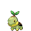

[Frames elegidos](../pokemon/turtwig/anim_front_selected.png) · [Todas las poses](../pokemon/turtwig/anim_front_source.png)

default.back · 64×64 · APNG [0, 7, 4] · timing: source_idle_cycle

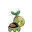

[Frames elegidos](../pokemon/turtwig/back_selected.png) · [Todas las poses](../pokemon/turtwig/back_source.png)

## GROTLE

default.front · 64×64 · APNG [0, 6, 18, 74, 76] · timing: source_timeline

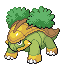

[Frames elegidos](../pokemon/grotle/anim_front_selected.png) · [Todas las poses](../pokemon/grotle/anim_front_source.png)

default.back · 64×64 · APNG [0, 18, 6] · timing: source_idle_cycle

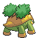

[Frames elegidos](../pokemon/grotle/back_selected.png) · [Todas las poses](../pokemon/grotle/back_source.png)

## TORTERRA

default.front · 80×80 · APNG [8, 0, 6, 34, 39] · timing: source_timeline

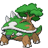

[Frames elegidos](../pokemon/torterra/anim_front_selected.png) · [Todas las poses](../pokemon/torterra/anim_front_source.png)

default.back · 96×96 · APNG [8, 0, 6] · timing: source_idle_cycle

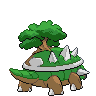

[Frames elegidos](../pokemon/torterra/back_selected.png) · [Todas las poses](../pokemon/torterra/back_source.png)

## CHIMCHAR

default.front · 64×64 · APNG [13, 17, 9, 79, 82] · timing: source_timeline

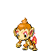

[Frames elegidos](../pokemon/chimchar/anim_front_selected.png) · [Todas las poses](../pokemon/chimchar/anim_front_source.png)

default.back · 64×64 · APNG [0, 16, 8] · timing: source_idle_cycle

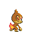

[Frames elegidos](../pokemon/chimchar/back_selected.png) · [Todas las poses](../pokemon/chimchar/back_source.png)

## MONFERNO

default.front · 80×80 · APNG [12, 9, 17, 74, 77] · timing: source_timeline

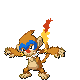

[Frames elegidos](../pokemon/monferno/anim_front_selected.png) · [Todas las poses](../pokemon/monferno/anim_front_source.png)

default.back · 64×64 · APNG [14, 1, 8] · timing: source_idle_cycle

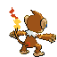

[Frames elegidos](../pokemon/monferno/back_selected.png) · [Todas las poses](../pokemon/monferno/back_source.png)

## INFERNAPE

default.front · 80×80 · APNG [5, 0, 10, 87, 90] · timing: source_timeline

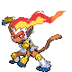

[Frames elegidos](../pokemon/infernape/anim_front_selected.png) · [Todas las poses](../pokemon/infernape/anim_front_source.png)

default.back · 80×80 · APNG [0, 5, 12] · timing: source_idle_cycle

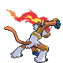

[Frames elegidos](../pokemon/infernape/back_selected.png) · [Todas las poses](../pokemon/infernape/back_source.png)

## PIPLUP

default.front · 64×64 · APNG [0, 2, 6, 61, 63] · timing: source_timeline

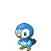

[Frames elegidos](../pokemon/piplup/anim_front_selected.png) · [Todas las poses](../pokemon/piplup/anim_front_source.png)

default.back · 64×64 · APNG [3, 4, 6] · timing: source_idle_cycle

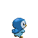

[Frames elegidos](../pokemon/piplup/back_selected.png) · [Todas las poses](../pokemon/piplup/back_source.png)

## PRINPLUP

default.front · 64×64 · APNG [0, 6, 4, 19, 23] · timing: source_timeline

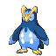

[Frames elegidos](../pokemon/prinplup/anim_front_selected.png) · [Todas las poses](../pokemon/prinplup/anim_front_source.png)

default.back · 64×64 · APNG [0, 6, 4] · timing: source_idle_cycle

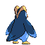

[Frames elegidos](../pokemon/prinplup/back_selected.png) · [Todas las poses](../pokemon/prinplup/back_source.png)

## EMPOLEON

default.front · 96×96 · APNG [2, 6, 0, 53, 56] · timing: source_timeline

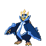

[Frames elegidos](../pokemon/empoleon/anim_front_selected.png) · [Todas las poses](../pokemon/empoleon/anim_front_source.png)

default.back · 80×80 · APNG [0, 2, 5] · timing: source_idle_cycle

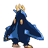

[Frames elegidos](../pokemon/empoleon/back_selected.png) · [Todas las poses](../pokemon/empoleon/back_source.png)

## STARLY

default.front · 64×64 · APNG [0, 5, 3, 46, 48] · timing: source_timeline

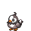

[Frames elegidos](../pokemon/starly/anim_front_selected.png) · [Todas las poses](../pokemon/starly/anim_front_source.png)

default.back · 64×64 · APNG [0, 5, 3] · timing: source_idle_cycle

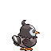

[Frames elegidos](../pokemon/starly/back_selected.png) · [Todas las poses](../pokemon/starly/back_source.png)

female.front · 64×64 · tira original [0, 1, 0, 2, 3] · timing: shared_species_timing

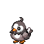

[Frames elegidos](../pokemon/starly/anim_frontf_selected.png) · [Todas las poses](../pokemon/starly/anim_frontf_source.png)

female.back · 64×64 · tira original [0, 0, 0] · timing: shared_species_timing

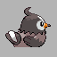

[Frames elegidos](../pokemon/starly/backf_selected.png) · [Todas las poses](../pokemon/starly/backf_source.png)

## STARAVIA

default.front · 64×64 · APNG [0, 6, 4, 25, 27] · timing: source_timeline

[Frames elegidos](../pokemon/staravia/anim_front_selected.png) · [Todas las poses](../pokemon/staravia/anim_front_source.png)

default.back · 64×64 · APNG [0, 5, 4] · timing: source_idle_cycle

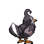

[Frames elegidos](../pokemon/staravia/back_selected.png) · [Todas las poses](../pokemon/staravia/back_source.png)

female.front · 64×64 · tira original [0, 1, 0, 2, 3] · timing: shared_species_timing

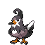

[Frames elegidos](../pokemon/staravia/anim_frontf_selected.png) · [Todas las poses](../pokemon/staravia/anim_frontf_source.png)

female.back · 64×64 · tira original [0, 0, 0] · timing: shared_species_timing

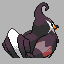

[Frames elegidos](../pokemon/staravia/backf_selected.png) · [Todas las poses](../pokemon/staravia/backf_source.png)

## STARAPTOR

default.front · 80×80 · APNG [6, 0, 3, 29, 34] · timing: source_timeline

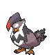

[Frames elegidos](../pokemon/staraptor/anim_front_selected.png) · [Todas las poses](../pokemon/staraptor/anim_front_source.png)

default.back · 64×64 · APNG [7, 9, 3] · timing: source_idle_cycle

[Frames elegidos](../pokemon/staraptor/back_selected.png) · [Todas las poses](../pokemon/staraptor/back_source.png)

female.front · 80×80 · tira original [0, 1, 0, 2, 3] · timing: shared_species_timing

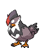

[Frames elegidos](../pokemon/staraptor/anim_frontf_selected.png) · [Todas las poses](../pokemon/staraptor/anim_frontf_source.png)

female.back · 64×64 · APNG [7, 9, 3] · timing: shared_species_timing

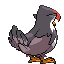

[Frames elegidos](../pokemon/staraptor/backf_selected.png) · [Todas las poses](../pokemon/staraptor/backf_source.png)

## BIDOOF

default.front · 64×64 · APNG [0, 3, 6, 36, 38] · timing: source_timeline

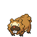

[Frames elegidos](../pokemon/bidoof/anim_front_selected.png) · [Todas las poses](../pokemon/bidoof/anim_front_source.png)

default.back · 64×64 · APNG [0, 4, 6] · timing: source_idle_cycle

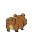

[Frames elegidos](../pokemon/bidoof/back_selected.png) · [Todas las poses](../pokemon/bidoof/back_source.png)

female.front · 64×64 · tira original [0, 1, 0, 2, 3] · timing: shared_species_timing

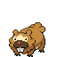

[Frames elegidos](../pokemon/bidoof/anim_frontf_selected.png) · [Todas las poses](../pokemon/bidoof/anim_frontf_source.png)

female.back · 64×64 · tira original [0, 0, 0] · timing: shared_species_timing

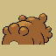

[Frames elegidos](../pokemon/bidoof/backf_selected.png) · [Todas las poses](../pokemon/bidoof/backf_source.png)

## BIBAREL

default.front · 80×80 · APNG [13, 0, 15, 62, 65] · timing: source_timeline

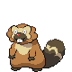

[Frames elegidos](../pokemon/bibarel/anim_front_selected.png) · [Todas las poses](../pokemon/bibarel/anim_front_source.png)

default.back · 64×64 · APNG [3, 0, 15] · timing: source_idle_cycle

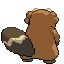

[Frames elegidos](../pokemon/bibarel/back_selected.png) · [Todas las poses](../pokemon/bibarel/back_source.png)

female.front · 80×80 · tira original [0, 1, 0, 2, 3] · timing: shared_species_timing

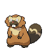

[Frames elegidos](../pokemon/bibarel/anim_frontf_selected.png) · [Todas las poses](../pokemon/bibarel/anim_frontf_source.png)

female.back · 64×64 · APNG [3, 0, 15] · timing: shared_species_timing

[Frames elegidos](../pokemon/bibarel/backf_selected.png) · [Todas las poses](../pokemon/bibarel/backf_source.png)

## KRICKETOT

default.front · 64×64 · APNG [0, 14, 3, 53, 61] · timing: source_timeline

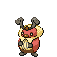

[Frames elegidos](../pokemon/kricketot/anim_front_selected.png) · [Todas las poses](../pokemon/kricketot/anim_front_source.png)

default.back · 64×64 · APNG [0, 6, 2] · timing: source_idle_cycle

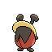

[Frames elegidos](../pokemon/kricketot/back_selected.png) · [Todas las poses](../pokemon/kricketot/back_source.png)

female.front · 64×64 · tira original [0, 1, 0, 2, 3] · timing: shared_species_timing

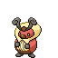

[Frames elegidos](../pokemon/kricketot/anim_frontf_selected.png) · [Todas las poses](../pokemon/kricketot/anim_frontf_source.png)

female.back · 64×64 · tira original [0, 0, 0] · timing: shared_species_timing

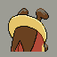

[Frames elegidos](../pokemon/kricketot/backf_selected.png) · [Todas las poses](../pokemon/kricketot/backf_source.png)

## KRICKETUNE

default.front · 80×80 · APNG [0, 5, 7, 46, 57] · timing: source_timeline

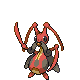

[Frames elegidos](../pokemon/kricketune/anim_front_selected.png) · [Todas las poses](../pokemon/kricketune/anim_front_source.png)

default.back · 80×80 · APNG [0, 5, 7] · timing: source_idle_cycle

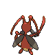

[Frames elegidos](../pokemon/kricketune/back_selected.png) · [Todas las poses](../pokemon/kricketune/back_source.png)

female.front · 64×64 · tira original [0, 1, 0, 1, 1] · timing: shared_species_timing

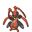

[Frames elegidos](../pokemon/kricketune/anim_frontf_selected.png) · [Todas las poses](../pokemon/kricketune/anim_frontf_source.png)

female.back · 64×64 · tira original [0, 0, 0] · timing: shared_species_timing

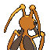

[Frames elegidos](../pokemon/kricketune/backf_selected.png) · [Todas las poses](../pokemon/kricketune/backf_source.png)

## SHINX

default.front · 64×64 · APNG [6, 1, 4, 37, 42] · timing: source_timeline

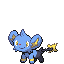

[Frames elegidos](../pokemon/shinx/anim_front_selected.png) · [Todas las poses](../pokemon/shinx/anim_front_source.png)

default.back · 64×64 · APNG [0, 7, 4] · timing: source_idle_cycle

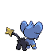

[Frames elegidos](../pokemon/shinx/back_selected.png) · [Todas las poses](../pokemon/shinx/back_source.png)

female.front · 64×64 · tira original [0, 1, 0, 2, 3] · timing: shared_species_timing

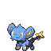

[Frames elegidos](../pokemon/shinx/anim_frontf_selected.png) · [Todas las poses](../pokemon/shinx/anim_frontf_source.png)

female.back · 64×64 · tira original [0, 0, 0] · timing: shared_species_timing

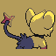

[Frames elegidos](../pokemon/shinx/backf_selected.png) · [Todas las poses](../pokemon/shinx/backf_source.png)

## LUXIO

default.front · 80×80 · APNG [0, 24, 9, 100, 111] · timing: source_timeline

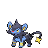

[Frames elegidos](../pokemon/luxio/anim_front_selected.png) · [Todas las poses](../pokemon/luxio/anim_front_source.png)

default.back · 64×64 · APNG [0, 12, 22] · timing: source_idle_cycle

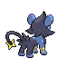

[Frames elegidos](../pokemon/luxio/back_selected.png) · [Todas las poses](../pokemon/luxio/back_source.png)

female.front · 80×80 · tira original [0, 1, 0, 2, 3] · timing: shared_species_timing

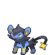

[Frames elegidos](../pokemon/luxio/anim_frontf_selected.png) · [Todas las poses](../pokemon/luxio/anim_frontf_source.png)

female.back · 64×64 · tira original [0, 0, 0] · timing: shared_species_timing

[Frames elegidos](../pokemon/luxio/backf_selected.png) · [Todas las poses](../pokemon/luxio/backf_source.png)

## LUXRAY

default.front · 80×80 · APNG [0, 6, 1, 52, 56] · timing: source_timeline

[Frames elegidos](../pokemon/luxray/anim_front_selected.png) · [Todas las poses](../pokemon/luxray/anim_front_source.png)

default.back · 80×80 · APNG [0, 2, 6] · timing: source_idle_cycle

[Frames elegidos](../pokemon/luxray/back_selected.png) · [Todas las poses](../pokemon/luxray/back_source.png)

female.front · 80×80 · tira original [0, 1, 0, 2, 3] · timing: shared_species_timing

[Frames elegidos](../pokemon/luxray/anim_frontf_selected.png) · [Todas las poses](../pokemon/luxray/anim_frontf_source.png)

female.back · 64×64 · tira original [0, 0, 0] · timing: shared_species_timing

[Frames elegidos](../pokemon/luxray/backf_selected.png) · [Todas las poses](../pokemon/luxray/backf_source.png)

## CRANIDOS

default.front · 64×64 · APNG [0, 1, 6, 38, 40] · timing: source_timeline

[Frames elegidos](../pokemon/cranidos/anim_front_selected.png) · [Todas las poses](../pokemon/cranidos/anim_front_source.png)

default.back · 64×64 · APNG [0, 1, 6] · timing: source_idle_cycle

[Frames elegidos](../pokemon/cranidos/back_selected.png) · [Todas las poses](../pokemon/cranidos/back_source.png)

## RAMPARDOS

default.front · 96×96 · APNG [8, 0, 6, 50, 58] · timing: source_timeline

[Frames elegidos](../pokemon/rampardos/anim_front_selected.png) · [Todas las poses](../pokemon/rampardos/anim_front_source.png)

default.back · 80×80 · APNG [0, 3, 6] · timing: source_idle_cycle

[Frames elegidos](../pokemon/rampardos/back_selected.png) · [Todas las poses](../pokemon/rampardos/back_source.png)

## SHIELDON

default.front · 64×64 · APNG [3, 0, 4, 36, 41] · timing: source_timeline

[Frames elegidos](../pokemon/shieldon/anim_front_selected.png) · [Todas las poses](../pokemon/shieldon/anim_front_source.png)

default.back · 64×64 · APNG [3, 0, 4] · timing: source_idle_cycle

[Frames elegidos](../pokemon/shieldon/back_selected.png) · [Todas las poses](../pokemon/shieldon/back_source.png)

## BASTIODON

default.front · 80×80 · APNG [0, 1, 5, 39, 43] · timing: source_timeline

[Frames elegidos](../pokemon/bastiodon/anim_front_selected.png) · [Todas las poses](../pokemon/bastiodon/anim_front_source.png)

default.back · 80×80 · APNG [0, 1, 5] · timing: source_idle_cycle

[Frames elegidos](../pokemon/bastiodon/back_selected.png) · [Todas las poses](../pokemon/bastiodon/back_source.png)

## COMBEE

default.front · 80×80 · APNG [12, 25, 5, 63, 73] · timing: source_timeline

[Frames elegidos](../pokemon/combee/anim_front_selected.png) · [Todas las poses](../pokemon/combee/anim_front_source.png)

default.back · 64×64 · APNG [16, 25, 5] · timing: source_idle_cycle

[Frames elegidos](../pokemon/combee/back_selected.png) · [Todas las poses](../pokemon/combee/back_source.png)

female.front · 64×64 · tira original [0, 1, 0, 2, 3] · timing: shared_species_timing

[Frames elegidos](../pokemon/combee/anim_frontf_selected.png) · [Todas las poses](../pokemon/combee/anim_frontf_source.png)

female.back · 64×64 · APNG [16, 25, 5] · timing: shared_species_timing

[Frames elegidos](../pokemon/combee/backf_selected.png) · [Todas las poses](../pokemon/combee/backf_source.png)

## VESPIQUEN

default.front · 80×80 · APNG [60, 1, 27, 215, 265] · timing: source_timeline

[Frames elegidos](../pokemon/vespiquen/anim_front_selected.png) · [Todas las poses](../pokemon/vespiquen/anim_front_source.png)

default.back · 80×80 · APNG [92, 8, 77] · timing: source_idle_cycle

[Frames elegidos](../pokemon/vespiquen/back_selected.png) · [Todas las poses](../pokemon/vespiquen/back_source.png)

[Índice](../GALLERY.md) · [Anterior](page_15.md) · [Siguiente](page_17.md)
