# Galería / página 16

[Índice](../GALLERY.md) · [Anterior](page_15.md) · [Siguiente](page_17.md)

## LUXRAY

default.front · 80×80 · APNG [0, 6, 1, 52, 56]

[Frames elegidos](../pokemon/luxray/anim_front_selected.png) · [Todas las poses](../pokemon/luxray/anim_front_source.png)

default.back · 80×80 · APNG [0, 2, 6]

[Frames elegidos](../pokemon/luxray/back_selected.png) · [Todas las poses](../pokemon/luxray/back_source.png)

## CRANIDOS

default.front · 64×64 · APNG [0, 1, 6, 38, 40]

[Frames elegidos](../pokemon/cranidos/anim_front_selected.png) · [Todas las poses](../pokemon/cranidos/anim_front_source.png)

default.back · 64×64 · APNG [0, 1, 6]

[Frames elegidos](../pokemon/cranidos/back_selected.png) · [Todas las poses](../pokemon/cranidos/back_source.png)

## RAMPARDOS

default.front · 96×96 · APNG [8, 0, 6, 50, 58]

[Frames elegidos](../pokemon/rampardos/anim_front_selected.png) · [Todas las poses](../pokemon/rampardos/anim_front_source.png)

default.back · 80×80 · APNG [0, 3, 6]

[Frames elegidos](../pokemon/rampardos/back_selected.png) · [Todas las poses](../pokemon/rampardos/back_source.png)

## SHIELDON

default.front · 64×64 · APNG [3, 0, 4, 36, 41]

[Frames elegidos](../pokemon/shieldon/anim_front_selected.png) · [Todas las poses](../pokemon/shieldon/anim_front_source.png)

default.back · 64×64 · APNG [3, 0, 4]

[Frames elegidos](../pokemon/shieldon/back_selected.png) · [Todas las poses](../pokemon/shieldon/back_source.png)

## BASTIODON

default.front · 80×80 · APNG [0, 1, 5, 39, 43]

[Frames elegidos](../pokemon/bastiodon/anim_front_selected.png) · [Todas las poses](../pokemon/bastiodon/anim_front_source.png)

default.back · 80×80 · APNG [0, 1, 5]

[Frames elegidos](../pokemon/bastiodon/back_selected.png) · [Todas las poses](../pokemon/bastiodon/back_source.png)

## COMBEE

default.front · 80×80 · APNG [12, 25, 5, 63, 73]

[Frames elegidos](../pokemon/combee/anim_front_selected.png) · [Todas las poses](../pokemon/combee/anim_front_source.png)

default.back · 64×64 · APNG [16, 25, 5]

[Frames elegidos](../pokemon/combee/back_selected.png) · [Todas las poses](../pokemon/combee/back_source.png)

## VESPIQUEN

default.front · 80×80 · APNG [60, 1, 27, 215, 265]

[Frames elegidos](../pokemon/vespiquen/anim_front_selected.png) · [Todas las poses](../pokemon/vespiquen/anim_front_source.png)

default.back · 80×80 · APNG [92, 8, 77]

[Frames elegidos](../pokemon/vespiquen/back_selected.png) · [Todas las poses](../pokemon/vespiquen/back_source.png)

## DRIFLOON

default.front · 80×80 · APNG [8, 0, 16, 29, 40]

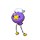

[Frames elegidos](../pokemon/drifloon/anim_front_selected.png) · [Todas las poses](../pokemon/drifloon/anim_front_source.png)

default.back · 64×64 · APNG [8, 16, 0]

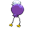

[Frames elegidos](../pokemon/drifloon/back_selected.png) · [Todas las poses](../pokemon/drifloon/back_source.png)

## DRIFBLIM

default.front · 80×80 · APNG [10, 6, 0, 19, 27]

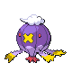

[Frames elegidos](../pokemon/drifblim/anim_front_selected.png) · [Todas las poses](../pokemon/drifblim/anim_front_source.png)

default.back · 80×80 · APNG [10, 6, 0]

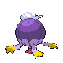

[Frames elegidos](../pokemon/drifblim/back_selected.png) · [Todas las poses](../pokemon/drifblim/back_source.png)

## BUNEARY

default.front · 80×80 · APNG [6, 0, 4, 62, 64]

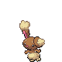

[Frames elegidos](../pokemon/buneary/anim_front_selected.png) · [Todas las poses](../pokemon/buneary/anim_front_source.png)

default.back · 64×64 · APNG [6, 0, 4]

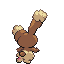

[Frames elegidos](../pokemon/buneary/back_selected.png) · [Todas las poses](../pokemon/buneary/back_source.png)

## LOPUNNY

default.front · 80×80 · APNG [0, 5, 7, 39, 43]

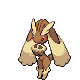

[Frames elegidos](../pokemon/lopunny/anim_front_selected.png) · [Todas las poses](../pokemon/lopunny/anim_front_source.png)

default.back · 64×64 · APNG [0, 5, 7]

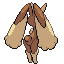

[Frames elegidos](../pokemon/lopunny/back_selected.png) · [Todas las poses](../pokemon/lopunny/back_source.png)

## GIBLE

default.front · 64×64 · APNG [4, 0, 3, 48, 58]

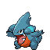

[Frames elegidos](../pokemon/gible/anim_front_selected.png) · [Todas las poses](../pokemon/gible/anim_front_source.png)

default.back · 64×64 · APNG [4, 0, 3]

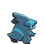

[Frames elegidos](../pokemon/gible/back_selected.png) · [Todas las poses](../pokemon/gible/back_source.png)

## GABITE

default.front · 80×80 · APNG [4, 0, 3, 19, 23]

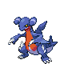

[Frames elegidos](../pokemon/gabite/anim_front_selected.png) · [Todas las poses](../pokemon/gabite/anim_front_source.png)

default.back · 80×80 · APNG [4, 0, 3]

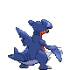

[Frames elegidos](../pokemon/gabite/back_selected.png) · [Todas las poses](../pokemon/gabite/back_source.png)

## GARCHOMP

default.front · 96×96 · APNG [5, 0, 4, 30, 34]

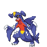

[Frames elegidos](../pokemon/garchomp/anim_front_selected.png) · [Todas las poses](../pokemon/garchomp/anim_front_source.png)

default.back · 80×80 · APNG [5, 0, 3]

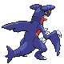

[Frames elegidos](../pokemon/garchomp/back_selected.png) · [Todas las poses](../pokemon/garchomp/back_source.png)

## RIOLU

default.front · 64×64 · APNG [0, 2, 5, 23, 24]

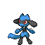

[Frames elegidos](../pokemon/riolu/anim_front_selected.png) · [Todas las poses](../pokemon/riolu/anim_front_source.png)

default.back · 64×64 · APNG [6, 8, 4]

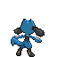

[Frames elegidos](../pokemon/riolu/back_selected.png) · [Todas las poses](../pokemon/riolu/back_source.png)

## LUCARIO

default.front · 64×64 · APNG [6, 0, 4, 21, 24]

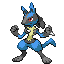

[Frames elegidos](../pokemon/lucario/anim_front_selected.png) · [Todas las poses](../pokemon/lucario/anim_front_source.png)

default.back · 80×80 · APNG [6, 8, 4]

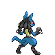

[Frames elegidos](../pokemon/lucario/back_selected.png) · [Todas las poses](../pokemon/lucario/back_source.png)

## SKORUPI

default.front · 80×80 · APNG [2, 0, 5, 35, 46]

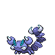

[Frames elegidos](../pokemon/skorupi/anim_front_selected.png) · [Todas las poses](../pokemon/skorupi/anim_front_source.png)

default.back · 80×80 · APNG [3, 0, 5]

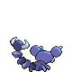

[Frames elegidos](../pokemon/skorupi/back_selected.png) · [Todas las poses](../pokemon/skorupi/back_source.png)

## DRAPION

default.front · 96×96 · APNG [3, 0, 7, 73, 82]

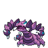

[Frames elegidos](../pokemon/drapion/anim_front_selected.png) · [Todas las poses](../pokemon/drapion/anim_front_source.png)

default.back · 99×99 · APNG [4, 0, 7]

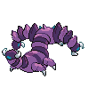

[Frames elegidos](../pokemon/drapion/back_selected.png) · [Todas las poses](../pokemon/drapion/back_source.png)

## CROAGUNK

default.front · 64×64 · APNG [0, 15, 5, 64, 67]

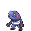

[Frames elegidos](../pokemon/croagunk/anim_front_selected.png) · [Todas las poses](../pokemon/croagunk/anim_front_source.png)

default.back · 64×64 · APNG [0, 7, 15]

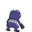

[Frames elegidos](../pokemon/croagunk/back_selected.png) · [Todas las poses](../pokemon/croagunk/back_source.png)

## TOXICROAK

default.front · 64×64 · APNG [2, 0, 4, 38, 44]

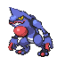

[Frames elegidos](../pokemon/toxicroak/anim_front_selected.png) · [Todas las poses](../pokemon/toxicroak/anim_front_source.png)

default.back · 64×64 · APNG [3, 0, 4]

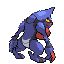

[Frames elegidos](../pokemon/toxicroak/back_selected.png) · [Todas las poses](../pokemon/toxicroak/back_source.png)

## SNOVER

default.front · 80×80 · APNG [0, 7, 5, 23, 33]

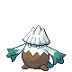

[Frames elegidos](../pokemon/snover/anim_front_selected.png) · [Todas las poses](../pokemon/snover/anim_front_source.png)

default.back · 80×80 · APNG [0, 7, 5]

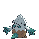

[Frames elegidos](../pokemon/snover/back_selected.png) · [Todas las poses](../pokemon/snover/back_source.png)

## ABOMASNOW

default.front · 96×96 · APNG [2, 0, 5, 27, 33]

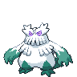

[Frames elegidos](../pokemon/abomasnow/anim_front_selected.png) · [Todas las poses](../pokemon/abomasnow/anim_front_source.png)

default.back · 96×96 · APNG [2, 0, 5]

[Frames elegidos](../pokemon/abomasnow/back_selected.png) · [Todas las poses](../pokemon/abomasnow/back_source.png)

## ROTOM

default.front · 96×96 · APNG [4, 10, 15, 35, 38]

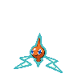

[Frames elegidos](../pokemon/rotom/anim_front_selected.png) · [Todas las poses](../pokemon/rotom/anim_front_source.png)

default.back · 96×96 · APNG [4, 10, 15]

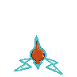

[Frames elegidos](../pokemon/rotom/back_selected.png) · [Todas las poses](../pokemon/rotom/back_source.png)

## HEATRAN

default.front · 96×96 · APNG [2, 0, 3, 68, 84]

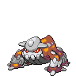

[Frames elegidos](../pokemon/heatran/anim_front_selected.png) · [Todas las poses](../pokemon/heatran/anim_front_source.png)

default.back · 96×96 · APNG [1, 0, 3]

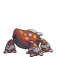

[Frames elegidos](../pokemon/heatran/back_selected.png) · [Todas las poses](../pokemon/heatran/back_source.png)

## REGIROCK

default.front · 80×80 · APNG [0, 9, 5, 25, 33]

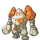

[Frames elegidos](../pokemon/regirock/anim_front_selected.png) · [Todas las poses](../pokemon/regirock/anim_front_source.png)

default.back · 80×80 · APNG [0, 9, 5]

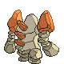

[Frames elegidos](../pokemon/regirock/back_selected.png) · [Todas las poses](../pokemon/regirock/back_source.png)

[Índice](../GALLERY.md) · [Anterior](page_15.md) · [Siguiente](page_17.md)
