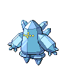
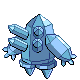
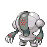
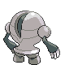
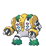
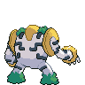

# Galería / página 17

[Índice](../GALLERY.md) · [Anterior](page_16.md)

## REGICE

default.front · 96×96 · APNG [1, 3, 5, 22, 28]

[Frames elegidos](../pokemon/regice/anim_front_selected.png) · [Todas las poses](../pokemon/regice/anim_front_source.png)

default.back · 80×80 · APNG [1, 3, 5]

[Frames elegidos](../pokemon/regice/back_selected.png) · [Todas las poses](../pokemon/regice/back_source.png)

## REGISTEEL

default.front · 80×80 · APNG [0, 5, 2, 22, 25]

[Frames elegidos](../pokemon/registeel/anim_front_selected.png) · [Todas las poses](../pokemon/registeel/anim_front_source.png)

default.back · 80×80 · APNG [0, 1, 4]

[Frames elegidos](../pokemon/registeel/back_selected.png) · [Todas las poses](../pokemon/registeel/back_source.png)

## REGIGIGAS

default.front · 96×96 · APNG [4, 0, 7, 52, 65]

[Frames elegidos](../pokemon/regigigas/anim_front_selected.png) · [Todas las poses](../pokemon/regigigas/anim_front_source.png)

default.back · 96×96 · APNG [8, 0, 6]

[Frames elegidos](../pokemon/regigigas/back_selected.png) · [Todas las poses](../pokemon/regigigas/back_source.png)

[Índice](../GALLERY.md) · [Anterior](page_16.md)
