# Galería / página 17

[Índice](../GALLERY.md) · [Anterior](page_16.md) · [Siguiente](page_18.md)

## DRIFLOON

default.front · 80×80 · APNG [8, 0, 16, 29, 40] · timing: source_timeline

[Frames elegidos](../pokemon/drifloon/anim_front_selected.png) · [Todas las poses](../pokemon/drifloon/anim_front_source.png)

default.back · 64×64 · APNG [8, 16, 0] · timing: source_idle_cycle

[Frames elegidos](../pokemon/drifloon/back_selected.png) · [Todas las poses](../pokemon/drifloon/back_source.png)

## DRIFBLIM

default.front · 80×80 · APNG [10, 6, 0, 19, 27] · timing: source_timeline

[Frames elegidos](../pokemon/drifblim/anim_front_selected.png) · [Todas las poses](../pokemon/drifblim/anim_front_source.png)

default.back · 80×80 · APNG [10, 6, 0] · timing: source_idle_cycle

[Frames elegidos](../pokemon/drifblim/back_selected.png) · [Todas las poses](../pokemon/drifblim/back_source.png)

## BUNEARY

default.front · 80×80 · APNG [6, 0, 4, 62, 64] · timing: source_timeline

[Frames elegidos](../pokemon/buneary/anim_front_selected.png) · [Todas las poses](../pokemon/buneary/anim_front_source.png)

default.back · 64×64 · APNG [6, 0, 4] · timing: source_idle_cycle

[Frames elegidos](../pokemon/buneary/back_selected.png) · [Todas las poses](../pokemon/buneary/back_source.png)

## LOPUNNY

default.front · 80×80 · APNG [0, 5, 7, 39, 43] · timing: source_timeline

[Frames elegidos](../pokemon/lopunny/anim_front_selected.png) · [Todas las poses](../pokemon/lopunny/anim_front_source.png)

default.back · 64×64 · APNG [0, 5, 7] · timing: source_idle_cycle

[Frames elegidos](../pokemon/lopunny/back_selected.png) · [Todas las poses](../pokemon/lopunny/back_source.png)

## GIBLE

default.front · 64×64 · APNG [4, 0, 3, 48, 58] · timing: source_timeline

[Frames elegidos](../pokemon/gible/anim_front_selected.png) · [Todas las poses](../pokemon/gible/anim_front_source.png)

default.back · 64×64 · APNG [4, 0, 3] · timing: source_idle_cycle

[Frames elegidos](../pokemon/gible/back_selected.png) · [Todas las poses](../pokemon/gible/back_source.png)

female.front · 64×64 · tira original [0, 1, 0, 2, 3] · timing: shared_species_timing

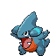

[Frames elegidos](../pokemon/gible/anim_frontf_selected.png) · [Todas las poses](../pokemon/gible/anim_frontf_source.png)

female.back · 64×64 · tira original [0, 0, 0] · timing: shared_species_timing

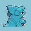

[Frames elegidos](../pokemon/gible/backf_selected.png) · [Todas las poses](../pokemon/gible/backf_source.png)

## GABITE

default.front · 80×80 · APNG [4, 0, 3, 19, 23] · timing: source_timeline

[Frames elegidos](../pokemon/gabite/anim_front_selected.png) · [Todas las poses](../pokemon/gabite/anim_front_source.png)

default.back · 80×80 · APNG [4, 0, 3] · timing: source_idle_cycle

[Frames elegidos](../pokemon/gabite/back_selected.png) · [Todas las poses](../pokemon/gabite/back_source.png)

female.front · 80×80 · tira original [0, 1, 0, 2, 3] · timing: shared_species_timing

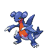

[Frames elegidos](../pokemon/gabite/anim_frontf_selected.png) · [Todas las poses](../pokemon/gabite/anim_frontf_source.png)

female.back · 64×64 · tira original [0, 0, 0] · timing: shared_species_timing

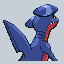

[Frames elegidos](../pokemon/gabite/backf_selected.png) · [Todas las poses](../pokemon/gabite/backf_source.png)

## GARCHOMP

default.front · 96×96 · APNG [5, 0, 4, 30, 34] · timing: source_timeline

[Frames elegidos](../pokemon/garchomp/anim_front_selected.png) · [Todas las poses](../pokemon/garchomp/anim_front_source.png)

default.back · 80×80 · APNG [5, 0, 3] · timing: source_idle_cycle

[Frames elegidos](../pokemon/garchomp/back_selected.png) · [Todas las poses](../pokemon/garchomp/back_source.png)

female.front · 96×96 · tira original [0, 1, 0, 2, 3] · timing: shared_species_timing

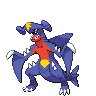

[Frames elegidos](../pokemon/garchomp/anim_frontf_selected.png) · [Todas las poses](../pokemon/garchomp/anim_frontf_source.png)

female.back · 80×80 · APNG [5, 0, 3] · timing: shared_species_timing

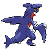

[Frames elegidos](../pokemon/garchomp/backf_selected.png) · [Todas las poses](../pokemon/garchomp/backf_source.png)

## RIOLU

default.front · 64×64 · APNG [0, 2, 5, 23, 24] · timing: source_timeline

[Frames elegidos](../pokemon/riolu/anim_front_selected.png) · [Todas las poses](../pokemon/riolu/anim_front_source.png)

default.back · 64×64 · APNG [6, 8, 4] · timing: source_idle_cycle

[Frames elegidos](../pokemon/riolu/back_selected.png) · [Todas las poses](../pokemon/riolu/back_source.png)

## LUCARIO

default.front · 64×64 · APNG [6, 0, 4, 21, 24] · timing: source_timeline

[Frames elegidos](../pokemon/lucario/anim_front_selected.png) · [Todas las poses](../pokemon/lucario/anim_front_source.png)

default.back · 80×80 · APNG [6, 8, 4] · timing: source_idle_cycle

[Frames elegidos](../pokemon/lucario/back_selected.png) · [Todas las poses](../pokemon/lucario/back_source.png)

## SKORUPI

default.front · 80×80 · APNG [2, 0, 5, 35, 46] · timing: source_timeline

[Frames elegidos](../pokemon/skorupi/anim_front_selected.png) · [Todas las poses](../pokemon/skorupi/anim_front_source.png)

default.back · 80×80 · APNG [3, 0, 5] · timing: source_idle_cycle

[Frames elegidos](../pokemon/skorupi/back_selected.png) · [Todas las poses](../pokemon/skorupi/back_source.png)

## DRAPION

default.front · 96×96 · APNG [3, 0, 7, 73, 82] · timing: source_timeline

[Frames elegidos](../pokemon/drapion/anim_front_selected.png) · [Todas las poses](../pokemon/drapion/anim_front_source.png)

default.back · 99×99 · APNG [4, 0, 7] · timing: source_idle_cycle

[Frames elegidos](../pokemon/drapion/back_selected.png) · [Todas las poses](../pokemon/drapion/back_source.png)

## CROAGUNK

default.front · 64×64 · APNG [0, 15, 5, 64, 67] · timing: source_timeline

[Frames elegidos](../pokemon/croagunk/anim_front_selected.png) · [Todas las poses](../pokemon/croagunk/anim_front_source.png)

default.back · 64×64 · APNG [0, 7, 15] · timing: source_idle_cycle

[Frames elegidos](../pokemon/croagunk/back_selected.png) · [Todas las poses](../pokemon/croagunk/back_source.png)

female.front · 64×64 · tira original [0, 1, 0, 2, 3] · timing: shared_species_timing

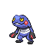

[Frames elegidos](../pokemon/croagunk/anim_frontf_selected.png) · [Todas las poses](../pokemon/croagunk/anim_frontf_source.png)

female.back · 64×64 · tira original [0, 0, 0] · timing: shared_species_timing

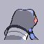

[Frames elegidos](../pokemon/croagunk/backf_selected.png) · [Todas las poses](../pokemon/croagunk/backf_source.png)

## TOXICROAK

default.front · 64×64 · APNG [2, 0, 4, 38, 44] · timing: source_timeline

[Frames elegidos](../pokemon/toxicroak/anim_front_selected.png) · [Todas las poses](../pokemon/toxicroak/anim_front_source.png)

default.back · 64×64 · APNG [3, 0, 4] · timing: source_idle_cycle

[Frames elegidos](../pokemon/toxicroak/back_selected.png) · [Todas las poses](../pokemon/toxicroak/back_source.png)

female.front · 64×64 · tira original [0, 1, 0, 2, 3] · timing: shared_species_timing

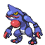

[Frames elegidos](../pokemon/toxicroak/anim_frontf_selected.png) · [Todas las poses](../pokemon/toxicroak/anim_frontf_source.png)

female.back · 64×64 · tira original [0, 0, 0] · timing: shared_species_timing

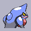

[Frames elegidos](../pokemon/toxicroak/backf_selected.png) · [Todas las poses](../pokemon/toxicroak/backf_source.png)

## SNOVER

default.front · 80×80 · APNG [0, 7, 5, 23, 33] · timing: source_timeline

[Frames elegidos](../pokemon/snover/anim_front_selected.png) · [Todas las poses](../pokemon/snover/anim_front_source.png)

default.back · 80×80 · APNG [0, 7, 5] · timing: source_idle_cycle

[Frames elegidos](../pokemon/snover/back_selected.png) · [Todas las poses](../pokemon/snover/back_source.png)

female.front · 80×80 · tira original [0, 1, 0, 2, 3] · timing: shared_species_timing

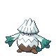

[Frames elegidos](../pokemon/snover/anim_frontf_selected.png) · [Todas las poses](../pokemon/snover/anim_frontf_source.png)

female.back · 64×64 · tira original [0, 0, 0] · timing: shared_species_timing

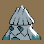

[Frames elegidos](../pokemon/snover/backf_selected.png) · [Todas las poses](../pokemon/snover/backf_source.png)

## ABOMASNOW

default.front · 96×96 · APNG [2, 0, 5, 27, 33] · timing: source_timeline

[Frames elegidos](../pokemon/abomasnow/anim_front_selected.png) · [Todas las poses](../pokemon/abomasnow/anim_front_source.png)

default.back · 96×96 · APNG [2, 0, 5] · timing: source_idle_cycle

[Frames elegidos](../pokemon/abomasnow/back_selected.png) · [Todas las poses](../pokemon/abomasnow/back_source.png)

female.front · 96×96 · tira original [0, 1, 0, 2, 3] · timing: shared_species_timing

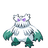

[Frames elegidos](../pokemon/abomasnow/anim_frontf_selected.png) · [Todas las poses](../pokemon/abomasnow/anim_frontf_source.png)

female.back · 96×96 · APNG [2, 0, 5] · timing: shared_species_timing

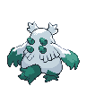

[Frames elegidos](../pokemon/abomasnow/backf_selected.png) · [Todas las poses](../pokemon/abomasnow/backf_source.png)

## ROTOM

default.front · 96×96 · APNG [4, 10, 15, 35, 38] · timing: source_timeline

[Frames elegidos](../pokemon/rotom/anim_front_selected.png) · [Todas las poses](../pokemon/rotom/anim_front_source.png)

default.back · 96×96 · APNG [4, 10, 15] · timing: source_idle_cycle

[Frames elegidos](../pokemon/rotom/back_selected.png) · [Todas las poses](../pokemon/rotom/back_source.png)

## ROTOM_HEAT

default.front · 80×80 · tira original [0, 1, 0, 2, 3] · timing: legacy_estimated

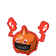

[Frames elegidos](../pokemon/rotom/heat/anim_front_selected.png) · [Todas las poses](../pokemon/rotom/heat/anim_front_source.png)

default.back · 64×64 · tira original [0, 0, 0] · timing: legacy_estimated

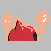

[Frames elegidos](../pokemon/rotom/heat/back_selected.png) · [Todas las poses](../pokemon/rotom/heat/back_source.png)

## ROTOM_WASH

default.front · 96×96 · tira original [0, 1, 0, 2, 3] · timing: legacy_estimated

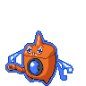

[Frames elegidos](../pokemon/rotom/wash/anim_front_selected.png) · [Todas las poses](../pokemon/rotom/wash/anim_front_source.png)

default.back · 64×64 · tira original [0, 0, 0] · timing: legacy_estimated

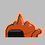

[Frames elegidos](../pokemon/rotom/wash/back_selected.png) · [Todas las poses](../pokemon/rotom/wash/back_source.png)

## ROTOM_FROST

default.front · 96×96 · tira original [0, 1, 0, 2, 3] · timing: legacy_estimated

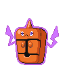

[Frames elegidos](../pokemon/rotom/frost/anim_front_selected.png) · [Todas las poses](../pokemon/rotom/frost/anim_front_source.png)

default.back · 64×64 · tira original [0, 0, 0] · timing: legacy_estimated

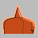

[Frames elegidos](../pokemon/rotom/frost/back_selected.png) · [Todas las poses](../pokemon/rotom/frost/back_source.png)

## ROTOM_FAN

default.front · 96×96 · tira original [0, 1, 0, 2, 3] · timing: legacy_estimated

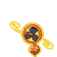

[Frames elegidos](../pokemon/rotom/fan/anim_front_selected.png) · [Todas las poses](../pokemon/rotom/fan/anim_front_source.png)

default.back · 64×64 · tira original [0, 0, 0] · timing: legacy_estimated

[Frames elegidos](../pokemon/rotom/fan/back_selected.png) · [Todas las poses](../pokemon/rotom/fan/back_source.png)

## ROTOM_MOW

default.front · 80×80 · tira original [0, 1, 0, 2, 3] · timing: legacy_estimated

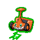

[Frames elegidos](../pokemon/rotom/mow/anim_front_selected.png) · [Todas las poses](../pokemon/rotom/mow/anim_front_source.png)

default.back · 64×64 · tira original [0, 0, 0] · timing: legacy_estimated

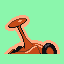

[Frames elegidos](../pokemon/rotom/mow/back_selected.png) · [Todas las poses](../pokemon/rotom/mow/back_source.png)

## HEATRAN

default.front · 96×96 · APNG [2, 0, 3, 68, 84] · timing: source_timeline

[Frames elegidos](../pokemon/heatran/anim_front_selected.png) · [Todas las poses](../pokemon/heatran/anim_front_source.png)

default.back · 96×96 · APNG [1, 0, 3] · timing: source_idle_cycle

[Frames elegidos](../pokemon/heatran/back_selected.png) · [Todas las poses](../pokemon/heatran/back_source.png)

## SANDILE

default.front · 64×64 · tira original [0, 1, 0, 2, 3] · timing: legacy_estimated

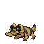

[Frames elegidos](../pokemon/sandile/anim_front_selected.png) · [Todas las poses](../pokemon/sandile/anim_front_source.png)

## KROKOROK

default.front · 64×64 · tira original [0, 1, 0, 2, 3] · timing: legacy_estimated

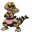

[Frames elegidos](../pokemon/krokorok/anim_front_selected.png) · [Todas las poses](../pokemon/krokorok/anim_front_source.png)

## KROOKODILE

default.front · 96×96 · tira original [0, 1, 0, 2, 3] · timing: legacy_estimated

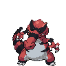

[Frames elegidos](../pokemon/krookodile/anim_front_selected.png) · [Todas las poses](../pokemon/krookodile/anim_front_source.png)

[Índice](../GALLERY.md) · [Anterior](page_16.md) · [Siguiente](page_18.md)
