# Galería / página 18

[Índice](../GALLERY.md) · [Anterior](page_17.md) · [Siguiente](page_19.md)

## YAMASK

default.front · 64×64 · tira original [0, 1, 0, 2, 3] · timing: legacy_estimated

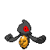

[Frames elegidos](../pokemon/yamask/anim_front_selected.png) · [Todas las poses](../pokemon/yamask/anim_front_source.png)

default.back · 64×64 · tira original [0, 0, 0] · timing: legacy_estimated

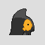

[Frames elegidos](../pokemon/yamask/back_selected.png) · [Todas las poses](../pokemon/yamask/back_source.png)

## COFAGRIGUS

default.front · 64×64 · tira original [0, 1, 0, 1, 1] · timing: legacy_estimated

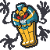

[Frames elegidos](../pokemon/cofagrigus/anim_front_selected.png) · [Todas las poses](../pokemon/cofagrigus/anim_front_source.png)

default.back · 64×64 · tira original [0, 0, 0] · timing: legacy_estimated

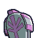

[Frames elegidos](../pokemon/cofagrigus/back_selected.png) · [Todas las poses](../pokemon/cofagrigus/back_source.png)

## GOTHITA

default.front · 64×64 · tira original [0, 1, 0, 2, 3] · timing: legacy_estimated

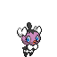

[Frames elegidos](../pokemon/gothita/anim_front_selected.png) · [Todas las poses](../pokemon/gothita/anim_front_source.png)

## GOTHORITA

default.front · 64×64 · tira original [0, 1, 0, 2, 3] · timing: legacy_estimated

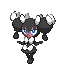

[Frames elegidos](../pokemon/gothorita/anim_front_selected.png) · [Todas las poses](../pokemon/gothorita/anim_front_source.png)

## GOTHITELLE

default.front · 80×80 · tira original [0, 1, 0, 2, 3] · timing: legacy_estimated

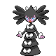

[Frames elegidos](../pokemon/gothitelle/anim_front_selected.png) · [Todas las poses](../pokemon/gothitelle/anim_front_source.png)

## FRILLISH

default.front · 80×80 · tira original [0, 1, 0, 2, 3] · timing: legacy_estimated

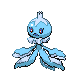

[Frames elegidos](../pokemon/frillish/anim_front_selected.png) · [Todas las poses](../pokemon/frillish/anim_front_source.png)

default.back · 64×64 · tira original [0, 0, 0] · timing: legacy_estimated

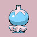

[Frames elegidos](../pokemon/frillish/back_selected.png) · [Todas las poses](../pokemon/frillish/back_source.png)

female.front · 80×80 · tira original [0, 1, 0, 2, 3] · timing: shared_species_timing

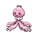

[Frames elegidos](../pokemon/frillish/anim_frontf_selected.png) · [Todas las poses](../pokemon/frillish/anim_frontf_source.png)

female.back · 64×64 · tira original [0, 0, 0] · timing: shared_species_timing

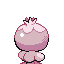

[Frames elegidos](../pokemon/frillish/backf_selected.png) · [Todas las poses](../pokemon/frillish/backf_source.png)

## JELLICENT

default.front · 96×96 · tira original [0, 1, 0, 2, 3] · timing: legacy_estimated

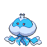

[Frames elegidos](../pokemon/jellicent/anim_front_selected.png) · [Todas las poses](../pokemon/jellicent/anim_front_source.png)

default.back · 64×64 · tira original [0, 0, 0] · timing: legacy_estimated

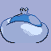

[Frames elegidos](../pokemon/jellicent/back_selected.png) · [Todas las poses](../pokemon/jellicent/back_source.png)

female.front · 96×96 · tira original [0, 1, 0, 2, 3] · timing: shared_species_timing

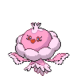

[Frames elegidos](../pokemon/jellicent/anim_frontf_selected.png) · [Todas las poses](../pokemon/jellicent/anim_frontf_source.png)

female.back · 64×64 · tira original [0, 0, 0] · timing: shared_species_timing

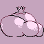

[Frames elegidos](../pokemon/jellicent/backf_selected.png) · [Todas las poses](../pokemon/jellicent/backf_source.png)

## JOLTIK

default.front · 64×64 · tira original [0, 1, 0, 2, 3] · timing: legacy_estimated

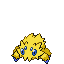

[Frames elegidos](../pokemon/joltik/anim_front_selected.png) · [Todas las poses](../pokemon/joltik/anim_front_source.png)

default.back · 64×64 · tira original [0, 0, 0] · timing: legacy_estimated

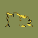

[Frames elegidos](../pokemon/joltik/back_selected.png) · [Todas las poses](../pokemon/joltik/back_source.png)

## GALVANTULA

default.front · 80×80 · tira original [0, 1, 0, 2, 3] · timing: legacy_estimated

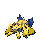

[Frames elegidos](../pokemon/galvantula/anim_front_selected.png) · [Todas las poses](../pokemon/galvantula/anim_front_source.png)

default.back · 64×64 · tira original [0, 0, 0] · timing: legacy_estimated

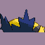

[Frames elegidos](../pokemon/galvantula/back_selected.png) · [Todas las poses](../pokemon/galvantula/back_source.png)

## FERROSEED

default.front · 64×64 · tira original [0, 1, 0, 1, 1] · timing: legacy_estimated

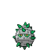

[Frames elegidos](../pokemon/ferroseed/anim_front_selected.png) · [Todas las poses](../pokemon/ferroseed/anim_front_source.png)

default.back · 64×64 · tira original [0, 0, 0] · timing: legacy_estimated

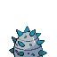

[Frames elegidos](../pokemon/ferroseed/back_selected.png) · [Todas las poses](../pokemon/ferroseed/back_source.png)

## FERROTHORN

default.front · 80×80 · tira original [0, 1, 0, 2, 3] · timing: legacy_estimated

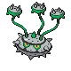

[Frames elegidos](../pokemon/ferrothorn/anim_front_selected.png) · [Todas las poses](../pokemon/ferrothorn/anim_front_source.png)

default.back · 64×64 · tira original [0, 0, 0] · timing: legacy_estimated

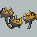

[Frames elegidos](../pokemon/ferrothorn/back_selected.png) · [Todas las poses](../pokemon/ferrothorn/back_source.png)

## LITWICK

default.front · 64×64 · tira original [0, 1, 0, 2, 3] · timing: legacy_estimated

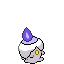

[Frames elegidos](../pokemon/litwick/anim_front_selected.png) · [Todas las poses](../pokemon/litwick/anim_front_source.png)

default.back · 64×64 · tira original [0, 0, 0] · timing: legacy_estimated

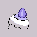

[Frames elegidos](../pokemon/litwick/back_selected.png) · [Todas las poses](../pokemon/litwick/back_source.png)

## LAMPENT

default.front · 64×64 · tira original [0, 1, 0, 2, 3] · timing: legacy_estimated

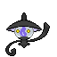

[Frames elegidos](../pokemon/lampent/anim_front_selected.png) · [Todas las poses](../pokemon/lampent/anim_front_source.png)

default.back · 64×64 · tira original [0, 0, 0] · timing: legacy_estimated

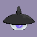

[Frames elegidos](../pokemon/lampent/back_selected.png) · [Todas las poses](../pokemon/lampent/back_source.png)

## CHANDELURE

default.front · 80×80 · tira original [0, 1, 0, 2, 3] · timing: legacy_estimated

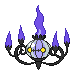

[Frames elegidos](../pokemon/chandelure/anim_front_selected.png) · [Todas las poses](../pokemon/chandelure/anim_front_source.png)

default.back · 64×64 · tira original [0, 0, 0] · timing: legacy_estimated

[Frames elegidos](../pokemon/chandelure/back_selected.png) · [Todas las poses](../pokemon/chandelure/back_source.png)

## AXEW

default.front · 64×64 · tira original [0, 1, 0, 2, 3] · timing: legacy_estimated

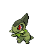

[Frames elegidos](../pokemon/axew/anim_front_selected.png) · [Todas las poses](../pokemon/axew/anim_front_source.png)

default.back · 64×64 · tira original [0, 0, 0] · timing: legacy_estimated

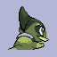

[Frames elegidos](../pokemon/axew/back_selected.png) · [Todas las poses](../pokemon/axew/back_source.png)

## FRAXURE

default.front · 64×64 · tira original [0, 1, 0, 2, 3] · timing: legacy_estimated

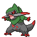

[Frames elegidos](../pokemon/fraxure/anim_front_selected.png) · [Todas las poses](../pokemon/fraxure/anim_front_source.png)

default.back · 64×64 · tira original [0, 0, 0] · timing: legacy_estimated

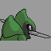

[Frames elegidos](../pokemon/fraxure/back_selected.png) · [Todas las poses](../pokemon/fraxure/back_source.png)

## HAXORUS

default.front · 96×96 · tira original [0, 1, 0, 2, 3] · timing: legacy_estimated

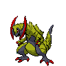

[Frames elegidos](../pokemon/haxorus/anim_front_selected.png) · [Todas las poses](../pokemon/haxorus/anim_front_source.png)

default.back · 64×64 · tira original [0, 0, 0] · timing: legacy_estimated

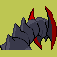

[Frames elegidos](../pokemon/haxorus/back_selected.png) · [Todas las poses](../pokemon/haxorus/back_source.png)

## CUBCHOO

default.front · 64×64 · tira original [0, 1, 0, 2, 3] · timing: legacy_estimated

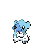

[Frames elegidos](../pokemon/cubchoo/anim_front_selected.png) · [Todas las poses](../pokemon/cubchoo/anim_front_source.png)

default.back · 64×64 · tira original [0, 0, 0] · timing: legacy_estimated

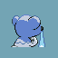

[Frames elegidos](../pokemon/cubchoo/back_selected.png) · [Todas las poses](../pokemon/cubchoo/back_source.png)

## BEARTIC

default.front · 80×80 · tira original [0, 1, 0, 2, 3] · timing: legacy_estimated

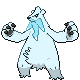

[Frames elegidos](../pokemon/beartic/anim_front_selected.png) · [Todas las poses](../pokemon/beartic/anim_front_source.png)

default.back · 64×64 · tira original [0, 0, 0] · timing: legacy_estimated

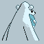

[Frames elegidos](../pokemon/beartic/back_selected.png) · [Todas las poses](../pokemon/beartic/back_source.png)

## GOLETT

default.front · 64×64 · tira original [0, 1, 0, 2, 3] · timing: legacy_estimated

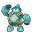

[Frames elegidos](../pokemon/golett/anim_front_selected.png) · [Todas las poses](../pokemon/golett/anim_front_source.png)

## GOLURK

default.front · 80×80 · tira original [0, 1, 0, 2, 3] · timing: legacy_estimated

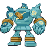

[Frames elegidos](../pokemon/golurk/anim_front_selected.png) · [Todas las poses](../pokemon/golurk/anim_front_source.png)

## PAWNIARD

default.front · 64×64 · tira original [0, 1, 0, 2, 3] · timing: legacy_estimated

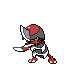

[Frames elegidos](../pokemon/pawniard/anim_front_selected.png) · [Todas las poses](../pokemon/pawniard/anim_front_source.png)

default.back · 64×64 · tira original [0, 0, 0] · timing: legacy_estimated

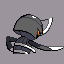

[Frames elegidos](../pokemon/pawniard/back_selected.png) · [Todas las poses](../pokemon/pawniard/back_source.png)

## BISHARP

default.front · 80×80 · tira original [0, 1, 0, 2, 3] · timing: legacy_estimated

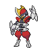

[Frames elegidos](../pokemon/bisharp/anim_front_selected.png) · [Todas las poses](../pokemon/bisharp/anim_front_source.png)

default.back · 64×64 · tira original [0, 0, 0] · timing: legacy_estimated

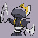

[Frames elegidos](../pokemon/bisharp/back_selected.png) · [Todas las poses](../pokemon/bisharp/back_source.png)

## DEINO

default.front · 64×64 · tira original [0, 1, 0, 2, 3] · timing: legacy_estimated

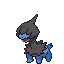

[Frames elegidos](../pokemon/deino/anim_front_selected.png) · [Todas las poses](../pokemon/deino/anim_front_source.png)

default.back · 64×64 · tira original [0, 0, 0] · timing: legacy_estimated

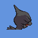

[Frames elegidos](../pokemon/deino/back_selected.png) · [Todas las poses](../pokemon/deino/back_source.png)

## ZWEILOUS

default.front · 80×80 · tira original [0, 1, 0, 2, 3] · timing: legacy_estimated

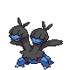

[Frames elegidos](../pokemon/zweilous/anim_front_selected.png) · [Todas las poses](../pokemon/zweilous/anim_front_source.png)

default.back · 64×64 · tira original [0, 0, 0] · timing: legacy_estimated

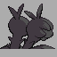

[Frames elegidos](../pokemon/zweilous/back_selected.png) · [Todas las poses](../pokemon/zweilous/back_source.png)

[Índice](../GALLERY.md) · [Anterior](page_17.md) · [Siguiente](page_19.md)
