# Galería / página 19

[Índice](../GALLERY.md) · [Anterior](page_18.md) · [Siguiente](page_20.md)

## HYDREIGON

default.front · 96×96 · tira original [0, 1, 0, 2, 3] · timing: legacy_estimated

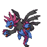

[Frames elegidos](../pokemon/hydreigon/anim_front_selected.png) · [Todas las poses](../pokemon/hydreigon/anim_front_source.png)

default.back · 64×64 · tira original [0, 0, 0] · timing: legacy_estimated

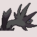

[Frames elegidos](../pokemon/hydreigon/back_selected.png) · [Todas las poses](../pokemon/hydreigon/back_source.png)

## LARVESTA

default.front · 64×64 · tira original [0, 1, 0, 2, 3] · timing: legacy_estimated

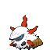

[Frames elegidos](../pokemon/larvesta/anim_front_selected.png) · [Todas las poses](../pokemon/larvesta/anim_front_source.png)

default.back · 64×64 · tira original [0, 0, 0] · timing: legacy_estimated

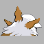

[Frames elegidos](../pokemon/larvesta/back_selected.png) · [Todas las poses](../pokemon/larvesta/back_source.png)

## VOLCARONA

default.front · 96×96 · tira original [0, 1, 0, 2, 3] · timing: legacy_estimated

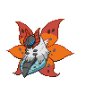

[Frames elegidos](../pokemon/volcarona/anim_front_selected.png) · [Todas las poses](../pokemon/volcarona/anim_front_source.png)

default.back · 64×64 · tira original [0, 0, 0] · timing: legacy_estimated

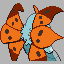

[Frames elegidos](../pokemon/volcarona/back_selected.png) · [Todas las poses](../pokemon/volcarona/back_source.png)

## FENNEKIN

default.front · 64×64 · tira original [0, 1, 0, 1, 1] · timing: legacy_estimated

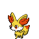

[Frames elegidos](../pokemon/fennekin/anim_front_selected.png) · [Todas las poses](../pokemon/fennekin/anim_front_source.png)

default.back · 64×64 · tira original [0, 0, 0] · timing: legacy_estimated

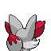

[Frames elegidos](../pokemon/fennekin/back_selected.png) · [Todas las poses](../pokemon/fennekin/back_source.png)

## BRAIXEN

default.front · 64×64 · tira original [0, 1, 0, 1, 1] · timing: legacy_estimated

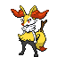

[Frames elegidos](../pokemon/braixen/anim_front_selected.png) · [Todas las poses](../pokemon/braixen/anim_front_source.png)

default.back · 64×64 · tira original [0, 0, 0] · timing: legacy_estimated

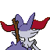

[Frames elegidos](../pokemon/braixen/back_selected.png) · [Todas las poses](../pokemon/braixen/back_source.png)

## DELPHOX

default.front · 64×64 · tira original [0, 1, 0, 1, 1] · timing: legacy_estimated

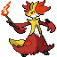

[Frames elegidos](../pokemon/delphox/anim_front_selected.png) · [Todas las poses](../pokemon/delphox/anim_front_source.png)

default.back · 64×64 · tira original [0, 0, 0] · timing: legacy_estimated

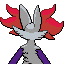

[Frames elegidos](../pokemon/delphox/back_selected.png) · [Todas las poses](../pokemon/delphox/back_source.png)

## FLETCHLING

default.front · 64×64 · tira original [0, 1, 0, 1, 1] · timing: legacy_estimated

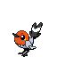

[Frames elegidos](../pokemon/fletchling/anim_front_selected.png) · [Todas las poses](../pokemon/fletchling/anim_front_source.png)

default.back · 64×64 · tira original [0, 0, 0] · timing: legacy_estimated

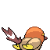

[Frames elegidos](../pokemon/fletchling/back_selected.png) · [Todas las poses](../pokemon/fletchling/back_source.png)

## FLETCHINDER

default.front · 64×64 · tira original [0, 1, 0, 1, 1] · timing: legacy_estimated

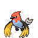

[Frames elegidos](../pokemon/fletchinder/anim_front_selected.png) · [Todas las poses](../pokemon/fletchinder/anim_front_source.png)

default.back · 64×64 · tira original [0, 0, 0] · timing: legacy_estimated

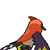

[Frames elegidos](../pokemon/fletchinder/back_selected.png) · [Todas las poses](../pokemon/fletchinder/back_source.png)

## TALONFLAME

default.front · 64×64 · tira original [0, 1, 0, 1, 1] · timing: legacy_estimated

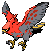

[Frames elegidos](../pokemon/talonflame/anim_front_selected.png) · [Todas las poses](../pokemon/talonflame/anim_front_source.png)

default.back · 64×64 · tira original [0, 0, 0] · timing: legacy_estimated

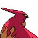

[Frames elegidos](../pokemon/talonflame/back_selected.png) · [Todas las poses](../pokemon/talonflame/back_source.png)

## TYRUNT

default.front · 64×64 · tira original [0, 1, 0, 1, 1] · timing: legacy_estimated

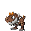

[Frames elegidos](../pokemon/tyrunt/anim_front_selected.png) · [Todas las poses](../pokemon/tyrunt/anim_front_source.png)

default.back · 64×64 · tira original [0, 0, 0] · timing: legacy_estimated

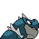

[Frames elegidos](../pokemon/tyrunt/back_selected.png) · [Todas las poses](../pokemon/tyrunt/back_source.png)

## TYRANTRUM

default.front · 64×64 · tira original [0, 1, 0, 1, 1] · timing: legacy_estimated

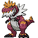

[Frames elegidos](../pokemon/tyrantrum/anim_front_selected.png) · [Todas las poses](../pokemon/tyrantrum/anim_front_source.png)

default.back · 64×64 · tira original [0, 0, 0] · timing: legacy_estimated

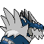

[Frames elegidos](../pokemon/tyrantrum/back_selected.png) · [Todas las poses](../pokemon/tyrantrum/back_source.png)

## AMAURA

default.front · 64×64 · tira original [0, 1, 0, 1, 1] · timing: legacy_estimated

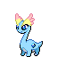

[Frames elegidos](../pokemon/amaura/anim_front_selected.png) · [Todas las poses](../pokemon/amaura/anim_front_source.png)

default.back · 64×64 · tira original [0, 0, 0] · timing: legacy_estimated

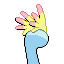

[Frames elegidos](../pokemon/amaura/back_selected.png) · [Todas las poses](../pokemon/amaura/back_source.png)

## AURORUS

default.front · 64×64 · tira original [0, 1, 0, 1, 1] · timing: legacy_estimated

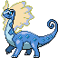

[Frames elegidos](../pokemon/aurorus/anim_front_selected.png) · [Todas las poses](../pokemon/aurorus/anim_front_source.png)

default.back · 64×64 · tira original [0, 0, 0] · timing: legacy_estimated

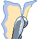

[Frames elegidos](../pokemon/aurorus/back_selected.png) · [Todas las poses](../pokemon/aurorus/back_source.png)

## ROWLET

default.front · 64×64 · tira original [0, 1, 0, 1, 1] · timing: legacy_estimated

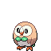

[Frames elegidos](../pokemon/rowlet/anim_front_selected.png) · [Todas las poses](../pokemon/rowlet/anim_front_source.png)

default.back · 64×64 · tira original [0, 0, 0] · timing: legacy_estimated

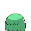

[Frames elegidos](../pokemon/rowlet/back_selected.png) · [Todas las poses](../pokemon/rowlet/back_source.png)

## DARTRIX

default.front · 64×64 · tira original [0, 1, 0, 1, 1] · timing: legacy_estimated

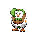

[Frames elegidos](../pokemon/dartrix/anim_front_selected.png) · [Todas las poses](../pokemon/dartrix/anim_front_source.png)

default.back · 64×64 · tira original [0, 0, 0] · timing: legacy_estimated

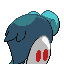

[Frames elegidos](../pokemon/dartrix/back_selected.png) · [Todas las poses](../pokemon/dartrix/back_source.png)

## DECIDUEYE

default.front · 64×64 · tira original [0, 1, 0, 1, 1] · timing: legacy_estimated

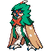

[Frames elegidos](../pokemon/decidueye/anim_front_selected.png) · [Todas las poses](../pokemon/decidueye/anim_front_source.png)

default.back · 64×64 · tira original [0, 0, 0] · timing: legacy_estimated

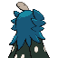

[Frames elegidos](../pokemon/decidueye/back_selected.png) · [Todas las poses](../pokemon/decidueye/back_source.png)

## JANGMO_O

default.front · 64×64 · tira original [0, 1, 0, 1, 1] · timing: legacy_estimated

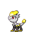

[Frames elegidos](../pokemon/jangmo_o/anim_front_selected.png) · [Todas las poses](../pokemon/jangmo_o/anim_front_source.png)

default.back · 64×64 · tira original [0, 0, 0] · timing: legacy_estimated

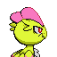

[Frames elegidos](../pokemon/jangmo_o/back_selected.png) · [Todas las poses](../pokemon/jangmo_o/back_source.png)

## HAKAMO_O

default.front · 64×64 · tira original [0, 1, 0, 1, 1] · timing: legacy_estimated

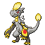

[Frames elegidos](../pokemon/hakamo_o/anim_front_selected.png) · [Todas las poses](../pokemon/hakamo_o/anim_front_source.png)

default.back · 64×64 · tira original [0, 0, 0] · timing: legacy_estimated

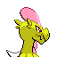

[Frames elegidos](../pokemon/hakamo_o/back_selected.png) · [Todas las poses](../pokemon/hakamo_o/back_source.png)

## KOMMO_O

default.front · 64×64 · tira original [0, 1, 0, 1, 1] · timing: legacy_estimated

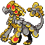

[Frames elegidos](../pokemon/kommo_o/anim_front_selected.png) · [Todas las poses](../pokemon/kommo_o/anim_front_source.png)

default.back · 64×64 · tira original [0, 0, 0] · timing: legacy_estimated

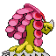

[Frames elegidos](../pokemon/kommo_o/back_selected.png) · [Todas las poses](../pokemon/kommo_o/back_source.png)

## ROOKIDEE

default.front · 64×64 · tira original [0, 1, 0, 1, 1] · timing: legacy_estimated

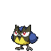

[Frames elegidos](../pokemon/rookidee/anim_front_selected.png) · [Todas las poses](../pokemon/rookidee/anim_front_source.png)

default.back · 64×64 · tira original [0, 0, 0] · timing: legacy_estimated

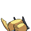

[Frames elegidos](../pokemon/rookidee/back_selected.png) · [Todas las poses](../pokemon/rookidee/back_source.png)

## CORVISQUIRE

default.front · 64×64 · tira original [0, 1, 0, 1, 1] · timing: legacy_estimated

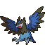

[Frames elegidos](../pokemon/corvisquire/anim_front_selected.png) · [Todas las poses](../pokemon/corvisquire/anim_front_source.png)

default.back · 64×64 · tira original [0, 0, 0] · timing: legacy_estimated

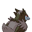

[Frames elegidos](../pokemon/corvisquire/back_selected.png) · [Todas las poses](../pokemon/corvisquire/back_source.png)

## CORVIKNIGHT

default.front · 64×64 · tira original [0, 1, 0, 1, 1] · timing: legacy_estimated

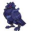

[Frames elegidos](../pokemon/corviknight/anim_front_selected.png) · [Todas las poses](../pokemon/corviknight/anim_front_source.png)

default.back · 64×64 · tira original [0, 0, 0] · timing: legacy_estimated

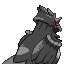

[Frames elegidos](../pokemon/corviknight/back_selected.png) · [Todas las poses](../pokemon/corviknight/back_source.png)

## BLIPBUG

default.front · 64×64 · tira original [0, 0, 0, 0, 0] · timing: legacy_estimated

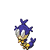

[Frames elegidos](../pokemon/blipbug/anim_front_selected.png) · [Todas las poses](../pokemon/blipbug/anim_front_source.png)

default.back · 64×64 · tira original [0, 0, 0] · timing: legacy_estimated

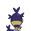

[Frames elegidos](../pokemon/blipbug/back_selected.png) · [Todas las poses](../pokemon/blipbug/back_source.png)

## DOTTLER

default.front · 64×64 · tira original [0, 0, 0, 0, 0] · timing: legacy_estimated

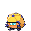

[Frames elegidos](../pokemon/dottler/anim_front_selected.png) · [Todas las poses](../pokemon/dottler/anim_front_source.png)

default.back · 64×64 · tira original [0, 0, 0] · timing: legacy_estimated

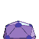

[Frames elegidos](../pokemon/dottler/back_selected.png) · [Todas las poses](../pokemon/dottler/back_source.png)

## ORBEETLE

default.front · 64×64 · tira original [0, 0, 0, 0, 0] · timing: legacy_estimated

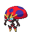

[Frames elegidos](../pokemon/orbeetle/anim_front_selected.png) · [Todas las poses](../pokemon/orbeetle/anim_front_source.png)

default.back · 64×64 · tira original [0, 0, 0] · timing: legacy_estimated

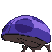

[Frames elegidos](../pokemon/orbeetle/back_selected.png) · [Todas las poses](../pokemon/orbeetle/back_source.png)

[Índice](../GALLERY.md) · [Anterior](page_18.md) · [Siguiente](page_20.md)
