# Galería / página 20

[Índice](../GALLERY.md) · [Anterior](page_19.md)

## SNOM

default.front · 64×64 · tira original [0, 0, 0, 0, 0] · timing: legacy_estimated

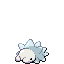

[Frames elegidos](../pokemon/snom/anim_front_selected.png) · [Todas las poses](../pokemon/snom/anim_front_source.png)

default.back · 64×64 · tira original [0, 0, 0] · timing: legacy_estimated

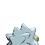

[Frames elegidos](../pokemon/snom/back_selected.png) · [Todas las poses](../pokemon/snom/back_source.png)

## FROSMOTH

default.front · 64×64 · tira original [0, 0, 0, 0, 0] · timing: legacy_estimated

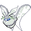

[Frames elegidos](../pokemon/frosmoth/anim_front_selected.png) · [Todas las poses](../pokemon/frosmoth/anim_front_source.png)

default.back · 64×64 · tira original [0, 0, 0] · timing: legacy_estimated

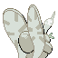

[Frames elegidos](../pokemon/frosmoth/back_selected.png) · [Todas las poses](../pokemon/frosmoth/back_source.png)

## DREEPY

default.front · 64×64 · tira original [0, 0, 0, 0, 0] · timing: legacy_estimated

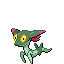

[Frames elegidos](../pokemon/dreepy/anim_front_selected.png) · [Todas las poses](../pokemon/dreepy/anim_front_source.png)

default.back · 64×64 · tira original [0, 0, 0] · timing: legacy_estimated

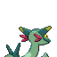

[Frames elegidos](../pokemon/dreepy/back_selected.png) · [Todas las poses](../pokemon/dreepy/back_source.png)

## DRAKLOAK

default.front · 64×64 · tira original [0, 0, 0, 0, 0] · timing: legacy_estimated

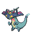

[Frames elegidos](../pokemon/drakloak/anim_front_selected.png) · [Todas las poses](../pokemon/drakloak/anim_front_source.png)

default.back · 64×64 · tira original [0, 0, 0] · timing: legacy_estimated

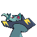

[Frames elegidos](../pokemon/drakloak/back_selected.png) · [Todas las poses](../pokemon/drakloak/back_source.png)

## DRAGAPULT

default.front · 64×64 · tira original [0, 0, 0, 0, 0] · timing: legacy_estimated

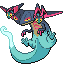

[Frames elegidos](../pokemon/dragapult/anim_front_selected.png) · [Todas las poses](../pokemon/dragapult/anim_front_source.png)

default.back · 64×64 · tira original [0, 0, 0] · timing: legacy_estimated

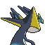

[Frames elegidos](../pokemon/dragapult/back_selected.png) · [Todas las poses](../pokemon/dragapult/back_source.png)

## REGIROCK

default.front · 80×80 · APNG [0, 9, 5, 25, 33] · timing: source_timeline

[Frames elegidos](../pokemon/regirock/anim_front_selected.png) · [Todas las poses](../pokemon/regirock/anim_front_source.png)

default.back · 80×80 · APNG [0, 9, 5] · timing: source_idle_cycle

[Frames elegidos](../pokemon/regirock/back_selected.png) · [Todas las poses](../pokemon/regirock/back_source.png)

## REGICE

default.front · 96×96 · APNG [1, 3, 5, 22, 28] · timing: source_timeline

[Frames elegidos](../pokemon/regice/anim_front_selected.png) · [Todas las poses](../pokemon/regice/anim_front_source.png)

default.back · 80×80 · APNG [1, 3, 5] · timing: source_idle_cycle

[Frames elegidos](../pokemon/regice/back_selected.png) · [Todas las poses](../pokemon/regice/back_source.png)

## REGISTEEL

default.front · 80×80 · APNG [0, 5, 2, 22, 25] · timing: source_timeline

[Frames elegidos](../pokemon/registeel/anim_front_selected.png) · [Todas las poses](../pokemon/registeel/anim_front_source.png)

default.back · 80×80 · APNG [0, 1, 4] · timing: source_idle_cycle

[Frames elegidos](../pokemon/registeel/back_selected.png) · [Todas las poses](../pokemon/registeel/back_source.png)

## REGIGIGAS

default.front · 96×96 · APNG [4, 0, 7, 52, 65] · timing: source_timeline

[Frames elegidos](../pokemon/regigigas/anim_front_selected.png) · [Todas las poses](../pokemon/regigigas/anim_front_source.png)

default.back · 96×96 · APNG [8, 0, 6] · timing: source_idle_cycle

[Frames elegidos](../pokemon/regigigas/back_selected.png) · [Todas las poses](../pokemon/regigigas/back_source.png)

## EGG

default.front · 64×64 · tira original [0, 1, 0, 1, 1] · timing: legacy_estimated

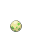

[Frames elegidos](../pokemon/egg/anim_front_selected.png) · [Todas las poses](../pokemon/egg/anim_front_source.png)

[Índice](../GALLERY.md) · [Anterior](page_19.md)
